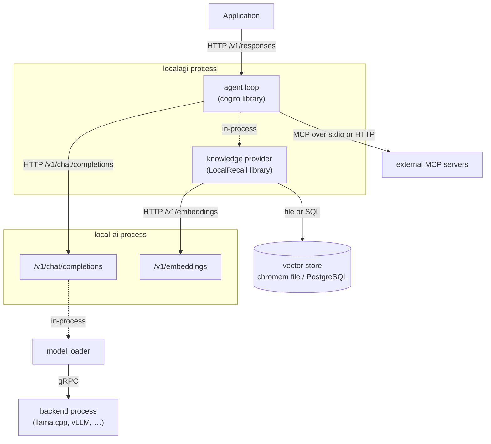

# LocalAI Stack Handbook

An independent technical field manual for building systems with **LocalAI**,
**LocalAGI** and **LocalRecall**.

> **This is not official documentation.** It is not produced, endorsed or
> reviewed by the LocalAI, LocalAGI or LocalRecall projects. It is an
> independently maintained field guide containing architectural notes, tested
> configurations, integration examples and troubleshooting material for the
> LocalAI ecosystem. For authoritative statements, go upstream — every page here
> links to the exact file, release or documentation page it was derived from.

## The conceptual model

```text
LocalAI     -> model / compute runtime
LocalAGI    -> agent platform
LocalRecall -> knowledge / retrieval layer
MCP         -> external capability boundary
```

That model is how the ecosystem is usually described, and it is the right way to
reason about *responsibilities*. It is wrong about *processes*, in three ways
this handbook spends most of its length correcting:

1. **Three names do not mean three services.** In current versions a single
   `local-ai` process can be all three at once. LocalAGI links LocalRecall as a
   Go library; LocalAI links both.
2. **The agent loop is not in LocalAGI.** Reason/act/observe lives in a fourth
   project, [`mudler/cogito`](https://github.com/mudler/cogito), which both
   LocalAGI and LocalAI depend on. LocalAI v4.8.2 links a cogito roughly four
   months newer than LocalAGI v2.9.0 does, so "the same feature" behaves
   differently depending on which one you run.
3. **LocalRecall is not a database and does not compute embeddings.** It is an
   ingestion, chunking and retrieval layer that calls an OpenAI-compatible
   `/v1/embeddings` endpoint and writes to a vector backend.

## Architecture

The separated deployment — the one worth learning first, because every boundary
is visible:



Dashed edges are in-process calls. Solid edges cross a process boundary. That
distinction is the point — see
[logical vs physical](docs/00-overview/logical-vs-physical.md).

## Quick start

Inference only, one container, no GPU:

```bash
docker run -p 8080:8080 --name local-ai \
  -v localai-models:/models \
  -v localai-backends:/backends \
  -v localai-data:/data \
  localai/localai:v4.8.2 qwen3-1.7b granite-embedding-107m-multilingual
```

The first start downloads two models (~1.4 GiB) and a backend. Then:

```bash
curl -s http://localhost:8080/v1/chat/completions \
  -H 'Content-Type: application/json' \
  -d '{"model":"qwen3-1.7b","messages":[{"role":"user","content":"Say hello."}]}'
```

Mount `/data` even for a quick trial. It holds agent state; omitting it silently
discards every agent you create.

For the full reference environment, see [`compose/`](compose/README.md).

## Learning path

Read in this order. Each step assumes only the ones before it.

| Step | Read | Answers |
|---|---|---|
| 1 | [Ecosystem](docs/00-overview/ecosystem.md) | What are these three projects, and why three? |
| 2 | [Architecture](docs/00-overview/architecture.md) | How do they fit together, one layer at a time? |
| 3 | [Logical vs physical](docs/00-overview/logical-vs-physical.md) | Which of them is actually a service right now? |
| 4 | [Terminology](docs/00-overview/terminology.md) | What do "memory", "agent" and "knowledge" mean here? |
| 5 | [Recipe 1–2](docs/05-recipes/index.md) | Run inference and generate embeddings. |
| 6 | [Recipe 3](docs/05-recipes/localrecall-rag.md) | Ingest documents and retrieve them. |
| 7 | [Recipe 4–6](docs/05-recipes/simple-agent.md) | Run an agent; give it tools; give it knowledge. |
| 8 | [Recipe 7–9](docs/05-recipes/mcp-agent.md) | MCP, the whole stack, multi-agent. |
| 9 | [Deep dives](docs/07-deep-dives/memory-vs-knowledge.md) | Why does it behave that way? |

## Documentation map

| Section | Contents |
|---|---|
| [`00-overview/`](docs/00-overview/) | Ecosystem, architecture, logical vs physical, terminology, project boundaries, version matrix |
| [`01-localai/`](docs/01-localai/) | Model runtime: installation, models, backends, API, embeddings, GPU, troubleshooting |
| [`02-localagi/`](docs/02-localagi/) | Agent platform: agents, the loop, tools, MCP, skills, state, memory, Responses API |
| [`03-localrecall/`](docs/03-localrecall/) | Knowledge layer: collections, ingestion, chunking, embeddings, retrieval, storage, RAG |
| [`04-integration/`](docs/04-integration/) | How the pieces actually talk: per-pair integration, data flow, API flow, deployment patterns |
| [`05-recipes/`](docs/05-recipes/) | Nine progressive hands-on recipes, each with an end-to-end request trace |
| [`06-deployment/`](docs/06-deployment/) | Docker, Compose, persistence, GPU, Kubernetes, security, observability, production |
| [`07-deep-dives/`](docs/07-deep-dives/) | Memory vs knowledge, agent lifecycle, Responses vs Chat Completions, scaling, security model |
| [`08-reference/`](docs/08-reference/) | API map, configuration map, environment variables, ports, storage map, source map, glossary |
| [`notes/`](notes/README.md) | Research notes: how conclusions were reached, including dead ends |

Runnable material lives in [`examples/`](examples/), [`compose/`](compose/),
[`kubernetes/`](kubernetes/) and [`scripts/`](scripts/).

## Evidence policy

Every architectural claim is traceable to one of four tiers, and the tier is
stated whenever it is not obvious from context.

| Tier | Meaning |
|---|---|
| **Documented** | Upstream docs or README say it, with a link to the exact page |
| **Source-verified** | Read in the implementation, cited as `path/file.go:LINE` at a stated tag |
| **Tested** | We ran it and observed it, with a `tested:` block giving date and versions |
| **Unverified** | Inference or an open question, and said to be so in the prose |

Where upstream documentation and implementation disagree, both are documented and
the page says which one to believe. Nothing is marked tested that was not
executed. See [`CONTRIBUTING.md`](CONTRIBUTING.md).

## Versions

Written and verified against:

| Project | Version |
|---|---|
| LocalAI | `v4.8.2` |
| LocalAGI | `v2.9.0` |
| LocalRecall | `v0.6.4` |

Validated 2026-08-17 on `darwin/arm64` under Docker. The full record — including
what was *not* validated, and the fact that
`quay.io/mudler/localagi:v2.9.0` does not exist as a published image — is in
[the version matrix](docs/00-overview/version-matrix.md).

## Documentation site

The repository is readable as plain Markdown on GitHub and nothing requires
MkDocs. To build the site anyway:

```bash
pip install -r requirements-docs.txt
mkdocs serve
```

## Contributing

Corrections to the evidence are the most valuable contribution. A page that
overstates its tier is a defect. See [`CONTRIBUTING.md`](CONTRIBUTING.md) for the
citation rules and the recipe template.

## Upstream projects

- [mudler/LocalAI](https://github.com/mudler/LocalAI) — [localai.io](https://localai.io)
- [mudler/LocalAGI](https://github.com/mudler/LocalAGI)
- [mudler/LocalRecall](https://github.com/mudler/LocalRecall)
- [mudler/cogito](https://github.com/mudler/cogito) — the agent loop both projects use

## Licence

MIT. See [`LICENSE`](LICENSE).
