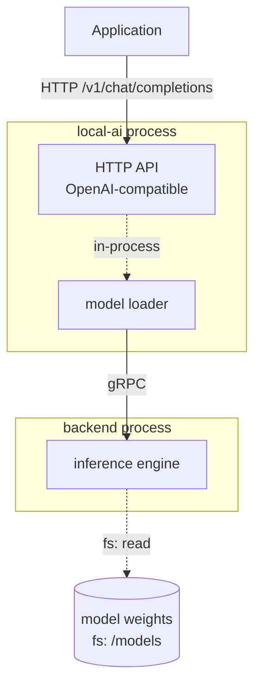
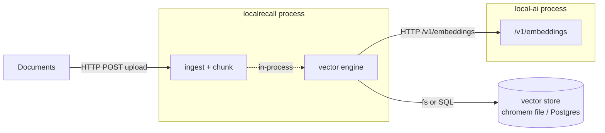
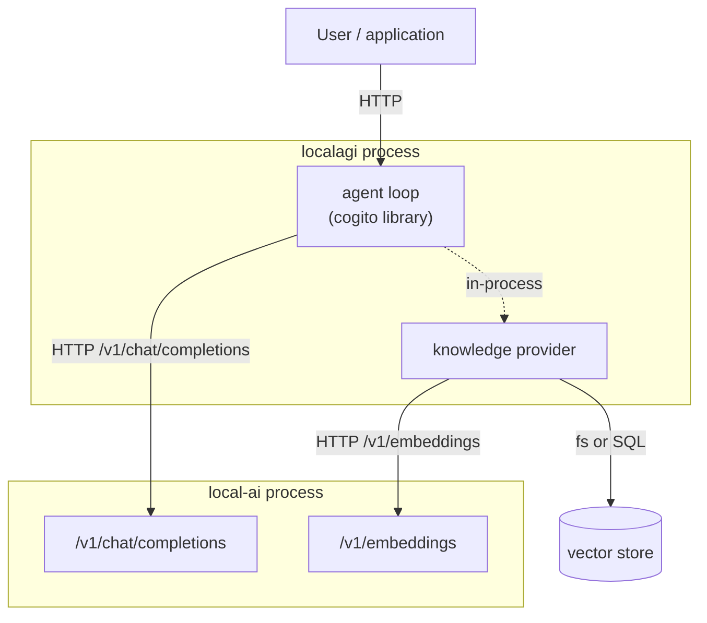
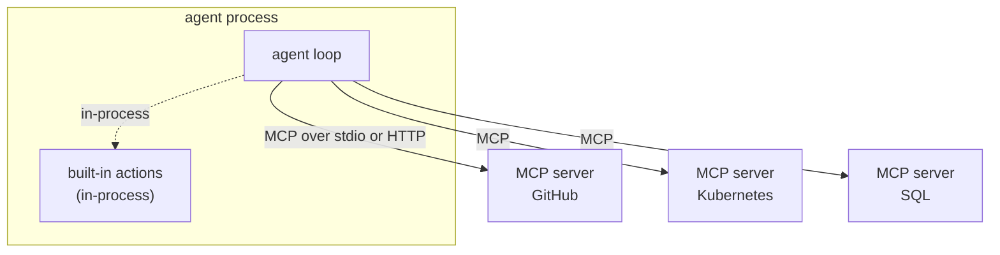
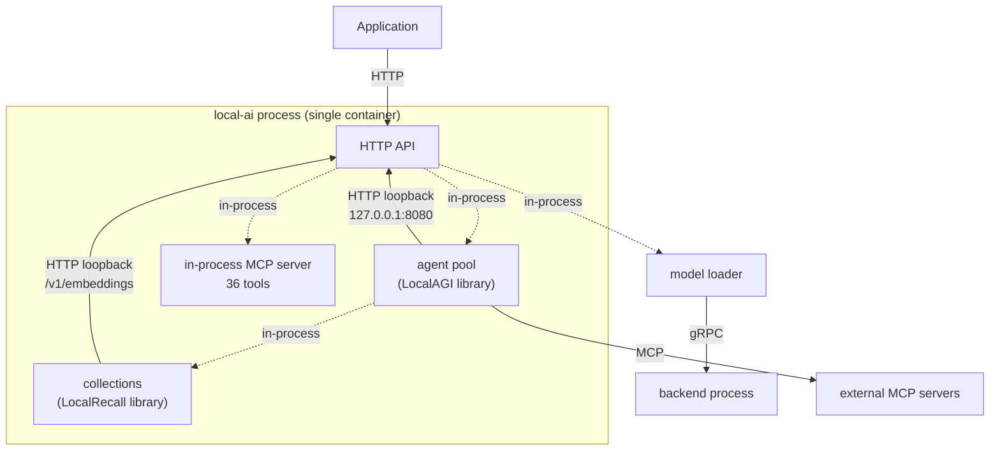

# Architecture

This page builds the stack up one component at a time. Each step adds exactly one
capability and states what that capability costs: a new process, a new network
hop, or a new piece of state to persist.

Every diagram labels its edges with the transport. Where an arrow is dashed and
labelled `in-process`, no network is involved. That distinction is the point of
the page.

## Step 1 — inference only

The smallest useful deployment is one process.

```text
Application
    |
    | HTTP  /v1/chat/completions
    v
  LocalAI
    |
    | gRPC
    v
 Backend process
    |
  Model weights
```



Two processes, not one. LocalAI is a supervisor and an API translator; the model
is executed by a **separate backend process** that LocalAI starts and speaks gRPC
to. A stock container ships with no backends at all — the first model install
also downloads one, as an OCI artifact from a container registry.

State introduced: model weights and generated model configuration in `/models`,
backend binaries in `/backends`.

## Step 2 — embeddings

Embeddings are not a different architecture. They are a different model on a
different endpoint, executed through the same backend mechanism.

```text
  Text
    |
    | HTTP  /v1/embeddings
    v
  LocalAI
    |
    | gRPC
    v
Embedding model
    |
  Vector
```

Worth knowing before you build anything on top: the vector's dimension is a
property of the model, and every consumer of a collection must use the same model
that populated it. Changing embedding models invalidates a collection.

Measured on the reference embedding model used throughout this handbook
(`granite-embedding-107m-multilingual`): 384 dimensions, vectors returned
already L2-normalized, so cosine similarity is a plain dot product.

## Step 3 — retrieval

LocalRecall adds document storage and similarity search. It computes no
embeddings itself.

```text
Documents
    |
    v
LocalRecall  ---- HTTP /v1/embeddings ---->  LocalAI
    |
    v
Vector store
```



The arrow from LocalRecall to LocalAI is the important one: **LocalRecall is a
client of an embeddings endpoint.** It does not care that the endpoint is
LocalAI. Any OpenAI-compatible `/v1/embeddings` will do.

The reverse arrow does not exist. LocalAI never calls LocalRecall.

## Step 4 — agents

An agent turns a single inference call into a loop that can decide to call tools,
retrieve knowledge and try again.

```text
                 LocalAGI
                /        \
               /          \
          LocalAI      LocalRecall
                            |
                         LocalAI
                        embeddings
```



Two things in this diagram routinely surprise people.

**The agent loop is not LocalAGI's code.** It is
[`github.com/mudler/cogito`](https://github.com/mudler/cogito), a library both
LocalAGI and LocalAI depend on. LocalAGI supplies configuration, persistence,
connectors, HTTP and scheduling around it.

**The knowledge provider is not a separate service by default.** LocalAGI links
LocalRecall's `rag` package into its own process and calls it directly. There is
no HTTP hop to LocalRecall unless you deliberately configure one by setting
`LOCALAGI_LOCALRAG_URL`, which selects a different code path built on a
hand-written HTTP client.

So the "three services" mental picture is already wrong at step 4: this is **two**
processes plus a vector store, not three.

## Step 5 — tools and MCP

Tools are what let an agent affect anything outside the model.

```text
                     LocalAGI
                         |
             +-----------+-----------+
             |           |           |
             v           v           v
         MCP GitHub   MCP K8s     MCP SQL
```



Three points the diagram is meant to settle:

- **The agent decides when and why a tool runs.** MCP determines only how the
  tool is reached. Adding an MCP server adds capability, not judgement.
- **Built-in actions are not MCP.** A stock LocalAI v4.8.2 reports 40 built-in
  actions and 9 connectors compiled into the binary; those execute in-process.
  MCP is for capabilities that live outside the process.
- **MCP is a trust boundary.** Every MCP server an agent is given is something
  the model can invoke with arguments it chose. See
  [security](../06-deployment/security.md).

MCP also runs in the other direction. LocalAI v4.8.2 *hosts* an MCP server. A stock
container logs `LocalAI Assistant in-memory MCP server initialised tools=36
read_only=false` — 36 administrative tools over the model runtime, not read-only,
backing LocalAI's built-in Assistant.

It is described as *in-memory*, and we found no default HTTP path for it: `/mcp`,
`/api/mcp` and `/mcp/sse` all returned 404 on a stock container. Treat it as a privilege
surface for the Assistant rather than as an externally reachable endpoint.

## Step 6 — the integrated deployment

Everything above can be one process.



This is what `docker run localai/localai:latest` gives you with no further
configuration. The agent pool starts automatically; the container's own log says
so:

```text
INFO  Agent pool started (standalone/LocalAGI mode) stateDir="//data" apiURL="http://127.0.0.1:8080"
```

Note the two loopback edges. Even inside a single process, the agent pool reaches
inference over **HTTP on 127.0.0.1**, and the knowledge layer reaches embeddings
the same way. The logical boundary is preserved as a real HTTP boundary. That has
consequences:

- API-key configuration applies to these internal calls.
- The agent pool is deliberately started only *after* the HTTP listener is
  accepting connections, because knowledge-base backends call the embeddings API
  on this same process. A startup ordering bug here would deadlock.
- Requests an agent makes appear in the same access log as external traffic.

## Which state lives where

| State | Owner | Default location | Lost if not persisted |
|---|---|---|---|
| Model weights and model YAML | LocalAI | `/models` | Re-downloaded |
| Backend binaries | LocalAI | `/backends` | Re-downloaded |
| Runtime/config settings | LocalAI | `/configuration` | Configuration reset |
| Agent definitions and agent state | LocalAGI layer | `/data` | **All agents lost** |
| Collections and vectors | LocalRecall layer | vector store path or PostgreSQL | **All knowledge lost** |
| Conversation context for one request | caller / agent loop | memory only | Not persisted by design |

The LocalAI image declares four volumes: `/models`, `/backends`, `/configuration`
and `/data`. Mounting only `/models` — a very common starting point, and what
most quickstarts show — silently discards every agent you create.

## Choosing a shape

| Situation | Shape |
|---|---|
| Learning the stack | Step 6, one container |
| Inference only, no agents | Step 1, agents disabled |
| Retrieval only, no agents | Step 3 |
| Agents against an existing OpenAI-compatible server | LocalAGI standalone |
| Inference and agents scale differently | Split LocalAI and LocalAGI |
| Knowledge shared by several agent deployments | LocalRecall as a service |

Start at step 6 and separate a layer only when you have a concrete reason.
[Deployment patterns](../04-integration/deployment-patterns.md) works through
each split and what it costs.

## Upstream references

- [LocalAI `core/cli/run.go`](https://github.com/mudler/LocalAI/blob/v4.8.2/core/cli/run.go) — startup ordering; agent pool started after the listener is ready. Validated against v4.8.2.
- [LocalAI `Dockerfile`](https://github.com/mudler/LocalAI/blob/v4.8.2/Dockerfile) — `VOLUME /models /backends /configuration /data`.
- [LocalAGI `webui/collections/inprocess.go`](https://github.com/mudler/LocalAGI/blob/v2.9.0/webui/collections/inprocess.go) — in-process construction of LocalRecall engines. Validated against v2.9.0.
- [LocalAGI `core/state/pool.go`](https://github.com/mudler/LocalAGI/blob/v2.9.0/core/state/pool.go) — RAG provider selection, HTTP provider when `LOCALAGI_LOCALRAG_URL` is set.
- [LocalRecall `rag/engine.go`](https://github.com/mudler/LocalRecall/blob/v0.6.4/rag/engine.go) — the vector-engine contract. Validated against v0.6.4.
- Startup log, embedding dimensions and latency: observed 2026-08-17, see [version matrix](version-matrix.md).
