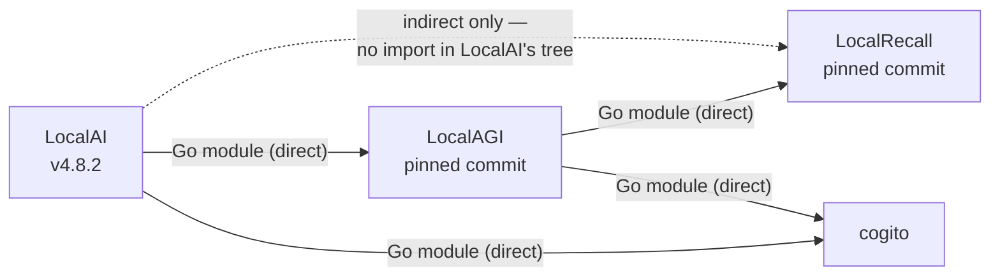

# The ecosystem

Three repositories carry the names in this handbook's title. Understanding how
they relate requires a fourth name that appears in none of the marketing
material, and a distinction between what a project *is* and where its code
*runs*.

## The one-line model

```text
LocalAI     = model/compute runtime
LocalAGI    = agent platform
LocalRecall = knowledge/retrieval layer
MCP         = external capability boundary
```

This model is useful and it is what most readers arrive with. It is also
incomplete in three specific ways, each of which this page then corrects:

1. It implies three deployable services. In current versions, one process can be
   all three.
2. It attributes the agent reasoning loop to LocalAGI. The loop actually lives in
   a fourth library, `cogito`.
3. It implies LocalRecall is a database. It is not; it stores nothing itself
   without a backend, and it computes no embeddings at all.

## What each project actually is

### LocalAI — the model runtime

LocalAI executes models and exposes them over HTTP. It owns:

- text generation, embeddings, audio, image, video and multimodal inference
- the *backend* abstraction: the engines that actually execute a model
  (llama.cpp, vLLM, whisper.cpp, stable-diffusion, MLX and others)
- model and backend acquisition, via galleries
- hardware detection and capability selection
- OpenAI-, Anthropic- and Ollama-compatible HTTP surfaces

LocalAI is a **single Go server process** that supervises **separate backend
processes** and speaks gRPC to them. A stock v4.8.2 container ships with zero
models and zero backends; both are pulled on demand. Backends arrive as OCI
artifacts from a container registry, not as libraries compiled into the binary.

That design decision explains a lot of first-run behaviour: installing your first
model also downloads a backend, and the two are reported as one job.

### LocalAGI — the agent platform

LocalAGI turns a model endpoint into a system that can pursue goals: it holds
agent definitions, persists their state, exposes them over HTTP and a web UI,
runs them on schedules, connects them to Slack/Discord/Telegram/GitHub/IRC, and
wires in tools, skills and MCP servers.

What LocalAGI does **not** own is the reasoning loop itself.

### cogito — the agent loop

[`github.com/mudler/cogito`](https://github.com/mudler/cogito) is a Go library,
by the same author, that implements the actual reason/act/observe cycle: tool
selection, reasoning extraction, planning, loop detection, retries, context
compaction and streaming. Both LocalAGI and LocalAI depend on it directly.

This matters beyond trivia. cogito is designed to make **small local models**
behave reliably as agents. When forced reasoning is enabled it does not hand the
model the real tool list at all. It first asks for schema-validated reasoning,
then asks the model to pick a tool from a JSON-schema `enum` of real tool names,
then generates that tool's arguments in a third scoped call. A hallucinated tool
name is impossible by construction.

If you want to know *why* an agent behaved a certain way, cogito is frequently
the answer, and neither LocalAGI's nor LocalAI's documentation will tell you.

### LocalRecall — the knowledge layer

LocalRecall ingests documents, splits them into chunks, has them embedded, writes
them to a vector backend, and answers similarity queries.

Two properties are commonly misread:

- **It runs no models.** Every embedding is an HTTP call to an external
  OpenAI-compatible `/embeddings` endpoint. In this ecosystem that endpoint is
  usually LocalAI, but nothing requires it to be.
- **It is a library first and a service second.** The HTTP server is roughly 670
  lines of shell around an importable Go package. That layering is precisely what
  lets LocalAGI embed it with no network hop.

### MCP — a protocol boundary, not a component

The Model Context Protocol is how capabilities are exposed across a trust
boundary. It is not a peer of the three projects, and it is not equivalent to
LocalAGI.

The direction matters, and both directions are in use:

- **As a client**, an agent connects to external MCP servers and gains their
  tools.
- **As a server**, LocalAI v4.8.2 hosts an in-process MCP server exposing its own
  administrative surface. A stock container logs 36 tools registered, writable by
  default.

An agent decides *when and why* a tool runs. MCP only determines *how the tool is
reached*. Conflating the two leads to the belief that adding an MCP server adds
agency; it does not.

## Why the boundaries blur

The three projects are not independent peers. They form a dependency chain:



LocalAI imports LocalAGI's packages directly. It never imports LocalRecall
directly — a search of LocalAI's source for `mudler/localrecall` returns nothing.
LocalRecall reaches LocalAI's deployment *through* LocalAGI's agent stack.

The practical consequence: when you run LocalAI v4.8.2, you are also running
LocalAGI's agent platform and, if you use a knowledge base, LocalRecall's
retrieval engine — in the same process, without installing either.

A stock LocalAI container says so in its own startup log:

```text
INFO  Agent pool started (standalone/LocalAGI mode) stateDir="//data" apiURL="http://127.0.0.1:8080"
```

Read that line carefully. Three separate facts are in it:

1. The agent pool started without being asked. It is on by default.
2. Its state lives in `/data`, not `/models`.
3. It reaches inference at `http://127.0.0.1:8080` — its own HTTP port. Even
   inside one process, the agent layer talks to the inference layer over the
   OpenAI-compatible API, on the loopback interface.

Point 3 is the reason the "logical versus physical" distinction is worth a whole
page rather than a paragraph. The logical boundary between the agent layer and
the model layer is preserved *as an HTTP boundary* even when there is no process
boundary at all.

## Why the projects exist separately

The projects were not carved out of one system for architectural elegance; they
accreted in a particular order, and the seams follow the problems that were being
solved at the time.

**Backend fragmentation came first.** Running open models locally means dealing
with llama.cpp, vLLM, MLX, whisper.cpp, diffusers and more — each with its own
build requirements, hardware support, model formats and API. LocalAI's original
value was a single OpenAI-shaped API in front of that mess, plus the packaging to
make each engine installable. Everything else in LocalAI follows from owning the
model runtime.

**Agents are a different problem.** An agent runtime cares about goals, tool
schemas, iteration limits, persistence and failure recovery. Almost none of that
concerns whether a GGUF is being executed by llama.cpp or by MLX. LocalAGI was
built as a separate no-code platform, and the genuinely hard part — making a 1B
model reliably select a tool — was factored out again into cogito.

**Retrieval is a third problem.** Chunking, embedding, vector persistence and
similarity search share no code with either inference or agent orchestration.
LocalRecall was written to be embeddable precisely because RAG is a component of
other systems more often than it is a product.

The consolidation into LocalAI v4 is a *packaging* decision layered on top of
that history. The logical boundaries survived it, which is why they remain the
right way to reason about the system.

## What the ecosystem is for

Stated without the marketing register, the stack targets these problems:

| Problem | Which layer addresses it |
|---|---|
| Every inference engine has a different API and build story | LocalAI backend abstraction |
| Applications are written against OpenAI's API | LocalAI compatibility surfaces |
| Model files and runtimes are large and hardware-specific | Galleries, on-demand OCI backends, capability detection |
| Small local models are unreliable at tool use | cogito's constrained tool-selection scheme |
| Agents need to persist, schedule and reach external systems | LocalAGI platform, connectors, MCP |
| Models cannot recall anything beyond their context window | LocalRecall collections and retrieval |
| Data must not leave the operator's infrastructure | Self-hosting all of the above |

The last row is the reason the others are worth the trouble. Every capability
here exists in hosted form elsewhere and usually works better there. The
trade-off is control: what runs, on whose hardware, with which data, reachable by
whom, and for how long. Whether that trade is worth making is a decision about
the workload, not a decision this handbook makes for you.

## Do you need all three?

No, and most readers should not start with all three.

| If you need | Run | Notes |
|---|---|---|
| An OpenAI-compatible endpoint for local models | LocalAI alone | The agent pool can be disabled |
| Retrieval over your documents, no agents | LocalRecall + any embeddings endpoint | LocalAI is a convenient embeddings provider, not a requirement |
| Agents, tools and knowledge in one process | LocalAI v4 alone | Agents and collections are built in |
| Agents against an existing model server | LocalAGI alone | Point it at any OpenAI-compatible URL |
| Independent scaling of agents and inference | LocalAI + LocalAGI as separate services | See [deployment patterns](../04-integration/deployment-patterns.md) |

The single most common mistake is deploying three containers because there are
three project names. Start with one process and separate a layer only when you
have a reason: independent scaling, independent failure domains, independent
upgrade cadence, or a different inference provider.

## Where to go next

- [Architecture](architecture.md) builds the system up one component at a time.
- [Logical versus physical](logical-vs-physical.md) is the central distinction in
  this handbook.
- [Terminology](terminology.md) disambiguates the overloaded words, of which
  "memory" is the worst.
- [Project boundaries](project-boundaries.md) answers "which project owns X".

## Upstream references

- [LocalAI `README.md`](https://github.com/mudler/LocalAI/blob/v4.8.2/README.md) — "A small core, not a bundle"; built-in agents claim. Validated against v4.8.2, 2026-08-17.
- [LocalAI `go.mod`](https://github.com/mudler/LocalAI/blob/v4.8.2/go.mod) — direct requirement on `github.com/mudler/LocalAGI` and `github.com/mudler/cogito`; `github.com/mudler/localrecall` marked indirect.
- [LocalAGI `README.md`](https://github.com/mudler/LocalAGI/blob/v2.9.0/README.md) — knowledge base "implementation uses LocalRecall libraries". Validated against v2.9.0.
- [LocalAGI `go.mod`](https://github.com/mudler/LocalAGI/blob/v2.9.0/go.mod) — direct requirement on `github.com/mudler/localrecall` and `github.com/mudler/cogito`.
- [LocalRecall `rag/collection.go`](https://github.com/mudler/LocalRecall/blob/v0.6.4/rag/collection.go) — library constructors used by in-process consumers. Validated against v0.6.4.
- [`github.com/mudler/cogito`](https://github.com/mudler/cogito) — the agent loop library.
- Startup log quoted above: observed from `localai/localai:latest` reporting `v4.8.2 (5ff25d9d)`, 2026-08-17. See [version matrix](version-matrix.md).
