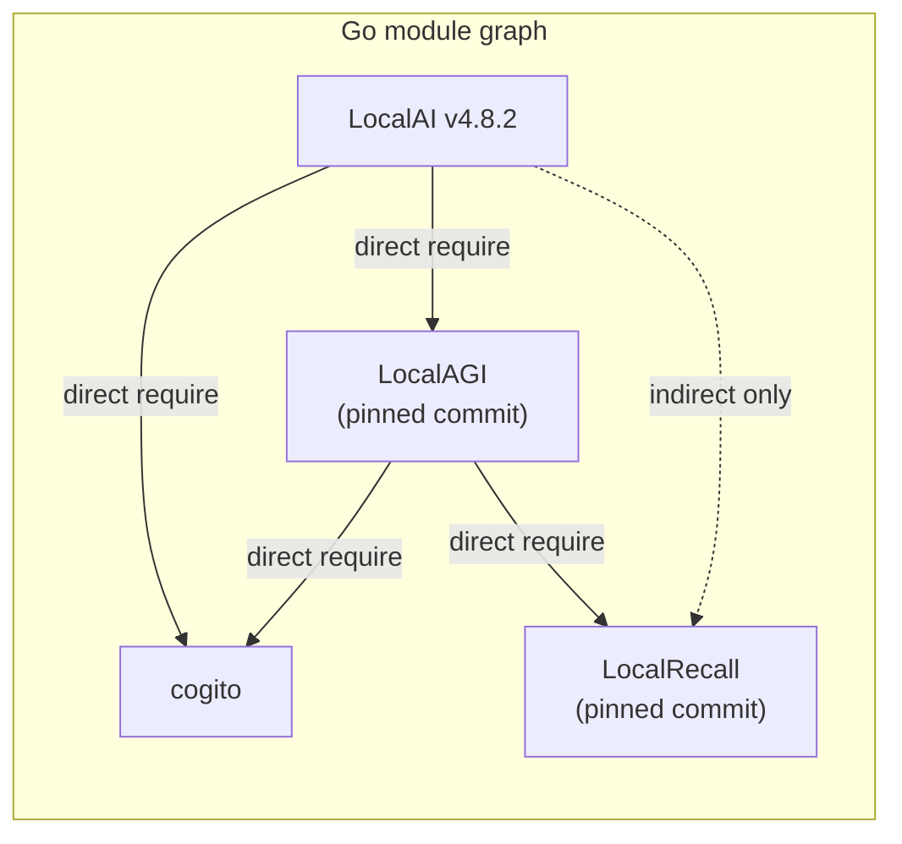
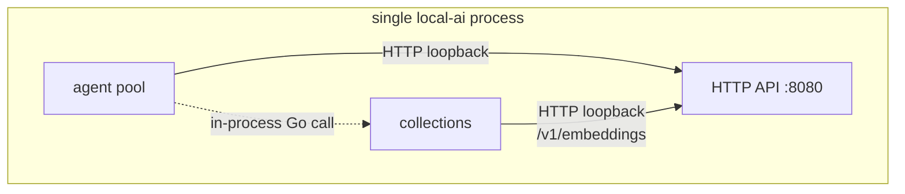
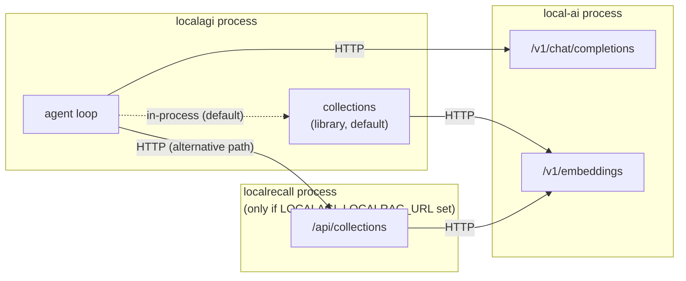

# Logical versus physical architecture

Three project names do not imply three services. This page separates the
architectural boundaries — which are real and stable — from the deployment
topology, which is a packaging choice that has changed twice already.

Confusing the two produces most of the wrong questions people ask about this
stack: "how do I connect LocalAGI to LocalAI?" is often unanswerable because in
the reader's deployment they are the same process.

## The logical model

These four responsibilities are worth naming regardless of how you deploy:

| Layer | Owns | Question it answers |
|---|---|---|
| **Model runtime** | executing models, hardware abstraction, model acquisition | "What computes a token?" |
| **Agent runtime** | goals, iteration, tool selection, agent state | "What decides what to do next?" |
| **Knowledge** | chunking, embedding coordination, vector persistence, retrieval | "What does it know that isn't in the prompt?" |
| **Capability boundary** | exposing external tools to an agent | "What can it affect?" |

The names LocalAI, LocalAGI, LocalRecall and MCP map onto those four. That
mapping is sound and this handbook uses it throughout.

What it does *not* tell you is how many processes you are running.

## The physical reality

In current versions the code is linked, not merely deployed alongside:



LocalAI's source imports LocalAGI packages in a dozen places. It imports
LocalRecall in none — a search of LocalAI's Go sources for `mudler/localrecall`
returns zero hits. LocalRecall reaches a LocalAI deployment *through* LocalAGI's
collections layer.

The chain is **LocalAI → LocalAGI → LocalRecall**, and it is a compile-time
chain, not a network one.

## Three supported patterns

### Pattern A — integrated

One process. This is what `docker run localai/localai:latest` gives you.

```text
+--------------------------------------------------+
|                     LocalAI                      |
|                                                  |
|  inference          HTTP :8080                   |
|                                                  |
|  +--------------------------------------------+  |
|  | LocalAGI agent platform (library)          |  |
|  |   agent pool, skills, connectors, jobs     |  |
|  |                                            |  |
|  |  +--------------------------------------+  |  |
|  |  | LocalRecall collections (library)    |  |  |
|  |  +--------------------------------------+  |  |
|  +--------------------------------------------+  |
+--------------------------------------------------+
         |                         |
      gRPC                      MCP / HTTP
         v                         v
   backend process          external tools
```

Verified by the container's own startup log:

```text
INFO  Agent pool started (standalone/LocalAGI mode) stateDir="//data" apiURL="http://127.0.0.1:8080"
```

Note what that line does **not** say: it does not say the agent layer calls
inference by function call. It says `apiURL="http://127.0.0.1:8080"`. Inside one
process, the agent layer still speaks HTTP to the inference layer over loopback.



Two of those three edges are network calls to itself. One is a function call.

**When to use it:** learning, single-node deployments, anything where inference
and agents scale together. This should be your default.

**What it costs:** everything shares a failure domain, a process memory space and
an upgrade cadence. A backend that exhausts memory takes the agent platform down
with it.

### Pattern B — separated services

```text
LocalAGI
   |
   +---- HTTP ----> LocalAI       (inference + embeddings)
   |
   +---- HTTP ----> LocalRecall   (knowledge, optional)
```

Standalone LocalAGI points at a model server with `LOCALAGI_LLM_API_URL`. By
default its knowledge base is still **in-process** — LocalRecall linked as a
library. Setting `LOCALAGI_LOCALRAG_URL` switches to a genuinely different code
path that talks to a remote LocalRecall over HTTP.



**When to use it:** inference and agents have different scaling profiles; a GPU
node serves several agent deployments; you want to upgrade one without the other;
you are using a non-LocalAI inference provider.

**What it costs:** two or three sets of configuration, real network failure modes
between layers, and version skew you now have to manage yourself.

### Pattern C — composable

The layers are independently useful. Each of these is a supported deployment:

```text
Application ------> LocalAI                  inference only, agents disabled

Custom agent ------> LocalRecall              retrieval without LocalAGI

LocalAGI ------> other OpenAI-compatible      agents without LocalAI
                 model server

LocalRecall ------> other OpenAI-compatible   knowledge without LocalAI
                    embeddings endpoint
```

The last two are worth stating plainly because they are frequently assumed
impossible. Neither LocalAGI nor LocalRecall contains any LocalAI-specific
requirement in its inference path: both are clients of OpenAI-shaped HTTP APIs.
LocalRecall's embedding client is the stock `go-openai` library pointed at
`OPENAI_BASE_URL`.

## What actually changes between patterns

This is the table to read before choosing.

| | Pattern A (integrated) | Pattern B (separated) |
|---|---|---|
| Processes to run | 1 (+ backends) | 2–3 (+ backends) |
| Agent → inference | HTTP over loopback | HTTP over the network |
| Agent → knowledge | in-process function call | in-process by default; HTTP if configured |
| Knowledge → embeddings | HTTP over loopback | HTTP over the network |
| Agent state location | `/data` in the LocalAI container | LocalAGI's state dir |
| Scale agents independently | No | Yes |
| Failure domain | Shared | Separate |
| Auth between layers | Same API key surface | Must be configured per hop |
| Version skew | Impossible by construction | Yours to manage |

The row that catches people is **agent state location**. In Pattern A your agents
live in `/data` inside the LocalAI container. The LocalAI image declares four
volumes — `/models`, `/backends`, `/configuration`, `/data` — and most
quickstarts mount only `/models`. Every agent you create is then discarded when
the container is replaced.

## Version skew is a real hazard

Pattern A pins its embedded layers to specific commits, not to the standalone
releases you would download.

At LocalAI v4.8.2 the pins are pseudo-versions — commits, not tags — of both
LocalAGI and LocalRecall. Two consequences:

- The agent features inside LocalAI v4.8.2 are **not** the features of LocalAGI
  v2.9.0. They are whatever existed at the pinned commit.
- LocalAI and LocalAGI pin *different* versions of cogito, the library that
  actually implements the agent loop. LocalAI v4.8.2 pins a July 2026 commit;
  LocalAGI v2.9.0 pins a March 2026 one. Capabilities present in the newer cogito
  — sub-agent spawning, KV-cache prefill, self-editing prompts — are simply not
  reachable from standalone LocalAGI.

So "LocalAGI" names two different things depending on which pattern you deploy.
When reporting a bug, say which.

## How to tell what you are running

```bash
curl -s http://localhost:8080/api/agents
```

If this returns JSON with `actions`, `connectors` and `agentCount`, the agent
platform is embedded and running in that process.

```bash
docker logs <container> 2>&1 | grep -i "agent pool"
```

The startup line reports the mode, the state directory and the inference URL the
agent layer will use.

```bash
curl -s http://localhost:8080/api/agents/collections
```

If this returns `{"collections":…,"count":…}`, the knowledge layer is embedded
too.

## Choosing

Start with Pattern A. Split a layer out when you can name the reason:

- **Different scaling profile.** Agents are I/O-bound and cheap; inference is
  memory- and GPU-bound. If you need twenty agent workers and one GPU, split.
- **Different failure domain.** You do not want a model OOM to kill scheduled
  agent jobs.
- **Different upgrade cadence.** Regulated environments often cannot upgrade an
  inference node casually.
- **Shared knowledge.** Several deployments reading one corpus argues for
  LocalRecall as a service with PostgreSQL behind it.
- **Non-LocalAI inference.** vLLM directly, or a hosted endpoint.

If none of those apply, a split buys you operational cost and no capability.

## Upstream references

- [LocalAI `go.mod`](https://github.com/mudler/LocalAI/blob/v4.8.2/go.mod) — direct requirement on LocalAGI and cogito; LocalRecall marked `// indirect`. Validated against v4.8.2.
- [LocalAI `core/services/agentpool/agent_pool.go`](https://github.com/mudler/LocalAI/blob/v4.8.2/core/services/agentpool/agent_pool.go) — imports `LocalAGI/core/{agent,sse,state,types}`, `LocalAGI/services`, `LocalAGI/webui/collections`.
- [LocalAI `Dockerfile`](https://github.com/mudler/LocalAI/blob/v4.8.2/Dockerfile) — `VOLUME /models /backends /configuration /data`.
- [LocalAGI `webui/collections/inprocess.go`](https://github.com/mudler/LocalAGI/blob/v2.9.0/webui/collections/inprocess.go) — in-process LocalRecall engine construction.
- [LocalAGI `core/state/pool.go`](https://github.com/mudler/LocalAGI/blob/v2.9.0/core/state/pool.go) — `NewHTTPRAGProvider`, selected only when `LOCALAGI_LOCALRAG_URL` is set.
- [LocalAGI `README.md`](https://github.com/mudler/LocalAGI/blob/v2.9.0/README.md) — states `LOCALAGI_LOCALRAG_URL` is "not used for built-in knowledge base".
- Startup log and endpoint responses: observed 2026-08-17 against `localai/localai:latest` reporting v4.8.2. See [version matrix](version-matrix.md).
