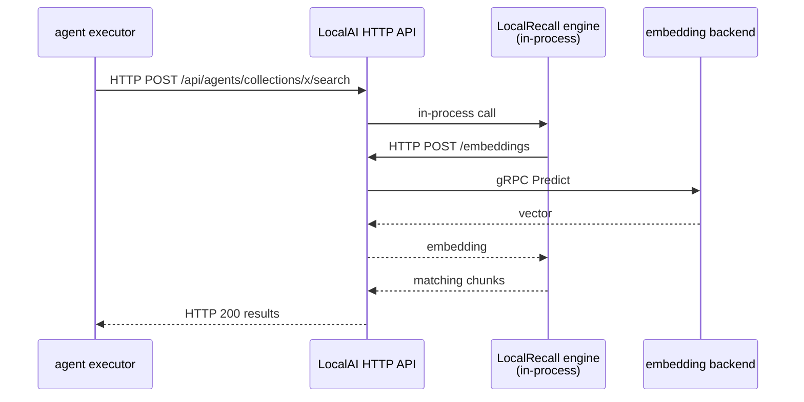

# Project boundaries

"Which project owns X?" is the question this page answers. It is harder than it
looks, because ownership of a *responsibility* and ownership of the *process it
runs in* are frequently different.

## Ownership at a glance

| Responsibility | Owned by | Runs inside (default deployment) |
|---|---|---|
| Executing a model | a backend process | its own OS process, started by LocalAI |
| Model acquisition, config, routing | LocalAI | the `local-ai` process |
| Hardware/capability detection | LocalAI | the `local-ai` process |
| OpenAI/Anthropic/Ollama API surfaces | LocalAI | the `local-ai` process |
| Embedding *generation* | LocalAI (or any OpenAI-compatible server) | a backend process |
| The agent loop | **cogito** | whichever process runs the agent |
| Agent definitions, persistence, scheduling | LocalAGI | the `local-ai` process, or standalone |
| Built-in actions and connectors | LocalAGI | same |
| Skills | LocalAGI + skillserver | same |
| Chunking | LocalRecall | the process that embeds it |
| Vector persistence | LocalRecall's chosen engine | in-process files, or PostgreSQL |
| Retrieval / similarity search | LocalRecall | the process that embeds it |
| Tool transport across a boundary | MCP | client in the agent process; server anywhere |

Two rows deserve emphasis because they contradict the common mental model.

**The agent loop is not owned by LocalAGI.** It is
[`github.com/mudler/cogito`](https://github.com/mudler/cogito). LocalAGI is the
platform around it. Both LocalAI and LocalAGI depend on cogito directly, and at
*different pinned versions*.

**Embedding generation is not owned by LocalRecall.** LocalRecall has no model
runtime. Every embedding is an outbound HTTP call to an OpenAI-compatible
`/embeddings` endpoint.

## Service, library, or both

| Component | Standalone service | Importable library | Embedded by default in |
|---|---|---|---|
| LocalAI | Yes | No | — |
| LocalAGI | Yes | **Yes** | LocalAI v4 |
| LocalRecall | Yes | **Yes** | LocalAGI (and therefore LocalAI v4) |
| cogito | No | Yes | LocalAI and LocalAGI |
| skillserver | Yes | Yes | LocalAGI (as an in-process MCP server) |
| A backend | Yes (it is a process) | No | — |

LocalAI is the only one of these that is exclusively a service. Everything above
the model runtime is a library that also happens to ship a server.

That is the structural reason the "three services" picture breaks down: two of
the three projects were designed to be embedded.

## Which project answers which question

### "What computes a token?"

A backend process — `cpu-llama-cpp`, a vLLM process, an MLX process. LocalAI
starts it, supervises it, and speaks gRPC to it. LocalAI itself computes nothing.

If inference is slow or wrong, the problem is usually in the backend or the model
configuration, not in LocalAI's HTTP layer.

### "What decides what to do next?"

cogito, running inside whichever process hosts the agent. LocalAGI supplies the
tools, the model endpoint and the configuration; cogito runs the loop.

If an agent stops early, loops, or picks the wrong tool, the behaviour is
cogito's — and the iteration cap that stopped it is LocalAGI configuration.

### "What does it know that isn't in the prompt?"

LocalRecall's collection for that agent. Retrieved by similarity search over
chunks that were embedded by LocalAI.

### "What can it affect?"

Built-in actions (LocalAGI, in-process) and MCP servers (external, over stdio or
HTTP). The agent decides; MCP only transports.

## Boundaries that are not where you expect

### LocalAI never calls LocalRecall

A search of LocalAI's Go sources for `mudler/localrecall` returns **zero** hits.
LocalRecall is present in LocalAI's dependency graph only transitively, via
LocalAGI. All of LocalAI's knowledge functionality is reached through LocalAGI's
collections layer.

### LocalAI has two different knowledge paths with different physics

This is the sharpest illustration of why "in-process" is not a sufficient answer.

**Path 1 — the LocalAGI pool path (single-node).** The agent pool installs
LocalRecall's provider directly. A knowledge lookup is a Go function call.

**Path 2 — the native executor path (distributed).** The agent worker performs a
knowledge lookup by issuing an **HTTP POST to LocalAI's own REST API** at
`/api/agents/collections/<name>/search`. That request routes back into the same
binary, which serves it from an in-process LocalRecall engine, which then POSTs
to `/embeddings` — on LocalAI again — which finally makes a gRPC call to the
embedding backend.

One "local" knowledge lookup, two loopback HTTP round trips and a gRPC call.

Neither path is wrong. But a latency budget, a trace, or a firewall rule written
for one will not describe the other.

### LocalAI cannot use a remote LocalRecall

LocalAGI supports pointing at a remote LocalRecall server over HTTP. LocalAI does
**not** expose that capability: the HTTP RAG provider is never constructed on
LocalAI's paths, and the `local_rag_url` / `local_rag_api_key` configuration
fields present in LocalAI's agent config are parsed and never read.

If you need agents in LocalAI to share a knowledge service with something else,
the supported route is a shared PostgreSQL vector store, not a shared LocalRecall
server.

### Skills are an MCP server inside the process

LocalAGI runs skillserver as an **in-process MCP server** over in-memory
transports. So "skills" are delivered to the agent by the same protocol as
external tools, without leaving the process.

### LocalAGI does not expose an MCP server

LocalAGI is an MCP **client** only. LocalAI, by contrast, hosts one: a stock
v4.8.2 container registers 36 administrative tools, writable by default.

## The `/v1` inconsistency

A systemic wart worth knowing before you substitute components.

cogito builds inference URLs by concatenating the configured base URL with
`/chat/completions` — it never inserts a version segment. LocalAGI's and
LocalRecall's shipped compose files set bare `http://localai:8080`. This works
only because **LocalAI registers un-prefixed aliases** for its OpenAI routes
alongside the `/v1` ones.

The consequence: if you point LocalAGI or LocalRecall at any *other*
OpenAI-compatible server, you must give it a base URL that already ends in
`/v1`. Otherwise every request goes to `/chat/completions` and gets a 404.

LocalAI's own native agent executor does append `/v1`, so the two paths inside
LocalAI disagree with each other about this.

## Can I replace a component?

| Replace | Possible | Notes |
|---|---|---|
| LocalAI, keeping LocalAGI | Yes | Any OpenAI-compatible server; base URL must end in `/v1` |
| LocalAI, keeping LocalRecall | Yes | Set `OPENAI_BASE_URL` to any embeddings endpoint |
| LocalAGI, keeping LocalAI | Yes | Disable agents; drive `/v1/chat/completions` from your own orchestrator |
| LocalRecall, keeping the rest | Partly | Agents' built-in knowledge is LocalRecall; you would bypass it and inject context yourself |
| cogito | No | Not a configuration point; it is the loop |
| A backend | Yes | That is the backend abstraction's purpose |

## Upstream references

- [LocalAI `core/services/agents/knowledge.go`](https://github.com/mudler/LocalAI/blob/v4.8.2/core/services/agents/knowledge.go) — the executor's HTTP knowledge lookup against LocalAI's own API. Validated against v4.8.2.
- [LocalAI `core/services/agentpool/agent_pool.go`](https://github.com/mudler/LocalAI/blob/v4.8.2/core/services/agentpool/agent_pool.go) — pool-path RAG provider installation; engine selection.
- [LocalAI `core/services/agents/config.go`](https://github.com/mudler/LocalAI/blob/v4.8.2/core/services/agents/config.go) — `local_rag_url` / `local_rag_api_key`, parsed and unused.
- [LocalAI `core/http/routes/openai.go`](https://github.com/mudler/LocalAI/blob/v4.8.2/core/http/routes/openai.go) — un-prefixed route aliases.
- [LocalAGI `core/agent/mcp.go`](https://github.com/mudler/LocalAGI/blob/v2.9.0/core/agent/mcp.go) — MCP client transports. Validated against v2.9.0.
- [LocalAGI `services/skills/service.go`](https://github.com/mudler/LocalAGI/blob/v2.9.0/services/skills/service.go) — skillserver as an in-process MCP server.
- [LocalRecall `rag/engine.go`](https://github.com/mudler/LocalRecall/blob/v0.6.4/rag/engine.go) — engine contract. Validated against v0.6.4.
- [`github.com/mudler/cogito`](https://github.com/mudler/cogito) — the agent loop.
