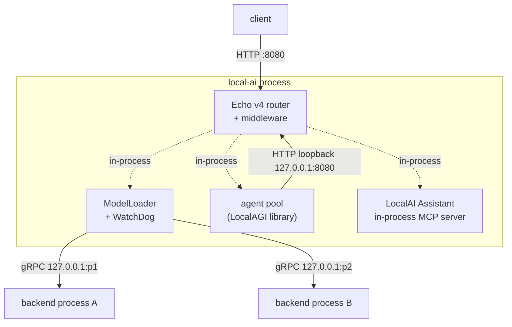
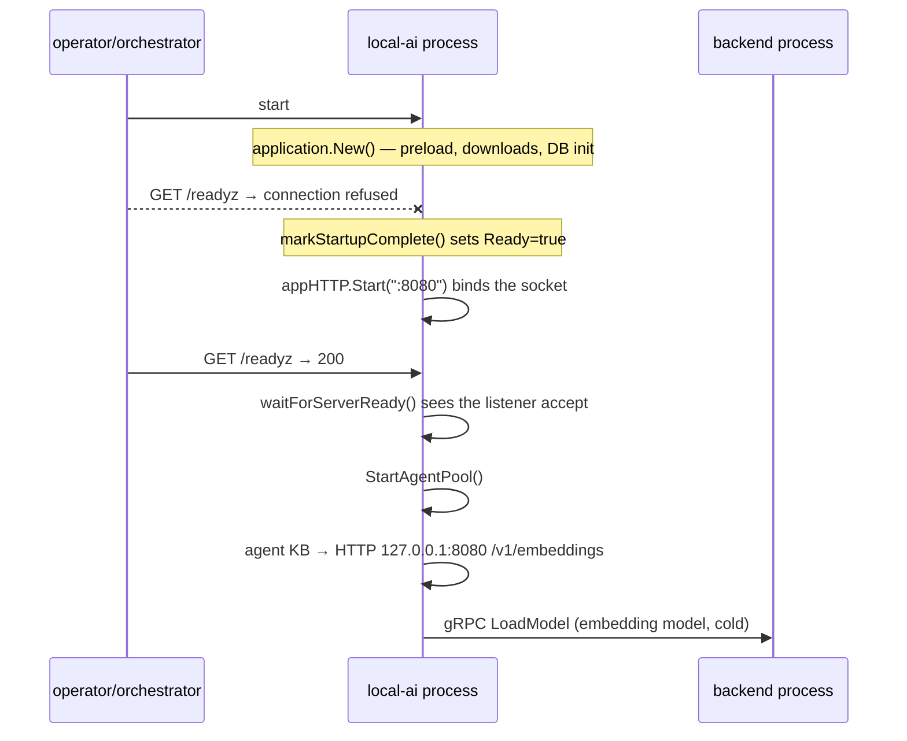
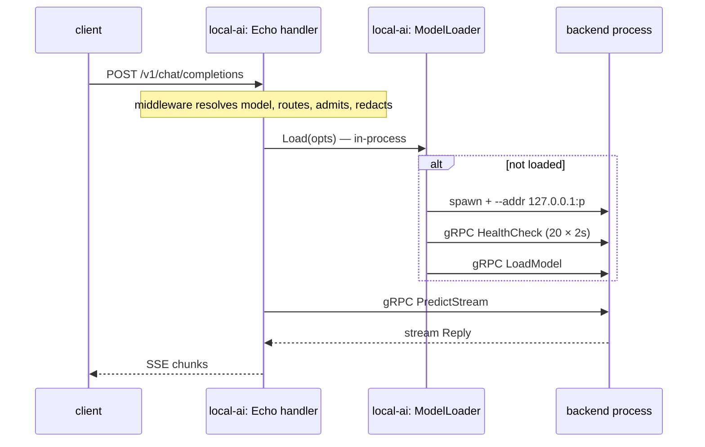

# LocalAI architecture

Everything in LocalAI hangs off two facts: there is exactly one server process,
and every model executes in a different one.

> **On citations.** File paths below were read from LocalAI master at commit
> `c29c99e` (2026-08-17), which is master shortly *after* the v4.8.2 tag. The
> behaviour described was cross-checked against a running `v4.8.2 (5ff25d9d)`
> instance where a test is noted. Line numbers may drift by a few lines against
> the tag itself; file and function names do not.

## Process model



Three edges in that diagram are worth stating in words.

**Client to server is HTTP; server to backend is gRPC.** Nothing else crosses a
process boundary during inference. A backend process is started by
`github.com/mudler/go-processmanager` (not a bare `exec.Command`), which owns the
pidfile, state directory and process group, and is handed `--addr 127.0.0.1:<port>`
on its command line.

**The agent pool talks to inference over loopback HTTP, not a Go call.** The
agent runtime is linked into the binary as a library, but it reaches the
inference API the same way an external client would. A stock container says so in
its own startup log (tested 2026-08-17):

```text
INFO  Agent pool started (standalone/LocalAGI mode) stateDir="//data" apiURL="http://127.0.0.1:8080"
```

That means API keys, CORS, admission control and the access log all apply to
traffic the process generates for itself.

**LocalAI hosts an MCP server in-process.** The same container logs
`LocalAI Assistant in-memory MCP server initialised tools=36 read_only=false`
(tested 2026-08-17) — an inbound administrative surface, writable by default,
disabled with `LOCALAI_DISABLE_ASSISTANT`.

## The HTTP layer is Echo v4

`core/http/app.go` builds the server with `echo.New()` from
`github.com/labstack/echo/v4`. LocalAI v2/v3 used Fiber; v4 does not. The exact
release where the swap landed was not traced in this pass — what is verified is
that at v4.8.2 the router, middleware types and context are Echo's.

Server timeouts (source-verified, v4.8.2):

| Setting | Value | Why |
|---|---|---|
| `ReadHeaderTimeout` | 30s | Slowloris defence |
| `IdleTimeout` | 120s | keep-alive |
| `ReadTimeout` | **0 (unset)** | multi-GB uploads must not be cut |
| `WriteTimeout` | **0 (unset)** | SSE streams run for minutes |

The code comment is explicit that operators wanting stricter limits should front
the server with a reverse proxy. There is no request timeout you can set from
LocalAI's own configuration.

## Middleware chain

Registration order in `API()`, outermost first. Order is behaviour here, not
style: health routes are registered *before* auth so probes are never
authenticated, and PII redaction is registered *innermost* on inference routes so
it sees the model the router actually picked.

| # | Middleware | Notes |
|---|---|---|
| 1 | Body limit (`--upload-limit`, default 15 MB) | Skipped for `POST /3d/remesh` (513 MB) |
| 2 | Error handler (opaque variant under `--opaque-errors`) | Falls back to the SPA index on HTML 404s |
| 3 | `Pre: StripPathPrefix()` | Sub-path mounting behind a proxy |
| 4 | `Pre:` external base URL stamp | Only when `LOCALAI_BASE_URL` is set |
| 5 | `Pre: RemoveTrailingSlash()` | — |
| 6 | `Machine-Tag` response header | Only when `LOCALAI_MACHINE_TAG` is set |
| 7 | `SecurityHeaders()` | CSP, nosniff, `SAMEORIGIN`, Referrer-Policy — early, so 404s carry them too |
| 8 | gzip `Compression()` | Streaming prefixes excluded (`/v1/chat/completions`, `/v1/responses`, `/v1/messages`, `/v1/realtime`, `/v1/audio/speech`, `/api/chat`) |
| 9 | Access log (xlog) | `/healthz`, `/readyz`, `/api/operations`, `/api/resources` logged at DEBUG when 200 |
| 10 | `Recover()` | **Registered only when not in debug.** Running at `--log-level=debug` disables panic recovery |
| 11 | Metrics middleware (`api_call` histogram) | Skips `/metrics` itself |
| 12 | **Health routes** | Registered here, before auth |
| 13 | `auth.Middleware(...)` | Static keys or the auth DB |
| 14 | `RequireRouteFeature`, `RequireModelAccess`, `RequireQuota` | Only when an auth DB exists |
| 15 | CORS | See below |
| 16 | CSRF (Sec-Fetch-Site mode) | **On by default**; `--disable-csrf` to turn off |

Two behaviours in that table surprise people:

- With `LOCALAI_CORS=false` (the default), LocalAI installs Echo's permissive
  `middleware.CORS()`. With `LOCALAI_CORS=true` and no allow-origins list, it
  **refuses** to register a wildcard policy and logs a warning. Turning CORS "on"
  without an origin list is more restrictive than leaving it off.
- With no auth DB, `adminMiddleware` degrades to a no-op. In no-auth mode every
  admin endpoint — gallery install, backend delete, `/metrics`, `/api/traces` —
  is open to anyone who can reach the port.

## Application construction

`application.New()` in `core/application/startup.go` is a single blocking
function that runs before any socket is bound. Ordering that matters:

| Order | Step | Why it is where it is |
|---|---|---|
| 1 | `loadRuntimeSettingsFromFile()` | Merges `runtime_settings.json` **before** anything consumes options; env and CLI still win over the file |
| 2 | Thread default from `CPUPhysicalCores()` | Only if still 0 |
| 3 | `newApplication()` — ModelLoader, ModelConfigLoader, template evaluator, voice profiles, face/voice registries | The registries are backed by the built-in vector store |
| 4 | CPU capability and GPU probes, logged | Diagnostic output, not a backend selector — see [backends](backends.md) |
| 5 | Reap `*.partial` downloads older than 24 h | The only cleanup of failed downloads |
| 6 | Auth DB init, HMAC secret generation | Secret persisted to `{DataPath}/.hmac_secret`, mode `0600` |
| 7 | OTel/Prometheus meter provider | **Before** any counter is created, or counters bind to a no-op provider |
| 8 | Billing/stats recorder | Unconditional unless disabled through the Go option |
| 9 | PII redactor, event store, router decision store, classifier registry, admission limiter | — |
| 10 | `initDistributed()` — NATS, object storage, node registry | No-op unless `LOCALAI_DISTRIBUTED` |
| 11 | `InstallModels()` — models named on the command line | **Downloads happen here** |
| 12 | `LoadModelConfigsFromPath()` — every YAML in the models dir | — |
| 13 | `gallery.RegisterBackends()` | Maps backend name → `run.sh` path in the loader |
| 14 | Background backend upgrade checker | — |
| 15 | Watchdog construction | Created when watchdog, LRU limit or memory reclaimer is on |
| 16 | `LoadToMemory` preload | **Loads weights into RAM/VRAM here** |
| 17 | Config-directory watcher | fsnotify, with optional polling fallback |
| 18 | `markStartupComplete()` | Flips readiness, last |

The gallery service, the in-process MCP server and the agent job service are
created inside `application.start()` during step 3–4.

## Startup ordering and readiness



Two claims about readiness circulate and only one is right at v4.8.2.

| Claim | Reality |
|---|---|
| `/readyz` returns 503 during preload | Only under **systemd socket activation**, where systemd pre-binds the socket. Otherwise the listener does not exist yet and probes get `connection refused` (source-verified, v4.8.2) |
| `/healthz` reflects model state | No. `/healthz` is always 200, deliberately, so a long preload never triggers a liveness restart |

`/readyz` is backed by an `atomic.Bool` flipped exactly once at the end of
`application.New()`. A nil readiness callback fails open to 200.

Consequences:

- A Kubernetes **startupProbe with a large `failureThreshold` is mandatory**, not
  optional. Upstream's own manifest uses `/readyz`, `periodSeconds: 10`,
  `failureThreshold: 60` — a ten-minute budget.
- The container image's `HEALTHCHECK` uses `--start-period=60m`. The Dockerfile
  explains why: a frontend's startup preload has been observed materializing
  31 GB of HuggingFace artifacts before the HTTP server binds.
- For a fast start, do not use `LOCALAI_PRELOAD_MODELS` or
  `LOCALAI_LOAD_TO_MEMORY`. Let the first request pay the cold load instead.

The image healthcheck is mode-aware: `scripts/build/healthcheck.sh` reads argv
and probes `/readyz` on `:8080` for `run`, `/readyz` on the gRPC base port minus
one for `worker`, and exits 0 for the subcommands with no HTTP surface
(`agent-worker`, `p2p-worker`, `chat`, `models`, `backends`, `tts`, …).

## Why the agent pool starts after the listener

`core/cli/run.go` starts a goroutine that calls `waitForServerReady` and only
then `app.StartAgentPool()`. The reason is a dependency cycle inside one process:
agent knowledge-base collections embed documents by calling `/v1/embeddings` on
`http://127.0.0.1:8080` — the process's own listener. Starting the pool
synchronously before `Start()` would block the goroutine that is supposed to bind
the socket.

The practical fallout:

- Agent endpoints answer `503 {"error":"agent pool is starting, please retry shortly"}`
  for a window after `/readyz` goes green. Readiness does not cover the pool.
- If `LOCALAI_API_KEY` is set, the pool authenticates to itself. The key it uses
  is `LOCALAI_AGENT_POOL_API_KEY`, defaulting to the first static API key.
- The first agent knowledge-base write triggers a cold load of the embedding
  model (`granite-embedding-107m-multilingual` by default), which is a backend
  process spawn, not a library call.

## Request path, end to end



The per-route middleware pipeline on `/v1/chat/completions` is the canonical
shape (source-verified, v4.8.2), outermost first:

1. `ExposeNodeHeader` — stamps `X-LocalAI-Node` when enabled
2. `UsageMiddleware` — billing/usage recording
3. `TraceMiddleware` — API tracing (JSON request bodies only)
4. `BuildFilteredFirstAvailableDefaultModel(FLAG_CHAT)` — picks a default model
   when the request omits one, filtered by usecase
5. `SetModelAndConfig` — resolves the model config
6. `SetOpenAIRequest` — schema-specific body parse
7. `RouteModel` — the content router; may rewrite `input.Model`
8. `AdmissionControl` — per-model concurrency limit, 503 + `Retry-After`
9. `pii.RequestMiddleware` — redaction, innermost, so it sees the routed model

`/v1/responses` deliberately gets **none** of steps 7–9. It gets an agent
interceptor instead. See [api](api.md).

Every gRPC call opens a fresh TCP connection and closes it on return
(`pkg/grpc/client.go`), with 50 MB send/receive caps and a 10 s health-check
timeout that requires the literal reply `"OK"`. When a model is not configured
for parallel requests, the client serialises calls behind a mutex.

## Shutdown

SIGINT/SIGTERM run registered handlers and then `os.Exit(0)`
(`pkg/signals/handler.go`). The handlers stop all gRPC backends, close the
voice-profile store and drain buffered usage records.

**There is no `echo.Shutdown(ctx)` for the API server.** In-flight inference and
open SSE streams are cut off when the process exits. `RegisterOnShutdown` hooks
exist but only fire on a real `Server.Shutdown`, which is never called
(source-verified, v4.8.2). Behind a load balancer, use a `preStop` sleep and a
generous `terminationGracePeriodSeconds` so the pod is deregistered before the
process dies — nothing in-process drains connections.

Backend teardown has its own budget: a 30 s graceful wait for `IsBusy()` to
clear, a `Free()` call with a 5 s timeout, then `process.Stop()`.
`LOCALAI_FORCE_BACKEND_SHUTDOWN=true` escalates a busy graceful shutdown to a
forced one.

## Observability boundaries

| Capability | Present at v4.8.2 |
|---|---|
| Prometheus `/metrics` | Yes — but **admin-gated**, so a scrape needs an admin credential |
| OpenTelemetry metrics SDK | Yes, with a Prometheus exporter |
| OpenTelemetry **tracing** / spans | **No.** `core/trace/` is an in-memory ring buffer with optional JSON persistence. There is no OTLP exporter and no way to ship these to Jaeger or Tempo |
| Request ID header | `X-Correlation-ID`, set per handler. There is no `X-Request-ID` and no global correlation middleware |

A stock instance exposes exactly one application metric family, `api_call`, plus
Go runtime collectors (tested 2026-08-17, 22 KB of Prometheus text). The billing,
PII and agent metric families exist in code but only materialise once those
subsystems record something. There are no metrics for model latency, token
throughput, backend health or agent iterations. The richer per-request data lives
behind `/api/traces` and `/api/backend-traces`, which are LocalAI-specific JSON
endpoints, not a telemetry export.

Upstream's authentication page lists `GET /metrics` as accessible to all
authenticated users. The code registers it with `adminMiddleware`. Believe the
code.

## Upstream references

- [`core/http/app.go`](https://github.com/mudler/LocalAI/blob/v4.8.2/core/http/app.go) — Echo construction, middleware order, server timeouts. Validated against v4.8.2.
- [`core/cli/run.go`](https://github.com/mudler/LocalAI/blob/v4.8.2/core/cli/run.go) — startup ordering; agent pool started after the listener accepts. Validated against v4.8.2.
- [`core/application/startup.go`](https://github.com/mudler/LocalAI/blob/v4.8.2/core/application/startup.go) — application construction order, `markStartupComplete`. Validated against v4.8.2.
- [`core/http/routes/health.go`](https://github.com/mudler/LocalAI/blob/v4.8.2/core/http/routes/health.go) — `/healthz` and `/readyz` semantics. Validated against v4.8.2.
- [`pkg/grpc/client.go`](https://github.com/mudler/LocalAI/blob/v4.8.2/pkg/grpc/client.go) — per-RPC dial, 50 MB caps, health check contract. Validated against v4.8.2.
- [`pkg/model/process.go`](https://github.com/mudler/LocalAI/blob/v4.8.2/pkg/model/process.go) — go-processmanager spawn, teardown timeouts. Validated against v4.8.2.
- [`pkg/signals/handler.go`](https://github.com/mudler/LocalAI/blob/v4.8.2/pkg/signals/handler.go) — signal handling, `os.Exit(0)`. Validated against v4.8.2.
- [`core/services/monitoring/metrics.go`](https://github.com/mudler/LocalAI/blob/v4.8.2/core/services/monitoring/metrics.go) — OTel meter provider with Prometheus exporter. Validated against v4.8.2.
- [`Dockerfile`](https://github.com/mudler/LocalAI/blob/v4.8.2/Dockerfile) — `HEALTHCHECK --start-period=60m` and its rationale. Validated against v4.8.2.
- Startup log lines, `/metrics` contents, empty-instance probes: observed 2026-08-17 on `localai/localai:latest` reporting `v4.8.2 (5ff25d9d)`.
