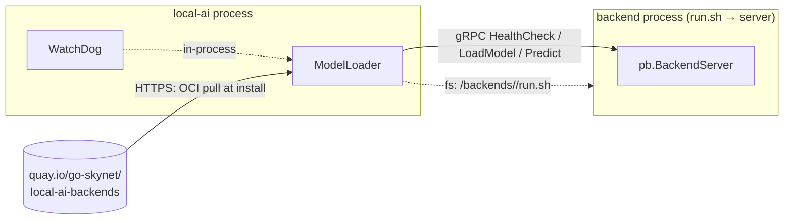
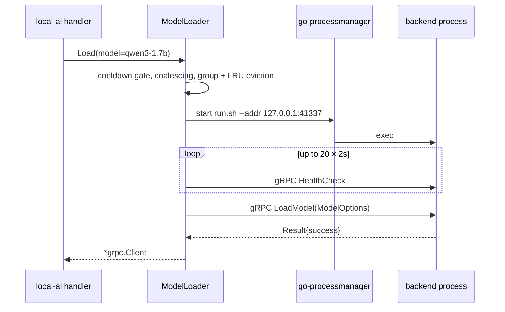

# Backends

A backend is a separate executable that implements one gRPC service and is
started, health-checked, driven and killed by LocalAI. Since v3.2.0 no backend is
compiled into the server binary; they are OCI artifacts pulled from a container
registry at install time.



## The contract

`backend/backend.proto` is 1453 lines: one `service Backend` with about 60 RPCs
and 110 messages. Every backend implements the same service; a backend that does
not support an operation returns `UNIMPLEMENTED`.

The Go side splits the client interface deliberately in two
(`pkg/grpc/backend.go`):

| Interface | Contents |
|---|---|
| `InferenceBackend` | 28 methods, one per discrete inference call: `Embeddings`, `Predict`, `PredictStream`, `GenerateImage`, `UpscaleImage`, `GenerateVideo`, `Generate3D`, `TTS`, `TTSStream`, `SoundGeneration`, `AudioTranscription`(+`Stream`), `Detect`, `Depth`, `FaceVerify`, `FaceAnalyze`, `VoiceVerify`, `VoiceAnalyze`, `VoiceEmbed`, `Rerank`, `TokenClassify`, `Score`, `VAD`, `Diarize`, `SoundDetection`, `AudioEncode`, `AudioDecode`, `AudioTransform` |
| `ControlBackend` | Lifecycle and control: `IsBusy`, `HealthCheck`, `LoadModel`, `TokenizeString`, `Detokenize`, `Status`, the four `Stores*`, `GetTokenMetrics`, three duplex-stream constructors, `Forward`, `ModelMetadata`, five fine-tuning methods, three quantization methods, `Free` |

The split is a compile-time guard: in-flight accounting wrappers must explicitly
implement every inference method rather than silently inheriting them.

Wire facts that matter operationally (source-verified, v4.8.2):

| Fact | Detail |
|---|---|
| Transport | **TCP only.** No Unix socket path exists anywhere in `pkg/`, `core/` or `backend/` |
| Address | Locally spawned: `127.0.0.1:<freeport>`. Remote/external: whatever address you supply |
| Connection reuse | **None.** Every RPC dials a fresh connection and closes it on return |
| Message size cap | 50 MB send and receive |
| Health check | 10 s timeout, and the reply must be the literal string `"OK"` |
| Serialization | When the model is not configured for parallel requests, the client holds a mutex across the whole call |
| Auth | `LOCALAI_GRPC_AUTH_TOKEN` + `authorization: Bearer …`, constant-time compared. Used in distributed mode |
| Model identity guard | `LoadModel` records the model name; later requests naming a different model are rejected with `NotFound` + the sentinel `model identity mismatch`. This exists because gRPC ports get recycled in distributed mode |

Backends also install a **parent-death watcher**: a goroutine polls `getppid()`
and exits when the parent changes or becomes 1, so a SIGKILLed LocalAI does not
leave orphaned model processes holding VRAM. Controlled by
`LOCALAI_BACKEND_PARENT_WATCH` (2 s default interval; disabled on Windows).

## Backends are OCI artifacts

Tested 2026-08-17 — after installing one embedding model, `GET /backends`
returned:

```json
{"Name":"cpu-llama-cpp","RunFile":"/backends/cpu-llama-cpp/run.sh",
 "IsMeta":false,"IsSystem":false,
 "Metadata":{"alias":"llama-cpp","name":"cpu-llama-cpp",
 "gallery_url":"https://index.localai.io/backends",
 "installed_at":"2026-08-17T12:23:46Z",
 "uri":"quay.io/go-skynet/local-ai-backends:latest-cpu-llama-cpp",
 "digest":"sha256:84e8be85bdcfaafbcc81e8b6ee0232111d1fefa393550d1f01340008e8714504"}}
```

The install is **pinned by digest** in `metadata.json`, which is what the upgrade
checker compares against. The artifact was 42 MiB.

`run.sh` is mandatory. `core/gallery/backends.go` validates its presence before
committing an install, and `ml.externalBackends[name]` is set to that path. This
is the whole indirection: a backend *name* resolves to a `run.sh`, which is
executed with `--addr host:port` appended.

- Go backends are a `main.go` calling `grpc.StartServer(*addr, impl)`.
- Python backends source `backend/python/common/libbackend.sh`, whose
  `startBackend` activates the venv, prepends `${EDIR}/lib` to
  `LD_LIBRARY_PATH`, and `exec`s the server script with the forwarded args.

If the resolved path is not a file, LocalAI treats the string as a **remote gRPC
address** and attaches without spawning anything. That is how
`LOCALAI_EXTERNAL_GRPC_BACKENDS` and distributed workers plug in.

## The backend gallery

`backend/index.yaml` carries **1,033 entries: 140 meta and 893 concrete**,
covering **75 distinct backend families** (measured against v4.8.2 sources). The
README's "60+ backends" is a conservative statement of the same thing.

Two entry kinds:

| Kind | Has `uri:` | Has `capabilities:` | Meaning |
|---|---|---|---|
| **Meta** | no | yes | A *family* (`llama-cpp`). Its capability map names concrete entries |
| **Concrete** | yes | no | One build for one target (`cuda12-llama-cpp`), with `mirrors:` |

The `llama-cpp` meta entry is the canonical example:

| Capability | Concrete backend |
|---|---|
| `default` | `cpu-llama-cpp` |
| `nvidia` / `nvidia-cuda-12` | `cuda12-llama-cpp` |
| `nvidia-cuda-13` | `cuda13-llama-cpp` |
| `nvidia-l4t` / `nvidia-l4t-cuda-12` | `nvidia-l4t-arm64-llama-cpp` |
| `nvidia-l4t-cuda-13` | `cuda13-nvidia-l4t-arm64-llama-cpp` |
| `intel` | `intel-sycl-f16-llama-cpp` |
| `amd` | `rocm-llama-cpp` |
| `metal` | `metal-llama-cpp` |
| `vulkan` | `vulkan-llama-cpp` |

A meta backend can never be installed directly. Installing `llama-cpp` resolves
the capability, installs the concrete build, and writes
`<BackendsPath>/llama-cpp/metadata.json` recording `MetaBackendFor` so the alias
can later be resolved and removed.

Roughly half the meta entries are `-development` twins pointing at
`master`-tagged images; `LOCALAI_PREFER_DEV_BACKENDS` flips which one is primary.

## Capability detection

This is the mechanism that decides *which build* of a backend your host gets.
`pkg/system/capabilities.go` resolves it once and memoises the result, in this
order:

1. Cached value.
2. `LOCALAI_FORCE_META_BACKEND_CAPABILITY`. The value `disable` turns capability
   filtering off entirely.
3. The file **`/run/localai/capability`** (path overridable). **This is how each
   container image self-declares its accelerator** — the Dockerfile writes it per
   variant.
4. darwin/arm64 → `metal`; darwin/amd64 → `darwin-x86`.
5. linux/arm64 with NVIDIA → `nvidia-l4t-cuda-13` / `-12` / `nvidia-l4t`,
   depending on which `/usr/local/cuda-*` directory exists.
6. No GPU → `default`.
7. **GPU with ≤ 4 GiB VRAM → `default`**, with a warning. A small GPU gets a CPU
   backend.
8. NVIDIA with a CUDA directory → `nvidia-cuda-13` / `nvidia-cuda-12`; otherwise
   the raw vendor string.

`Capability(capMap)` returns the detected key if the meta entry has it, else
falls back to `default`, then to `cpu` (the last hop exists for metas such as
`vllm` that enumerate GPU keys plus `cpu` but no `default`).

Our observed container took path 3 (tested 2026-08-17):

```text
INFO  Using forced capability run file capabilityRunFile="/run/localai/capability" capability="default\n" env=""
```

### AVX is not a backend selector

The same container logged:

```text
CPU: no AVX    found
CPU: no AVX2   found
CPU: no AVX512 found
```

Those three lines are printed by `entrypoint.sh` before `local-ai` even starts,
and they are **diagnostics only**. A case-insensitive grep for `avx` across the
whole repository hits build scripts, backend Makefiles and a blog post — and
nothing in the Go decision path. AVX support is a compile-time property of the
published CPU builds, not a runtime capability key (source-verified, v4.8.2).

The practical consequence: seeing `no AVX found` does not mean LocalAI picked a
different backend. It means your CPU lacks AVX and a build that *requires* it
will fault at runtime rather than being filtered out beforehand.

### Three separate preference vocabularies

Easy to conflate; they are matched against different things
(`pkg/system/capabilities.go`):

| Vocabulary | Matched against | Consumer | nvidia | metal |
|---|---|---|---|---|
| Build tags | Installed build **directory names** | Alias conflict resolution in `ListSystemBackends` | `[cuda, vulkan, cpu]` | `[metal, cpu]` |
| Engine names | A gallery entry's `backend:` value | Model **variant** selection | `[vllm, sglang, llama-cpp]` | `[mlx, llama-cpp]` |
| Serving features | A gallery entry's **tags** only | Variant ranking | `[dflash, mtp]` | same |

The engine-name default fallback is deliberately empty, so an unknown capability
expresses no engine preference rather than a wrong one.

## Installing a backend

```bash
local-ai backends list
local-ai backends install llama-cpp
local-ai backends upgrade llama-cpp
local-ai backends uninstall llama-cpp
```

Over HTTP: `POST /backends/apply`, `GET /backends/jobs/:uuid`,
`POST /backends/delete/:name`, `GET /backends/available`, `GET /backends/known`,
`GET /backends/upgrades`, `POST /backends/upgrade/:name` — all admin-gated.

The install path (`core/gallery/backends.go`):

1. Unless forced, short-circuit **only if the existing entry is runnable** — the
   check stats `run.sh`, so an orphaned meta pointing at a deleted concrete
   triggers a real reinstall rather than a silent no-op.
2. Resolve meta → concrete via the capability map.
3. Fetch the artifact. Three kinds are supported: OCI images, plain
   tarballs/URLs, and local directories (copied). OCI dominates — 895 `uri:`
   lines in the index, all `quay.io/go-skynet/local-ai-backends:<tag>` with
   `docker.io/localai/localai-backends` mirrors.
4. **Integrity:** OCI plus a gallery `verification:` policy → cosign
   verification. OCI without a policy → warn, or hard-fail under
   `--require-backend-integrity`. Non-OCI without a `sha256:` → the same.
5. **Atomic install:** stage into `<path>.install-tmp`, validate `run.sh` exists,
   write `metadata.json` including the OCI digest, rename the old install to
   `.install-backup`, rename staging into place, roll back on failure.
6. Re-register backends with the model loader.

The **fallback chain** on a failed fetch is: primary URI → each mirror →
`latest-` swapped for `master-` → the `-development` suffix. Tag names are
configurable through `LOCALAI_BACKEND_IMAGES_RELEASE_TAG`,
`LOCALAI_BACKEND_IMAGES_BRANCH_TAG` and `LOCALAI_BACKEND_DEV_SUFFIX`.

## Process lifecycle

### Load on demand

`ModelLoader.Load` decides in this order (`pkg/model/initializers.go`):

1. **Distributed mode** — bypass the local cache so replica selection runs per
   request.
2. **Cache hit** — update LRU last-used and return the existing client.
3. **Group exclusivity**, then **LRU cap** — both enforced *before* any new load,
   so eviction can make room first.
4. **Explicit backend** — if the model config names one, load it directly.
5. **Auto-detect** — otherwise enumerate installed backends, order them, and
   trial-load each until one's `LoadModel` succeeds. All failures are joined into
   a single error.

Auto-detect ordering (`pkg/model/autoload.go`) always sorts the installed set
deterministically first. The old code ranged a Go map, which let the `opus` audio
codec win a GGUF load. For a `.gguf` file the list is filtered to LLM-capable
backends with `llama-cpp` placed first; if filtering empties the list, it falls
back to the full sorted set.

"LLM-capable" comes from a 60-entry capability table keyed by backend name. A
backend is LLM-capable only if its `PossibleUsecases` intersect
`[chat, completion, edit, embeddings]` — **unknown backends are not LLM-capable
by design**. Hardware-prefixed names (`cuda12-vibevoice-cpp`, `vulkan-localvqe`)
are resolved by stripping the prefix.

### Cold start



Details that show up in incidents:

| Mechanism | Behaviour |
|---|---|
| Health-check budget | 20 attempts, 2 s apart, overridable per model with `grpc.attempts` / `grpc.attempts_sleep_time` |
| Startup diagnostics | On failure LocalAI builds the error from the process exit code **and the last stderr line**, then stops the process |
| Coalescing | A second request for a loading model waits on a channel rather than starting a second process |
| **Failure cooldown** | After a failed load, further loads are refused for `LOCALAI_MODEL_LOAD_FAILURE_COOLDOWN` (10 s, doubling to a 5 m cap), answered as 503 + `Retry-After`. This is what stops a polling client leaking one process per request |
| Health caching | A successful health probe is cached for 30 s, serialised per model |
| Dead-process eviction | A local process that is not alive is force-deleted from the store; for *remote* models only definitive connection errors evict |
| Env inheritance | `HF_HOME`, `TRANSFORMERS_CACHE` and `HUGGINGFACE_HUB_CACHE` are set to the models path if unset |
| Vulkan | `VK_DRIVER_FILES` / `VK_ICD_FILENAMES` are set from `<workDir>/vulkan/icd.d/*.json` so self-contained Vulkan backends find their bundled ICDs |

### Teardown

`deleteProcess` waits for `IsBusy()` to clear (unless forced), runs unload hooks,
calls `Free()` with a 5 s timeout tolerating `Unimplemented`, marks the process as
intentionally stopping, and calls `process.Stop()`. Timeouts: 30 s graceful, 30 s
forced, 5 s free.

An exit watcher distinguishes intentional stops from crashes and appends the last
stderr line as a diagnostic, which is what you see in the logs when a backend
dies on its own.

## Eviction, and why it kills other processes

The watchdog tracks state **by gRPC address**: busy time, in-flight count,
per-request start IDs, idle time, last used, plus model sizes, pinned models and
concurrency groups.

Its loop runs only when at least one check is enabled, and it self-stops
otherwise:

| Check | Trigger | Action |
|---|---|---|
| `checkBusy` | Busy longer than `LOCALAI_WATCHDOG_BUSY_TIMEOUT` (5 m) | **`ShutdownModelForce`** — the graceful path would wait on the same stuck call |
| `checkIdle` | Idle longer than `LOCALAI_WATCHDOG_IDLE_TIMEOUT` (15 m) | Graceful shutdown. **Pinned models are skipped** |
| `checkMemory` | VRAM (or RAM with no GPU) above `LOCALAI_MEMORY_RECLAIMER_THRESHOLD` (0.95) | Evict LRU until below |

Two capacity mechanisms run on the load path rather than on the tick:

**LRU cap.** `LOCALAI_MAX_ACTIVE_BACKENDS` limits how many backends can be loaded
at once. Enforcement retries 30 times, 1 s apart, waiting for busy models to go
idle; anything busy at selection time is shut down through the *force* path.
`LOCALAI_SIZE_AWARE_EVICTION` reorders candidates largest-first.
`--max-active-backends=1` reproduces the classic single-model behaviour.

**Group exclusivity.** This is the one that surprises people. A model config can
declare:

```yaml
name: whisper-large
concurrency_groups: ["gpu0"]
```

Two loaded models sharing a group cannot coexist on a node. Loading one
**evicts** the other — which means terminating a different OS process, and
therefore dropping whatever that process was holding in VRAM. `Load` calls group
exclusivity *before* the LRU cap precisely so group eviction can make room first.

Pinned models (`pinned: true`) are skipped by idle eviction and by eviction
candidate collection, but not by the busy-timeout kill.

## Diagnosing a backend

| Route | What it gives you | Availability |
|---|---|---|
| `GET /backends` | Installed backends with URI, digest, alias, run file | Admin |
| `GET /system` | External backends plus loaded models and their backend | Admin |
| `GET /backend/monitor` | Live per-backend state | Admin |
| `POST /backend/shutdown` | Stop one backend | Admin |
| `POST /backend/load` | Explicit warm-up | Admin |
| `GET /api/backend-logs`, `/api/backend-logs/:modelId` | **Captured stdout/stderr per model** | Admin, **standalone mode only** |
| `GET /ws/backend-logs/:modelId` | The same, streamed | Admin, standalone only |
| `GET /api/backend-traces`, `/api/backend-traces/:id` | Structured records per backend operation | Admin, needs `LOCALAI_ENABLE_TRACING` |
| `GET /api/models/:id/load-status` | Cold-load progress | Standard auth |

Backend stdout and stderr are tailed into both the server log and an in-memory
`BackendLogStore`, which is what `/api/backend-logs` reads. In distributed mode
those routes are absent on the frontend; the equivalent is
`/api/nodes/:id/backend-logs/:modelId`, proxied to the worker's own HTTP server.

## Upstream references

- [`backend/backend.proto`](https://github.com/mudler/LocalAI/blob/v4.8.2/backend/backend.proto) — the full service and message set. Validated against v4.8.2.
- [`pkg/grpc/backend.go`](https://github.com/mudler/LocalAI/blob/v4.8.2/pkg/grpc/backend.go) — `InferenceBackend` / `ControlBackend` split. Validated against v4.8.2.
- [`pkg/grpc/server.go`](https://github.com/mudler/LocalAI/blob/v4.8.2/pkg/grpc/server.go) — TCP listener, auth interceptors, model-identity guard. Validated against v4.8.2.
- [`pkg/grpc/parentwatch.go`](https://github.com/mudler/LocalAI/blob/v4.8.2/pkg/grpc/parentwatch.go) — parent-death watcher. Validated against v4.8.2.
- [`pkg/model/initializers.go`](https://github.com/mudler/LocalAI/blob/v4.8.2/pkg/model/initializers.go) — load ordering, spawn, health-check loop, alias table. Validated against v4.8.2.
- [`pkg/model/loader.go`](https://github.com/mudler/LocalAI/blob/v4.8.2/pkg/model/loader.go) — coalescing, failure cooldown, health caching, shutdown paths. Validated against v4.8.2.
- [`pkg/model/watchdog.go`](https://github.com/mudler/LocalAI/blob/v4.8.2/pkg/model/watchdog.go) — busy/idle/memory checks, LRU limit, group exclusivity. Validated against v4.8.2.
- [`pkg/model/autoload.go`](https://github.com/mudler/LocalAI/blob/v4.8.2/pkg/model/autoload.go) — deterministic auto-detect ordering. Validated against v4.8.2.
- [`pkg/model/process.go`](https://github.com/mudler/LocalAI/blob/v4.8.2/pkg/model/process.go) — go-processmanager spawn, Vulkan ICD env, teardown, log tailing. Validated against v4.8.2.
- [`pkg/system/capabilities.go`](https://github.com/mudler/LocalAI/blob/v4.8.2/pkg/system/capabilities.go) — capability resolution and the three preference vocabularies. Validated against v4.8.2.
- [`core/gallery/backends.go`](https://github.com/mudler/LocalAI/blob/v4.8.2/core/gallery/backends.go) — install, atomic staging, fallback chain, integrity policy. Validated against v4.8.2.
- [`backend/index.yaml`](https://github.com/mudler/LocalAI/blob/v4.8.2/backend/index.yaml) — meta/concrete entries and capability maps. Validated against v4.8.2.
- [`core/config/backend_capabilities.go`](https://github.com/mudler/LocalAI/blob/v4.8.2/core/config/backend_capabilities.go) — per-backend capability table, LLM-capability predicate. Validated against v4.8.2.
- Installed backend metadata, digest pinning, artifact size, capability and AVX log lines: observed 2026-08-17 on `localai/localai:latest` reporting `v4.8.2 (5ff25d9d)`.
