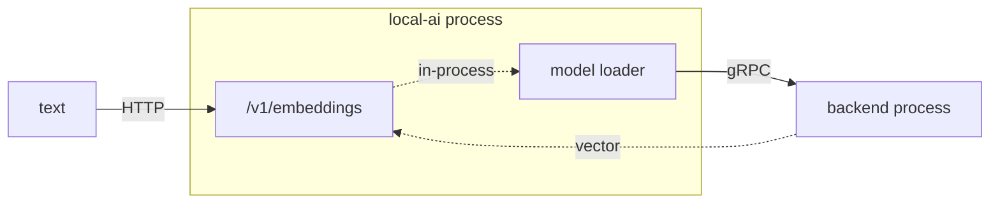

# Embeddings

LocalAI's embeddings endpoint is the foundation the entire knowledge layer stands on.
LocalRecall computes no vectors itself; it is a client of this endpoint, and so is
anything else in the stack that stores or searches text.

This page covers the **server** side. For the client side — how LocalRecall calls it and
what happens when it is misconfigured — see
[LocalRecall embeddings](../03-localrecall/embeddings.md).

## The endpoint

```text
POST /v1/embeddings        (also served un-prefixed at /embeddings)
```

```json
{
  "model": "granite-embedding-107m-multilingual",
  "input": "text to embed"
}
```

`input` accepts a string or an array of strings. The response is OpenAI-shaped:

```json
{
  "object": "list",
  "model": "granite-embedding-107m-multilingual",
  "data": [{"object": "embedding", "index": 0, "embedding": [0.0123, -0.0456, "…"]}]
}
```

Architecturally there is nothing special here. It is the same process, the same backend
mechanism and the same gRPC boundary as chat completions — a different model producing a
different output shape.



## What makes a model an embedding model

One line in its configuration:

```yaml
embeddings: true
```

That flag is what LocalAI checks before serving a model here. It is not a claim about the
model's architecture — it is permission.

```bash
docker exec localai grep -i embeddings /models/granite-embedding-107m-multilingual.yaml
```

The consequence is a trap worth knowing before you debug retrieval quality. A **chat**
model with `embeddings: true` will answer this endpoint. It will return vectors of the
right shape. They will be poor. Nothing errors.

The gallery entry named `bert-embeddings` is exactly this: it is not a BERT model at all,
but Llama-3.2-1B-Instruct Q4_K_M with the flag set — a legacy alias that misleads. Do not
use it.

## The reference model, measured

`granite-embedding-107m-multilingual`, used throughout this handbook.

| Property | Value | How we know |
|---|---|---|
| Dimensions | **384** | observed |
| Quantisation | F16 | gallery entry |
| On-disk size | 220,974,080 bytes (211 MiB) | observed |
| Normalisation | L2, magnitude **0.9999999536** | observed |
| Licence | apache-2.0 | gallery entry |
| Cold call, incl. load | ~3.3 s | observed |
| Warm call | **0.06–0.09 s** | observed |

It is upstream's own default in three independent places — LocalAI's CLI default,
LocalAGI's default, and both projects' shipped compose files. Choosing something else
means diverging from every default in the ecosystem.

### The vectors are already normalized

Verified:

```bash
curl -s http://localhost:8080/v1/embeddings \
  -H 'Content-Type: application/json' \
  -d '{"model":"granite-embedding-107m-multilingual","input":"magnitude check"}' \
  | jq '[.data[0].embedding[] | . * .] | add | sqrt'
```

Observed: `0.9999999536394939`.

Two consequences. **Cosine similarity is a plain dot product** — no division needed,
which is why the vector stores in this ecosystem can be simple. And **do not normalize
again**; you would divide by one and add error.

The magnitude is not exactly 1 — it is 1 within the rounding error of 384 float32
values. Never write an equality assertion against `1.0`.

### What the numbers actually mean

```bash
curl -s http://localhost:8080/v1/embeddings \
  -H 'Content-Type: application/json' \
  -d '{"model":"granite-embedding-107m-multilingual",
       "input":["a cat sat on the mat","a feline rested on the rug","quarterly revenue increased"]}' \
  | jq '[.data[].embedding] as $e
        | {related: ([range(384) | $e[0][.] * $e[1][.]] | add),
           unrelated: ([range(384) | $e[0][.] * $e[2][.]] | add)}'
```

Observed:

```json
{"related": 0.8681793897317607, "unrelated": 0.5404004191810163}
```

Two paraphrases sharing no significant words score **0.87**. Two unrelated sentences
score **0.54**.

The second number is the important one, and it is the single most useful fact on this
page: **the floor is not zero.** Unrelated text is not orthogonal in this embedding
space. Combined with the fact that retrieval in this stack applies **no relevance
threshold**, it means a top-*k* search always returns *k* results, however irrelevant.
An empty-handed "I found nothing" is not something the pipeline can produce.

## Batching

An array input returns one object per string, with `index` preserved:

```bash
curl -s http://localhost:8080/v1/embeddings \
  -H 'Content-Type: application/json' \
  -d '{"model":"granite-embedding-107m-multilingual",
       "input":["first string","second string","third string"]}' \
  | jq -c '[.data[] | {index, dims: (.embedding | length)}]'
```

Observed: `[{"index":0,"dims":384},{"index":1,"dims":384},{"index":2,"dims":384}]`

Ordering is guaranteed by `index`, not by array position — read the field rather than
relying on order.

Whether a *caller* batches is a different question, and it matters for ingestion cost:
LocalRecall's engines differ, and one of them embeds strictly one chunk per call. See
[batching differs by engine](../03-localrecall/embeddings.md#batching-differs-by-engine).

## Dimensions are a permanent commitment

The dimension is a property of the model. It is not a parameter and it cannot be
requested.

Every vector in a collection must come from the **same model**, because similarity
between vectors from different models is meaningless even when the dimensions match.

| Situation | Result |
|---|---|
| New model, different dimension | writes fail on dimension mismatch |
| New model, same dimension | writes succeed and **retrieval silently degrades** |

The second row is the dangerous one: no error, no warning, worse answers. Treat the
embedding model as part of a collection's identity. Changing it means **re-ingesting**,
not migrating.

| Model | Dimensions |
|---|---|
| `granite-embedding-107m-multilingual` | 384 |
| `granite-embedding-125m-english` | 768 |

Larger vectors cost more storage and more compute per comparison. They do not
automatically retrieve better.

## Cost, and where it lands

One embedding call per text. The asymmetry between the two sides of retrieval is worth
internalising:

| Operation | Embedding calls |
|---|---|
| Search a collection | **one**, for the query |
| Ingest a document | **one per chunk** |

Ingestion is the expensive side and the one people benchmark last. At the default
400-character chunk size, a moderately sized manual is thousands of calls. Size it with
the **warm** figure (0.06–0.09 s), not the cold one — the model loads once.

Retrieval, by contrast, is cheap. Measured in a full agent request: the entire retrieval
hop, including the embedding call and the database query, took **29–37 ms**.

## Verifying the endpoint

```bash
curl -s http://localhost:8080/v1/embeddings \
  -H 'Content-Type: application/json' \
  -d '{"model":"granite-embedding-107m-multilingual","input":"test"}' \
  | jq '.data[0].embedding | length'
```

Expected `384`. This is the second rung of the diagnostic ladder in
[`verify-stack.sh`](https://github.com/wrkode/local-ai-stack-handbook/blob/main/scripts/verify-stack.sh),
and if it fails, nothing about collections or retrieval is worth investigating.

| Symptom | Cause | Fix |
|---|---|---|
| Error mentioning embeddings support | model lacks `embeddings: true` | use an embedding model |
| `model not found` | name mismatch — case and hyphens are significant | copy from `/v1/models` |
| Unexpected dimension | different model than you think | check the `model` field in the response |
| First call slow, rest fast | model load | expected; not a fault |
| 401 / 403 | `LOCALAI_API_KEY` set, client token missing | align the keys on every hop |

## Upstream references

- [LocalAI `core/http/endpoints/openai/embeddings.go`](https://github.com/mudler/LocalAI/blob/v4.8.2/core/http/endpoints/openai/embeddings.go) — the handler, input handling and model checks. Validated against v4.8.2.
- [LocalAI `core/backend/embeddings.go`](https://github.com/mudler/LocalAI/blob/v4.8.2/core/backend/embeddings.go) — the gRPC embedding call to the backend.
- [LocalAI `core/http/routes/openai.go`](https://github.com/mudler/LocalAI/blob/v4.8.2/core/http/routes/openai.go) — the `/v1` and un-prefixed route registrations.
- [LocalAI `core/cli/run.go`](https://github.com/mudler/LocalAI/blob/v4.8.2/core/cli/run.go) — `granite-embedding-107m-multilingual` as the default embedding model.
- [LocalAI `gallery/index.yaml`](https://github.com/mudler/LocalAI/blob/v4.8.2/gallery/index.yaml) — the model entry, `embeddings: true`, the 384-dimension description, and the `bert-embeddings` alias.
- [OpenAI Embeddings API reference](https://platform.openai.com/docs/api-reference/embeddings) — the wire format implemented here.
- Dimensions, magnitude, similarity scores, batch ordering, file size and latencies: observed 2026-08-17, see [version matrix](../00-overview/version-matrix.md).
