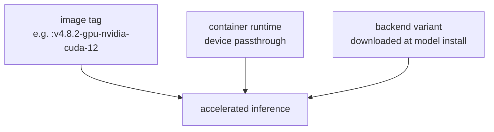

# GPU acceleration

GPU support in LocalAI is a property of two things chosen independently: the **image
variant** and the **backend** it downloads. Getting one right and the other wrong
produces a working CPU deployment that looks like it should be fast.

Nothing in this handbook's learning path requires a GPU. That is deliberate — mixing
device-plugin problems with "what does an agent do" makes both harder to learn.

## The two decisions



All three must agree. LocalAI does not warn you when they do not; it falls back to CPU
and runs.

## Image variants

Eight tag suffixes for v4.8.2, verified present:

| Suffix | Target |
|---|---|
| *(none)* | CPU, amd64 + arm64, 0.29 GB |
| `-gpu-nvidia-cuda-12` | NVIDIA, CUDA 12 |
| `-gpu-nvidia-cuda-13` | NVIDIA, CUDA 13 |
| `-gpu-hipblas` | AMD ROCm |
| `-gpu-intel` | Intel SYCL |
| `-gpu-vulkan` | Vulkan, vendor-neutral |
| `-nvidia-l4t-arm64` | Jetson |
| `-nvidia-l4t-arm64-cuda-13` | Jetson, CUDA 13 |

```bash
docker run -p 8080:8080 --gpus all \
  -v localai-models:/models -v localai-backends:/backends \
  localai/localai:v4.8.2-gpu-nvidia-cuda-12 qwen3-1.7b
```

!!! warning "Do not use AIO or `latest-*` tags"
    **All-in-one images were removed in the 4.x line.** Tags such as `latest-aio-gpu-*`,
    `-extras`, `-cuda-11` and `-intel-f16/f32` still *resolve* but are frozen builds from
    2026-02-21 or earlier. `latest-cpu` has been stale since 2025-06-19 — and is still
    referenced in comments in LocalAI's own compose file.

    A tutorial using `latest-aio-gpu-nvidia-cuda-12` is describing software you are not
    running. Pin an explicit version.

## macOS: Docker cannot reach the GPU

This is the most common wasted afternoon in this ecosystem, so it comes before the Linux
material.

**There is no Metal or Darwin target anywhere in LocalAI's Dockerfile or image
workflows.** A containerised LocalAI on Apple Silicon runs **CPU-only**, inside a Linux
VM. No flag, no image tag and no Docker Desktop setting changes this.

GPU acceleration on a Mac requires the **native install** — the DMG or the install script
— which pulls `metal-darwin-arm64-*` backends.

The practical arrangement on a Mac:

```text
LocalAI          native install (Metal)      host:8080
LocalAGI         container                   -> host.docker.internal:8080
LocalRecall      container                   -> host.docker.internal:8080
```

Everything else in this handbook works unchanged; only LocalAI moves out of Docker. Note
also that **no Intel-Mac binary is published**: release assets cover `linux-amd64`,
`linux-arm64`, `darwin-arm64` and a DMG.

Our Apple Silicon validation was CPU-only for exactly this reason. GPU claims on this page were
subsequently validated on a **separate linux/amd64 host with an NVIDIA Quadro RTX 6000 (24 GB,
driver 590.44.01)** running LocalAI `v4.8.2-gpu-nvidia-cuda-12`. Claims about **ROCm, Intel SYCL,
Vulkan and Metal remain untested** — only CUDA 12 was available.

## NVIDIA on Linux

```bash
nvidia-smi
```

```bash
docker run --rm --gpus all nvidia/cuda:12.4.0-base-ubuntu22.04 nvidia-smi
```

The second command is the one that matters: it proves the **container runtime** can reach
the device. If it fails, LocalAI cannot either, and the problem is the NVIDIA Container
Toolkit rather than LocalAI.

Then match the CUDA major version to the image tag — `-gpu-nvidia-cuda-12` against a
CUDA 12 driver stack, `-cuda-13` against 13.

In Compose:

```yaml
services:
  localai:
    image: localai/localai:v4.8.2-gpu-nvidia-cuda-12
    deploy:
      resources:
        reservations:
          devices:
            - driver: nvidia
              count: all
              capabilities: [gpu]
```

## AMD, Intel, Vulkan

| Vendor | Tag | Device passthrough |
|---|---|---|
| AMD | `-gpu-hipblas` | `--device /dev/kfd --device /dev/dri` |
| Intel | `-gpu-intel` | `--device /dev/dri` |
| Any | `-gpu-vulkan` | `--device /dev/dri` |

Vulkan is the fallback worth remembering: vendor-neutral, and often the fastest path to
*some* acceleration on hardware whose vendor-specific stack is awkward. It is usually
slower than the native path.

*(Documented and source-verified from the image workflows. Not tested.)*

## Verifying that the GPU is actually being used

The image tag proves nothing. Neither does `nvidia-smi` showing the process. Check the
backend and the load line.

**1. Which backend was installed:**

```bash
docker exec localai ls /backends
```

A CPU deployment shows `cpu-llama-cpp`. An accelerated one shows a CUDA, ROCm, SYCL or
Vulkan variant. Verified on the CUDA host:

```text
cuda12-llama-cpp
llama-cpp
```

**If you see `cpu-llama-cpp` on a GPU image, you are running on the CPU** — this is the single
most useful check on this page.

!!! warning "Judge by the directory, not the process name"
    On the same verified CUDA host, the running backend process was:

    ```text
    /backends/cuda12-llama-cpp/lib/ld.so \
      /backends/cuda12-llama-cpp/llama-cpp-cpu-all --addr 127.0.0.1:45479
    ```

    …while `nvidia-smi` attributed **3136 MiB of VRAM to that PID**. `llama-cpp-cpu-all` means
    "**all CPU microarchitecture variants in one binary**" — ggml `dlopen`s the best
    `libggml-cpu-*.so` at runtime — **not** "CPU-only execution". The bundle carries 13 such
    variants alongside `libcublas` and `libcudart`.

    So `ps` output showing `cpu-all` on a GPU host is normal. The **directory** name is the
    signal. Full detail in
    [the model runtime abstraction](../07-deep-dives/model-runtime-abstraction.md).

Backends are downloaded as OCI artifacts at model-install time, and the variant is chosen
by hardware detection *inside the container*. If the container cannot see the device at
install time, it installs the CPU backend and keeps using it afterwards.

**2. What the log says at load:**

```bash
docker logs localai 2>&1 | grep -i -E 'cuda|rocm|sycl|vulkan|metal|offload|gpu layer'
```

**3. Whether it is faster:**

```bash
time curl -s -o /dev/null http://localhost:8080/v1/chat/completions \
  -H 'Content-Type: application/json' \
  -d '{"model":"qwen3-1.7b","messages":[{"role":"user","content":"Write two sentences about vectors."}]}'
```

Compare warm calls, not cold ones — the first includes model load either way. For
reference, CPU-only on Apple Silicon produced a completion in **4 s** including load.

## Layer offloading

For llama.cpp-family backends, `gpu_layers` in the model YAML controls how many
transformer layers are placed on the device:

```yaml
name: qwen3-1.7b
backend: llama-cpp
parameters:
  model: Qwen3-1.7B.Q4_K_M.gguf
gpu_layers: 999
```

A high number means "all of them"; the backend clamps to the actual layer count. Partial
offload is the useful case: a model larger than VRAM can put most layers on the device and
the remainder in system RAM, at the cost of the transfer.

Note that `f16: true` and `context_size` interact with VRAM here — a large context reserves
KV-cache memory proportional to it. The reference model's gallery config sets
`context_size: 8192`; raising it to the model's native 32,768 quadruples that reservation.

### Verified: this is how large models fit on small cards

On the 24 GB host, auto-tuning set `n_gpu_layers=99999999` (all layers) and a 30B MoE model failed:

```text
ggml_backend_cuda_buffer_type_alloc_buffer: allocating 17524.43 MiB on device 0:
cudaMalloc failed: out of memory
```

An 80B model asked for **46,297 MiB**. The working configuration keeps `gpu_layers: 999` but moves
the **expert tensors** to system RAM:

```yaml
name: qwen3next-80b-moecpu
backend: llama-cpp
gpu_layers: 999
threads: 6
options:
    - use_jinja:true
    - tensor_buft_overrides:exps=CPU
```

Result: an 80B MoE model **resident on a 24 GB card**, using 3136 MiB of VRAM and roughly 46 GB of
RSS. A selective variant offloads only blocks 16+ and adds a quantised KV cache:

```yaml
flash_attention: true
cache_type_k: q8_0
cache_type_v: q8_0
options:
    - tensor_buft_overrides:blk\.(1[6-9]|[2-9][0-9])\.ffn_.*_exps\.=CPU
```

`tensor_buft_overrides` is a llama.cpp feature passed through opaquely — it appears nowhere in
LocalAI's Go source. Observed 2026-08-17.

## Failure modes

**GPU image, CPU speed.**

- *Check:* `docker exec localai ls /backends` — is it `cpu-llama-cpp`?
- *Cause:* the device was invisible when the backend was installed, so the CPU variant
  was selected and persists in the `/backends` volume.
- *Fix:* fix device passthrough, then remove the backend volume and let it re-install.
  Merely restarting with the device attached does **not** replace an already-installed
  backend.

**`docker run --gpus all` fails.**

- *Cause:* NVIDIA Container Toolkit not installed or not configured.
- *Check:* the `nvidia/cuda … nvidia-smi` command above.
- *Fix:* install the toolkit. This is not a LocalAI problem.

**Out of memory on load.**

- *Symptom:* the backend dies during load; container exit code 137 for host OOM.
- *Cause:* model plus KV cache exceeds VRAM.
- *Fix:* lower `gpu_layers` for partial offload; reduce `context_size`; use a smaller
  quantisation.

**Two models, one GPU, constant reloading.**

- *Cause:* loading a model may **evict** another, terminating that backend's process.
  Two clients alternating between two models pay a load per request.
- *Fix:* separate deployments per model, or pick one model. See
  [scaling](../07-deep-dives/scaling.md).

**Works standalone, not in Kubernetes.**

- *Cause:* device plugin, resource limits, or node selection — not LocalAI.
- *Fix:* see [Kubernetes](../06-deployment/kubernetes.md).

## What GPU acceleration does not fix

Worth stating, because it is a recurring disappointment:

| Slow thing | Helped? |
|---|---|
| Token generation | **yes** — measured **~4.5x** (30 -> 142 tok/s) |
| Embedding a large ingestion | yes per call; the call count is unchanged |
| Model load | marginally; largely I/O |
| Retrieval | **no** — already 30-56 ms |
| **Agent wall-clock** | **yes, substantially — measured ~11x** |

The agent row corrects an earlier, more pessimistic reading in this handbook. A GPU does not
reduce the *number* of model calls an agent makes, so we expected only a partial gain. Measured on
the same node, same model, same request, the agent went from **23.7 s to 2.12 s** — a larger
speed-up than the raw token-rate improvement.

Counting model calls is still the right first move when an agent is slow: a request making six
calls where it should make two is a prompt or model-capability problem, and no device fixes that.
But "a GPU barely helps agents" is not supported by measurement.

## Upstream references

- [LocalAI container documentation](https://localai.io/basics/container/) — image variants and their targets.
- [LocalAI `Dockerfile`](https://github.com/mudler/LocalAI/blob/v4.8.2/Dockerfile) — build targets; the absence of any Metal or Darwin target. Validated against v4.8.2.
- [LocalAI `pkg/model/initializers.go`](https://github.com/mudler/LocalAI/blob/v4.8.2/pkg/model/initializers.go) — backend selection, load and eviction.
- [LocalAI `core/config/backend_config.go`](https://github.com/mudler/LocalAI/blob/v4.8.2/core/config/backend_config.go) — `gpu_layers`, `f16`, `context_size`.
- [LocalAI releases](https://github.com/mudler/LocalAI/releases/tag/v4.8.2) — published assets; no Intel-Mac binary.
- [NVIDIA Container Toolkit](https://docs.nvidia.com/datacenter/cloud-native/container-toolkit/latest/) — device passthrough prerequisites.
- Tag suffix inventory, AIO removal and staleness dates, CPU-only latency on Apple Silicon, and retrieval-hop timings: observed 2026-08-17 on darwin/arm64.
- `cuda12-llama-cpp` installed and in use, the backend process and its VRAM attribution, the `llama-cpp-cpu-all` naming, hardware auto-tuning, the CUDA OOM figures and the two MoE offload configurations: observed 2026-08-17 on Ubuntu 24.04 amd64 with an NVIDIA Quadro RTX 6000. **ROCm, Intel, Vulkan and Metal were not tested.** See [version matrix](../00-overview/version-matrix.md).
