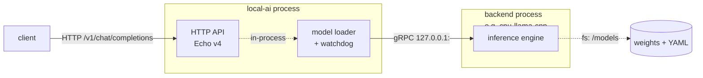

# LocalAI overview

LocalAI is a single Go server process. It terminates HTTP, decides which model a
request means, and executes nothing itself: inference runs in **separate backend
processes** that LocalAI starts, supervises and speaks gRPC to.

The gRPC hop is real TCP on loopback, not a Unix socket and not an in-process
call. `pkg/model/initializers.go` allocates a free port and formats
`127.0.0.1:<port>` for every locally spawned backend; there is no
`net.Listen("unix"` anywhere in `pkg/`, `core/` or `backend/`
(source-verified, v4.8.2). The one in-process transport that exists,
`pkg/grpc/embed.go`, is selected only by test code.

## Small core, not a bundle

A stock container ships **zero models and zero backends**. Both are downloaded on
demand: models from a model gallery, backends as OCI artifacts from a container
registry.

Tested against `localai/localai:latest` (digest id `df2919064853`, arm64,
reporting `v4.8.2 (5ff25d9d145e0a03a5b9a3559c620f1e1204ca6d)`), observed
2026-08-17:

| Probe | Response |
|---|---|
| `GET /v1/models` | `{"object":"list","data":[]}` |
| `GET /backends` | `[]` |
| `GET /system` | `{"backends":[],"loaded_models":[]}` |
| `GET /models/galleries` | one gallery, `https://index.localai.io/models` |

The CPU image is 0.29 GB compressed (Docker Hub, measured 2026-08-17); the GPU
variants run 1.11–6.13 GB. That is the *floor*. A first useful run costs image +
backend artifact + model weights. Installing
`granite-embedding-107m-multilingual` also pulled
`quay.io/go-skynet/local-ai-backends:latest-cpu-llama-cpp` (42 MiB) without being
asked, because the model's gallery entry declares a backend and backend gallery
autoload is on by default (tested 2026-08-17).

This is deliberate. The all-in-one images that bundled a preset of models were
dropped in the 4.x line; upstream's own wording is that maintaining them across
every hardware variant "stopped being worth what they gave people"
(documented, `website/content/blog/what-landed-in-localai-4-0.md`).

## Two binaries, one server

| Binary | Source | Role |
|---|---|---|
| `local-ai` | `cmd/local-ai/main.go` | The server and every CLI subcommand |
| `LocalAI.app` launcher | `cmd/launcher/main.go` | A Fyne/systray desktop wrapper. **Not** the server; it supervises one |

`internal/version.go` sets `Version` and `Commit` as link-time variables, so a
plain `go build` reports an empty version string. A binary that answers
`GET /version` with nothing was built from source, not installed from a release
(source-verified, v4.8.2).

## CLI surface

`core/cli/cli.go` defines the complete top-level command set. `run` is the
default command, so `local-ai <model-name>` is `local-ai run <model-name>`.

| Subcommand | Purpose | Starts an HTTP server? |
|---|---|---|
| `run` (default) | The LocalAI server | Yes, `:8080` |
| `chat` | Terminal agent against a LocalAI server | No |
| `federated` | P2P federated load balancer | Yes, `:8080` |
| `models` | `list`, `install` | No |
| `backends` | `list`, `install`, `uninstall`, `upgrade` | No |
| `tts` | One-shot text to speech | No |
| `sound-generation` | Audio from text/audio | No |
| `transcript` | Audio to text | No |
| `p2p-worker` | P2P workload distribution (`p2p-llama-cpp-rpc`, `p2p-mlx`, `llama-cpp-rpc`, `mlx-distributed`, `vllm`, `ds4-distributed`) | No |
| `worker` | Distributed-mode worker (NATS + registration) | Yes, gRPC base − 1 |
| `agent-worker` | Executes agent chats from a NATS queue | No |
| `util` | `gguf-info`, `create-oci-image`, `hf-scan`, `usecase-heuristic` | No |
| `agent` | `run`, `list` — agents without the server | No |
| `mcp-server` | LocalAI's admin surface as a stdio MCP server | No |
| `explorer` | P2P network directory | Yes, `:8080` |
| `completion` | bash/zsh/fish completion scripts | No |

Four global flags apply to every subcommand (`core/cli/context/context.go`):
`--debug` (deprecated), `--log-level`, `--log-format`, `--log-dedup-logs`.

Two renames worth knowing before you copy a command from anywhere:

- `worker` meant the P2P worker before v4.1.0 and means the **NATS distributed
  worker** now. The P2P one is `p2p-worker`. LocalAI's own printed join
  instructions still say the old form (`core/cli/run.go` prints
  `local-ai worker p2p-llama-cpp-rpc`), as do several upstream docs pages. The
  correct command at v4.8.2 is `local-ai p2p-worker p2p-llama-cpp-rpc`
  (source-verified, v4.8.2).
- `local-ai agent run` starts no listener at all. It needs a reachable
  OpenAI-compatible endpoint (`--api-url`), but serves no API of its own.

## What `local-ai run` starts, in order

`RunCMD.Run` in `core/cli/run.go` (source-verified, v4.8.2):

| # | Step | Consequence for an operator |
|---|---|---|
| 1 | Warn on deprecated flags | — |
| 2 | Collect systemd socket-activation listeners | The only way `/readyz` answers during preload |
| 3 | `MkdirAll` on backends and models paths, mode `0750` | — |
| 4 | Build the system state (paths, capability, tags) | Capability decides which backend build gets pulled |
| 5 | Assemble ~200 application options from flags/env | — |
| 6 | If `--preload-backend-only`: construct, then exit | No HTTP server at all |
| 7 | `application.New(opts...)` — **blocking**, does all preload | Tens of GB of downloads can happen here |
| 8 | Public-bind safety check | Refuses to start on a public address with no auth unless `--allow-insecure-public-bind` |
| 9 | `http.API(app)` builds the Echo server | Routes and middleware are registered here, nothing is listening yet |
| 10 | Start P2P if a token exists | — |
| 11 | Register the graceful-termination handler | Stops backends on SIGINT/SIGTERM |
| 12 | Spawn a goroutine that waits for the listener to accept, then `StartAgentPool()` | Agents come up *after* the API is answering |
| 13 | `appHTTP.Start(listenAddress)` — blocks | The socket binds **here**, last |

Step 13 being last is the single most consequential ordering fact in the whole
system. During step 7 the port is not open, so probes get `connection refused`
rather than a 503. Step 12 exists because agent knowledge-base backends call the
embeddings API on this same process over loopback HTTP — starting the pool before
the listener accepts would deadlock. See
[architecture](architecture.md) for both in detail.

## Where state lives

Defaults are relative to kong's `${basepath}`, which is **the process working
directory**, not a fixed system path. In the container `WORKDIR /` makes them
absolute (`Dockerfile`, source-verified v4.8.2).

| Path (container) | Flag / env | Holds |
|---|---|---|
| `/models` | `--models-path` / `LOCALAI_MODELS_PATH` | Weights and per-model YAML |
| `/backends` | `--backends-path` / `LOCALAI_BACKENDS_PATH` | Installed backend artifacts |
| `/configuration` | `--localai-config-dir` / `LOCALAI_CONFIG_DIR` | `api_keys.json`, `external_backends.json`, `runtime_settings.json` |
| `/data` | `--data-path` / `LOCALAI_DATA_PATH` | Agent state, jobs, auth DB, HMAC secret, traces, MITM CA |
| `/var/lib/local-ai/backends` | `LOCALAI_BACKENDS_SYSTEM_PATH` | Read-only, package-installed backends |

Running `local-ai run` from a different directory silently uses a different
models/backends/data tree. Set the three path variables explicitly outside
containers.

## Reading order

| You want | Page |
|---|---|
| Process model, middleware, startup ordering, readiness | [architecture](architecture.md) |
| Images, binaries, volumes, `docker run` lines | [installation](installation.md) |
| Env vars and flags, grouped | [configuration](configuration.md) |
| Model YAML, gallery, install jobs | [models](models.md) |
| Backend artifacts, gRPC contract, eviction | [backends](backends.md) |
| Every route, and which dialect it speaks | [api](api.md) |
| `/v1/embeddings`, with measured numbers | [embeddings](embeddings.md) |
| Accelerators and what actually works | [gpu](gpu.md) |
| Diagnosing a specific failure | [troubleshooting](troubleshooting.md) |

## Upstream references

- [`cmd/local-ai/main.go`](https://github.com/mudler/LocalAI/blob/v4.8.2/cmd/local-ai/main.go) — entrypoint, dotenv load order, kong parsing. Validated against v4.8.2.
- [`core/cli/cli.go`](https://github.com/mudler/LocalAI/blob/v4.8.2/core/cli/cli.go) — the complete subcommand set. Validated against v4.8.2.
- [`core/cli/run.go`](https://github.com/mudler/LocalAI/blob/v4.8.2/core/cli/run.go) — `run` startup ordering, defaults, safety checks. Validated against v4.8.2.
- [`pkg/model/initializers.go`](https://github.com/mudler/LocalAI/blob/v4.8.2/pkg/model/initializers.go) — backend spawn, `127.0.0.1:<freeport>` addressing. Validated against v4.8.2.
- [`internal/version.go`](https://github.com/mudler/LocalAI/blob/v4.8.2/internal/version.go) — link-time version variables. Validated against v4.8.2.
- [`Dockerfile`](https://github.com/mudler/LocalAI/blob/v4.8.2/Dockerfile) — `WORKDIR /`, `VOLUME /models /backends /configuration /data`. Validated against v4.8.2.
- [LocalAI release v4.8.2](https://github.com/mudler/LocalAI/releases/tag/v4.8.2) — validated 2026-08-17.
- Empty-instance probes, image digest, backend auto-install: observed 2026-08-17 on `localai/localai:latest` reporting `v4.8.2 (5ff25d9d)`.
