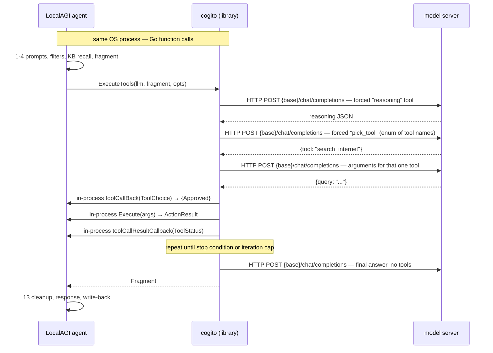

# The agent loop

The loop is not in LocalAGI. `consumeJob` builds a conversation and a
configuration, then calls one function:

```go
// core/agent/agent.go:1368
fragment, err = cogito.ExecuteTools(a.llm, fragment, cogitoOpts...)
```

Everything a reader thinks of as "the agent" — deciding whether to call a tool,
which one, with what arguments, whether to go round again — happens inside
[cogito](https://github.com/mudler/cogito) `tools.go`, in a labelled loop called
`TOOL_LOOP:`. LocalAGI keeps three callbacks inside it and nothing else.

This page traces one job end to end.

## What happens internally

1. **LocalAGI renders prompts.** Dynamic prompts are rendered (and Go-templated
   if they contain `{{`), then prepended; the system prompt goes first if it is
   not already present (`core/agent/agent.go:974`, impl `465-562`).
2. **LocalAGI applies filters.** Regex and classifier filters run as gates (all
   must pass) or triggers (at least one must fire); the job runs only if
   `failedBy == "" && (!hasTriggers || triggeredBy != "")`
   (`core/agent/agent.go:683-748`).
3. **LocalAGI recalls knowledge.** With `enable_kb` and `kb_auto_search`, the
   latest user message is used as a similarity query and the results are
   prepended as a system message: *"Given the user input you have the following
   in memory"* (`core/agent/knowledgebase.go:17-111`).
4. **LocalAGI merges leading system messages** into one, appends a single-space
   `user` message if the conversation ends with an assistant message — a
   workaround for backends that reject a prefill when `enable_thinking` is set
   (`core/agent/agent.go:1006-1022`) — and builds `cogito.NewFragment(conv...)`
   plus the tool list (`core/agent/agent.go:1024-1028`).
5. **cogito starts an iteration.** It optionally compacts the context, then
   assembles the usable tool set: LocalAGI's actions plus any MCP tools.
6. **cogito forces reasoning** (when `enable_reasoning` is on). One model call
   whose only available tool is a synthetic `reasoning` tool, with
   `tool_choice` pinned to it. The chain of thought comes back as
   schema-validated JSON, not prose.
7. **cogito forces a tool choice.** A second model call offering only
   `pick_tool`, whose `tool` property is a JSON-schema **`enum` of the real tool
   names**, with the reasoning from step 6 injected as an assistant message.
8. **cogito generates that tool's arguments.** A third call, scoped to the one
   chosen tool's parameter schema.
9. **cogito checks for a loop** against the window of past actions, and asks
   LocalAGI's tool callback for approval. The callback sees the name, the
   arguments and the reasoning, and can veto.
10. **cogito executes the tool** through the wrapper LocalAGI supplied,
    retrying up to `max_attempts`. For an MCP tool, cogito calls the MCP session
    itself.
11. **LocalAGI's result callback** recovers the full `ActionResult` — including
    metadata such as generated file paths — and appends the tool call and its
    result to the conversation (`core/agent/agent.go:1095-1143`).
12. **Back to step 5** until a stop condition fires or the iteration cap is hit.
13. **LocalAGI finishes the job**: strips `<think>` blocks if configured, sets
    the response and the plan status, and registers the conversation write-back
    finalizer (`core/agent/agent.go:1409-1423`).



## Why three calls instead of one

A single native function-calling request asks the model to do three things at
once: work out what is needed, pick a tool, and emit valid arguments. Small
models fail at the composite task long before they fail at any of its parts.

cogito splits it (`cogito/tools.go:649-853`, `cogito/tool_intention.go`):

| Call | Tools offered | `tool_choice` | Output |
|---|---|---|---|
| 1 | one synthetic `reasoning` tool | forced to it | schema-validated reasoning JSON |
| 2 | one synthetic `pick_tool` | forced to it | a name drawn from a JSON-schema `enum` |
| 3 | the one chosen tool | forced to it | that tool's arguments only |

Each call is a forced function call, so the response is constrained by a schema
rather than by hope. cogito's own test suite runs against a 0.6-billion-parameter
Qwen; this pipeline is why that is possible.

**Hallucinated tool names are impossible by construction on this path.** The
model never types a tool name into free text. It selects a value from an `enum`
built from the live tool list (`cogito/tool_intention.go:97,133`), and a value
outside the enum is a schema violation the server-side grammar rejects.

Two honest qualifications:

- The guarantee applies to the **forced-reasoning path**, taken when
  `enable_reasoning` is set (cogito's `forceReasoning`, wired at
  `core/agent/agent.go:1332`). With it off, cogito takes the fast path
  (`cogito/tools.go:674`): one ordinary function-calling request with the real
  tools attached. There the usual native tool-calling failure modes apply.
- `enable_reasoning_tool` (UI default **true**) maps to
  `cogito.WithForceReasoningTool()` (`core/agent/agent.go:1351`). Its exact
  behaviour inside cogito was **not traced**; do not assume it is the same
  switch as `enable_reasoning`.

The schema layer goes one level deeper for LocalAI specifically: cogito's LocalAI
client can send a top-level `grammar` field
(`cogito/clients/localai_client.go:68,107`), so constraint can be enforced during
decoding rather than checked afterwards.

## The iteration cap

`max_evaluation_loops`, **default 2** (`core/agent/options.go:120`, UI default
also 2 at `core/state/config.go:538`), becomes `cogito.WithIterations(n)`
(`core/agent/agent.go:1341`). cogito's own default is 1
(`cogito/options.go:108-124`).

Two is small. It means: at most two rounds of *choose a tool and execute it*.
When `totalIterations >= maxIterations`, cogito compacts the context, appends an
instruction to *produce a final response and not call tools*, makes one last
model call and returns (`cogito/tools.go:1375-1401`).

The visible symptom of hitting the cap is an answer that describes what the agent
was about to do rather than the result of doing it. If a task genuinely needs
search-then-read-then-summarise, two is not enough. Raise
`max_evaluation_loops`; it is the single most consequential number in the agent
configuration.

## Stop conditions

| Condition | Mechanism | Result |
|---|---|---|
| Model calls `stop` | LocalAGI's callback returns `Approved: false` (`agent.go:1195-1198`); the trailing tool message is recognised at `agent.go:1394-1402` | Job finishes cleanly |
| Model calls `no_tool_to_call` | cogito's sink state (`agent.go:1052-1059`); a final call phrases the answer | Job finishes with a normal answer |
| Model calls `send_message` | Message pushed onto the new-conversation channel; response set to *"decided to initiate a new conversation"* (`agent.go:1199-1235`) | Job finishes |
| Model calls a user-defined tool | `replyWithToolCall` stages a `tool_calls` assistant message and vetoes execution (`agent.go:751-787,1154-1161`) | Returned to the API caller for execution |
| Iteration cap reached | cogito forces a final tool-free response | Job finishes with whatever the model can say |
| `ErrNoToolSelected` / `ErrGoalNotAchieved` | Tolerated explicitly (`agent.go:1373`) | Job finishes with the last message |
| Loop detected | cogito returns `ErrLoopDetected` — **not** in the tolerated list | Job finishes with an error |
| A connector's reasoning callback returns false | Recorded as *"stopped by callback"* (`agent.go:1286-1307`) | Job finishes |
| New message on the same `conversation_id` | `Enqueue` cancels the running job unless `cancel_previous_on_new_message` is false (`agent.go:374-385`) | Previous job cancelled |
| Agent paused, or job context expired | Checked at the top of `consumeJob` (`agent.go:899-912`) | Job rejected |

`disable_sink_state` removes the second row's escape hatch. Its option ordering
matters and the code says so: *"DisableSinkState must be before
WithForceReasoning()"* (`core/agent/agent.go:1326`).

## Loop detection

`loop_detection` (UI default 5, code default 0 = off) becomes
`cogito.WithLoopDetection(n)` (`core/agent/agent.go:1346`). cogito keeps a
`PastActions` list on the session status and calls `checkForLoop` before each
execution (`cogito/tools.go:1616-1618`, impl `:172`): a tool call that repeats
within the window returns `ErrLoopDetected` and ends the loop.

Because that error is not tolerated by LocalAGI's error handling
(`core/agent/agent.go:1373`), a detected loop surfaces to the caller as a failed
job, not a partial answer.

## LocalAGI's three control points

`ExecuteTools` gets three closures. They are the whole of LocalAGI's presence
inside the loop.

**Reasoning callback** (`core/agent/agent.go:1060-1094`) — fires per reasoning
string. Emits an SSE `reasoning` stream event, pushes a synthetic chat-completion
response into the job's progress observable, and calls the job's own reasoning
callback.

**Tool callback** (`core/agent/agent.go:1144-1311`) — the pre-execution veto.
Returns `cogito.ToolCallDecision{Approved: bool}`. This is where `stop`,
`send_message`, `update_state` and user-defined tools are intercepted, where the
`decision` observable is emitted, and where connector vetoes are honoured — if
*any* connector's reasoning callback returns false, the tool call is rejected
(`core/state/pool.go:444-449`).

cogito's decision struct also carries `Adjustment`, `Modified` and `Skip`
(`cogito/fragment.go:295`), which drive a natural-language tool-correction loop
(`cogito/tools.go:1693-1718`). LocalAGI sets only `Approved`, so that loop is
dead code in this deployment.

**Result callback** (`core/agent/agent.go:1095-1143`) — post-execution. Recovers
the whole `types.ActionResult` from cogito's `ResultData` `any` field, which is
how action metadata such as `songs_paths` and `images_url` survives the round
trip into `job.Metadata` where connectors read it to upload files. It also
appends the tool call and its result to the conversation, describing images
first when a result is an image.

## What LocalAGI does not take from cogito

Verified by exhaustive grep over the LocalAGI tree:

| cogito capability | Status in LocalAGI v2.9.0 |
|---|---|
| Sub-agent spawning (`AgentManager`, `spawn_agent`) | Not present in the pinned cogito, and unused |
| `Prefill` (KV-cache warming) | Not present in the pinned cogito |
| `AutoImprove` (self-editing system prompts) | Unused |
| Park/resume message injection (`WithMessageInjectionChan`, `WithOnPark`, `WithOnResume`) | Unused; the callback receives a `*cogito.SessionState` and discards it (`agent.go:1145`) |
| Guidelines (condition → action → tools rules) | Unused |
| `EnableParallelToolExecution` | Unused — tool calls are sequential |
| TODO-list persistence, custom prompt overrides, `ContentReview`, direct `ExecutePlan`/`ExtractGoal` | Unused |
| `StreamEventToolResult`, `StreamEventStatus`, `StreamEventError`, `StreamEventSubAgent` | **Silently dropped** — the pool handles only 4 of cogito's 8 event types (`core/state/pool.go:633-664`) |
| `WithStatusCallback`, `WithStepContentCallback` | Not wired; only the reasoning callback is |

LocalAGI also does not use `cogito.NewToolDefinition` for its own actions. It
hand-implements `ToolDefinitionInterface` as `cogitoWrapper`
(`core/types/actions.go:92-116`) so it can return the whole `ActionResult`
through the untyped result channel. The one exception is the sink-state tool.

## The cogito version skew

| | Pinned cogito | Dated |
|---|---|---|
| LocalAGI v2.9.0 | `v0.9.5-0.20260315222927-63abdec7189b` | March 2026 |
| LocalAI v4.8.2 | `v0.11.1-0.20260721122412-6eece18a6bb6` | July 2026 |

Roughly four months apart. LocalAGI's call sites are a subset that still exists
at cogito HEAD, so this is not a breakage — it is a capability gap. What
standalone LocalAGI cannot reach, and LocalAI's own agent executor can:

- **Sub-agent spawning** (`AgentManager`, `spawn_agent`, `check_agent`,
  `get_agent_result`, `send_agent_message`) — cogito's native multi-agent
  primitive. LocalAGI instead ships `call_agent`, a **blocking nested `Ask`**
  onto an unbuffered channel, with the deadlock properties described in
  [architecture](architecture.md).
- **`Prefill`** — KV-cache warming.
- **`AutoImprove`** — system prompts the loop edits based on its own review.
- **Park/resume with message injection** — the ability to suspend a loop awaiting
  input and resume it, rather than cancelling and restarting.

One further wrinkle: cogito declares `modelcontextprotocol/go-sdk v1.0.0` while
LocalAGI declares `v1.2.0`. Go's minimal version selection resolves to 1.2.0, so
cogito is compiled against a newer MCP SDK than it was written for.

## Upstream references

- [`core/agent/agent.go`](https://github.com/mudler/LocalAGI/blob/v2.9.0/core/agent/agent.go) — `consumeJob`, the `ExecuteTools` call at 1368, all three callbacks, option wiring 1047-1366. Validated against v2.9.0, 2026-08-17.
- [`core/agent/options.go`](https://github.com/mudler/LocalAGI/blob/v2.9.0/core/agent/options.go) — `maxEvaluationLoops` default 2, `maxAttempts` default 1. Validated against v2.9.0, 2026-08-17.
- [`core/agent/knowledgebase.go`](https://github.com/mudler/LocalAGI/blob/v2.9.0/core/agent/knowledgebase.go) — automatic recall before the loop. Validated against v2.9.0, 2026-08-17.
- [`core/state/pool.go`](https://github.com/mudler/LocalAGI/blob/v2.9.0/core/state/pool.go) — stream-event translation, connector veto chain. Validated against v2.9.0, 2026-08-17.
- [`core/types/actions.go`](https://github.com/mudler/LocalAGI/blob/v2.9.0/core/types/actions.go) — `cogitoWrapper`, `ToCogitoTools`. Validated against v2.9.0, 2026-08-17.
- [`go.mod`](https://github.com/mudler/LocalAGI/blob/v2.9.0/go.mod) — cogito `v0.9.5-0.20260315222927`, MCP SDK `v1.2.0`. Validated against v2.9.0, 2026-08-17.
- [cogito `tools.go`](https://github.com/mudler/cogito/blob/main/tools.go) — `ExecuteTools`, `pickTool`, iteration cap, loop detection. Read at commit `6eece18a6bb6` (2026-07-21); **this link is to a moving branch because the read commit is newer than LocalAGI's pin** — treat line numbers as approximate.
- [cogito `tool_intention.go`](https://github.com/mudler/cogito/blob/main/tool_intention.go) — the `reasoning` and `pick_tool` meta-tools and their enums. Read at commit `6eece18a6bb6`, 2026-07-21.
- [LocalAI `go.mod`](https://github.com/mudler/LocalAI/blob/v4.8.2/go.mod) — cogito `v0.11.1-0.20260721122412`. Validated against v4.8.2, 2026-08-17.
