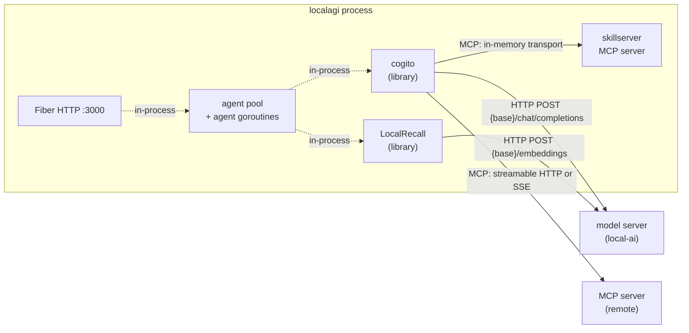
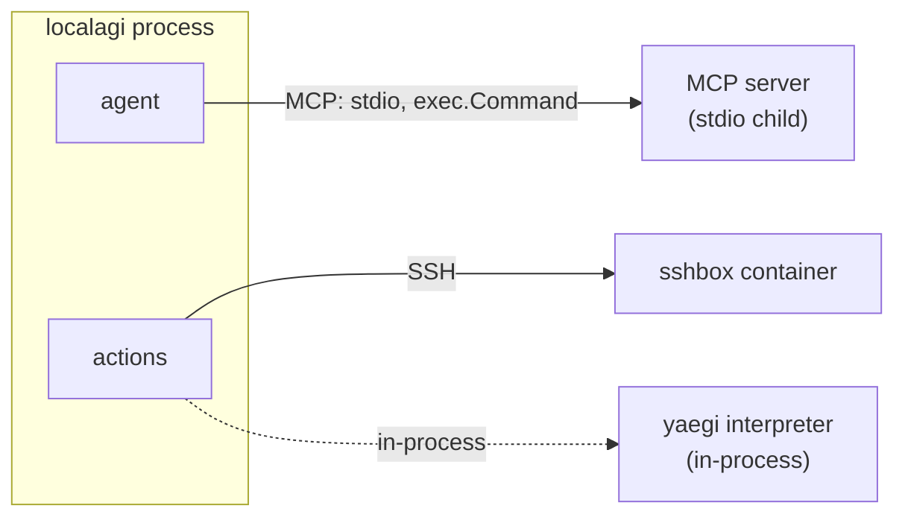

# LocalAGI architecture

One OS process runs everything LocalAGI owns: the HTTP server, the agent pool,
every agent goroutine, the cogito reasoning loop, the LocalRecall collections
engine and the skills MCP server. The only components that are genuinely
separate processes are the model server, stdio MCP servers, and the SSH sandbox
container that the `run_command` action shells into.

## Process model

`main.go` is nine lines and delegates to Cobra (`cmd/root.go:10-19`). Two
subcommands exist:

| Command | Handler | What it starts |
|---|---|---|
| `local-agi serve` | `cmd/serve.go:27` | HTTP server + every agent in `pool.json` |
| `local-agi agent run <name>` | `cmd/agent_run.go:24-40` | One agent, no HTTP server |
| *(no subcommand)* | `cmd/root.go:14-18` | Same as `serve` — "ensures the container starts the web server by default" |

`serveCmd` is registered on the root command twice, at `cmd/root.go:30` and
again at `cmd/serve.go:24`. Cobra tolerates the duplicate. Whether it produces a
doubled entry in `--help` is **not established** — that would need a run.

### What `serve` does, in order

`runServe` (`cmd/serve.go:27-128`):

1. `LoadEnv()` — read the whole environment surface (`cmd/serve.go:29`).
2. Refuse to start if `LOCALAGI_MODEL` or `LOCALAGI_LLM_API_URL` is empty
   (`cmd/serve.go:31-36`).
3. Default `StateDir` to `$CWD/pool` and create it (`cmd/serve.go:38-46`).
4. Default `COLLECTION_DB_PATH` to `<stateDir>/collections` and `FILE_ASSETS` to
   `<stateDir>/assets` (`cmd/serve.go:48-53`).
5. Construct the skills service over `<stateDir>/skills` (`cmd/serve.go:60`).
6. Construct the agent pool with 14 arguments (`cmd/serve.go:65-88`).
7. Build the Fiber app with 18 functional options (`cmd/serve.go:93-111`).
8. **Choose the knowledge backend**: if `LOCALAGI_LOCALRAG_URL` is set, an HTTP
   client to a remote LocalRecall; otherwise the in-process LocalRecall library
   (`cmd/serve.go:113-120`). The second is the default.
9. `pool.StartAll()` — instantiate and run every agent (`cmd/serve.go:122`).
10. `app.Listen(env.LocalAGIURL)` (`cmd/serve.go:126`).

Note the ordering consequence: **agents start before the listener binds.** A
pool of slow-to-initialise agents delays the port opening.

## Where the boundaries are



Two things in that picture surprise readers:

- **cogito talks to the model server directly.** LocalAGI does not proxy
  inference. `clients.NewLocalAILLM(model, apiKey, apiURL)`
  (`core/agent/agent.go:98`) is a cogito client and it owns every reasoning
  request.
- **The knowledge path never leaves the process by default.**
  `internalRAGAdapter` calls `*rag.PersistentKB` methods directly
  (`webui/collections/rag_provider.go:21-90`). The only network hop is
  LocalRecall's own embeddings request.

The subprocess side:



Custom actions are *not* subprocesses. They are Go source interpreted by
[yaegi](https://github.com/traefik/yaegi) inside the LocalAGI process
(`core/action/custom.go:60-109`), with an `unsafe` flag that removes the
interpreter's restrictions. See [tools](tools.md).

## Platform versus runtime

The split is visible in one function. `consumeJob`
(`core/agent/agent.go:898-1424`) is ~530 lines, and the loop is one of them:

```go
// core/agent/agent.go:1368
fragment, err = cogito.ExecuteTools(a.llm, fragment, cogitoOpts...)
```

Everything before line 1368 is platform work — prompt assembly, filters,
multimodal preprocessing, knowledge recall, message merging. Everything after is
result handling. The 300 lines in between build `cogitoOpts`: the iteration cap,
the loop-detection window, the reasoning switches, the streaming callback and the
three control callbacks. [The agent loop](agent-loop.md) walks it step by step.

## How an agent gets built

`AgentPool.startAgentWithConfig` (`core/state/pool.go:294-704`) is the wiring
point. For each agent it:

| Step | What it resolves | Line |
|---|---|---|
| Model / API URL / keys | agent config if set, else pool default — and writes the resolved value back into the config | `core/state/pool.go:302-349` |
| Actions | `services.Actions(actionsConfigs)` → a `types.Actions` slice | `cmd/serve.go:74-78` |
| Connectors | `services.Connectors(config)`, started as goroutines *after* the agent | `core/state/pool.go:688-690` |
| Knowledge | `ragProvider(agentName, ragURL, ragKey)` — one collection per agent, named after the agent | `core/state/pool.go:553-576` |
| Skills | the shared in-process MCP session | `core/state/pool.go:547-551` |
| MCP servers | `WithMCPServers(...)`, connected during `agent.New()` | `core/state/pool.go:403` |
| SSE | a per-agent broadcast manager, `sseLib.NewManager(5)` | `core/state/pool.go:299` |
| Streaming | cogito `StreamEvent`s translated to SSE `stream_event` messages | `core/state/pool.go:633-664` |

`agent.New()` (`core/agent/agent.go:91-177`) constructs but starts nothing. It
builds two LLM handles — a raw `go-openai` client used only for transcription,
TTS and image description, and the cogito client used for all reasoning — loads
`<name>.state.json` if it exists, generates a random identity when configured,
**connects every MCP server**, and creates the per-agent scheduler.

`Run()` (`core/agent/agent.go:1485-1532`) starts the scheduler, the
new-conversation fan-out goroutine, the periodic-run timer, and `parallelJobs`
worker goroutines that all read from one channel.

## Concurrency, and two hazards worth knowing

`jobQueue` is an **unbuffered** channel (`core/agent/agent.go:106`). Every entry
point that enqueues work blocks until a worker is free:

| Entry point | Path | Blocking? |
|---|---|---|
| `Ask` | `Execute` → `Enqueue` → `jobQueue` | yes, waits for the result |
| `AskDirect` | calls `consumeJob` synchronously, bypassing the queue | yes, but never queues |
| `AskDirectSystem` | same, with `SystemRole` | yes |
| `call_agent` action | nested `Ask` on another agent | yes — see below |
| scheduler | pushes onto `jobQueue` directly | yes |

**Deadlock hazard.** Two agents that can call each other through `call_agent`,
each with `parallel_jobs: 1`, will deadlock: A blocks writing to B's queue while
B's only worker blocks writing to A's. `core/agent/agent.go:106`,
`services/actions/callagents.go:55-114`. Covered in
[troubleshooting](troubleshooting.md).

**Timer sharing.** With `parallel_jobs > 1`, N worker goroutines share one
`*time.Timer` and each calls `Stop()` / drains `timer.C` / `Reset()`
(`core/agent/agent.go:1512-1551`). That pattern is not concurrency-safe in
general. Whether it manifests as a stall is **not established**; it is recorded
here as a code observation, not a confirmed bug. The UI default for
`parallel_jobs` is 5 (`core/state/config.go:470`), so most agents run in this
configuration.

`AskDirect` exists for callers that own their own event loop — its comment says
it "enables stateless execution where the caller manages the event loop"
(`core/agent/agent.go:257`). It pairs with `AgentPool.CreateOnly`, which
"skips Run(), connectors, and HUD" (`core/state/pool.go:773`). This is the
seam LocalAI uses when it embeds the pool.

## The web UI

Two generations coexist in the tree:

- **Legacy server-rendered** — `webui/views/`, `webui/public/`, Fiber HTML
  templates plus `elem-go`. `webui/app.go:260` still holds an HTMX chat handler
  (`OldChat`) that is registered on no route.
- **Current React SPA** — `webui/react-ui/`, Vite plus Bun. `Makefile:17-18`
  builds it inside an `oven/bun:1` container; `Makefile:21-22` makes the
  resulting `dist` a prerequisite of `go build`, and it is embedded into the
  binary (`webui/routes.go:25-26,42-48`).

`Dockerfile.webui` sets `ENTRYPOINT ["/localagi", "serve"]` on `ubuntu:24.04`
and installs `docker.io`, because the shipped compose stack expects the
container to reach a Docker daemon (`DOCKER_HOST=tcp://dind:2375`).

## HTTP surface, in one table

All routes are registered in two functions — `(*App).registerRoutes`
(`webui/routes.go:28`) and `(*App).RegisterCollectionRoutes`
(`webui/collections_handlers.go:72`) — on one Fiber app, with no route groups,
no prefix, no CORS middleware and no body limit.

| Group | Count | Notes |
|---|---|---|
| Static / SPA | 5 | `/`, `/app`, `/app/*`, `/public`, `/login` |
| SSE | 1 | `GET /sse/:name` |
| Agent CRUD and chat | 16 | includes `GET /api/notify/:name` — a GET with a form body |
| OpenAI-compatible | **1** | `POST /v1/responses` only |
| Actions | 3 | list, definition, direct execution |
| Settings / metadata | 4 | includes a duplicate config-metadata alias |
| Skills | 21 | 503 when the skills service is absent |
| Collections | 11 | deliberately mirrors LocalRecall's REST contract |
| MCP | **0** | there is no MCP endpoint |

`POST /api/chat/:name` is asynchronous: it returns 202 and the answer arrives
over SSE. `POST /v1/responses` is synchronous. They are two different contracts
onto the same agent.

## Upstream references

- [`cmd/root.go`](https://github.com/mudler/LocalAGI/blob/v2.9.0/cmd/root.go) — command tree, bare-binary defaults to `serve`, duplicate registration. Validated against v2.9.0, 2026-08-17.
- [`cmd/serve.go`](https://github.com/mudler/LocalAGI/blob/v2.9.0/cmd/serve.go) — startup order, RAG backend selection at lines 113-120. Validated against v2.9.0, 2026-08-17.
- [`core/agent/agent.go`](https://github.com/mudler/LocalAGI/blob/v2.9.0/core/agent/agent.go) — struct, `New`, `Run`, unbuffered `jobQueue`, `consumeJob`. Validated against v2.9.0, 2026-08-17.
- [`core/state/pool.go`](https://github.com/mudler/LocalAGI/blob/v2.9.0/core/state/pool.go) — `startAgentWithConfig`, RAG provider, SSE managers, connector startup. Validated against v2.9.0, 2026-08-17.
- [`webui/routes.go`](https://github.com/mudler/LocalAGI/blob/v2.9.0/webui/routes.go) — the complete route registration. Validated against v2.9.0, 2026-08-17.
- [`webui/collections/rag_provider.go`](https://github.com/mudler/LocalAGI/blob/v2.9.0/webui/collections/rag_provider.go) — in-process LocalRecall adapter. Validated against v2.9.0, 2026-08-17.
- [`Makefile`](https://github.com/mudler/LocalAGI/blob/v2.9.0/Makefile) and [`Dockerfile.webui`](https://github.com/mudler/LocalAGI/blob/v2.9.0/Dockerfile.webui) — React build, container entrypoint. Validated against v2.9.0, 2026-08-17.
