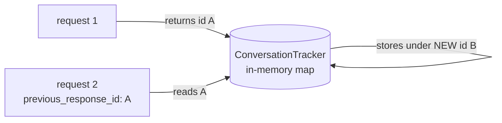

# The Responses API

`POST /v1/responses` is how an application talks to an agent. It borrows OpenAI's
Responses shape, and the borrowing is partial in ways that matter if you are writing a
client against it.

The single most important difference from every other endpoint in this stack:

```text
model  =  the AGENT name,  not a model name
```

## The contract

```bash
curl -s http://localhost:8081/v1/responses \
  -H 'Content-Type: application/json' \
  -d '{
    "model": "handbook-probe",
    "input": "What is 2+2? Answer with just the number."
  }'
```

Observed response:

```json
{
  "id": "b9ec1e4d-41c5-42b7-a18a-d12d21040be4",
  "object": "response",
  "created_at": 1786981102,
  "status": "completed",
  "error": null,
  "model": "handbook-probe",
  "output": [
    {"type": "message", "id": "msg_1786981102342119587", "status": "completed",
     "role": "assistant",
     "content": [{"type": "output_text", "text": "4", "annotations": null}]}
  ],
  "usage": {"input_tokens": 0, "output_tokens": 0, "total_tokens": 0},
  "store": false,
  "temperature": 0,
  "top_p": 0,
  "tool_choice": "",
  "parallel_tool_calls": false,
  "previous_response_id": null,
  "metadata": null
}
```

Send a model name instead of an agent name and you get HTTP **500** with
`{"error":"Agent not found"}`. Verified.

## What is faithful, and what is not

Fields that behave as an OpenAI client would expect:

| Field | Behaviour |
|---|---|
| `input` | string or message array, both accepted |
| `output[].content[].text` | the answer |
| `status` | `completed` on success |
| `previous_response_id` | **request** side works — conversation is carried |
| `tools` | user-defined tools are accepted and separated from built-ins |
| `tool_choice` | honoured when `{"type":"function","name":"…"}` |

Fields that do not:

| Field | Reality |
|---|---|
| `usage` | **always zero.** Hardcoded, with `// TODO: calculate actual usage` beside it |
| `id` | a **bare UUID**, not `resp_…` |
| `previous_response_id` in the response | always `null`, even when you sent one |
| `stream` | **accepted and silently ignored** — no handler reads it |
| `store` | reported `false`; accurate, nothing is persisted |
| `temperature`, `top_p` | reported as `0`; set them on the agent or the model, not here |

### `stream` is the one that bites

The field exists on the request type — `webui/types/openai.go:161` — and **no handler
reads it**. Verified by grep across the whole `webui` and `core` trees: there are no
references to it outside its declaration.

So a client asking for a stream receives a single complete JSON body, with a `200`, and no
indication that its request was not honoured. A client written to consume SSE will hang
waiting for events that never arrive, then fail on parsing.

If you need streaming, use LocalAI's `/v1/chat/completions`, which does support it, or
subscribe to LocalAGI's own SSE channel — see [alternatives](#the-other-two-entry-points).

### `usage` being zero is not a small thing

Token accounting is impossible at this layer. If you need it — for cost attribution, for
quota, for anything — take it from LocalAI's side, where each underlying
`/chat/completions` call reports real numbers. Note that one agent request produces
**several** such calls, so you must sum them.

## Conversation state



Mechanics, verified:

1. `previous_response_id` looks up prior messages in an in-memory map.
2. New input is appended and the whole list is passed to the agent.
3. The reply is appended and stored under a **freshly generated UUID**, returned as `id`.

Each turn therefore has a **new** identity. Conversation is a chain of per-turn IDs, not
one session ID. Continuing from an older ID branches rather than errors.

Observed:

```text
request 1 → id b9ec1e4d-41c5-42b7-a18a-d12d21040be4   "I remember your favorite color, teal."
request 2 (previous_response_id: b9ec1e4d…) → id 00c6abcf-a427-420b-a35d-2ef05f9cb160
          "My favorite color is teal."
```

### Three indistinguishable failure states

An unknown `previous_response_id` does **not** error. Verified:

```bash
curl -s http://localhost:8081/v1/responses \
  -H 'Content-Type: application/json' \
  -d '{"model":"handbook-probe","input":"What is my favourite colour?","previous_response_id":"does-not-exist-at-all"}'
```

Observed: `I don't have access to personal information such as favorite colors.` — HTTP
200, `status: completed`, no warning.

The same is true of an **expired** ID. History lives in memory with a TTL
(`LOCALAGI_CONVERSATION_DURATION`, falling back to **1 hour** if unset or unparseable),
and expiry returns an *empty conversation* rather than an error.

| State | Response | Distinguishable? |
|---|---|---|
| Valid ID, history carried | 200, model knows the context | — |
| Expired ID | 200, model knows nothing | **no** |
| Never-existed ID | 200, model knows nothing | **no** |

If your application needs to know which, it must track conversation identity itself. This
is the mechanism behind "the agent forgot everything over lunch": a valid-looking ID, a
valid response, and no history.

There is one guard: continuing a conversation with **no new input** is rejected, because
it would end the job on an assistant message and some backends reject that:

```json
{"error":"previous_response_id was set but no new input was sent; send at least one user or tool message when continuing a conversation"}
```

### Nothing is persisted

| State | Location | Survives restart |
|---|---|---|
| Agent definition | `<stateDir>` JSON | **yes** |
| Conversation history | **process memory, TTL'd** | **no** |

Optionally, `LOCALAGI_ENABLE_CONVERSATIONS_LOGGING=true` writes each turn to
`<stateDir>/conversations/<agent>-<timestamp>.json`. That is an **audit log** — nothing
reads it back, and it does not restore history.

## User-defined tools

Tools sent in the request are separated into built-in and user-defined. User-defined ones
produce a **tool-call response** rather than a text answer: the output carries a
`function_call` item, the conversation is saved without an assistant message, and your
client is expected to execute the function and send the result back as a
`function_call_output` on the next request.

This is the OpenAI-style client-side tool loop, and it coexists with the agent's own
server-side tools from [Recipe 5](../05-recipes/agent-with-tools.md). The distinction:

| Tool kind | Executed by | Configured |
|---|---|---|
| Built-in action | LocalAGI, in-process | on the agent |
| MCP tool | the MCP server | on the agent |
| **User-defined** | **your client** | per request, in `tools` |

## The other two entry points

`/v1/responses` is one of three ways to reach an agent, and they behave very differently.

| Endpoint | Shape | Returns |
|---|---|---|
| `POST /v1/responses` | Responses envelope | the answer, synchronously |
| `POST /api/chat/:name` | LocalAGI-specific | **does not return the answer** |
| `GET /sse/:name` | SSE stream | events, including the answer |

`/api/chat/:name` is asynchronous. If you poll it expecting a body you will wait forever.
Use `/v1/responses` for request/response, and the SSE channel when you want incremental
output — that is also the only way to get streaming behaviour out of LocalAGI, since
`stream` on `/v1/responses` is ignored.

## Timeouts

The most common operational mistake with this endpoint.

An agent request is a **loop**. `LOCALAGI_TIMEOUT` (default `5m`) bounds **one model
call**, not the request. Measured on CPU:

| Request | Model calls | Wall clock |
|---|---|---|
| No tools, no knowledge | 1 | **2–3 s** |
| Knowledge, no tools | 1 | **2.27 s** |
| One tool | 3 | **38.7 s** |
| Knowledge and one tool | 2 | **24.1 s** |

So order your timeouts:

```text
client timeout  >  proxy timeout  >  LOCALAGI_TIMEOUT (per call)
```

A proxy with a default 60-second read timeout in front of a legitimately slow agent
returns 504 to the client **while the agent runs to completion and commits its tool side
effects**. Check before blaming the agent:

```bash
docker logs localagi 2>&1 | grep 'we got a response from the agent'
```

If that line is present, the agent finished and the timeout was yours.

Note also that a mistyped `LOCALAGI_TIMEOUT` silently falls back to **150 s** — shorter
than the documented `5m` default.

## Authentication

`LOCALAGI_API_KEYS`, comma-separated. The key is looked up from any of:

```text
header:Authorization    header:x-api-key    header:xi-api-key    cookie:token
```

The middleware is applied globally, so with keys configured **every** route requires one —
including `/api/agents`, which the reference environment uses as a healthcheck. Add the
header to the healthcheck or drop it.

## Reference

| Property | Value |
|---|---|
| Path | `POST /v1/responses` |
| Port | **3000** inside the container — hardcoded, no variable changes it |
| `model` | the agent name |
| Auth | `LOCALAGI_API_KEYS`, four accepted locations |
| Streaming | **not implemented**; field ignored |
| Token usage | **not implemented**; always zero |

## Upstream references

- [LocalAGI `webui/app.go`](https://github.com/mudler/LocalAGI/blob/v2.9.0/webui/app.go) — the handler at 575-692: input normalisation, `previous_response_id` lookup, the no-new-input guard at 598-602, agent resolution at 604-608, tool separation at 616-626, `tool_choice` at 628-633, the tool-call response path at 646-658, new-UUID storage at 644 and 666, and the hardcoded zero `usage` at 567-571. Validated against v2.9.0.
- [LocalAGI `webui/types/openai.go`](https://github.com/mudler/LocalAGI/blob/v2.9.0/webui/types/openai.go) — the request body type, including `Stream` at 161, which no handler reads.
- [LocalAGI `core/conversations`](https://github.com/mudler/LocalAGI/tree/v2.9.0/core/conversations) — the in-memory tracker, TTL expiry returning an empty conversation, and opportunistic GC of other conversations.
- [LocalAGI `webui/options.go`](https://github.com/mudler/LocalAGI/blob/v2.9.0/webui/options.go) — the 1 hour fallback at 42-50.
- [LocalAGI `webui/routes.go`](https://github.com/mudler/LocalAGI/blob/v2.9.0/webui/routes.go) — route registration at 83, `/api/chat/:name` at 75, `/sse/:name` at 58, and `GetKeyAuthConfig`'s four key locations at 252-254.
- [LocalAGI `cmd/serve.go`](https://github.com/mudler/LocalAGI/blob/v2.9.0/cmd/serve.go) — the hardcoded `:3000` listener at 126.
- [OpenAI Responses API reference](https://platform.openai.com/docs/api-reference/responses) — the shape being approximated.
- Response envelope, bare-UUID id, zero `usage`, unknown-id behaviour, conversation chaining and all latencies: observed 2026-08-17 against LocalAGI v2.8.1, see [version matrix](../00-overview/version-matrix.md).
