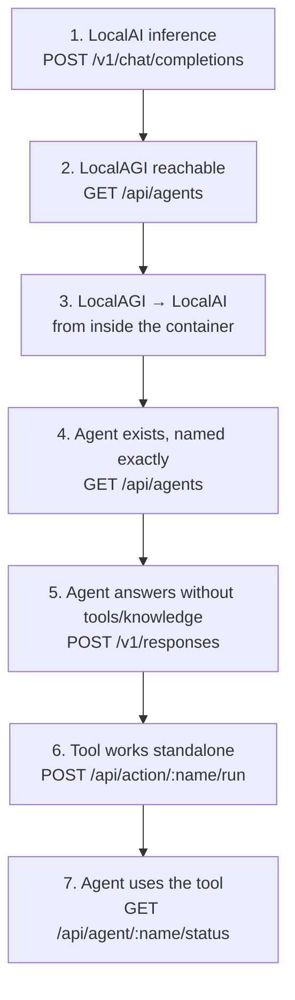

# LocalAGI troubleshooting

LocalAGI sits at the top of the stack and depends on everything below it. That makes it
the layer where faults are **most** ambiguous: an agent that misbehaves may be failing at
inference, at retrieval, at a tool, or in its own configuration.

So the first rule is not a fix, it is an ordering: **never debug the agent before proving
the layers under it.**

```bash
./scripts/verify-stack.sh --agent <agent-name>
```

That walks inference → embeddings → vector store → retrieval → agent, stopping at the
first failure.

## The ladder



A failure at any rung invalidates everything above it.

## Symptom: the agent never returns

The most reported symptom, and usually not a hang.

**1. Did the agent actually finish?**

```bash
docker logs localagi 2>&1 | grep 'we got a response from the agent'
```

If this line is present, **the agent finished and your client gave up.** An agent request
is a loop; measured on CPU:

| Request | Model calls | Wall clock |
|---|---|---|
| No tools, no knowledge | 1 | 2–3 s |
| Knowledge only | 1 | 2.27 s |
| One tool | 3 | **38.7 s** |
| Knowledge and one tool | 2 | 24.1 s |

Order your timeouts:

```text
client  >  proxy  >  LOCALAGI_TIMEOUT (per model call, default 5m)
```

A 60-second proxy read timeout in front of a legitimately slow agent returns 504 to the
client **while the agent completes and commits its tool side effects**. A round-number
timeout — exactly 30 s, exactly 60 s — is almost always yours, not the agent's.

Note that an unparseable `LOCALAGI_TIMEOUT` falls back to **150 s**, shorter than the
documented default.

**2. Is LocalAI reachable from LocalAGI?**

```bash
docker exec localagi curl -s -o /dev/null -w '%{http_code}\n' http://localai:8080/readyz
```

**3. Is the loop iterating without progressing?**

```bash
docker logs --since 5m localai 2>&1 | grep -c 'chat/completions'
```

A number that keeps climbing during one request is an agent loop. Cap it with
`loop_detection` and `max_attempts` in the agent config.

**4. Is a tool blocking?**

```bash
curl -s http://localhost:8081/api/agent/<name>/status | jq -r '.History[]'
```

Repeated identical entries mean the model is not registering the observation. An MCP tool
with no timeout of its own can extend the request indefinitely.

## Symptom: `{"error":"Agent not found"}`, HTTP 500

```bash
curl -s http://localhost:8081/api/agents | jq '.agents'
```

| Cause | Fix |
|---|---|
| `model` holds a **model** name | `/v1/responses` resolves `model` against the **agent pool**. Send the agent name. |
| Case or spelling mismatch | copy the exact string from `/api/agents` |
| Agent was never created | `POST /api/agent/create` |
| State directory not mounted | agents were lost on restart — see below |

This is the single most common first-time error, and it is a naming collision in the API
rather than a fault: every other endpoint in the stack means "model" by `model`.

## Symptom: all agents disappeared

```bash
docker exec localagi ls -la /pool
```

Agent definitions are **JSON on disk** in `LOCALAGI_STATE_DIR`. Losing that directory loses
the definitions themselves, not merely runtime state.

| Cause | Fix |
|---|---|
| No volume mounted at the state dir | mount one; recreate the agents |
| `docker compose down -v` | volumes removed; nothing to recover |
| Two agent pools sharing one state dir | **disable one.** Two processes writing one JSON inventory lose agents; last writer wins |

That last row deserves attention in a Pattern B deployment: LocalAI ships its own agent
pool, enabled by default. Running it alongside a standalone LocalAGI against the same
directory is a data-loss configuration. Set `LOCALAI_DISABLE_AGENTS=true`.

Back up a definition while you still have it:

```bash
curl -s http://localhost:8081/settings/export/<name> > agent.json
```

## Symptom: the agent ignores its knowledge

Covered in depth in [Recipe 6](../05-recipes/agent-with-knowledge.md); the diagnostic
sequence in short.

**1. Did retrieval run at all?**

```bash
docker logs localagi 2>&1 | grep -i 'knowledge base'
```

Present → it ran. **Absent → a guard skipped it.** Three guards, checked in order, and all
three log at **DEBUG only**:

| Guard | Config field |
|---|---|
| Knowledge base enabled | `enable_kb` |
| Auto-search enabled | `kb_auto_search` |
| A RAG provider exists | set at boot from `LOCALAGI_LOCALRAG_URL` |

```bash
curl -s http://localhost:8081/api/agent/<name>/config | jq '{enable_kb, kb_auto_search, kb_results}'
```

```bash
docker exec localagi printenv LOCALAGI_LOCALRAG_URL
```

Set `DEBUG=true` and restart to see the guards report themselves. This is the most common
"retrieval isn't working" cause in the whole handbook.

**2. Is it the wrong collection?**

The collection is the **lowercased agent name**. Not configurable.

```bash
curl -s http://localhost:8082/api/collections | jq '.data.collections'
```

An agent named `Support-Bot` uses `support-bot`. Two agents differing only in case share
one collection. Renaming an agent **orphans** its knowledge — the old collection stays,
full and unreachable.

**3. Is the knowledge service reachable?**

```bash
docker logs localagi 2>&1 | grep 'Error finding similar strings'
```

An unreachable service logs at **INFO**, with the dial error:

```text
INFO Error finding similar strings inside KB: error="Post \"http://localrecall:8080/api/collections/x/search\": dial tcp: lookup localrecall on 127.0.0.11:53: no such host"
INFO [Knowledge Base Lookup] No similar strings found in KB
```

Note the visibility asymmetry, verified by stopping the service:

| Failure | Response | Logged at |
|---|---|---|
| Knowledge service unreachable | 200, `completed`, **hallucinated answer** | **INFO** |
| Knowledge disabled by config | 200, `completed`, unsourced answer | **DEBUG** |

Either way the agent stays *available* while becoming *unreliable*. Observed: with the
knowledge layer down, an agent that had answered "4200 milliseconds" from a document
answered "**10 seconds**" instead — confidently, with `error: null`.

**4. Are the retrieved chunks simply irrelevant?**

There is **no relevance threshold**. Top-*k* always returns *k*. Unrelated text still
scores ~0.54 in this embedding space, so an irrelevant collection produces confidently
irrelevant context rather than "nothing found". Lower `kb_results`.

!!! warning "On LocalAGI v2.8.1 there is no in-process knowledge layer"
    v2.8.1 — the newest published image — does not import LocalRecall at all, and has no
    `/api/collections` routes. `GET /api/collections` on port 8081 returns
    `Cannot GET /api/collections`; that is not a fault.

    Consequently `LOCALAGI_LOCALRAG_URL` is **required** for any knowledge, and collections
    must be managed against LocalRecall directly. See the
    [version matrix](../00-overview/version-matrix.md).

## Symptom: the agent will not use its tools

**1. Does the tool work without the agent?**

```bash
curl -s -X POST http://localhost:8081/api/action/<name>/run \
  -H 'Content-Type: application/json' -d '{"config":{},"params":{…}}' | jq
```

This separates "the tool is broken" from "the model will not choose it", and it is the
step people skip.

**2. Does the agent actually have the tool?**

```bash
curl -s http://localhost:8081/api/agent/<name>/config | jq '.actions'
```

Expected: `[{"name":"counter","config":"{}"}]`. `config` must be a **JSON string**, not an
object. Sending an object is the most common reason an agent silently has no tools.

**3. Is the model configured for tool calling?**

```bash
docker exec localai cat /models/<model>.yaml
```

`qwen3-1.7b` needs `use_jinja: true`, `use_tokenizer_template: true` and LocalAI's own
function grammar **disabled** — which is what its gallery entry sets, with upstream
comments naming the specific bugs each avoids. A hand-written YAML missing these will not
call tools reliably.

**4. Did the model choose it?**

```bash
curl -s http://localhost:8081/api/agent/<name>/status | jq -r '.History[]'
```

Empty `History` with a plausible answer means the model just answered. That is a
model-capability limit, not a stack fault — sharpen the system prompt, or use `qwen3-4b`.

### The tool ran and the answer is still wrong

Observed, and worth expecting: an agent correctly called `counter` twice — `+7` then a
query, both returning 7 — and then reported *"increased by 7 to 14. Its current value is
14."*

| Layer | Correct? |
|---|---|
| Tool selection, arguments, execution, results | **yes** |
| The model's prose about the results | **no** |

**`History` is ground truth; the reply is a summary written by the weakest component.**
When they disagree, believe `History`. Fix it with a larger model, or by having the tool
return a sentence to quote rather than a number to reason about.

## Symptom: 401 or 403

Every hop authenticates **independently**:

| Variable | Direction |
|---|---|
| `LOCALAGI_API_KEYS` | inbound to LocalAGI |
| `LOCALAGI_LLM_API_KEY` | LocalAGI → LocalAI |
| `LOCALAI_API_KEY` | inbound to LocalAI |
| `local_rag_api_key` (per agent) | LocalAGI → LocalRecall |
| `API_KEYS` | inbound to LocalRecall |

Two traps:

**When `LOCALAGI_LLM_API_KEY` is unset the client sends the literal string `sk-xxx`.** You
will see a *rejected token*, never "no credentials supplied" — so the log looks like a
wrong key rather than a missing one.

**The HTTP RAG provider defaults to the model server's key** for LocalRecall. If the two
services use different keys, retrieval authenticates with the wrong one unless you set the
per-agent `local_rag_api_key`.

Also note that with `LOCALAGI_API_KEYS` set, the auth middleware is global — **every**
route needs a key, including `/api/agents`, which the reference environment uses as its
healthcheck. The healthcheck will fail until you add the header or remove it.

## Symptom: the agent forgot the conversation

Not a bug. Conversation history lives in an **in-memory map with a TTL** —
`LOCALAGI_CONVERSATION_DURATION`, falling back to **1 hour**. Expiry returns an **empty
conversation**, not an error.

Verified: an unknown `previous_response_id` also returns 200 with no history and no
warning. Three states are indistinguishable — valid-but-new, expired, never existed.

| Want | Do |
|---|---|
| Longer memory within a session | raise `LOCALAGI_CONVERSATION_DURATION` |
| Durable recall across restarts | knowledge base with `long_term_memory` |
| An audit trail | `LOCALAGI_ENABLE_CONVERSATIONS_LOGGING=true` — an audit log, **not** state; nothing reads it back |

Also check you are sending the **response** `id` and not the `msg_…` id nested inside
`output[0]`. A greedy regex over the JSON grabs the wrong one, and the symptom is
identical to expiry. Use `jq -r '.id'`.

## Symptom: streaming does not work

`stream` is accepted on `/v1/responses` and **silently ignored** — the field exists on the
request type and no handler reads it. You get one complete JSON body with a 200.

| Want | Use |
|---|---|
| Streamed tokens from a model | LocalAI `/v1/chat/completions` with `"stream": true` |
| Incremental agent output | `GET /sse/:name` |
| Request/response from an agent | `/v1/responses` |

Note also that `POST /api/chat/:name` is **asynchronous** and does not return the answer.
Polling it for a body waits forever.

## Symptom: cannot reach LocalAGI at all

```bash
docker ps --format '{{.Names}} {{.Ports}}' | grep localagi
```

**LocalAGI listens on port 3000 inside the container.** The address is hardcoded in
`cmd/serve.go`; no environment variable changes it. Map it — `8081:3000` in the reference
environment.

If the container is not running:

```bash
docker logs localagi 2>&1 | head -30
```

`serve` prints help and exits when `LOCALAGI_MODEL` or `LOCALAGI_LLM_API_URL` is empty. A
container that exits immediately with usage text is a missing required variable, not a
crash.

## Symptom: agent calls 404 on `/chat/completions`

**Symptom:** immediate failure — not slow — and LocalAI's log shows
`POST /chat/completions 404`, without `/v1`.

cogito concatenates `/chat/completions` onto the configured base URL and **never inserts a
version segment**. LocalAI tolerates this because it registers un-prefixed aliases; vLLM,
OpenAI and most others do not.

| Target | `LOCALAGI_LLM_API_URL` |
|---|---|
| LocalAI | `http://host:8080` or `…/v1` — both work |
| Anything else | `http://host:port/v1` — **mandatory** |

This bites specifically when you copy upstream's compose file, which uses the bare form,
and swap in a different inference server.

## Reading the logs

```bash
docker logs localagi 2>&1 | grep -E 'Agent Ask|Agent Execute|has finished'
```

Brackets one request. The delta is the agent's real cost.

```bash
docker logs localagi 2>&1 | grep -i 'knowledge base'
```

Retrieval, at INFO. Absence means a guard skipped it.

```bash
curl -s http://localhost:8081/api/agent/<name>/status | jq -r '.History[]'
```

Tool ground truth — the **last ten** results only, newest first. An agent that made
fifteen calls shows ten.

```bash
docker logs --since 5m localai 2>&1 | grep -c 'chat/completions'
```

Iteration count.

```bash
docker logs localagi 2>&1 | grep 'agent=' | tail -30
```

Every agent line carries `agent=<name>`, which is how you separate interleaved agents in a
[multi-agent](../05-recipes/multi-agent.md) deployment.

## When LocalAGI is not the problem

| Symptom | Go to |
|---|---|
| Inference itself fails or is slow | [LocalAI troubleshooting](../01-localai/troubleshooting.md) |
| Retrieval returns nothing directly | [LocalRecall troubleshooting](../03-localrecall/troubleshooting.md) |
| Unsure which layer | [`verify-stack.sh`](https://github.com/wrkode/local-ai-stack-handbook/blob/main/scripts/verify-stack.sh) |

## Upstream references

- [LocalAGI `webui/app.go`](https://github.com/mudler/LocalAGI/blob/v2.9.0/webui/app.go) — the Responses handler, agent resolution, conversation handling, zero `usage`. Validated against v2.9.0.
- [LocalAGI `core/agent/knowledgebase.go`](https://github.com/mudler/LocalAGI/blob/v2.9.0/core/agent/knowledgebase.go) — the three debug-level guards at 19-31; the INFO-level search error path; the injected system message.
- [LocalAGI `webui/collections/rag_provider.go`](https://github.com/mudler/LocalAGI/blob/v2.9.0/webui/collections/rag_provider.go) — collection-name lowercasing at 160.
- [LocalAGI `core/state/pool.go`](https://github.com/mudler/LocalAGI/blob/v2.9.0/core/state/pool.go) — pool persistence; `Status` keeping the last ten results at 83-90; the HTTP RAG provider's API-key default at 36-49.
- [LocalAGI `pkg/llm/client.go`](https://github.com/mudler/LocalAGI/blob/v2.9.0/pkg/llm/client.go) — the `sk-xxx` placeholder and the 150 s timeout fallback.
- [LocalAGI `cmd/serve.go`](https://github.com/mudler/LocalAGI/blob/v2.9.0/cmd/serve.go) — required-variable validation, the hardcoded `:3000` listener at 126.
- [LocalAGI `webui/routes.go`](https://github.com/mudler/LocalAGI/blob/v2.9.0/webui/routes.go) — global auth middleware at 30-36; `/api/chat/:name`; `/sse/:name`.
- [LocalAGI `webui/types/openai.go`](https://github.com/mudler/LocalAGI/blob/v2.9.0/webui/types/openai.go) — `Stream` at 161, read by nothing.
- [LocalAI `gallery/qwen3.yaml`](https://github.com/mudler/LocalAI/blob/v4.8.2/gallery/qwen3.yaml) — the tool-calling configuration a hand-written YAML must reproduce.
- v2.8.1 having no `localrecall` dependency and no `/api/collections`; the knowledge-down hallucination; the correct-tool-wrong-narration result; all latencies: observed 2026-08-17, see [version matrix](../00-overview/version-matrix.md).
