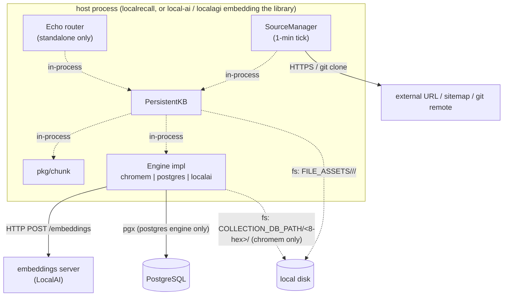
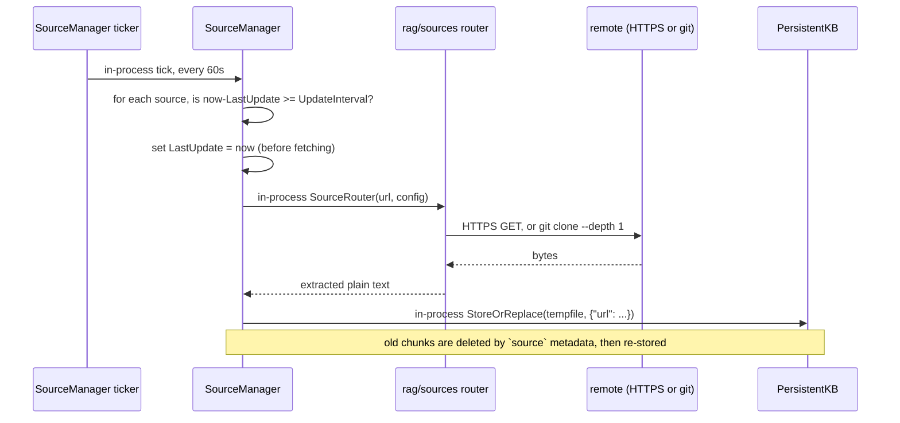

# LocalRecall architecture

Two halves, one dependency arrow. The service half owns configuration, HTTP and
the web UI; the library half owns collections, chunking, embedding coordination
and storage. Nothing in the library half imports the service half.

## The split

| Package | Role | Reads environment? |
|---|---|---|
| `main` (`main.go`, `routes.go`, `static.go`) | Echo server, env parsing, auth middleware, embedded UI | yes — all 16 variables |
| `rag` | `PersistentKB`, collection lifecycle, file layout, chunk orchestration | **no** |
| `rag/engine` | the three backends plus a mock | `postgres.go` only (weights, timeouts, BM25 config) |
| `rag/sources` | URL, sitemap and git fetchers | no |
| `rag/types` | the `Result` DTO | no |
| `pkg/chunk` | the splitter | no |
| `pkg/client` | HTTP client for a *remote* LocalRecall server | no |

The `rag` package taking no environment is the load-bearing design decision. A
host application constructs an `*openai.Client` itself, passes it to a
constructor, and receives a working collection. Standalone `main.go` is just one
such host.

## Where the process boundaries are



Read the edges carefully. When a host embeds the library, **the only network
calls it makes on LocalRecall's behalf are (a) to the embeddings endpoint and (b)
to PostgreSQL if that engine is selected.** There is no loopback HTTP to a
LocalRecall port, no gRPC, no message bus. The external-source poller adds
outbound HTTPS and git only if you register a source.

The `localai` engine is the exception that proves the rule: selecting it adds a
third outbound HTTP target, LocalAI's `/stores/*` API. It is largely stubbed —
see [storage](storage.md#the-localai-engine).

## `PersistentKB`

`rag/persistency.go:32-40`. The object every consumer holds.

```go
type PersistentKB struct {
    Engine                 // embedded interface — the storage backend
    sync.Mutex             // one lock for the whole collection
    path         string    // <COLLECTION_DB_PATH>/collection-<name>.json
    assetDir     string    // <FILE_ASSETS>/<name>/
    maxChunkSize int
    chunkOverlap int
    sources      []*ExternalSource
}
```

Three things follow from that shape.

**It embeds `Engine`, so it *is* one.** Backend methods are promoted; `Search`,
`Reset` and `Count` are overridden on `PersistentKB` to add locking and
filesystem bookkeeping.

**One mutex guards everything.** `Search` takes the lock
(`rag/persistency.go:186`), as do the write paths. Searches on a single
collection therefore **serialise against each other and against ingestion**.
Concurrent readers do not run in parallel. Different collections are independent
values with independent locks, so per-collection parallelism is fine; per-query
parallelism inside one collection is not.

**Chunk configuration is baked in at construction.** `maxChunkSize` and
`chunkOverlap` are captured once, process-wide, from `MAX_CHUNKING_SIZE` and
`CHUNK_OVERLAP`. There is no per-collection override anywhere in the API. See
[chunking](chunking.md#changing-the-configuration).

### The exported surface

Constructors (`rag/collection.go`):

| Symbol | Line | Notes |
|---|---|---|
| `NewPersistentChromeCollection` | `:20` | chromem file store |
| `NewPersistentLocalAICollection` | `:40` | LocalAI `/stores`; calls `Repopulate()` at construction and discards the error (`:55`) |
| `NewPersistentPostgresCollection` | `:63` | takes an extra `databaseURL` |
| `ListAllCollections` | `:82` | scans `dbPath` for `collection-*.json` |
| `NewPersistentCollectionKB` | `rag/persistency.go:74` | low-level; takes an already-built `Engine` |

There is no exported `NewPersistentKB`. Methods on `*PersistentKB` cover the
lifecycle: `Store`, `StoreOrReplace`, `RemoveEntry`, `Search`, `Reset`, `Count`,
`Repopulate`, `ListDocuments`, `EntryExists`, `GetEntryContent`,
`GetEntryFilePath`, `GetEntryFileContent`, and the three external-source methods.

## The `Engine` interface — the backend contract

`rag/engine.go:8-18`. Nine methods. Anything satisfying them can be a LocalRecall
backend.

| Method | Purpose |
|---|---|
| `Store(s string, metadata map[string]string) (string, error)` | one chunk |
| `StoreDocuments(s []string, metadata map[string]string) error` | a batch of chunks |
| `GetEmbeddingDimensions() (int, error)` | used by the startup dimension check |
| `Reset() error` | drop everything |
| `Search(s string, similarEntries int) ([]types.Result, error)` | top-K retrieval |
| `Count() int` | stored chunk count |
| `Delete(where, whereDocument map[string]string, ids ...string) error` | metadata-filtered delete |
| `GetByID(id string) (types.Result, error)` | single fetch |
| `GetBySource(source string) ([]types.Result, error)` | all chunks of one entry |

Four implementations ship: `ChromemDB`, `PostgresDB`, `LocalAIRAGDB` and
`MockEngine`. `MockEngine` (`rag/engine/mock.go:19`) is in-memory with no
embeddings and no external dependencies. Its doc comment says it is for testing,
but it lives in a non-`_test` file and is therefore importable — useful for unit
tests in a consuming project.

The interface is where the abstraction leaks. Note what is *absent*: no `where`
parameter on `Search`, so **metadata filtering is not reachable from a query**,
and no contract on what `types.Result.Similarity` means. Both consequences are
covered in [retrieval](retrieval.md).

### `types.Result`

`rag/types/result.go:4-14`:

```go
type Result struct {
    ID         string
    Metadata   map[string]string
    Embedding  []float32
    Content    string
    Similarity float32
}
```

No JSON struct tags. When the search handler marshals this, the wire keys are the
Go field names — **capitalised**: `ID`, `Metadata`, `Embedding`, `Content`,
`Similarity`. Clients written against a lower-cased assumption get nothing.

The `Similarity` doc comment (`rag/types/result.go:10-12`) states cosine in
`[-1,1]`. That is accurate for chromem and wrong for the PostgreSQL hybrid path.
[retrieval](retrieval.md#score-semantics-differ-by-engine) has the numbers.

## The source manager

`rag/source_manager.go`. A background poller that keeps a collection in step with
external URLs, sitemaps and git repositories.



Mechanics worth knowing:

- **The tick is fixed at one minute** (`rag/source_manager.go:213`). Your
  configured `update_interval` is a *minimum* age, not a schedule; a source with a
  five-minute interval fires on the first tick at or after five minutes.
- **`LastUpdate` is stamped before the fetch** (`:127`). A failing source does not
  retry sooner than its interval; it just stays stale.
- **Routing is by URL suffix** (`rag/sources/router.go:12-30`): `.git` → shallow
  depth-1 clone; `sitemap.xml` → crawl every entry and join; anything else → fetch
  as a web page with a 30-second timeout and convert HTML to text.
- **Failures are logged and dropped** (`:132-134`, `:138-140`, `:167-169`). There
  is no error surface on the API, no retry policy and no per-source status. A
  source that has been failing for a week is distinguishable from a healthy one
  only by a stale `last_update`.
- **Every restart re-fetches everything**, because `RegisterCollection` kicks off
  an immediate `updateSource` for each loaded source (`:51-57`).
- **`Stop()` exists and is never called.** `main.go` has no signal handling and
  blocks on `e.Start` inside `e.Logger.Fatal` (`main.go:92`); LocalAGI's
  in-process backend calls only `Start`. There is no graceful shutdown.

A collision hazard lives in `sanitizeURL` (`:175-208`), which lowercases, replaces
punctuation with `-`, collapses repeats and truncates to 255 characters. Two
different URLs can map to the same temp filename and silently overwrite one
another.

## Lazy collection rehydration

At startup `registerAPIRoutes` walks every on-disk collection and tries to build
its engine (`routes.go:124-135`). Before v0.6.2 a failure called `os.Exit`, so a
transient embeddings outage crash-looped the server. Now a failure logs and stores
a **nil placeholder** in the map (`routes.go:127-131`), and `lookupCollection`
re-attempts construction on first use, caching on success (`routes.go:145-155`).

Two consequences you will meet in practice:

- `GET /api/collections` lists collections whose engine has never initialised,
  because it reads the filesystem rather than the map (`routes.go:474`).
- The first request against a collection after an outage pays the construction
  cost, including a dimension-probe embedding call.

LocalAGI reimplements this pattern, with a near-identical comment, in
`webui/collections/inprocess.go:66-97`.

## What LocalAGI reuses, and one gap

LocalAGI's `webui/collections/inprocess.go:21-55` is a near-verbatim copy of
LocalRecall's own `newVectorEngine` (`routes.go:87-116`), same three cases,
differing mainly in returning `nil` instead of an `error`. It reads the same
environment variable names — `COLLECTION_DB_PATH`, `FILE_ASSETS`,
`VECTOR_ENGINE`, `EMBEDDING_MODEL`, `DATABASE_URL`, `MAX_CHUNKING_SIZE`,
`CHUNK_OVERLAP` — with the same defaults, and improves one: it defaults
`EMBEDDING_MODEL` to `granite-embedding-107m-multilingual`, where standalone
LocalRecall leaves it empty.

The gap: LocalAGI constructs the source manager with an empty `&sources.Config{}`
(`inprocess.go:260`), so `GitPrivateKey` is always `""`. **Private-git external
sources cannot authenticate under the in-process backend.** `GIT_PRIVATE_KEY` is
honoured only by standalone LocalRecall (`main.go:26-29`).

## Upstream references

- [`rag/engine.go`](https://github.com/mudler/LocalRecall/blob/v0.6.4/rag/engine.go) — the nine-method `Engine` interface at lines 8-18. Source-verified against v0.6.4, validated 2026-08-17.
- [`rag/persistency.go`](https://github.com/mudler/LocalRecall/blob/v0.6.4/rag/persistency.go) — `PersistentKB` struct at 32-40, mutex-guarded `Search` at 185-190, asset layout at 353-355. Validated 2026-08-17.
- [`rag/collection.go`](https://github.com/mudler/LocalRecall/blob/v0.6.4/rag/collection.go) — constructors at 20, 40, 63; `ListAllCollections` at 82. Validated 2026-08-17.
- [`rag/types/result.go`](https://github.com/mudler/LocalRecall/blob/v0.6.4/rag/types/result.go) — the `Result` DTO and its cosine doc comment at 10-12. Validated 2026-08-17.
- [`rag/source_manager.go`](https://github.com/mudler/LocalRecall/blob/v0.6.4/rag/source_manager.go) — 60-second tick at 213, `LastUpdate` ordering at 127, unused `Stop` at 237. Validated 2026-08-17.
- [`rag/sources/router.go`](https://github.com/mudler/LocalRecall/blob/v0.6.4/rag/sources/router.go) — suffix-based dispatch at 12-30. Validated 2026-08-17.
- [`rag/engine/mock.go`](https://github.com/mudler/LocalRecall/blob/v0.6.4/rag/engine/mock.go) — exported in-memory engine. Validated 2026-08-17.
- [`routes.go`](https://github.com/mudler/LocalRecall/blob/v0.6.4/routes.go) — `newVectorEngine` at 87-116, lazy rehydration at 124-155. Validated 2026-08-17.
- [LocalRecall release v0.6.2](https://github.com/mudler/LocalRecall/releases/tag/v0.6.2) — the "never `os.Exit` on engine init failure" change (PR #44). Validated 2026-08-17.
- [LocalAGI `webui/collections/inprocess.go`](https://github.com/mudler/LocalAGI/blob/v2.9.0/webui/collections/inprocess.go) — copied engine switch at 21-55, empty `sources.Config` at 260. Validated against v2.9.0, 2026-08-17.
