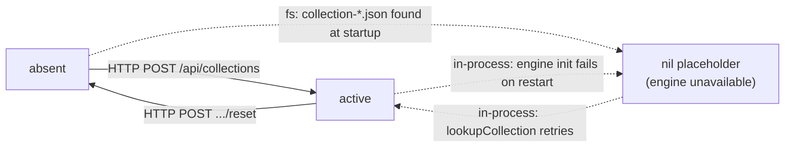

# Collections and the HTTP API

A collection is a named set of documents, their chunks and their vectors. It is
the unit of organisation, the unit of isolation, and the unit of deletion. In
agent deployments there is one collection per agent, named after the agent.

Every route below belongs to standalone LocalRecall. A host embedding the library
calls `*PersistentKB` methods instead and crosses no network boundary — see
[architecture](architecture.md).

## The envelope

Every JSON handler returns the same shape (`routes.go:36-48`):

```json
{
  "success": true,
  "message": "optional human string",
  "data": { },
  "error": { "code": "NOT_FOUND", "message": "...", "details": "..." }
}
```

`message`, `data` and `error` are all `omitempty`. Declared error codes
(`routes.go:51-57`): `NOT_FOUND`, `INVALID_REQUEST`, `INTERNAL_ERROR`,
`UNAUTHORIZED`, `CONFLICT`. **`CONFLICT` is declared and never used** anywhere in
the codebase.

One route escapes the envelope: `GET /entries/:entry/raw` returns file bytes with
a Content-Type derived from the extension.

## The complete route table

Twelve routes, all registered at `routes.go:177-188`, plus two static handlers.
There is no version prefix; the base path is `/api`.

| # | Method | Path | Purpose | Request | Success response |
|---|---|---|---|---|---|
| 1 | POST | `/api/collections` | Create a collection | `{"name": string}` | **201** · `{"name", "created_at"}` |
| 2 | POST | `/api/collections/:name/upload` | Ingest a file | `multipart/form-data`, field **`file`** | **200** · `{"filename", "collection", "key", "created_at"}` |
| 3 | GET | `/api/collections` | List collections | — | **200** · `{"collections": [string], "count": int}` |
| 4 | GET | `/api/collections/:name/entries` | List entries | — | **200** · `{"collection", "entries": [string], "keys": [string], "count"}` |
| 5 | GET | `/api/collections/:name/entries/:entry` | Extracted text of one entry | — | **200** · `{"collection", "entry", "content": string, "chunk_count": int}` |
| 6 | GET | `/api/collections/:name/entries/:entry/raw` | Original bytes | — | **200** · raw file, **no envelope** |
| 7 | POST | `/api/collections/:name/search` | Similarity search | `{"query": string, "max_results": int}` | **200** · `{"query", "max_results", "results": [Result], "count"}` |
| 8 | POST | `/api/collections/:name/reset` | Wipe — in effect, delete | — | **200** · `{"collection", "reset_at"}` |
| 9 | DELETE | `/api/collections/:name/entry/delete` | Remove one entry | `{"entry": string}` | **200** · `{"deleted_entry", "remaining_entries": [string], "entry_count"}` |
| 10 | POST | `/api/collections/:name/sources` | Register an external source | `{"url": string, "update_interval": int}` (**minutes**) | **200** · `{"collection", "url", "update_interval"}` |
| 11 | DELETE | `/api/collections/:name/sources` | Remove an external source | `{"url": string}` | **200** · `{"collection", "url"}` |
| 12 | GET | `/api/collections/:name/sources` | List external sources | — | **200** · `{"collection", "sources": [{"url", "update_interval", "last_update"}], "count"}` |

Static handlers (`static.go:28-32`), serving an embedded FS:

| Method | Path | Serves |
|---|---|---|
| GET | `/` | `static/index.html` — the web UI |
| GET | `/static/*` | `collectionManager.js`, logos |

### Notes that will save you an hour

**Route 1 — create.** The engine is constructed immediately, and a failure
returns **502 Bad Gateway** with `INTERNAL_ERROR` and the message
`"Vector backend unavailable"` (`routes.go:211`) — deliberate, so a caller does
not walk away holding a permanently broken collection. There is **no name
validation at all**: an empty name is accepted and produces `collection-.json`.
Naming rules are below.

**Route 2 — upload.** Multipart only, field name exactly `file`. The handler
copies the upload to a temp file and then *renames* it so the basename matches
the original filename, because `Store` derives the index key from
`filepath.Base`. The returned `key` is the `uuid/filename` index key. A `200`
here does **not** mean the file was indexed — see
[ingestion](ingestion.md#the-trap-200-ok-does-not-mean-searchable).

**Route 3 — list.** Reads the **filesystem**, scanning `COLLECTION_DB_PATH` for
`collection-*.json`, not the in-memory map. It therefore lists collections whose
engine failed to initialise, and it works while the embeddings endpoint is down.
This is the closest thing to a health probe the project has.

**Route 4 — entries.** `keys` are the full `uuid/filename` keys; `entries` are
`filepath.Base(k)`, retained for backward compatibility. Prefer `keys`;
`pkg/client` does exactly that, falling back to `entries`.

**Route 5 — entry content.** Returns the **re-extracted text of the file on
disk**, not a concatenation of stored chunks, specifically so overlap text is not
duplicated. Two error mappings are done by `strings.Contains` on the error
message, which is brittle:

- message contains `"entry not found"` → **404**
- message contains `"not implemented"` or `"unsupported file type"` → **501**

A `501` here is how a non-indexable upload (a `.png`, a `.docx`) surfaces, and
also how the `localai` engine surfaces most operations.

> **Discrepancy (#8).** `README.md:259` documents this response as `collection`,
> `entry`, `chunks` (an array of `{id, content, metadata}`) and `count`. The code
> returns `content` as a **single string** and `chunk_count` as an integer
> (`routes.go:370-375`). The README documents a pre-v0.6.0 shape. Believe the
> code. `pkg/client.GetEntryContent` papers over the difference by wrapping the
> string in a one-element `[]EntryChunk`.

**Route 7 — search.** Two traps. First, `max_results` defaults to **5 if the
collection holds ≥5 documents, otherwise 1** — and it counts *documents*, not
chunks, so an unspecified query against a collection holding one 500-page PDF
returns exactly **one** chunk. Always send `max_results` explicitly. Second, each
result is a `types.Result` marshalled with Go's default field names, because the
struct carries no JSON tags:

```json
{"ID": "...", "Metadata": {...}, "Embedding": [...], "Content": "...", "Similarity": 0.71}
```

**Capitalised keys.** There is no server-side cap on `max_results`; a value of
1000000 is passed straight through as the SQL `LIMIT` or chromem's `nResults`.
What `Similarity` means depends on the engine — [retrieval](retrieval.md) has the
detail.

**Route 8 — reset is really delete.** `Reset()` wipes the asset directory, clears
sources, resets the engine and deletes the state JSON; the handler then removes
the collection from the in-memory map. Afterwards the collection is gone from
`GET /api/collections` too. **There is no delete-collection endpoint, and no way
to empty a collection while keeping it.** `pkg/client` has no `DeleteCollection`
either; the project's own e2e suite uses `Reset` for teardown.

**Route 9 — path shape.** `entry/delete` is singular and carries the verb in the
path as well as the method, inconsistent with the plural `entries` of routes 4-6.
The entry name travels in a body on a `DELETE`, which some HTTP clients and
proxies drop.

**Route 11 — inconsistent error.** Alone among its siblings this handler does not
call `lookupCollection`; it goes straight to `sourceManager.RemoveSource`. An
unknown collection therefore returns **500**, not 404.

### What the API does not have

Verified against the full route list:

- **No raw-text ingestion endpoint** — despite the README claiming it. See
  [ingestion](ingestion.md#discrepancy-the-readme-promises-raw-text-input).
- **No health or readiness endpoint.**
- **No delete-collection.**
- **No `/version`.** `versioning.ApplicationVersion` is injected by ldflags and
  read by nothing.
- **No metrics, no pagination, no PUT/PATCH on anything.**

## Authentication

Off unless `API_KEYS` is set; then a bearer token is required on **every** route,
the web UI included. Detail in [installation](installation.md#authentication).

## Collection lifecycle



Creation writes `<COLLECTION_DB_PATH>/collection-<name>.json` and creates
`<FILE_ASSETS>/<name>/`. Both happen under every engine, PostgreSQL included.

At startup each on-disk collection is rehydrated; if its engine cannot be built
(embeddings endpoint down, PostgreSQL unreachable) a nil placeholder is stored and
construction is retried on first use. Consequence: the first request after an
outage is slower, and a collection can appear in `GET /api/collections` while
every operation on it returns 502.

## Naming

**Nothing validates a collection name at the API.** What the name then has to
survive depends on the engine:

| Engine | What the name becomes | Hazard |
|---|---|---|
| all | `collection-<name>.json`, `<FILE_ASSETS>/<name>/` | path characters in the name reach the filesystem |
| chromem | an 8-hex-character SHA-256 prefix directory | the name is **not recoverable** from the vector store |
| postgres | `documents_<sanitized>`, every non-`[a-zA-Z0-9_]` rune replaced by `_` | **many-to-one**: `a-b`, `a.b` and `a b` all become `documents_a_b` and silently share one table |

The PostgreSQL sanitiser also prepends `col_` when the sanitised name does not
start with a letter, so a collection named `9lives` lands in `documents_col_9lives`.

The allowlist closes SQL injection. It does not close collisions, and nothing
detects them. **Recommendation: restrict collection names to
`[a-z0-9_]` yourself.** If you namespace names — an agent name, a tenant prefix —
pick `_` as the separator rather than `:`, `-` or `.`.

That advice is not theoretical. The sanitiser exists because a `:` in a
namespaced collection name produced `syntax error at or near ':'` on
`CREATE TABLE`; the fix shipped in v0.6.3.

## Isolation

Isolation is per collection and it is genuine at the storage layer:

- **chromem** — a separate directory per collection under `COLLECTION_DB_PATH`.
- **postgres** — a separate table per collection, plus one shared
  `collection_config` registry row.
- **filesystem** — a separate asset directory per collection.
- **concurrency** — a separate `sync.Mutex` per `PersistentKB`, so collections do
  not block each other. Operations *within* one collection serialise.

What isolation does **not** give you:

- **No authorisation per collection.** `API_KEYS` is all-or-nothing across the
  whole server. Any key that can read one collection can read, write and reset
  every collection.
- **No cross-collection search.** One query, one collection.
- **No metadata filtering inside a collection** — the `Engine.Search` contract has
  no `where` parameter. If you need "only within document X", you need a
  collection per X.

## Upstream references

- [`routes.go`](https://github.com/mudler/LocalRecall/blob/v0.6.4/routes.go) — route registration at 177-188; envelope at 36-57; every handler cited above. Source-verified against v0.6.4, validated 2026-08-17.
- [`static.go`](https://github.com/mudler/LocalRecall/blob/v0.6.4/static.go) — the two embedded-FS handlers at 28-32. Validated 2026-08-17.
- [`rag/persistency.go`](https://github.com/mudler/LocalRecall/blob/v0.6.4/rag/persistency.go) — `Reset` at 192, `GetEntryFileContent` at 310, `findEntryKey` at 164-183. Validated 2026-08-17.
- [`rag/collection.go`](https://github.com/mudler/LocalRecall/blob/v0.6.4/rag/collection.go) — `ListAllCollections` filesystem scan at 82-99. Validated 2026-08-17.
- [`rag/engine/postgres.go`](https://github.com/mudler/LocalRecall/blob/v0.6.4/rag/engine/postgres.go) — `sanitizeTableName` at 112-133 and its inline history of the `:` bug. Validated 2026-08-17.
- [`rag/types/result.go`](https://github.com/mudler/LocalRecall/blob/v0.6.4/rag/types/result.go) — no JSON tags, hence capitalised wire keys. Validated 2026-08-17.
- [`pkg/client/client.go`](https://github.com/mudler/LocalRecall/blob/v0.6.4/pkg/client/client.go) — `keys`-then-`entries` fallback at 110-113; `GetEntryContent` wrapping at 144-159. Validated 2026-08-17.
- [`README.md`](https://github.com/mudler/LocalRecall/blob/v0.6.4/README.md) — the pre-v0.6.0 entry-content shape at line 259. Validated 2026-08-17.
- [LocalRecall release v0.6.3](https://github.com/mudler/LocalRecall/releases/tag/v0.6.3) — table-name sanitisation (PR #48). Validated 2026-08-17.
