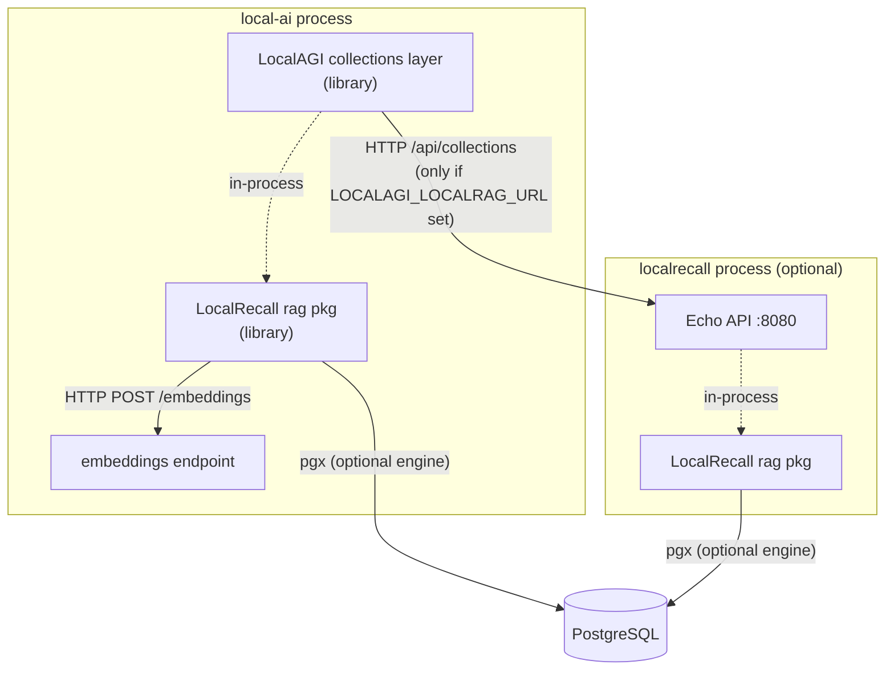

# LocalRecall overview

LocalRecall is a **RAG collection store**. It ingests files, splits them into
chunks, asks an external embeddings endpoint for a vector per chunk, writes those
vectors into a pluggable backend, and answers similarity queries against them.

It runs **no models**. There is no ONNX, GGML or tokeniser dependency anywhere in
its `go.mod`; every embedding is an HTTP POST to an OpenAI-compatible
`/embeddings` endpoint (normally LocalAI). If that endpoint is down, LocalRecall
can still list and serve files, but it cannot index or search. See
[embeddings](embeddings.md).

At v0.6.4 the whole project is roughly 9,600 lines across 65 files. It is small
enough to read end to end, and this chapter is written from a full read of the Go
sources rather than from the README.

## The dual nature

LocalRecall is simultaneously two things, and which one you are using changes
where its state lives, what crosses the network, and which bugs can reach you.

| | Standalone HTTP service | Importable Go library |
|---|---|---|
| Entry point | `main.go` → `startAPI` (`main.go:95-97`) | `rag.NewPersistent*Collection` (`rag/collection.go:20,40,63`) |
| Configuration | 16 environment variables, read in `main.go` | constructor parameters only — `rag/` reads no environment at all |
| Transport to caller | HTTP `/api/collections/...` on `:8080` | in-process Go method calls |
| Web UI | yes, embedded `static/` FS | no |
| Consumers | anything that speaks HTTP; LocalAGI when `LOCALAGI_LOCALRAG_URL` is set | LocalAGI by default, and therefore LocalAI |

The `main` package holds exactly four files: `main.go` (97 lines), `routes.go`
(577), `static.go` (32), and `internal/versioning/version.go` (3, a separate
package). That is **~674 lines of Echo shell** over the library — everything
substantive lives under `rag/` and `pkg/`.

The layering is not incidental. Nothing under `rag/`, `rag/engine/` or
`pkg/chunk/` imports Echo or `net/http` for its own serving; the dependency arrow
points only `main` → `rag`. Every value a collection needs, including the
embeddings client itself, arrives as a constructor argument. **That is precisely
what makes in-process embedding possible**: a host application supplies its own
`*openai.Client` and gets a `*PersistentKB` back, with no HTTP server, no port,
and no environment parsing in between.

## Who consumes it which way

- **LocalAGI** embeds the library by default. `LocalAGI/webui/collections/inprocess.go`
  calls `rag.NewPersistentChromeCollection` / `...LocalAICollection` /
  `...PostgresCollection` directly and stores the results in a
  `map[string]*rag.PersistentKB`. Setting `LOCALAGI_LOCALRAG_URL` switches it to
  an HTTP backend built on LocalAGI's own `pkg/localrag` client — **not**
  LocalRecall's `pkg/client`, which no LocalAGI file imports.
- **LocalAI** never touches LocalRecall's API directly. A search of LocalAI's Go
  sources for `mudler/localrecall` returns zero hits; the module appears in its
  `go.mod` as `// indirect`. Knowledge reaches LocalAI **through** LocalAGI's
  collections layer. The dependency chain is LocalAI → LocalAGI → LocalRecall,
  and it is a compile-time chain.
- **Third-party callers** have two supported options: `pkg/client` (HTTP, against
  a running server) or the `rag` package (in-process). Both are exported and
  documented in [architecture](architecture.md).

## Three LocalRecall versions are in play at once

This trips people up when comparing "knowledge in LocalAI" with "knowledge in
standalone LocalRecall".

| Deployment | LocalRecall version linked |
|---|---|
| Standalone LocalRecall today | `v0.6.4` |
| LocalAI v4.8.2 | `v0.6.3` (plain tag, `LocalAI/go.mod:241`) |
| A `go build` of standalone LocalAGI v2.9.0 | `v0.6.3-0.20260618142827-d0073dd5dc32` |

LocalAGI pins a **pseudo-version** — a commit dated 2026-06-18, after the `v0.6.2`
tag and before the `v0.6.3` tag (2026-06-26). LocalAI requires the plain tag
`v0.6.3`. Under semver a pre-release suffix sorts *below* the plain version, so
Go's minimal version selection resolves the combined build to the real `v0.6.3`
release. **LocalAI therefore links a newer LocalRecall than standalone LocalAGI
does.**

The practical consequence: features that landed in `v0.6.4` — notably
`BM25_TEXT_CONFIG` and the `pg_textsearch v1.3.1` pin — are present in neither
linked version. Parity between the two deployments is coincidental, not
contractual. Version-sensitive claims in this chapter are stamped `v0.6.4` unless
stated otherwise.

## What LocalRecall is not

- **Not a memory system.** The README describes managing "long-term and
  short-term memory" (`README.md:16`). In the code there is no memory endpoint,
  no recency decay, no salience, no summarisation, no eviction and no TTL. A
  `created_at` value is written into chunk metadata and never read by anything.
  Agent memory is built *on top of* LocalRecall's collection primitives by
  LocalAGI — see [terminology](../00-overview/terminology.md#long-term-memory).
- **Not a document converter.** Only `.pdf`, `.txt` and `.md` are indexable on the
  upload path. Everything else is stored, listed, downloadable and permanently
  unsearchable. This is the single most common surprise in the whole component;
  [ingestion](ingestion.md) covers it.
- **Not a reranking pipeline.** A grep for `rerank` across the sources returns
  zero hits. There is no query rewriting, no HyDE, no multi-query and no
  cross-encoder. Retrieval is one call into the backend.

## Nine places the README and the code disagree

Each is confirmed against v0.6.4 source. Believe the source column.

| # | README says | Code does | Covered in |
|---|---|---|---|
| 1 | Supports raw text inputs (`README.md:22`) | No such route (`routes.go:177-188`), no such UI control (`static/js/collectionManager.js:329-341`) | [ingestion](ingestion.md) |
| 2 | Fully local, no external cloud dependencies (`README.md:58`) | Web UI loads four public CDNs (`static/index.html:7-10`) | [installation](installation.md) |
| 3 | `.env` file support (`README.md:216`) | No dotenv dependency; `env_file` commented out (`docker-compose.yml:40`) | [installation](installation.md) |
| 4 | Two engines: Chromem, PostgreSQL (`README.md:18-21`) | Three; `localai` is selectable (`routes.go:99`) | [storage](storage.md) |
| 5 | `COLLECTION_DB_PATH` is "for Chromem engine" (`README.md:196`) | Used by every engine for `collection-*.json` (`rag/collection.go:27,45,70`) | [storage](storage.md) |
| 6 | Env table omits three variables (`README.md:194-212`) | `BM25_TEXT_CONFIG`, `LOCALRECALL_REPOPULATE_DELETE`, `LOCALRECALL_PDF_EXTRACT_TIMEOUT` all exist | [installation](installation.md) |
| 7 | Go 1.16 or higher (`README.md:71`) | `go 1.25.0` (`go.mod:3`), builder image `golang:1.26` (`Dockerfile:5`) | [installation](installation.md) |
| 8 | Entry content returns `chunks[]` + `count` (`README.md:259`) | Returns `content` (one string) + `chunk_count` (`routes.go:370-375`) | [collections](collections.md) |
| 9 | Pull `latest-postgresql` (`README.md:156`) | `latest=false` on that image (`.github/workflows/image.yml:98`) | [installation](installation.md) |

`OPENAI_BASE_URL` is a tenth case of a different kind: the README lists it as an
ordinary optional row, but the code makes it effectively mandatory. That one is
in [embeddings](embeddings.md) because the failure mode needs explaining.

## Where to go next

| Question | Page |
|---|---|
| How do the library and service halves fit together? | [architecture](architecture.md) |
| How do I run it? | [installation](installation.md) |
| What is the HTTP API? | [collections](collections.md) |
| Why is my uploaded file not searchable? | [ingestion](ingestion.md) |
| Why are my chunks so small? | [chunking](chunking.md) |
| Where do embeddings come from? | [embeddings](embeddings.md) |
| What does the similarity number mean? | [retrieval](retrieval.md) |
| chromem or PostgreSQL? | [storage](storage.md) |
| End-to-end pipelines | [rag](rag.md) |
| It is broken | [troubleshooting](troubleshooting.md) |

## Upstream references

- [`main.go`](https://github.com/mudler/LocalRecall/blob/v0.6.4/main.go) — service entry point, environment parsing, embeddings client construction. Source-verified against v0.6.4, validated 2026-08-17.
- [`routes.go`](https://github.com/mudler/LocalRecall/blob/v0.6.4/routes.go) — the complete route registration at lines 177-188. Validated 2026-08-17.
- [`rag/collection.go`](https://github.com/mudler/LocalRecall/blob/v0.6.4/rag/collection.go) — the three exported collection constructors and `ListAllCollections`. Validated 2026-08-17.
- [`rag/persistency.go`](https://github.com/mudler/LocalRecall/blob/v0.6.4/rag/persistency.go) — `PersistentKB`, on-disk layout, chunkable-file gate. Validated 2026-08-17.
- [`go.mod`](https://github.com/mudler/LocalRecall/blob/v0.6.4/go.mod) — no model runtime dependency; `sashabaranov/go-openai v1.37.0` at line 16. Validated 2026-08-17.
- [`README.md`](https://github.com/mudler/LocalRecall/blob/v0.6.4/README.md) — the documented claims in the discrepancy table. Validated 2026-08-17.
- [LocalRecall release v0.6.4](https://github.com/mudler/LocalRecall/releases/tag/v0.6.4) — validated 2026-08-17.
- [LocalAI `go.mod`](https://github.com/mudler/LocalAI/blob/v4.8.2/go.mod) — line 241, `localrecall v0.6.3 // indirect`. Validated against v4.8.2, 2026-08-17.
- [LocalAGI `go.mod`](https://github.com/mudler/LocalAGI/blob/v2.9.0/go.mod) — line 21, the `v0.6.3-0.20260618142827-d0073dd5dc32` pseudo-version. Validated against v2.9.0, 2026-08-17.
- [LocalAGI `webui/collections/inprocess.go`](https://github.com/mudler/LocalAGI/blob/v2.9.0/webui/collections/inprocess.go) — the in-process backend and its engine switch. Validated against v2.9.0, 2026-08-17.
