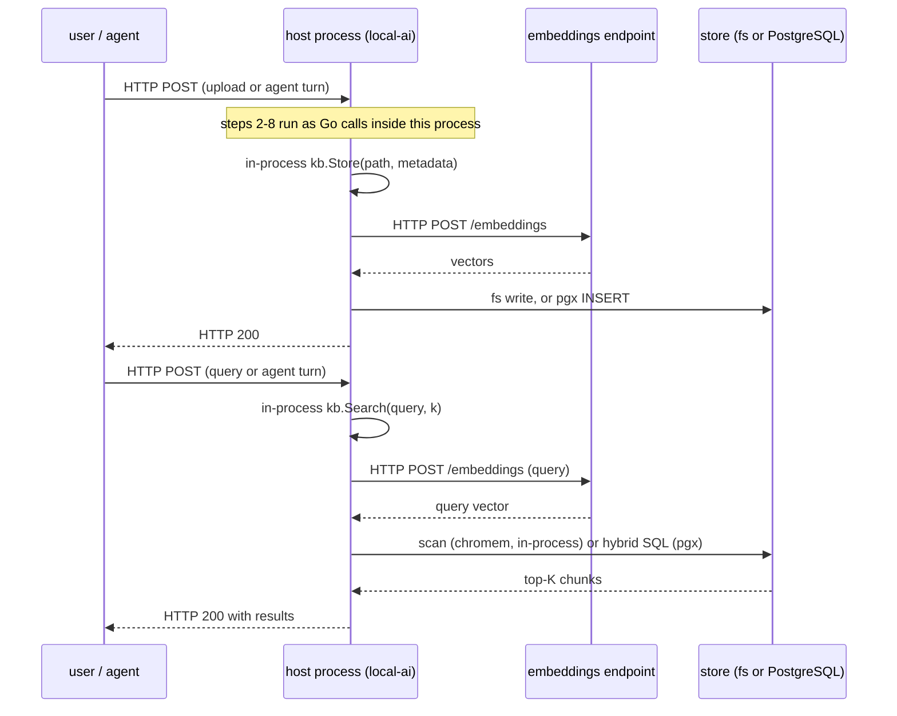

# The end-to-end RAG pipeline

Two pipelines, ingest and query, each crossing the same small set of boundaries.
Which boundaries are network hops depends on whether LocalRecall is a separate
process or a linked library — and nothing else about the pipeline changes.

## Ingest, standalone

Uploading `guide.md` to collection `handbook` on a chromem deployment.

1. **`POST /api/collections/handbook/upload`**, `multipart/form-data`, field
   `file`. **[network — client → localrecall :8080]**
2. The handler copies the body to an `os.CreateTemp` file, then renames it so the
   basename is `guide.md`, because the index key derives from `filepath.Base`.
   **[in-process; fs write to /tmp]**
3. `lookupCollection("handbook")` resolves the `*PersistentKB`, constructing the
   engine now if a previous attempt left a nil placeholder. **[in-process]**
4. `PersistentKB.Store` takes the collection mutex, generates a UUID, and copies
   the file to `<FILE_ASSETS>/handbook/<uuid>/guide.md`. **[fs write]** The index
   key is `<uuid>/guide.md`.
5. `isChunkableFile` checks the lowercased extension. `.md` passes. **A file that
   fails here is stored and the request still returns `200` — see
   [ingestion](ingestion.md#the-trap-200-ok-does-not-mean-searchable).**
6. `fileToText` reads the file. Markdown is not parsed; the raw source is the
   text. **[fs read]** *(An uppercase `.MD` fails here after passing step 5.)*
7. `chunkFile` splits on `strings.Fields` and accumulates greedily to 400 bytes
   with 0 overlap. **[in-process]**
8. Metadata is attached to every chunk: `type="file"`,
   `source="<uuid>/guide.md"`, `file_name="guide.md"`, `created_at`.
9. `Engine.StoreDocuments` embeds the chunks. **On chromem this is one HTTP POST
   per chunk**, fanned out across `NumCPU()` goroutines; on PostgreSQL it is one
   POST carrying every chunk. **[network — localrecall → embeddings endpoint]**
10. Vectors are persisted: one gzipped gob file per chunk under
    `<COLLECTION_DB_PATH>/<8-hex>/` **[fs write]**, or one `INSERT` per chunk into
    `documents_handbook` **[network — pgx → PostgreSQL]**.
11. **`200 OK`** with `{filename, collection, key, created_at}`. **[network]**

The mutex taken at step 4 is held across steps 5-10. Ingestion of one collection
blocks searches of that same collection for its whole duration — including the
embedding round trips.

## Query, standalone

1. **`POST /api/collections/handbook/search`** with `{"query": "...",
   "max_results": 8}`. **[network — client → localrecall :8080]** Omitting
   `max_results` gives you 5, or **1** if the collection holds fewer than 5
   *documents*.
2. `PersistentKB.Search` takes the collection mutex. **[in-process]**
3. `Engine.Search` embeds the query text. **[network — localrecall → embeddings
   endpoint]** Every search pays this; there is no query cache.
4. Nearest-neighbour lookup:
   - chromem: brute-force scan of every chunk, dot product against the normalised
     query vector, bounded max-heap of size K. **[in-process, no index]**
   - postgres: the RRF hybrid query, each arm pulling `max(K*10, 100)` candidates
     from its own index, fused by rank. **[network — pgx → PostgreSQL]**
5. Results marshal as `types.Result` with **capitalised** JSON keys. `Similarity`
   means different things on different engines — see
   [retrieval](retrieval.md#score-semantics-differ-by-engine).
6. **`200 OK`**. **[network]**

The caller now owns the rest of RAG: select which chunks to keep, assemble them
into a prompt, and call the model. LocalRecall does none of that and has no
knowledge of the model.

## Embedded

The same eleven and six steps, with two edges deleted.

Differences that matter:

| | Standalone | Embedded |
|---|---|---|
| Steps 1 and 11 of ingest | HTTP to `:8080` | Go method calls |
| Auth on collection operations | `API_KEYS`, all-or-nothing | the host's own auth |
| The embeddings hop | present | **still present** |
| The PostgreSQL hop | present if selected | **still present** if selected |
| Raw-text ingest | impossible — no endpoint | trivial — write a temp file and call `Store`, which is exactly what LocalAGI does |
| Config source | 16 environment variables | constructor arguments supplied by the host |

**The embeddings call never disappears.** Embedding LocalRecall as a library
removes the LocalRecall port, not the model dependency. In a LocalAI deployment
that call is loopback HTTP from LocalAI to itself — a real HTTP request, subject
to auth and visible in access logs.

## Practical guidance

### Chunk size

Decide before first ingest; changing it later requires a reset and re-upload,
because the setting is process-global and existing chunks are never rewritten.

- The 400-byte default is roughly 60-100 English words. That is smaller than one
  paragraph, and with zero overlap a fact spanning a boundary survives in
  **neither** chunk.
- For English prose, a size in the low thousands of bytes with roughly 10-15%
  overlap is a defensible starting point.
- For non-ASCII corpora, scale up: the count is bytes, so CJK text gets about a
  third of the characters at the same setting.
- On chromem, larger chunks are also directly cheaper — fewer chunks means
  proportionally fewer HTTP requests during ingest.

Nothing here has been measured by us. Tune against your own queries.

### Top-K

- **Always send `max_results`.** The default of 5-or-1 counting *documents* is a
  trap on small collections.
- With 400-byte chunks, each result is tiny; a K of 8-12 is closer to one
  paragraph of usable context than K of 3 would be with conventional chunk sizes.
- On PostgreSQL, K also drives candidate depth: each arm pulls `max(K*10, 100)`
  rows before fusion, so cost grows faster than the result count.
- Filter by **rank position**, never by an absolute similarity threshold. The
  score scale differs per engine and per index health.

### When to move to PostgreSQL

Move when any of these is true:

| Signal | Why chromem cannot fix it |
|---|---|
| Query latency grows with corpus size | brute-force scan, no ANN index |
| Queries need exact identifiers, error codes, part numbers | chromem is dense-only; BM25 lives in PostgreSQL |
| Ingestion is dominated by embedding calls | chromem sends one HTTP request per chunk |
| More than one process must read the same collection | file-per-document store with process-local locking |
| You expect to change embedding models | chromem has no migration; PostgreSQL has a transactional one |

Stay on chromem when the corpus is a few thousand chunks, one process serves it,
and you do not want a database to operate.

There is no in-place migration between engines. Moving means: create the
collection on the new engine, re-upload the originals from `FILE_ASSETS` (or
download them via `.../raw` first), and re-register external sources. Budget
embeddings capacity for a full re-embed of everything.

Before switching, confirm the target database has `pg_textsearch`,
`shared_preload_libraries` set, and a healthy `idx_<table>_embedding` — a
collection with no vector index works, silently, on sequential scans. See
[storage](storage.md#indexes).

### Operating notes

- Persist `COLLECTION_DB_PATH` and `FILE_ASSETS` under **every** engine, database
  or not.
- There is no health endpoint. `GET /api/collections` proves only that the HTTP
  server and state directory are alive; it never touches the embeddings backend.
- There is no graceful shutdown and no signal handling. Restarts during ingestion
  can leave a file in the asset directory with no chunks in the store; the entry
  will list and never match. `Repopulate` fixes it, but only fires as a side
  effect of other operations.
- Every restart re-fetches every external source immediately.

## Upstream references

- [`routes.go`](https://github.com/mudler/LocalRecall/blob/v0.6.4/routes.go) — `uploadFile` at 405-470, `search` at 279-318, `lookupCollection` at 137-156. Source-verified against v0.6.4, validated 2026-08-17.
- [`rag/persistency.go`](https://github.com/mudler/LocalRecall/blob/v0.6.4/rag/persistency.go) — `Store` at 334-379 (mutex, UUID, copy, chunk, metadata), `Search` at 185-190, `chunkFile` at 703-713. Validated 2026-08-17.
- [`rag/engine/chromem.go`](https://github.com/mudler/LocalRecall/blob/v0.6.4/rag/engine/chromem.go) — per-chunk embedding at 82-89, `NumCPU` fan-out at 150. Validated 2026-08-17.
- [`rag/engine/postgres.go`](https://github.com/mudler/LocalRecall/blob/v0.6.4/rag/engine/postgres.go) — whole-file batch embed at 681-686, hybrid query at 879-913, candidate constants at 851-859. Validated 2026-08-17.
- [`main.go`](https://github.com/mudler/LocalRecall/blob/v0.6.4/main.go) — process-global chunk configuration at 72-88; no signal handling, `e.Start` at 92. Validated 2026-08-17.
- [LocalAGI `webui/collections/rag_provider.go`](https://github.com/mudler/LocalAGI/blob/v2.9.0/webui/collections/rag_provider.go) — the embedded raw-text write path at 29-52. Validated against v2.9.0, 2026-08-17.
