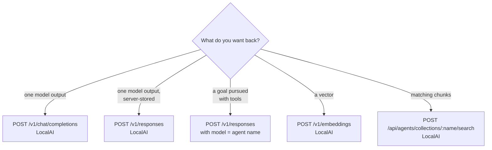
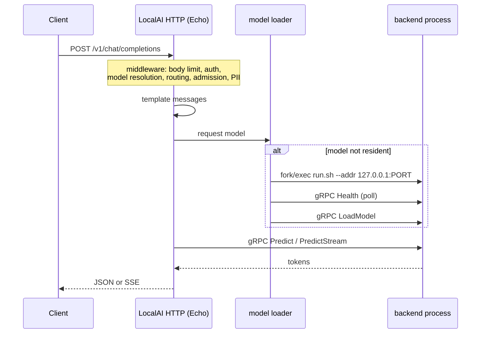
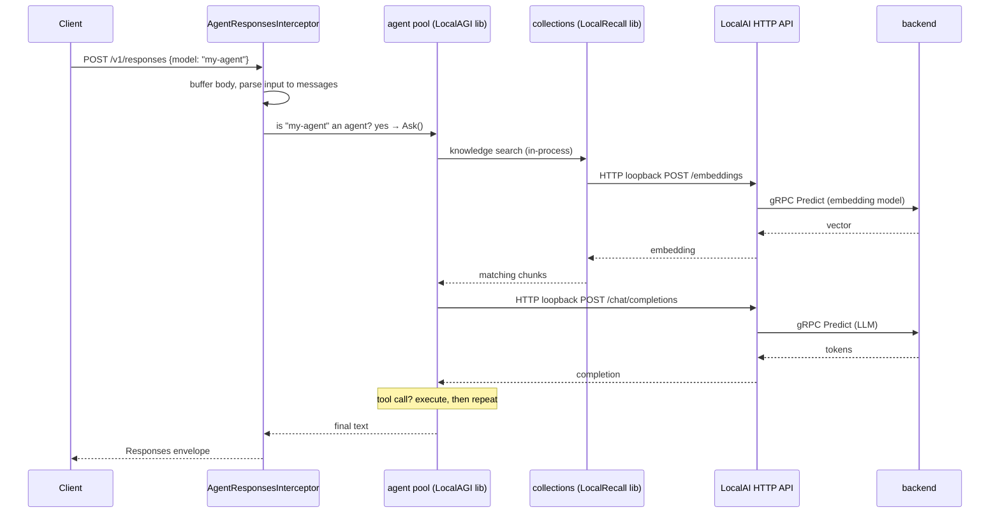

# API flow and request tracing

What actually happens between a request arriving and a response leaving, and
which boundaries are crossed on the way.

Each trace below marks every step with its boundary: `in-process`, `loopback
HTTP`, `network HTTP`, `gRPC`, or `subprocess`. Steps we could not verify are
marked; nothing is presented as traced when it was inferred.

## Which API do I call?

The important row is the third. In LocalAI, an **agent request and an inference
request arrive at the same URL**. A middleware inspects the `model` field: if it
names an agent, the request is diverted into the agent runtime; otherwise it
falls through to the normal inference pipeline.

Same endpoint, two completely different execution paths, two completely
different latency profiles.

## Inference request versus agent request

| | Inference request | Agent request |
|---|---|---|
| Produces | one model output | a goal outcome |
| Model calls | exactly one | one per iteration, up to the cap |
| Tool executions | zero (or MCP, if configured) | zero or many |
| Retrieval | none | optional, per iteration |
| Latency | proportional to tokens | unbounded in principle |
| Failure modes | backend errors | plus loops, tool failures, iteration exhaustion |
| Idempotent | effectively | **no** — tools have side effects |

Treating an agent request like an inference request in a client timeout or a
load balancer configuration is a reliable way to produce mysterious truncations.

## Trace 1 — chat completion to LocalAI

The baseline. Everything else is built on this.

Numbered, with boundaries:

1. Request arrives at LocalAI's Echo server. *(inbound HTTP)*
2. Middleware chain runs: body limit, security headers, access log, metrics,
   auth, route-feature and quota checks, CORS, CSRF. *(in-process)*
3. Model resolution: the `model` field is matched against loaded configuration
   and the model YAML is read. *(in-process)*
4. Optional model routing. The router's classifier can itself invoke a scorer,
   embedder or reranker — **which means step 4 can trigger its own gRPC calls to
   other backends.** *(in-process, possibly gRPC)*
5. Optional PII middleware. Detection is performed by a NER detector model, so
   this too can be a backend call. *(in-process, possibly gRPC)*
6. Optional MCP tool discovery, if the model config declares MCP servers.
   *(subprocess and/or network HTTP per server)*
7. Prompt templating, unless the tokenizer template is used. *(in-process)*
8. If the model is not resident: a free port on `127.0.0.1` is allocated, the
   backend's `run.sh` is **fork/exec'd** as a child process, then polled with a
   gRPC `Health` RPC until ready, then sent `LoadModel`. *(process boundary,
   then gRPC over loopback TCP)*
9. Loading may **evict another model**, which terminates that backend's OS
   process. *(process boundary)*
10. Optional `TokenizeString` for prompt token accounting. *(gRPC)*
11. The inference RPC: `Predict` or `PredictStream`. *(gRPC)*
12. Tokens stream back through the callback chain to SSE, or are assembled into
    a JSON body. *(in-process, then outbound HTTP)*
13. If the model emitted a tool call and MCP is configured, the tool is executed
    and the loop returns to step 11. *(subprocess or network HTTP)*

**Boundary count for a warm, tool-free request: exactly one** — LocalAI to the
backend over loopback gRPC.

Observed cold, including model load: **8 s** for a 3B Q4 model on CPU.
Observed warm embedding call: **0.06–0.09 s**.

## Trace 2 — agent request to LocalAI `/v1/responses`

Numbered:

1. The interceptor middleware runs **before** the normal responses handler.
   *(in-process)*
2. The body is buffered and unmarshalled; the original body is restored so the
   request can fall through if this is not an agent. *(in-process)*
3. The input is parsed into messages. A bare string and a message array are both
   accepted, including `function_call` and `function_call_output` items.
   *(in-process)*
4. The `model` field is looked up as an agent name. **If it is not an agent, the
   middleware calls `next()` and the request proceeds as ordinary inference.**
   *(in-process)*
5. Otherwise the LocalAGI agent object's `Ask` is invoked with the conversation
   history. *(in-process — into library code)*
6. If the agent has a knowledge base and auto-search is on, a similarity search
   runs. *(in-process)*
7. That search embeds the query by POSTing to `/embeddings` — **on this same
   process, over loopback HTTP**. *(loopback HTTP, then gRPC)*
8. The agent loop calls the model by POSTing to `/chat/completions` — again
   **loopback HTTP on this same process**. *(loopback HTTP, then gRPC)*
9. If the model requests a tool, the tool executes and the loop returns to step
   8. Built-in actions are in-process; MCP tools cross a boundary.
10. The final text is wrapped in an OpenAI Responses envelope with an
    `id` of the form `resp_<uuid>`. *(in-process)*

> **Not fully traced.** The internals of the agent's own job loop — filters,
> connectors, planner — were verified only at the entry point and at the
> retrieval and inference egress points. Treat the intermediate ordering as
> source-derived, not statement-by-statement traced.

### The alternative agent entry point behaves differently

`POST /api/agents/:name/chat` reaches the same engine but is **asynchronous**: it
returns `202 Accepted` with a `message_id`, and the answer streams over
`GET /api/agents/:name/sse`.

If you are polling for a synchronous body from that endpoint, you will wait
forever. Use `/v1/responses` for request/response, or subscribe to the SSE
stream.

## Trace 3 — the distributed knowledge path

Worth its own trace because its physics differ from Trace 2 despite being the
same binary.

In distributed mode LocalAI does **not** run a LocalAGI pool. It runs its own
executor, and that executor performs knowledge lookups over HTTP against
LocalAI's public REST API:

1. Executor issues `POST /api/agents/collections/<name>/search`. *(HTTP — to the
   frontend, which may be a different container)*
2. The frontend routes that into its in-process collections backend.
   *(in-process)*
3. That backend POSTs `/embeddings` on the frontend. *(loopback HTTP)*
4. Which calls the embedding backend. *(gRPC)*

One knowledge lookup: **two HTTP round trips and one gRPC call**, where Trace 2
did the equivalent with one loopback HTTP hop and one gRPC call.

Both are "LocalAI with agents". Neither documentation nor a latency budget
written for one describes the other.

### A trap in this path

The executor reuses **one** base URL for both the LLM call and the collection
call. Configuring an agent to use an external model provider therefore aims its
`/api/agents/collections/...` requests at that provider too. The result is a 404,
a logged warning, and **knowledge silently disabled** — the agent still answers,
just without retrieval.

## Trace 4 — standalone LocalAGI with knowledge and a tool

1. Request arrives at LocalAGI's HTTP server, default port **3000**.
   *(inbound HTTP)* — the exact route handler was **not** verified.
2. The pool resolves the agent. The RAG provider was chosen at boot: embedded
   unless `LOCALAGI_LOCALRAG_URL` is set. *(in-process)*
3. Auto-search runs on the latest user message. *(in-process)*
4. **Embedded provider:** a direct Go call into LocalRecall's `PersistentKB`.
   *(in-process)*
   **HTTP provider:** `POST {LOCALAGI_LOCALRAG_URL}/api/collections/<c>/search`.
   *(network HTTP)*
5. Either way, the query is embedded by POSTing `/embeddings` to the configured
   model API. *(network HTTP → LocalAI)*
6. Retrieved chunks are prepended to the fragment as a system message.
   *(in-process)*
7. Tools are assembled: built-in actions, MCP servers, and — only if tools-mode
   is enabled — `search_memory` and `add_memory`. *(in-process)*
8. The agent loop calls `POST {base}/chat/completions`. *(network HTTP → LocalAI
   → gRPC)*
9. The model emits a tool call; the action runs. Transport varies by action:
   image generation POSTs back to the model API, shell actions use a container,
   MCP tools use their own transport. *(varies)*
10. Result appended; loop returns to step 8, once per iteration up to the cap
    (**default 2**).
11. If long-term memory is on, the turn is written back to the collection.
    *(in-process or network)*
12. Response returned; optionally logged to `<stateDir>/conversations` if
    conversation logging is enabled. *(local disk)*

## The `/v1` trap

cogito builds its inference URL by concatenating the configured base URL with
`/chat/completions`. **It never inserts a version segment.**

LocalAGI's and LocalRecall's shipped compose files set a bare
`http://localai:8080`, and that works only because LocalAI registers un-prefixed
aliases alongside its `/v1` routes.

| Target server | Base URL you must configure |
|---|---|
| LocalAI | `http://host:8080` or `http://host:8080/v1` — both work |
| Any other OpenAI-compatible server | `http://host:port/v1` — **the `/v1` is mandatory** |

LocalAI's own native executor *does* append `/v1`, so the two agent paths inside
LocalAI disagree with each other about this. If you substitute vLLM or a hosted
endpoint and every call 404s on `/chat/completions`, this is why.

## Counting boundaries

For one agent iteration with retrieval, in the integrated deployment:

| Hop | Boundary |
|---|---|
| Client → LocalAI | network HTTP |
| Agent pool → collections | in-process |
| Collections → embeddings | **loopback HTTP** |
| LocalAI → embedding backend | gRPC |
| Agent pool → chat completions | **loopback HTTP** |
| LocalAI → LLM backend | gRPC |
| Agent → built-in action | in-process |
| Agent → MCP tool | subprocess or network HTTP |

Four network-shaped hops for something commonly described as running "all in one
container". They are cheap on loopback, but they are real: they hit the auth
middleware, they appear in the access log, and they can fail independently.

## Upstream references

- [LocalAI `core/http/endpoints/openai/chat.go`](https://github.com/mudler/LocalAI/blob/v4.8.2/core/http/endpoints/openai/chat.go) — chat completion handler, MCP loop. Validated against v4.8.2.
- [LocalAI `core/backend/llm.go`](https://github.com/mudler/LocalAI/blob/v4.8.2/core/backend/llm.go) — inference path, tokenize, predict.
- [LocalAI `pkg/model/initializers.go`](https://github.com/mudler/LocalAI/blob/v4.8.2/pkg/model/initializers.go) — backend port allocation, process spawn, load.
- [LocalAI `core/http/endpoints/localai/agent_responses.go`](https://github.com/mudler/LocalAI/blob/v4.8.2/core/http/endpoints/localai/agent_responses.go) — the agent interceptor on `/v1/responses`.
- [LocalAI `core/services/agents/knowledge.go`](https://github.com/mudler/LocalAI/blob/v4.8.2/core/services/agents/knowledge.go) — the distributed executor's HTTP knowledge lookup and shared base URL.
- [LocalAI `core/http/routes/openai.go`](https://github.com/mudler/LocalAI/blob/v4.8.2/core/http/routes/openai.go) — un-prefixed route aliases.
- [LocalAGI `core/agent/knowledgebase.go`](https://github.com/mudler/LocalAGI/blob/v2.9.0/core/agent/knowledgebase.go) — auto-search and write-back. Validated against v2.9.0.
- [LocalAGI `core/state/pool.go`](https://github.com/mudler/LocalAGI/blob/v2.9.0/core/state/pool.go) — provider selection, iteration options.
- Latency figures: observed 2026-08-17, see [version matrix](../00-overview/version-matrix.md).
