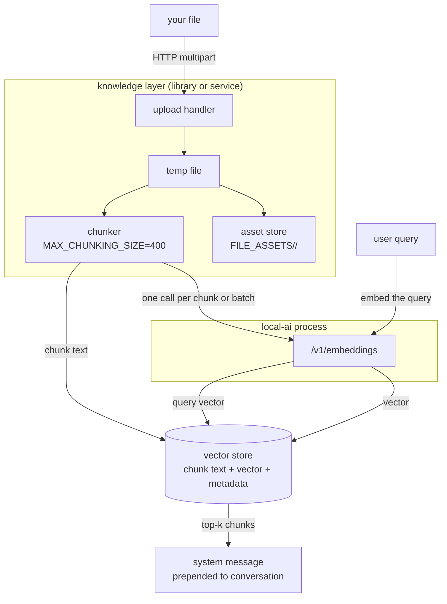
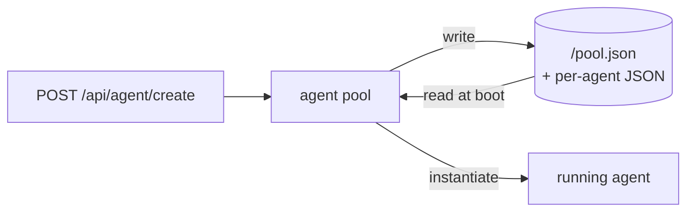
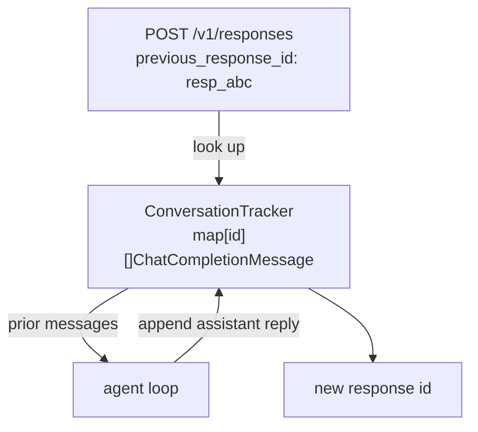
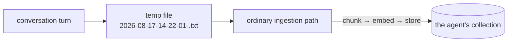

# Data flow

[API flow](api-flow.md) follows a request. This page follows the **data**: where
each piece originates, which process transforms it, where it comes to rest, and
what happens to it when a container is replaced.

## The five kinds of data

Distinguishing these is most of the work. They have different owners, different
lifetimes and different consequences when lost.

| Data | Created by | Lives in | Survives restart |
|---|---|---|---|
| Model weights | downloaded from a gallery | `/models` | only if the volume is mounted |
| Backend binaries | downloaded as OCI artifacts | `/backends` | only if the volume is mounted |
| Agent definitions | you, via API or UI | `<stateDir>` / `/data` as JSON | only if the volume is mounted |
| Collections and vectors | ingestion | chromem file or PostgreSQL | only if the volume or database persists |
| Conversation history | the caller, per request | **process memory only** | **no, by design** |

The last row is the one that surprises people, so it is worth stating plainly: in
LocalAGI, conversation history for the Responses API is held in an in-memory map
with a TTL. It is never written to disk and it does not survive a restart. See
[the TTL section](#conversation-history-expires-on-a-timer) below.

## Path 1 — a document becomes an answer

The full lifecycle, from a file on your laptop to text in a model's context.

Numbered, with the transformation at each step:

1. **Upload.** A multipart POST to `/api/collections/:name/upload`. The handler
   copies the stream to an OS temp file, then renames it so its base name matches
   the original filename — because the index key is derived with `filepath.Base`.
2. **Asset storage.** `Store` copies the file into a UUID subdirectory under
   `FILE_ASSETS`. The original bytes are kept, which is what makes
   `GET /api/collections/:name/entries/:entry/raw` possible.
3. **Chunking.** Paragraph-oriented splitting to `MAX_CHUNKING_SIZE` characters
   with `CHUNK_OVERLAP` characters of word-aligned overlap. Defaults: **400 and
   0**. Words longer than the chunk size are split rather than allowed to overflow.
4. **Embedding.** Each chunk is sent to `/v1/embeddings`. This crosses the network
   even when retrieval is in-process.
5. **Persistence.** Chunk text, vector, and metadata (`created_at`, source) are
   written to the engine — a chromem file, or a PostgreSQL table.
6. **Query time.** The query is embedded through the same endpoint and the engine
   returns the top *k* chunks.
7. **Injection.** Chunks are formatted into one system message and prepended to
   the conversation. See
   [what the model actually receives](localagi-localrecall.md#what-the-model-actually-receives).

Note what is *not* in this path: no reranking, no relevance threshold, no query
rewriting. Retrieval quality is determined almost entirely by chunk size and the
embedding model.

### Two copies of every document

Step 2 and step 5 both persist content. That is deliberate but easy to miss when
sizing volumes:

| Copy | Where | Purpose |
|---|---|---|
| The original file | `FILE_ASSETS/<uuid>/<filename>` | raw retrieval, re-chunking, compaction |
| The chunk text | inside the vector store | returned with search results |

So a collection costs roughly the document bytes plus the chunk text plus the
vectors. For the 384-dimension reference model, each vector is 384 float32 values
— about 1.5 KB before storage overhead. A 400-character chunk is therefore mostly
vector, not text.

## Path 2 — an agent definition

Agent configuration is JSON on disk in the state directory, read once at startup
by `StartAll` and rewritten when an agent is created, updated or deleted.

Two operational facts follow:

- **The state directory is the agent inventory.** Losing it loses every agent
  definition — not just runtime state. This is why the LocalAI container declares
  `/data` as a volume and why mounting only `/models`, as most quickstarts show,
  silently discards agents.
- **It is a file, not a database.** Two replicas sharing one state directory are
  two processes writing the same JSON. There is no locking protocol that makes
  that safe. See [scaling](../07-deep-dives/scaling.md).

## Path 3 — conversation state

The shortest-lived data in the stack, and the least documented.

Mechanics, verified in source:

1. A request with `previous_response_id` fetches the prior message list from an
   in-memory map keyed by response ID.
2. New input messages are appended to it and the whole list is passed to the agent
   as conversation history.
3. The reply is appended and stored under a **new, freshly generated UUID**, which
   is returned as the response `id`.

So conversation identity is a chain: each response ID points at the state as of
that turn. Continuing from an older ID branches the conversation rather than
erroring.

### Conversation history expires on a timer

`GetConversation` compares the last-message timestamp against a configured
duration. If it has elapsed, **it returns an empty conversation** rather than an
error, and simultaneously garbage-collects every other expired conversation.

| Setting | Value |
|---|---|
| `LOCALAGI_CONVERSATION_DURATION` | configurable |
| Fallback if unset or unparseable | **1 hour** |

The failure mode this produces is distinctive: an agent that "forgets" everything
after an idle period, with no error and no log line above debug. The client sends a
valid `previous_response_id`, gets a valid response, and the model simply has no
history. If a user reports that the agent forgot the conversation over lunch, this
is why.

Separately, `LOCALAGI_ENABLE_CONVERSATIONS_LOGGING=true` writes each turn to
`<stateDir>/conversations/<agent>-<timestamp>.json`. That is an audit log, not
state — nothing reads it back.

## Path 4 — agent memory, written back

When long-term memory is enabled, the agent turns conversation content into a
document:

There is no separate memory store. Memory enters the same collection as ingested
documents, through the same chunking and embedding, distinguished only by its
generated filename. Everything in Path 1 from step 3 onward applies unchanged.

This is the mechanism behind the claim in
[memory vs knowledge](../07-deep-dives/memory-vs-knowledge.md) that the two are
the same storage with different write paths.

## Ownership table

The table the rest of the handbook refers back to. Verified against v4.8.2 /
v2.9.0 / v0.6.4.

| Concept | Owner | Physical location | Notes |
|---|---|---|---|
| LLM context | assembled by the caller or the agent loop | request body only | never stored |
| Conversation history | LocalAGI `ConversationTracker` | **process memory, TTL'd** | 1 h fallback |
| Agent definition | LocalAGI agent pool | `<stateDir>` JSON | lost with the volume |
| Agent runtime status | LocalAGI, in memory | process memory | last 10 action results only |
| Agent memory | LocalRecall collection | vector store | same store as knowledge |
| Knowledge | LocalRecall collection | vector store | |
| Original documents | LocalRecall asset store | `FILE_ASSETS/<uuid>/` | second copy |
| Embedding generation | **LocalAI** (or any OpenAI-compatible endpoint) | — | never LocalRecall |
| Vector persistence | LocalRecall's engine | chromem file / PostgreSQL / LocalAI stores | |
| Model weights | LocalAI | `/models` | |
| Backend binaries | LocalAI | `/backends` | |
| Runtime settings | LocalAI | `/configuration` | |

The two rows people most often get wrong: **LocalRecall does not generate
embeddings**, and **conversation history is not persisted anywhere**.

## What a restart costs

| Restart | Lost | Recovered how |
|---|---|---|
| LocalAI, volumes mounted | resident models | reloaded on next request |
| LocalAI, no volumes | models, backends, agents, collections | re-downloaded and re-created |
| LocalAGI, state dir mounted | conversation history, agent status | conversations start fresh |
| LocalAGI, no state dir | **all agent definitions** | manual re-creation |
| LocalRecall, data mounted | nothing | — |
| PostgreSQL, volume mounted | nothing | — |

A model reload is a latency event: observed **8 s** for a 3B Q4 model on CPU. Note
that the first request after a restart pays it, which makes readiness probes on a
model-serving endpoint misleading — the process is ready long before the model is.

## Where to intervene

| Goal | Change |
|---|---|
| Retrieval returns too little context | raise `kb_results`, or `MAX_CHUNKING_SIZE` |
| Chunks cut mid-thought | set `CHUNK_OVERLAP` to 10–20% of chunk size |
| Exact identifiers not found | PostgreSQL engine, hybrid search |
| Conversations forgotten too soon | raise `LOCALAGI_CONVERSATION_DURATION` |
| Agents disappear on restart | mount the state directory |
| Knowledge shared between deployments | LocalRecall as a service |

## Upstream references

- [LocalRecall `routes.go`](https://github.com/mudler/LocalRecall/blob/v0.6.4/routes.go) — upload temp file and rename at 429-451, base-name index key. Validated against v0.6.4.
- [LocalRecall `pkg/chunk/chunking.go`](https://github.com/mudler/LocalRecall/blob/v0.6.4/pkg/chunk/chunking.go) — chunk options, word-aligned overlap, long-word splitting.
- [LocalRecall `main.go`](https://github.com/mudler/LocalRecall/blob/v0.6.4/main.go) — `MAX_CHUNKING_SIZE` default 400 at 72, `CHUNK_OVERLAP` default 0 at 81.
- [LocalRecall `rag/persistency.go`](https://github.com/mudler/LocalRecall/blob/v0.6.4/rag/persistency.go) — asset copy into a UUID directory.
- [LocalAGI `core/conversations`](https://github.com/mudler/LocalAGI/blob/v2.9.0/core/conversations) — in-memory map, TTL expiry returning an empty conversation, opportunistic GC. Validated against v2.9.0.
- [LocalAGI `webui/options.go`](https://github.com/mudler/LocalAGI/blob/v2.9.0/webui/options.go) — 1 hour fallback when the duration fails to parse, at 42-50.
- [LocalAGI `webui/app.go`](https://github.com/mudler/LocalAGI/blob/v2.9.0/webui/app.go) — `previous_response_id` lookup and new-UUID storage at 584-666.
- [LocalAGI `webui/collections/rag_provider.go`](https://github.com/mudler/LocalAGI/blob/v2.9.0/webui/collections/rag_provider.go) — memory written as a timestamped, hashed temp file at 29-52.
- [LocalAGI `core/agent/knowledgebase.go`](https://github.com/mudler/LocalAGI/blob/v2.9.0/core/agent/knowledgebase.go) — conversation logging path at 113-124.
- [LocalAI `Dockerfile`](https://github.com/mudler/LocalAI/blob/v4.8.2/Dockerfile) — `VOLUME /models /backends /configuration /data`.
- Model load latency and embedding dimensions: observed 2026-08-17, see [version matrix](../00-overview/version-matrix.md).
