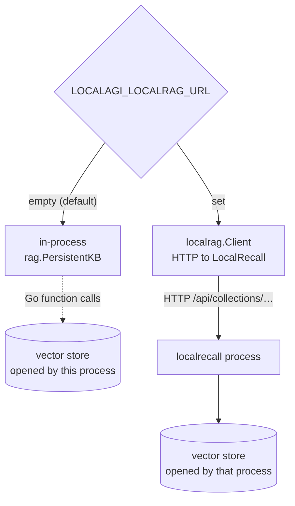

# LocalAGI ← LocalRecall

The only edge in this stack that is **not** necessarily a network call. In LocalAGI
v2.9.0's source, LocalAGI links LocalRecall as a Go library and calls it
in-process; setting one environment variable converts the same edge into HTTP
against a separate service.

This is the page that dissolves the "three services" picture, so it is worth
reading even if you never intend to run retrieval.

!!! danger "Which version you run changes this page entirely"
    Everything below about the **in-process** path applies to LocalAGI **v2.9.0
    source only**. It is not reachable from any published container image.

    | | v2.9.0 (source) | **v2.8.1 (the newest image)** |
    |---|---|---|
    | Imports `mudler/localrecall` | yes | **no — zero files, absent from `go.mod`** |
    | In-process retrieval | yes, **the default** | **does not exist** |
    | `/api/collections` routes | 11 routes | **none** — `Cannot GET /api/collections` |
    | `LOCALAGI_LOCALRAG_URL` | opt-in | **required for any knowledge at all** |

    So in every LocalAGI you can actually pull and run, **retrieval is always an
    HTTP call to a separate LocalRecall service**, and LocalAGI offers no way to
    create or inspect a collection. Manage collections against LocalRecall
    directly, or against LocalAI's `/api/agents/collections`.

    Verified 2026-08-17 against both source tags and the running v2.8.1 image. The
    HTTP path described here was executed end to end; the in-process path was not.
    See the [version matrix](../00-overview/version-matrix.md).

## Two implementations, one switch

`LOCALAGI_LOCALRAG_URL` decides. Empty, which is the default, means embedded.



The variable flips **two independent things**, in two different files, and it is
worth knowing they are separate because they can be reasoned about separately:

| What flips | Where | Effect |
|---|---|---|
| The agent's retrieval provider | `cmd/serve.go:113` | how the agent loop searches for knowledge |
| The collections **management** API backend | `webui/routes.go:219` | what `POST /api/collections` on LocalAGI does |

In the embedded case LocalAGI's own `/api/collections` routes operate on a store
it opened itself. In the HTTP case those same routes become a **proxy** to
LocalRecall. The API surface a client sees is identical either way — deliberately
so; LocalAGI reimplements LocalRecall's `{success, message, data, error}` envelope
and says so in a comment.

### What embedded actually means

Not "bundled", not "vendored copy" — LocalAGI imports
`github.com/mudler/localrecall/rag` and constructs a `*rag.PersistentKB`
directly. It is the same code that runs inside the standalone service, executing
in LocalAGI's process, opening the vector store from LocalAGI's filesystem or
database connection.

Consequences that matter operationally:

- **No LocalRecall container exists to inspect.** There is no port to curl, no log
  to read, no health check to fail. Retrieval problems appear only in LocalAGI's
  log.
- **The vector store is exclusively LocalAGI's.** With `chromem`, the store is a
  file under LocalAGI's state directory. Two LocalAGI replicas pointed at the same
  volume are two processes writing one file store — see
  [scaling](../07-deep-dives/scaling.md).
- **LocalRecall's version is decided by LocalAGI's `go.mod`**, not by you. You
  cannot upgrade the knowledge layer independently in this mode.
- **The embeddings edge still exists.** The embedded engine still POSTs to
  `/v1/embeddings` over the network. Embedding is never in-process.

That last point is the one people get wrong: making retrieval in-process removes
the retrieval hop, not the embedding hop.

## Configuration

Because LocalAGI links the library, it reads **LocalRecall's own environment
variables**, not renamed ones:

| Variable | Default in LocalAGI | Notes |
|---|---|---|
| `VECTOR_ENGINE` | `chromem` | `chromem`, `postgres`, or `localai` |
| `EMBEDDING_MODEL` | `granite-embedding-107m-multilingual` | **LocalAGI supplies a default; standalone LocalRecall does not** |
| `DATABASE_URL` | none | required when `VECTOR_ENGINE=postgres` |
| `COLLECTION_DB_PATH` | `<stateDir>/collections` | |
| `FILE_ASSETS` | `<stateDir>/assets` | |
| `MAX_CHUNKING_SIZE` | `400` | characters |
| `CHUNK_OVERLAP` | `0` | characters |

The `EMBEDDING_MODEL` row is a genuine behavioural difference between running the
knowledge layer inside LocalAGI and running it standalone. LocalAGI defaults it;
LocalRecall leaves it empty and fails on first use. Same library, different
robustness, depending on who started it.

Note also that LocalAGI resolves the two path variables **relative to its state
directory** if unset, whereas standalone LocalRecall resolves them relative to the
process working directory. The embedded case is the safer default; the standalone
case is how collections get written into a container's ephemeral layer.

### Switching to service mode

```yaml
services:
  localrecall:
    image: quay.io/mudler/localrecall:v0.6.4
    environment:
      - OPENAI_BASE_URL=http://localai:8080
      - EMBEDDING_MODEL=granite-embedding-107m-multilingual
      - COLLECTION_DB_PATH=/data/collections
      - FILE_ASSETS=/data/assets
      - LISTENING_ADDRESS=:8080
    volumes:
      - localrecall-data:/data

  localagi:
    image: quay.io/mudler/localagi:v2.8.1
    environment:
      - LOCALAGI_LLM_API_URL=http://localai:8080
      - LOCALAGI_MODEL=qwen3-1.7b
      - LOCALAGI_STATE_DIR=/pool
      - LOCALAGI_LOCALRAG_URL=http://localrecall:8080   # flips the edge
```

Note that `LOCALAGI_LOCALRAG_URL` takes the service root, **not** an
`/api/collections` path — the client appends the path itself. It also has a
per-agent override, `local_rag_url`, so individual agents can use a different
knowledge service than the pool default.

There is a trap in the credentials here. `NewHTTPRAGProvider` is constructed with
`env.LLMAPIKey` — the **model server's** API key — as its default token for
LocalRecall. If your LocalRecall uses `API_KEYS` and your LocalAI uses a different
key, the retrieval calls authenticate with the wrong one unless you set the
per-agent `local_rag_api_key`.

## Collection naming: the agent's name is the collection

An agent does not name its knowledge base. The provider derives the collection
name from the **agent name**, trimmed and lowercased:

```go
name := strings.TrimSpace(strings.ToLower(collectionName))
```

Three practical consequences:

- An agent called `Support-Bot` uses the collection `support-bot`.
- Two agents whose names differ only in case **share one collection**. That is
  either convenient or a data leak, depending on your intent.
- Renaming an agent orphans its knowledge. The old collection remains on disk,
  full, and unreachable by the renamed agent.

If the collection does not exist, the provider creates it on demand via
`EnsureCollection`. So an agent with knowledge enabled produces an empty
collection the first time it looks something up — an empty collection is normal
and not evidence of successful ingestion.

## What the model actually receives

Retrieved chunks are not passed as structured context. They are formatted into a
plain system message and **prepended to the front of the conversation**:

```text
Given the user input you have the following in memory:
- <chunk content> (map[created_at:2026-08-17T09:14:22Z])
- <chunk content> (map[created_at:2026-08-17T09:14:22Z])
```

Each line is `fmt.Sprintf("%s (%+v)", r.Content, r.Metadata)` — the content
followed by a Go-formatted metadata map. Worth internalising, for three reasons:

- **The prompt says "in memory", not "in the knowledge base".** The conflation of
  memory and knowledge that this handbook spends a whole
  [deep dive](../07-deep-dives/memory-vs-knowledge.md) untangling is baked into
  the prompt the model sees. The model cannot distinguish them because nothing
  tells it they are different.
- **Go map syntax reaches the model.** `map[created_at:…]` is what the model reads.
  It is noise in the context window, and it is why retrieved chunks sometimes get
  echoed back oddly in answers.
- **There is no relevance threshold.** The top *k* results are injected whatever
  their similarity scores. An irrelevant collection does not produce "no results";
  it produces confidently irrelevant context. `kb_results` (`KnowledgeBaseResults`)
  controls *k*, and lowering it is the main lever you have.

The query is the **latest user message**, verbatim — no rewriting, no
condensation, no history-aware reformulation. A follow-up like "and the second
one?" is embedded literally and retrieves accordingly.

## Retrieval is conditional on three flags

Auto-search runs only if all three are true, checked in order:

| Flag | Config field | If false |
|---|---|---|
| Knowledge base enabled | `enable_kb` | skipped, logged at debug |
| Auto-search enabled | `kb_auto_search` | skipped, logged at debug |
| A RAG provider exists | *(set at boot)* | skipped, logged at debug |

All three failures log at **debug level only**. With default logging, an agent
whose knowledge is silently disabled looks exactly like an agent with an empty
collection. This is the single most common "retrieval isn't working" cause, and
finding it requires `DEBUG=true` or the equivalent.

There is a fourth path: `kb_as_tools`, which exposes `search_memory` and
`add_memory` as tools the model may choose to call instead of retrieving
automatically. The two modes are independent, and with a small model, tool-based
retrieval fires less often than people expect.

## Writes: how agent memory becomes a document

When long-term memory is enabled, the agent writes conversation content back into
the same collection. The mechanism is worth seeing, because it explains the shape
of what you later retrieve:

1. The text is written to a temporary file named
   `<yyyy-mm-dd-HH-MM-SS>-<md5-of-content>.txt`.
2. That file is ingested through the ordinary `Store` path — chunked, embedded,
   written to the vector store.
3. The temporary directory is removed.

So **agent memory is not a separate subsystem.** It is a document in the same
collection the knowledge base uses, distinguishable only by its filename shape.
Reset a collection to clear stale knowledge and you delete the agent's memories
too; there is no separate scope. Full treatment in
[memory vs knowledge](../07-deep-dives/memory-vs-knowledge.md).

## Choosing embedded or service

| Choose embedded when | Choose the service when |
|---|---|
| One LocalAGI deployment | Several consumers share one knowledge base |
| Simplest possible operation | You want to scale or back up knowledge separately |
| You do not need to inspect retrieval independently | You need to curl and diagnose retrieval on its own |
| PostgreSQL is not required | You want hybrid search plus multiple readers |

In practice the choice is often made for you: **if you run a published LocalAGI
image, you get the service, because the embedded path does not exist there.** Choose
embedded only when you are building v2.9.0 from source, or when the knowledge layer
is embedded inside LocalAI instead (Pattern A), where it genuinely is the default.

When you do have the choice, move to the service as soon as a second consumer
appears. That is the concrete trigger, not deployment size.

### The HTTP path, observed

Worth showing because it is the path you will actually run. An agent named
`kb-probe` with `enable_kb` and `kb_auto_search` was asked about a fact that
existed only in its collection. LocalAGI logged the hit:

```text
INFO [Knowledge Base Lookup] Last user message agent=kb-probe
     message="What heartbeat interval does the Zeppelin-7 telemetry bus use?"
INFO [Knowledge Base Lookup] Found similar strings in KB agent=kb-probe
     results="- The Zeppelin-7 telemetry bus uses a heartbeat interval of 4200
     milliseconds. … (map[created_at:2026-08-17T15:42:42Z file_name:kb-fact.txt
     source:e040fb16-…/kb-fact.txt title:e040fb16-…/kb-fact.txt type:file]) \n"
```

and LocalRecall's access log recorded the arriving request at the same instant,
which is what proves the boundary was crossed rather than inferred:

```text
{"time":"2026-08-17T15:42:53.705Z","remote_ip":"172.18.0.5",
 "method":"POST","uri":"/api/collections/kb-probe/search",
 "user_agent":"Go-http-client/1.1","status":200,"latency_human":"37.190542ms"}
```

`172.18.0.5` is the LocalAGI container. Retrieval cost **37 ms** of a 2.27 s
request. Three things this confirms empirically rather than by reading code: the
collection is the lowercased agent name, the query is the user's message verbatim,
and the Go-formatted metadata map really does reach the model.

Observed 2026-08-17; LocalAGI v2.8.1, LocalRecall v0.6.4, PostgreSQL engine.

The [deployment patterns](deployment-patterns.md) page covers the migration and
what it costs.

## Verifying this edge in isolation

**Embedded.** There is nothing to reach over the network; use LocalAGI's own
collections API, which shares the backend the agent uses:

```bash
curl -s http://localhost:8081/api/collections | jq
```

```bash
curl -s -X POST http://localhost:8081/api/collections/<agent-name>/search \
  -H 'Content-Type: application/json' \
  -d '{"query":"a phrase you know is in the collection","max_results":3}'
```

Use the **lowercased agent name** as the collection. If this returns chunks but
the agent behaves as if it has no knowledge, the edge is fine and the problem is
one of the three flags above.

**Service mode.** Verify LocalRecall directly first, then from inside LocalAGI:

```bash
curl -s http://localhost:8082/api/collections | jq
```

```bash
docker exec localagi wget -qO- http://localrecall:8080/api/collections
```

If the second fails, it is networking or the API key, not retrieval.

## Upstream references

- [LocalAGI `cmd/serve.go`](https://github.com/mudler/LocalAGI/blob/v2.9.0/cmd/serve.go) — provider fork at 113-120; state-dir-relative collection paths at 48-53. Validated against v2.9.0.
- [LocalAGI `webui/routes.go`](https://github.com/mudler/LocalAGI/blob/v2.9.0/webui/routes.go) — collections backend fork at 217-227.
- [LocalAGI `webui/collections/rag_provider.go`](https://github.com/mudler/LocalAGI/blob/v2.9.0/webui/collections/rag_provider.go) — name lowercasing at 160, `EnsureCollection` at 169-180, `Search` result formatting at 64-80, memory write-as-file at 29-52.
- [LocalAGI `core/agent/knowledgebase.go`](https://github.com/mudler/LocalAGI/blob/v2.9.0/core/agent/knowledgebase.go) — the three debug-level guards at 19-31, latest-user-message query at 44, system message wording at 94-101.
- [LocalAGI `core/state/pool.go`](https://github.com/mudler/LocalAGI/blob/v2.9.0/core/state/pool.go) — `NewHTTPRAGProvider` and its use of the LLM API key at 36-49.
- [LocalAGI `cmd/env.go`](https://github.com/mudler/LocalAGI/blob/v2.9.0/cmd/env.go) — LocalRecall variables read by LocalAGI, and the `granite-embedding-107m-multilingual` default at 88-90.
- [LocalAGI `pkg/localrag`](https://github.com/mudler/LocalAGI/blob/v2.9.0/pkg/localrag) — the HTTP client and the paths it constructs.
- [LocalRecall `rag/persistency.go`](https://github.com/mudler/LocalRecall/blob/v0.6.4/rag/persistency.go) — `PersistentKB`, the type LocalAGI constructs directly. Validated against v0.6.4.
