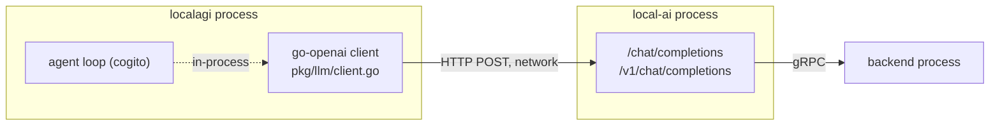

# LocalAI ← LocalAGI

The agent runtime reaching the model runtime. This is the one integration edge no
agent can do without, and it is deliberately thin: LocalAGI holds a base URL, a
model name, an API key and a timeout. Nothing else.

## The contract



Three properties follow from the thinness:

- **It is a standard OpenAI client.** `github.com/sashabaranov/go-openai`, no
  LocalAI-specific code on the wire. Anything OpenAI-compatible works.
- **It is stateless.** No session, no handshake, no capability negotiation.
  LocalAGI discovers nothing about the model server at startup — including whether
  it is reachable.
- **The direction is fixed.** LocalAI never initiates a call to LocalAGI.

## Configuration

Standalone LocalAGI, the four variables that matter:

| Variable | Required | Default | Meaning |
|---|---|---|---|
| `LOCALAGI_LLM_API_URL` | **yes** | none | base URL of the OpenAI-compatible server |
| `LOCALAGI_MODEL` | **yes** | none | model name sent in every request |
| `LOCALAGI_LLM_API_KEY` | no | `sk-xxx` | bearer token |
| `LOCALAGI_TIMEOUT` | no | `5m` | client HTTP timeout |

Both required variables are actually enforced: `serve` prints help and exits if
either is empty. That is worth contrasting with LocalRecall, which has the same
pattern of configuration and **no** validation — see
[localai-localrecall](localai-localrecall.md).

A minimal working pair:

```bash
docker run -d --name local-ai -p 8080:8080 \
  -v localai-models:/models -v localai-backends:/backends \
  localai/localai:v4.8.2 qwen3-1.7b granite-embedding-107m-multilingual

docker run -d --name localagi -p 8081:3000 \
  -e LOCALAGI_LLM_API_URL=http://host.docker.internal:8080 \
  -e LOCALAGI_MODEL=qwen3-1.7b \
  -e LOCALAGI_STATE_DIR=/pool \
  -v localagi-pool:/pool \
  quay.io/mudler/localagi:v2.8.1
```

Two details in that command that are not obvious:

**LocalAGI listens on port 3000, not 8080.** The listen address is hardcoded —
`log.Fatal(app.Listen(":3000"))`. There is no environment variable to change it;
remap it at the container or the proxy.

**The image tag is `v2.8.1`, not `v2.9.0`.** `quay.io/mudler/localagi:v2.9.0` does
not exist — the image build has been failing since 2026-04-15 while the
`localagi-sshbox` image of the same version published successfully. See the
[version matrix](../00-overview/version-matrix.md).

### Per-agent override

The pool-level URL and model are defaults. An agent's own config can override
them:

```json
{
  "name": "researcher",
  "model": "qwen3-4b",
  "api_url": "http://other-inference:8080",
  "api_key": "sk-something"
}
```

This is what makes "one agent per model" possible in a single LocalAGI, including
mixing a local model with a hosted one. It also means a misconfigured agent fails
while its neighbours work — check the agent config, not just the environment.

## The `/v1` trap

The single most common failure on this edge.

cogito builds its request URL by concatenating the configured base with
`/chat/completions`. **It never inserts a version segment.** So a base URL of
`http://server:8080` produces `http://server:8080/chat/completions`.

Against LocalAI that works, because LocalAI registers un-prefixed aliases
alongside its `/v1` routes. Against a server that only serves `/v1/...` — vLLM,
llama.cpp's server, OpenAI itself — it 404s.

| Target server | Base URL to configure |
|---|---|
| LocalAI | `http://host:8080` **or** `http://host:8080/v1` — both work |
| vLLM, OpenAI, most others | `http://host:port/v1` — the `/v1` is **mandatory** |

LocalAGI's own shipped compose file uses the bare form
(`LOCALAGI_LLM_API_URL=http://localai:8080`), which is why copying it and swapping
in a different inference server produces an agent that fails every call with a
404 on a path you never wrote.

Symptom to recognise: agent requests fail immediately — not slowly — and the
inference server's access log shows `POST /chat/completions 404`.

## Timeouts, and why agents need long ones

`LOCALAGI_TIMEOUT` is parsed into the HTTP client's total timeout, defaulting to
`5m`. If the value fails to parse the code falls back to **150 seconds**, which is
shorter than the documented default — so a typo silently halves your budget
rather than erroring.

The timeout applies to **each individual model call**, not to the agent request.
An agent request is a loop, so wall-clock time for one client request can be a
multiple of it:

```text
client timeout   >=  iterations x model call time  +  tool execution time
```

This is the mechanism behind the most-reported "agent never returns" symptom.
Three timeouts must be ordered correctly and usually are not:

| Timeout | Typical default | Must be |
|---|---|---|
| your client / curl | none, or 30 s | longest |
| reverse proxy / ingress | 60 s | longer than the agent's worst case |
| `LOCALAGI_TIMEOUT` | 5 m | per-call, shortest of the three |

An ingress with a 60-second read timeout in front of an agent that legitimately
takes two minutes produces a 504 to the client while the agent runs to completion
and writes its side effects. See
[troubleshooting](../02-localagi/troubleshooting.md).

## Authentication

Both sides support bearer tokens, and they are configured independently:

| Side | Variable | Effect |
|---|---|---|
| LocalAI | `LOCALAI_API_KEY` | required on inbound requests |
| LocalAGI, as a client | `LOCALAGI_LLM_API_KEY` | sent to LocalAI |
| LocalAGI, as a server | `LOCALAGI_API_KEYS` | required on inbound requests |

If you set `LOCALAI_API_KEY` and forget `LOCALAGI_LLM_API_KEY`, every agent call
gets a 401 from LocalAI while LocalAGI's own API keeps working — the agent appears
broken but the platform appears healthy.

When `LOCALAGI_LLM_API_KEY` is unset the client sends the literal string
`sk-xxx`. That is a placeholder, not an absence: LocalAI with no key configured
ignores it, and LocalAI with a key configured rejects it. Either way you will not
see "no credentials supplied" in a log — you will see a rejected token.

## What LocalAGI needs from the model

The edge is protocol-compatible with any OpenAI server, but the *agent* has
requirements the protocol does not express:

| Requirement | Why | If missing |
|---|---|---|
| Tool/function calling | tools are how an agent acts | agent can only converse |
| Reasonable instruction following | the loop depends on structured replies | loops, repeated tool calls |
| Adequate context window | history + retrieved chunks + tool results | truncation, or backend errors |

cogito compensates for weak models rather than assuming strong ones. With forced
reasoning enabled it never hands the model a free-form tool list: it asks for
schema-validated reasoning, then asks the model to pick a name from a JSON-schema
`enum` of real tools, then generates arguments in a third scoped call. A
hallucinated tool name is impossible by construction.

That is why a 1.7B model can drive tools here when it cannot elsewhere, and it is
also why one agent iteration can be **three or more** Chat Completions requests
rather than one. Budget accordingly; the [scaling](../07-deep-dives/scaling.md)
page works through the arithmetic.

## Verifying this edge in isolation

Never debug the agent before proving the edge. In order:

```bash
curl -s http://<localai-host>:8080/readyz
```

```bash
curl -s http://<localai-host>:8080/v1/models | jq '.data[].id'
```

The model named in `LOCALAGI_MODEL` must appear in that list, spelled identically.

```bash
curl -s http://<localai-host>:8080/v1/chat/completions \
  -H 'Content-Type: application/json' \
  -d '{"model":"<LOCALAGI_MODEL>","messages":[{"role":"user","content":"hi"}]}'
```

Then the same call **from inside the LocalAGI container**, which is where DNS and
network policy actually apply:

```bash
docker exec localagi wget -qO- \
  http://<localai-host>:8080/v1/models
```

If that last command fails and the previous one succeeded, the problem is
container networking, not the stack. On Docker Desktop, `localhost` inside the
LocalAGI container is not your host — use `host.docker.internal`, or put both
containers on one Compose network and use the service name.

## Upstream references

- [LocalAGI `pkg/llm/client.go`](https://github.com/mudler/LocalAGI/blob/v2.9.0/pkg/llm/client.go) — client construction, `sk-xxx` fallback, 150 s timeout fallback. Validated against v2.9.0.
- [LocalAGI `cmd/serve.go`](https://github.com/mudler/LocalAGI/blob/v2.9.0/cmd/serve.go) — required-variable validation and the hardcoded `:3000` listener.
- [LocalAGI `cmd/env.go`](https://github.com/mudler/LocalAGI/blob/v2.9.0/cmd/env.go) — environment variable names and defaults.
- [LocalAGI `core/state/config.go`](https://github.com/mudler/LocalAGI/blob/v2.9.0/core/state/config.go) — per-agent `api_url`, `api_key`, `model` overrides.
- [LocalAGI `docker-compose.yaml`](https://github.com/mudler/LocalAGI/blob/v2.9.0/docker-compose.yaml) — the bare base URL and the `8080:3000` port mapping.
- [LocalAI `core/http/routes/openai.go`](https://github.com/mudler/LocalAI/blob/v4.8.2/core/http/routes/openai.go) — un-prefixed route aliases that make the bare base URL work.
- Image tag availability: observed 2026-08-17, see [version matrix](../00-overview/version-matrix.md).
