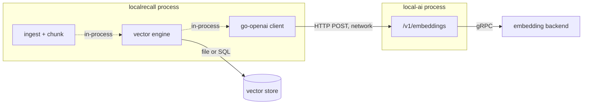
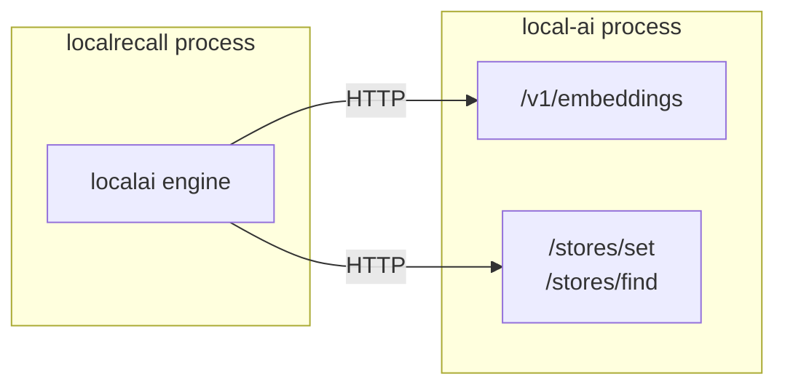

# LocalAI ← LocalRecall

The knowledge layer reaching the model runtime. LocalRecall computes no embeddings
itself, so this edge is not optional: without it, a collection cannot be written
to or queried at all.

There are actually **two** distinct edges between these projects, and conflating
them causes real confusion:

| Edge | What LocalAI provides | When it exists |
|---|---|---|
| Embeddings | `POST /v1/embeddings` | always |
| Vector storage | `POST /stores/*` | only when `VECTOR_ENGINE=localai` |

The first is the architecture. The second is one of three storage options, and the
least complete of them.

## Edge 1 — embeddings



As with [LocalAGI's edge](localai-localagi.md), this is a plain
`github.com/sashabaranov/go-openai` client. LocalRecall does not know or care that
the endpoint is LocalAI.

### Configuration

| Variable | Required | Default | Meaning |
|---|---|---|---|
| `OPENAI_BASE_URL` | **effectively yes** | *(none — and this breaks)* | base URL of the embeddings server |
| `EMBEDDING_MODEL` | **yes** | *(none — and this breaks)* | embedding model name |
| `OPENAI_API_KEY` | no | empty | bearer token |

Neither required variable is validated at startup. Both failure modes are quiet
and both are worth recognising:

**`OPENAI_BASE_URL` unset.** `main.go` assigns `config.BaseURL = openAIBaseURL`
unconditionally, *after* `openai.DefaultConfig` has already set the real OpenAI
URL. An empty value therefore does not fall back to a default — it overwrites the
default with nothing, and every embedding request goes to a bare relative
`/embeddings`. The process starts happily; the first ingestion fails.

**`EMBEDDING_MODEL` unset.** There is no default. An empty model name goes on the
wire and LocalAI rejects it.

The full treatment, including which call sites are affected, is in
[LocalRecall embeddings](../03-localrecall/embeddings.md).

### The `/v1` question, answered differently here

Unlike cogito, LocalRecall's client is the standard go-openai client, which
appends the OpenAI path itself. Set the base URL **without** `/v1`:

| Target | `OPENAI_BASE_URL` |
|---|---|
| LocalAI | `http://localai:8080` |
| Any OpenAI-compatible server | `http://host:port` |

So the two edges in this stack want the base URL written differently, for
different reasons. Against LocalAI both happen to work, which is exactly why the
inconsistency stays hidden until you substitute another server. Keep the
[api-flow `/v1` trap](api-flow.md#the-v1-trap) in mind whenever you change either
one.

### The dimension coupling

This is the most consequential property of the edge, and it is not enforced
anywhere.

A vector's dimension is a property of the embedding model. Every vector in a
collection must come from the same model, because similarity between vectors from
different models is meaningless even when the dimensions happen to match.

Measured on the reference model used throughout this handbook
(`granite-embedding-107m-multilingual`): **384 dimensions, L2-normalized**, so
cosine similarity is a plain dot product.

What happens if you change `EMBEDDING_MODEL` against an existing collection
depends on the engine, and neither outcome is good:

| Situation | Result |
|---|---|
| New model, different dimension | writes fail on dimension mismatch |
| New model, same dimension | writes succeed and **retrieval silently degrades** |

The second is the dangerous one: no error, no warning, just worse answers. Treat
`EMBEDDING_MODEL` as part of the collection's identity. Changing it means
re-ingesting, not migrating — see
[changing the embedding model](../03-localrecall/embeddings.md#changing-the-embedding-model).

### Cost per operation

Each edge crossing is one HTTP request plus one gRPC call inside LocalAI:

| Operation | Embedding calls |
|---|---|
| Ingest a document | one per chunk |
| Search a collection | exactly one, for the query |

Ingestion is therefore the expensive side, and it is the side people benchmark
last. A 400-character chunk size against a moderately sized manual is thousands
of embedding calls. Whether they are batched depends on the engine — see
[batching differs by engine](../03-localrecall/embeddings.md#batching-differs-by-engine).

Observed for the reference model: cold call **3.34 s** including model load, warm
calls **0.06–0.09 s**. Model load happens once; plan ingestion around the warm
figure and the count of chunks.

## Edge 2 — LocalAI as the vector store

`VECTOR_ENGINE=localai` selects a third mode in which LocalAI holds the vectors
too, through its `/stores/*` API. LocalRecall talks to it with a small
hand-written HTTP client whose first line calls itself a duplicate of LocalAI's
own store client.

In this configuration LocalAI is both the embedder and the database:



Attractive on paper — one fewer stateful component — but several methods on this
engine return `not implemented`, including `Reset`, `Count` and
`GetEmbeddingDimensions`. Operations the other engines support therefore fail
here.

Do not choose it for new work. `chromem` for a single node, PostgreSQL when you
need hybrid search or shared access. The comparison table is in
[storage](../03-localrecall/storage.md#the-localai-engine).

## Why PostgreSQL earns its place

Worth stating here because it is the one dependency this handbook's reference
Compose environment adds beyond the three projects.

Hybrid search — combining vector similarity with BM25 lexical scoring — is
implemented **only** in the PostgreSQL engine, and requires the `pg_textsearch`
extension for BM25 indexing. Weights are tunable:

| Variable | Default |
|---|---|
| `HYBRID_SEARCH_VECTOR_WEIGHT` | 0.5 |
| `HYBRID_SEARCH_BM25_WEIGHT` | 0.5 |
| `BM25_TEXT_CONFIG` | `english` |

So the choice is not "PostgreSQL because production needs a database". It is:
**pure vector search on a file, or vector plus lexical search on PostgreSQL.**
Queries containing exact identifiers — error codes, function names, product
SKUs — are where the difference shows, because embeddings are poor at exact-token
matching and BM25 is good at it.

## Verifying this edge in isolation

Prove embeddings work before blaming retrieval.

```bash
curl -s http://<localai-host>:8080/v1/embeddings \
  -H 'Content-Type: application/json' \
  -d '{"model":"granite-embedding-107m-multilingual","input":"test"}' \
  | jq '.data[0].embedding | length'
```

Expected: `384`. If this returns an error, no collection will work and the problem
is not in LocalRecall.

Then from inside the LocalRecall container, which is where its DNS applies:

```bash
docker exec localrecall wget -qO- \
  --header='Content-Type: application/json' \
  --post-data='{"model":"granite-embedding-107m-multilingual","input":"test"}' \
  http://<localai-host>:8080/v1/embeddings
```

Then confirm the collection layer, which exercises the edge end to end:

```bash
curl -s -X POST http://localhost:8081/api/collections \
  -H 'Content-Type: application/json' -d '{"name":"probe"}'
```

A `502` with `"Vector backend unavailable"` here means collection creation reached
the embedding call and it failed — the edge is broken, not the API. That
distinction is deliberate in the code: an earlier version called `os.Exit` on this
path and crash-looped the server during transient embedding outages.

There is **no health endpoint** on LocalRecall. `GET /api/collections` is the
closest thing, and it answers from disk without touching the embedding server, so
a `200` from it proves the process is up and proves nothing about this edge.

## Upstream references

- [LocalRecall `main.go`](https://github.com/mudler/LocalRecall/blob/v0.6.4/main.go) — unconditional `config.BaseURL` assignment at 60-63; `EMBEDDING_MODEL` with no default at 17; engine default `chromem` at 47-49. Validated against v0.6.4.
- [LocalRecall `routes.go`](https://github.com/mudler/LocalRecall/blob/v0.6.4/routes.go) — `newVectorEngine` and the deliberate 502 on backend failure at 87-116 and 207-212; the comment recording the earlier `os.Exit` behaviour.
- [LocalRecall `rag/engine/localai.go`](https://github.com/mudler/LocalRecall/blob/v0.6.4/rag/engine/localai.go) — the `not implemented` methods, and `Store` embedding one chunk per call.
- [LocalRecall `rag/engine/localai/client.go`](https://github.com/mudler/LocalRecall/blob/v0.6.4/rag/engine/localai/client.go) — the vendored `stores/*` client and its self-describing TODO.
- [LocalRecall `rag/engine/postgres.go`](https://github.com/mudler/LocalRecall/blob/v0.6.4/rag/engine/postgres.go) — hybrid search weights at 63-94, `pg_textsearch` requirement at 215-218, BM25 index at 290-293.
- Embedding dimensions, normalization and latency: observed 2026-08-17, see [version matrix](../00-overview/version-matrix.md).
