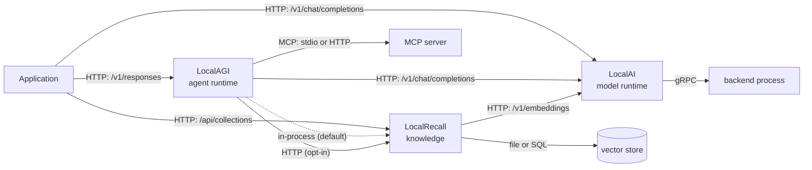
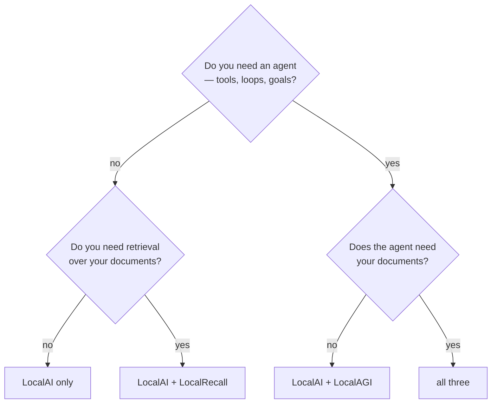

# Integration overview

Three projects, but only a handful of integration edges actually exist. This page
enumerates all of them, states the transport and the direction, and points at the
page that covers each in detail.

Read [logical vs physical](../00-overview/logical-vs-physical.md) first if you
have not. This page assumes you accept that "LocalAGI" may be a library inside
another process rather than a service.

## Every integration edge



Five things this diagram is meant to settle:

- **LocalAI never calls LocalAGI or LocalRecall.** Every arrow into LocalAI is
  inbound. It is a leaf in this graph — which is why it is the layer you verify
  first when something breaks.
- **LocalAGI → LocalRecall has two implementations**, one in-process and one over
  HTTP, selected by a single environment variable. They are not equally
  well-tested paths.
- **LocalRecall → LocalAI is embeddings only.** LocalRecall never asks for a
  completion. It has no notion of a chat model.
- **There is no LocalRecall → LocalAGI edge.** Retrieval is always pulled by the
  agent, never pushed by the knowledge layer.
- **MCP hangs off the agent runtime**, not off the model runtime — with one
  exception noted below.

## The edges in detail

| Edge | Transport | Direction | Required? | Page |
|---|---|---|---|---|
| LocalAGI → LocalAI | HTTP, OpenAI Chat Completions | one-way | yes, for any agent | [localai-localagi](localai-localagi.md) |
| LocalRecall → LocalAI | HTTP, OpenAI Embeddings | one-way | yes, for any collection | [localai-localrecall](localai-localrecall.md) |
| LocalAGI → LocalRecall | in-process Go calls **or** HTTP | one-way | only if the agent uses knowledge | [localagi-localrecall](localagi-localrecall.md) |
| LocalAGI → MCP server | MCP over stdio or HTTP | one-way, agent-initiated | no | [mcp](../02-localagi/mcp.md) |
| LocalAI → backend | gRPC over loopback TCP | one-way | always | [backends](../01-localai/backends.md) |
| LocalRecall → vector store | file I/O or PostgreSQL wire protocol | one-way | always | [storage](../03-localrecall/storage.md) |

### The MCP exception

LocalAI v4.8.2 also *hosts* an MCP server. A stock container logs:

```text
INFO LocalAI Assistant in-memory MCP server initialised tools=36 read_only=false
```

So MCP appears twice in this architecture, in opposite roles:

| Role | Who | What it means |
|---|---|---|
| MCP **client** | the agent runtime | the model can invoke external capabilities |
| MCP **server** | LocalAI itself | 36 administrative tools, **not read-only**, available to its built-in Assistant |

Two details worth getting right, because it is easy to overstate this:

- It is described as **in-memory**, and it backs LocalAI's own Assistant feature. We
  probed `/mcp`, `/api/mcp` and `/mcp/sse` on a stock container: **all three returned
  404**. There is no evidence it is reachable by an arbitrary external MCP client at a
  default path.
- `read_only=false` is still significant. The Assistant is a model-driven agent with 36
  writable tools over the model runtime it is running on. That is a real privilege
  surface even without external exposure.

These are unrelated features that share an acronym. Confusing them leads to real
security misconfiguration — see [security](../06-deployment/security.md).

## Substitutability

The edges are defined by protocol, not by implementation, and that determines
what you may replace.

| Component | Replaceable by | Why |
|---|---|---|
| LocalAI, as the agent's model server | any OpenAI-compatible Chat Completions server | LocalAGI holds a base URL and a model name, nothing more |
| LocalAI, as LocalRecall's embedder | any OpenAI-compatible Embeddings server | LocalRecall uses a standard OpenAI Go client |
| LocalRecall's vector store | chromem file, or PostgreSQL | selected by `VECTOR_ENGINE`; hybrid search needs PostgreSQL |
| LocalAGI, as the agent runtime | anything that can loop over Chat Completions | the protocol is standard; the persistence and connectors are not |
| **The backend under LocalAI** | llama.cpp, vLLM, MLX, whisper.cpp, … | this is LocalAI's core abstraction |

What is *not* substitutable: LocalRecall's collection format. The vectors in a
collection are only meaningful to the embedding model that produced them, so
changing the embedding model invalidates the collection rather than migrating it.

Note the asymmetry that follows from the table. You can run LocalAGI against a
hosted OpenAI endpoint and keep everything local except inference; you can run
LocalRecall against LocalAI and never touch agents; you can run LocalAI alone and
never touch either. The one thing you cannot do is run agents or knowledge with
*no* model server at all.

## The same API, three prefixes

The collections API exists in all three projects, because two of them link the
third as a library. The routes are deliberately shape-compatible and the prefix
differs:

| Operation | LocalRecall standalone | LocalAGI standalone | LocalAI integrated |
|---|---|---|---|
| list collections | `GET /api/collections` | `GET /api/collections` | `GET /api/agents/collections` |
| create collection | `POST /api/collections` | `POST /api/collections` | `POST /api/agents/collections` |
| upload a document | `POST /api/collections/:name/upload` | same | `POST /api/agents/collections/:name/upload` |
| search | `POST /api/collections/:name/search` | same | `POST /api/agents/collections/:name/search` |
| reset | `POST /api/collections/:name/reset` | same | `POST /api/agents/collections/:name/reset` |
| raw file | `GET /api/collections/:name/entries/:entry/raw` | *(not exposed)* | `GET /api/agents/collections/:name/entries-raw/*` |

The response envelope is identical in all three — LocalAGI reimplements
LocalRecall's `{success, message, data, error}` contract deliberately, and says
so in a comment. Practical consequence: **a client written against LocalRecall
works against all three if you make the prefix configurable.** That is the single
most useful thing to know when writing tooling for this stack.

Ports and full route tables are in the [API map](../08-reference/api-map.md) and
[ports](../08-reference/ports.md).

## Which integration do you actually need?



Every arm of that tree is a supported configuration, and each is a recipe:

| Answer | Recipe |
|---|---|
| LocalAI only | [Recipe 1](../05-recipes/localai-chat.md) |
| LocalAI + LocalRecall | [Recipe 3](../05-recipes/localrecall-rag.md) |
| LocalAI + LocalAGI | [Recipe 4](../05-recipes/simple-agent.md) |
| All three | [Recipe 6](../05-recipes/agent-with-knowledge.md) |

## What to read next

- [Data flow](data-flow.md) — where each piece of data comes from, goes, and
  persists.
- [API flow](api-flow.md) — step-by-step request traces with boundary
  annotations.
- [Deployment patterns](deployment-patterns.md) — the three physical shapes and
  what each costs.
- [Complete stack](complete-stack.md) — a concrete, working configuration of all
  three.

## Upstream references

- [LocalAI `core/http/routes/agents.go`](https://github.com/mudler/LocalAI/blob/v4.8.2/core/http/routes/agents.go) — the `/api/agents/collections` route group. Validated against v4.8.2.
- [LocalRecall `routes.go`](https://github.com/mudler/LocalRecall/blob/v0.6.4/routes.go) — the eleven `/api/collections` routes and the response envelope. Validated against v0.6.4.
- [LocalAGI `webui/collections_handlers.go`](https://github.com/mudler/LocalAGI/blob/v2.9.0/webui/collections_handlers.go) — LocalAGI's re-exposure of the same contract. Validated against v2.9.0.
- [LocalAGI `webui/routes.go`](https://github.com/mudler/LocalAGI/blob/v2.9.0/webui/routes.go) — in-process versus HTTP collections backend selection.
- MCP tool count and default writability: observed 2026-08-17, see [version matrix](../00-overview/version-matrix.md).
