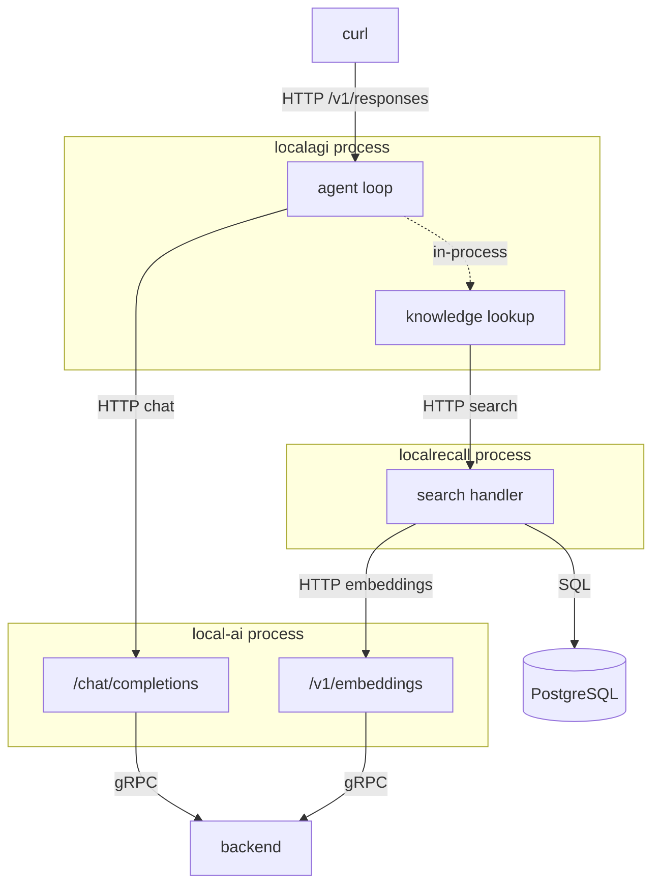
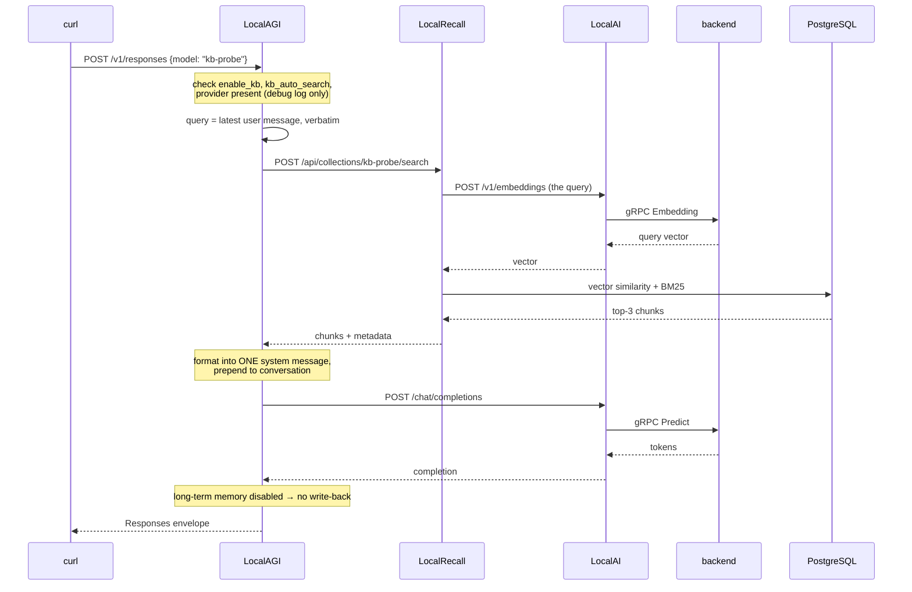

# Recipe 6 — An agent with knowledge

## Goal

Give the agent access to documents it did not see in training, and trace the retrieval
across every boundary. This is the recipe where all three projects run at once, and
where the architecture in the overview stops being a diagram.

## Architecture

```text
                     You
                      |
                 LocalAGI
                 /       \
                /         \
        /chat/completions  /api/collections/<agent>/search
              |                        |
           LocalAI  <---- /v1/embeddings ----+
              |                        |
           backend              PostgreSQL
```



Count the process boundaries on the retrieval path alone: LocalAGI → LocalRecall →
LocalAI → backend. Three, for one lookup.

## What you will learn

- the collection name is the **lowercased agent name**, and you do not choose it
- retrieval runs before the model is called, on the latest user message verbatim
- exactly what the retrieved text looks like in the model's context — including Go
  map syntax
- the three flags that silently disable retrieval, and why you cannot see them at
  default log level
- there is no relevance threshold anywhere

## Components

| Component | Role | Port |
|---|---|---|
| LocalAI | inference **and** embeddings | 8080 |
| LocalAGI | agent loop, retrieval trigger | 8081 → 3000 |
| LocalRecall | collection, chunking, search | 8082 |
| PostgreSQL | vectors and lexical index | internal |

## Prerequisites

- Recipes 3 and 4 completed. This recipe joins them; if either is shaky, fix it first
- The reference Compose environment running

## Versions tested

```yaml
tested:
  date: 2026-08-17
versions:
  localai: "v4.8.2"
  localagi: "v2.8.1 (image)"
  localrecall: "v0.6.4 + v0.6.4-postgresql"
environment:
  architecture: arm64 (Apple Silicon)
  host: macOS 26.5.1
  runtime: Docker Desktop 29.7.2
  vector_engine: postgres
  gpu: none
results:
  agent_retrieved_invented_fact: pass
  total_request: 2.27 s
  retrieval_hop: 37.19 ms
  boundary_crossing_confirmed: yes — LocalRecall access log
```

!!! important "On the published image, retrieval is always over HTTP"
    LocalAGI **v2.8.1** — the newest published image — does not import LocalRecall at
    all. There is no in-process knowledge layer, and no `/api/collections` routes:
    `GET /api/collections` on LocalAGI returns `Cannot GET /api/collections`.

    Two practical consequences for this recipe:

    - `LOCALAGI_LOCALRAG_URL` is **required**, not optional. Without it the agent has
      no knowledge at all.
    - You must create and populate the collection **against LocalRecall directly**, on
      port 8082. That is what the commands below do.

    The in-process variant exists in v2.9.0 source, which has no published image and
    was not exercised. See the
    [version matrix](../00-overview/version-matrix.md).

## Start the environment

```bash
cd compose
docker compose up -d
```

Confirm `LOCALAGI_LOCALRAG_URL` reached the process — without it nothing in this
recipe works:

```bash
docker exec localagi printenv LOCALAGI_LOCALRAG_URL
```

Expected: `http://localrecall:8080`.

## Verify each dependency

Five layers, strictly bottom-up.

**1. Inference.**

```bash
curl -s http://localhost:8080/v1/chat/completions \
  -H 'Content-Type: application/json' \
  -d '{"model":"qwen3-1.7b","messages":[{"role":"user","content":"hi"}],"max_tokens":8}' \
  | jq -r '.choices[0].message.content'
```

**2. Embeddings.**

```bash
curl -s http://localhost:8080/v1/embeddings \
  -H 'Content-Type: application/json' \
  -d '{"model":"granite-embedding-107m-multilingual","input":"probe"}' \
  | jq '.data[0].embedding | length'
```

Expected `384`.

**3. LocalRecall.**

```bash
curl -s http://localhost:8082/api/collections | jq '.data.collections'
```

**4. LocalAGI.**

```bash
curl -s http://localhost:8081/api/agents | jq '.agents'
```

**5. LocalAGI can reach LocalRecall.** The edge this recipe adds:

```bash
docker exec localagi curl -s http://localrecall:8080/api/collections | head -c 120
```

If step 3 worked and step 5 did not, it is networking or an API key — not retrieval.

## Configure the system

**Create the agent first.** The collection name is derived from the agent name, so
knowing the agent name tells you the collection name.

```bash
curl -s -X POST http://localhost:8081/api/agent/create \
  -H 'Content-Type: application/json' \
  -d '{
    "name": "kb-probe",
    "model": "qwen3-1.7b",
    "system_prompt": "Answer using only the provided context. Be terse.",
    "strip_thinking_tags": true,
    "enable_kb": true,
    "kb_auto_search": true,
    "kb_results": 3,
    "max_attempts": 1
  }' | jq
```

| Field | Effect |
|---|---|
| `enable_kb: true` | without this, retrieval is skipped and **only a debug log says so** |
| `kb_auto_search: true` | retrieve on every request. Without it, retrieval only happens if the model calls a memory tool |
| `kb_results: 3` | the top *k*. This is your only relevance lever |

**Then create the matching collection.** The name must be the agent name, lowercased:

```bash
curl -s -X POST http://localhost:8082/api/collections \
  -H 'Content-Type: application/json' -d '{"name":"kb-probe"}' | jq
```

An agent called `KB-Probe` would also use `kb-probe`. Two agents differing only in case
share one collection — convenient or a data leak, depending on intent.

**Ingest a fact the model cannot possibly know.** This is what makes the test
conclusive:

```bash
cat > /tmp/kb-fact.txt <<'EOF'
The Zeppelin-7 telemetry bus uses a heartbeat interval of 4200 milliseconds.
Operators must never set the Zeppelin-7 heartbeat below 900 milliseconds because
the flight controller drops frames at that rate.
EOF
```

```bash
curl -s -X POST http://localhost:8082/api/collections/kb-probe/upload \
  -F file=@/tmp/kb-fact.txt | jq
```

**Prove retrieval works before involving the agent:**

```bash
curl -s -X POST http://localhost:8082/api/collections/kb-probe/search \
  -H 'Content-Type: application/json' \
  -d '{"query":"Zeppelin-7 heartbeat interval","max_results":3}' | jq '.data.count'
```

Expected `1`. If this is `0`, stop — the agent cannot retrieve what LocalRecall cannot
find.

## Run the request

```bash
curl -s http://localhost:8081/v1/responses \
  -H 'Content-Type: application/json' \
  -d '{
    "model": "kb-probe",
    "input": "What heartbeat interval does the Zeppelin-7 telemetry bus use?"
  }' | jq -r '.output[0].content[0].text'
```

## Expected result

```text
The Zeppelin-7 telemetry bus uses a heartbeat interval of 4200 milliseconds.
```

Total **2.27 s**, of which retrieval was **37.19 ms**.

That answer is proof. "Zeppelin-7" was invented for this recipe; no model has it in its
weights. The only way that number reaches the reply is through the retrieval path.

Run the same question against `handbook-probe` from Recipe 4 — same model, no knowledge
— and it cannot answer. That comparison is the cleanest demonstration of what the
knowledge layer adds.

### What the model actually received

The retrieved chunk is not passed as structured context. It is formatted into a single
system message and **prepended to the front of the conversation**:

```text
Given the user input you have the following in memory:
- The Zeppelin-7 telemetry bus uses a heartbeat interval of 4200 milliseconds.
Operators must never set the Zeppelin-7 heartbeat below 900 milliseconds because
the flight controller drops frames at that rate. (map[created_at:2026-08-17T15:42:42Z
file_name:kb-fact.txt source:e040fb16-…/kb-fact.txt title:e040fb16-…/kb-fact.txt
type:file])
```

Three observations that explain a great deal of later confusion:

**The prompt says "in memory", not "in the knowledge base".** The conflation of memory
and knowledge that the [deep dive](../07-deep-dives/memory-vs-knowledge.md) spends a
page untangling is baked into the prompt the model reads. The model has no way to
distinguish the two, because nothing tells it they are different.

**Go map syntax reaches the model.** `map[created_at:… file_name:… type:file]` is
literally in the context window — the result of a `fmt.Sprintf("%s (%+v)")`. It is
noise, it consumes context, and it is why retrieved chunks sometimes get echoed back
oddly.

**There is no similarity score and no threshold.** The top *k* are injected whatever
their scores. Recall from [Recipe 2](localai-embeddings.md) that unrelated sentences
still score ~0.54 — so an irrelevant collection does not produce "no results", it
produces confidently irrelevant context. Lowering `kb_results` is your main defence.

Also note the query: the **latest user message, verbatim**. No rewriting, no
history-aware reformulation. A follow-up like "and the minimum?" is embedded literally
and retrieves accordingly — which is why multi-turn retrieval often degrades.

## What happened internally

1. `POST /v1/responses` arrives; the agent is resolved. *(inbound HTTP, then
   in-process)*
2. The three guards are checked in order: `enable_kb`, `kb_auto_search`, and whether a
   RAG provider exists. All pass. Each failure would log at **debug only**.
   *(in-process)*
3. The latest user message is extracted as the query. Logged:
   `[Knowledge Base Lookup] Last user message`. *(in-process)*
4. The provider issues `POST /api/collections/kb-probe/search` to LocalRecall.
   **(network HTTP)** — confirmed in LocalRecall's access log, from `172.18.0.5`,
   user-agent `Go-http-client/1.1`, latency **37.19 ms**.
5. LocalRecall embeds the query via `POST /v1/embeddings` on LocalAI. **(network
   HTTP)**
6. LocalAI runs the embedding model. *(gRPC)*
7. LocalRecall queries PostgreSQL — vector similarity combined with BM25. *(SQL)*
8. Chunks return to LocalAGI. Logged:
   `[Knowledge Base Lookup] Found similar strings in KB`. *(network HTTP)*
9. Results are formatted into one system message and prepended to the conversation.
   *(in-process)*
10. The loop calls `/chat/completions`. **(network HTTP)**
11. LocalAI calls the LLM backend. *(gRPC)*
12. The model answers in prose; no tools are configured, so the loop ends.
13. Long-term memory is disabled, so nothing is written back. Logged at debug:
    `Long term memory is disabled`. *(in-process)*
14. The envelope is returned. *(outbound HTTP)*

**Boundary count for one knowledge-using agent request: four network HTTP calls and
two gRPC calls.** Steps 4, 5, 8 and 10 are HTTP; 6 and 11 are gRPC.

Steps 2, 3, 8, 9 and 13 were confirmed from LocalAGI's log; step 4 from LocalRecall's
access log at the same timestamp; step 7's hybrid combination is source-verified but
its weights were not varied. *(step 7 behaviour inferred, not measured)*

## Request flow



## Persistent state

| What | Written by | Where | Survives restart |
|---|---|---|---|
| Agent definition, with `enable_kb` | LocalAGI | `/pool` JSON | yes |
| Original document | LocalRecall | `/data/assets/kb-probe/<uuid>/kb-fact.txt` | yes |
| Chunk text and vectors | LocalRecall | PostgreSQL | yes |
| The retrieved context | nobody | request only | no |
| Conversation history | `ConversationTracker` | memory, TTL'd | no |

The collection outlives the agent. Delete `kb-probe` the agent and the `kb-probe`
collection remains, fully populated. Recreate an agent with the same name and it
inherits that knowledge — surprising the first time, and a genuine consideration when
agent names are reused.

Conversely, **renaming an agent orphans its knowledge.** The old collection stays on
disk and the renamed agent looks at an empty new one.

## Logs worth inspecting

The single most useful command in this recipe:

```bash
docker logs localagi 2>&1 | grep -i 'knowledge base'
```

```text
INFO [Knowledge Base Lookup] Last user message agent=kb-probe message="What heartbeat…"
INFO [Knowledge Base Lookup] Found similar strings in KB agent=kb-probe results="- The Zeppelin-7…"
```

Both are INFO, so you see them by default. Their **absence** is the signal: it means one
of the three guards skipped retrieval, and those log at debug.

```bash
docker logs localrecall 2>&1 | grep 'collections/kb-probe/search' | tail -3
```

The other side of the boundary, with the real latency:

```text
{"time":"2026-08-17T15:42:53.705Z","remote_ip":"172.18.0.5","method":"POST",
 "uri":"/api/collections/kb-probe/search","user_agent":"Go-http-client/1.1",
 "status":200,"latency_human":"37.190542ms"}
```

`172.18.0.5` is the LocalAGI container. Matching these two timestamps is how you prove
the hop happened rather than assuming it.

```bash
docker logs localai 2>&1 | grep -c embeddings
```

Should increase by one per retrieval.

```bash
docker logs localagi 2>&1 | grep -i 'long term memory'
```

Confirms whether write-back is on.

## Failure modes

**The agent answers without the knowledge, and nothing looks wrong.**

- *Symptom:* a plausible generic answer; no `[Knowledge Base Lookup]` lines.
- *Cause:* one of the three guards. `enable_kb` false, `kb_auto_search` false, or no
  RAG provider — on v2.8.1 that means `LOCALAGI_LOCALRAG_URL` unset.
- *Check:*

    ```bash
    curl -s http://localhost:8081/api/agent/kb-probe/config | jq '{enable_kb, kb_auto_search, kb_results}'
    ```

    ```bash
    docker exec localagi printenv LOCALAGI_LOCALRAG_URL
    ```

    All three guards log at **debug**, so set `DEBUG=true` in `.env` and restart to see
    them.
- *Fix:* whichever is false. This is the most common failure in the whole handbook.

**`GET /api/collections` on port 8081 returns `Cannot GET /api/collections`.**

- *Cause:* not a fault. Those routes do not exist in LocalAGI v2.8.1.
- *Fix:* use LocalRecall on 8082.

**Direct search finds the chunk; the agent does not use it.**

- *Symptom:* step "prove retrieval works" passes, the agent still answers generically.
- *Cause:* the collection name does not match the lowercased agent name. Searching
  `handbook` while the agent looks in `kb-probe` is the classic version of this.
- *Check:* `curl -s http://localhost:8082/api/collections | jq '.data.collections'`
- *Fix:* name the collection exactly `<agent-name-lowercased>`.

**Retrieval returns irrelevant chunks and the answer is confidently wrong.**

- *Cause:* no relevance threshold. Top-*k* always returns *k*.
- *Fix:* lower `kb_results`; improve chunking; use hybrid search for identifier-like
  queries. Do not expect "I found nothing."

**Retrieval worked yesterday and returns nothing today.**

- *Cause:* `EMBEDDING_MODEL` changed. Old vectors are no longer comparable to new query
  vectors, and if the dimension also changed, writes fail outright.
- *Fix:* revert the model, or re-ingest everything. Vectors cannot be migrated between
  models.

**A follow-up question retrieves the wrong thing.**

- *Symptom:* the first question works, "and the minimum?" does not.
- *Cause:* the query is the latest user message verbatim — there is no history-aware
  rewriting.
- *Fix:* ask self-contained questions, or rewrite them in your client before sending.

## Troubleshooting

The full ladder. A failure at any rung invalidates everything above it.

1. **Inference:** `POST /v1/chat/completions` on 8080
2. **Embeddings:** `POST /v1/embeddings` on 8080 → 384
3. **Vector store:** `docker exec localai-postgres pg_isready -U localrecall`
4. **Knowledge service:** `GET /api/collections` on 8082
5. **The collection exists, named for the agent:** `.data.collections` contains
   `kb-probe`
6. **The document is in it:** `GET /api/collections/kb-probe/entries`
7. **Direct search finds it:** `POST /api/collections/kb-probe/search`
8. **LocalAGI can reach LocalRecall:** `docker exec localagi curl …`
9. **The agent's flags are on:** `GET /api/agent/kb-probe/config`
10. **The agent actually retrieved:** the `[Knowledge Base Lookup]` log lines
11. **The agent answered:** `we got a response from the agent`

Steps 1–7 are exactly what
[`verify-stack.sh`](https://github.com/wrkode/local-ai-stack-handbook/blob/main/scripts/verify-stack.sh)
automates. Steps 9 and 10 are the ones unique to this recipe, and where the answer
usually is.

## Cleanup

```bash
curl -s -X DELETE http://localhost:8081/api/agent/kb-probe | jq
```

```bash
curl -s -X POST http://localhost:8082/api/collections/kb-probe/reset | jq
```

Both are needed. Deleting the agent leaves the collection; resetting the collection
leaves the agent. Note that `reset` also removes the collection from LocalRecall's
in-memory registry, so it is nearer a delete than a truncate.

Everything, keeping models:

```bash
docker compose down
docker volume rm localai-stack_localagi-pool localai-stack_postgres-data localai-stack_localrecall-data
```

## Variations

**Prove the negative.** Ask `handbook-probe` from Recipe 4 the same question. Same
model, no knowledge, no answer. Do this once — it converts belief into evidence.

**Turn `kb_results` down to 1 and up to 10.** Watch the injected system message grow in
the `Found similar strings in KB` log line. With a small model and a large *k*, the
answer often gets *worse* as irrelevant chunks crowd the context.

**Turn retrieval into a tool instead.** Set `kb_as_tools: true` and `kb_auto_search:
false`. `search_memory` and `add_memory` become tools the model may choose to call.
With a 1.7B model it fires less often than you expect — a good illustration of why
automatic retrieval is the default.

**Enable long-term memory.** Set `long_term_memory: true` and watch the debug log stop
saying it is disabled. The agent then writes conversation content back into the **same
collection**, as a file named `<timestamp>-<md5>.txt`. Memory and knowledge are one
store; see [memory vs knowledge](../07-deep-dives/memory-vs-knowledge.md). Not
exercised in our run.

**Ingest something with more than one chunk.** A document over 400 characters produces
several chunks, and retrieval starts making genuine choices. Check `chunk_count` in
LocalRecall's log.

**Add the tool from Recipe 5** to this agent and you have Recipe 8.

## Upstream references

- [LocalAGI `core/agent/knowledgebase.go`](https://github.com/mudler/LocalAGI/blob/v2.9.0/core/agent/knowledgebase.go) — the three guards at 19-31; latest-user-message query at 44; the `"Given the user input you have the following in memory:"` system message at 94-101; conversation logging at 113-124. Validated against v2.9.0; log lines observed on v2.8.1 at `knowledgebase.go:46` and `:85`.
- [LocalAGI `webui/collections/rag_provider.go`](https://github.com/mudler/LocalAGI/blob/v2.9.0/webui/collections/rag_provider.go) — collection-name lowercasing at 160; `fmt.Sprintf("%s (%+v)")` result formatting at 64-80; memory write-back as a timestamped hashed file at 29-52.
- [LocalAGI `core/state/pool.go`](https://github.com/mudler/LocalAGI/blob/v2.9.0/core/state/pool.go) — `NewHTTPRAGProvider` and its API-key default at 36-49.
- [LocalAGI `pkg/localrag`](https://github.com/mudler/LocalAGI/tree/v2.9.0/pkg/localrag) — the HTTP client and the `/api/collections/<name>/search` path it builds.
- [LocalAGI `core/state/config.go`](https://github.com/mudler/LocalAGI/blob/v2.9.0/core/state/config.go) — `enable_kb`, `kb_auto_search`, `kb_results`, `kb_as_tools`, `long_term_memory`.
- [LocalRecall `routes.go`](https://github.com/mudler/LocalRecall/blob/v0.6.4/routes.go) — the search handler and its `max_results` default at 279-318.
- [LocalRecall `rag/engine/postgres.go`](https://github.com/mudler/LocalRecall/blob/v0.6.4/rag/engine/postgres.go) — hybrid vector + BM25 scoring.
- LocalAGI v2.8.1 having no `localrecall` dependency and no `/api/collections` routes; the retrieval trace, both log excerpts, latencies and the answered invented fact: observed 2026-08-17, see [version matrix](../00-overview/version-matrix.md).
