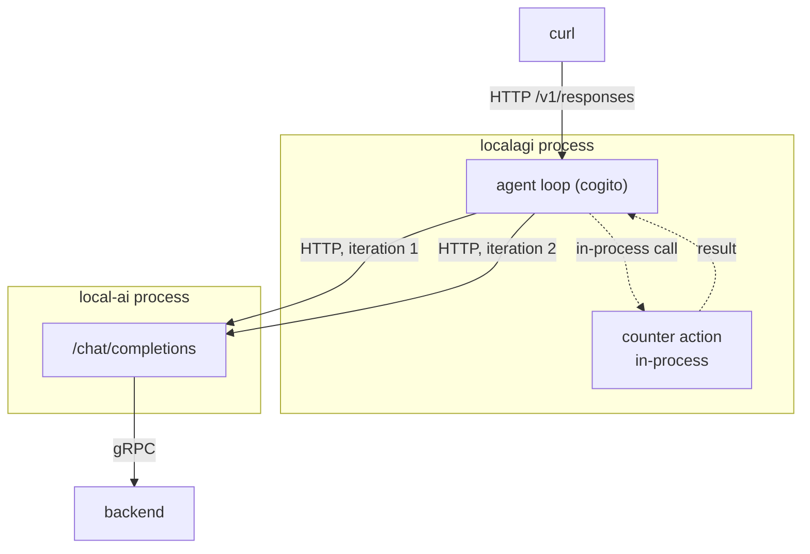
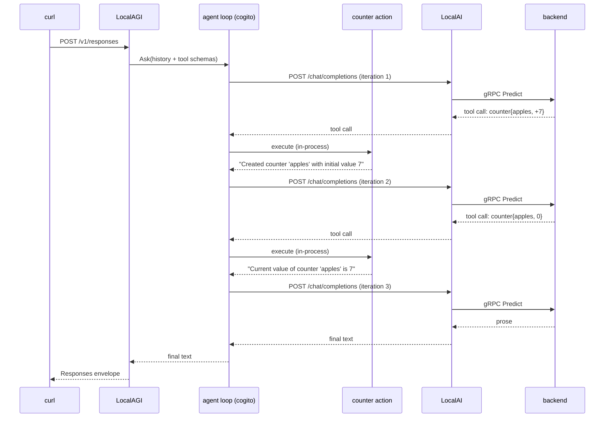

# Recipe 5 — An agent with a tool

## Goal

Give the agent one tool, watch it decide to use it, and see the loop iterate. This is
the recipe where "agent" stops being a synonym for "chatbot".

## Architecture

```text
  You
   |
 LocalAGI  ----- built-in action (in-process) -----> counter
   |
   | HTTP  /chat/completions   (once per iteration)
   v
 LocalAI
```



Two arrows to LocalAI, from one client request. That is the whole idea.

## What you will learn

- built-in actions execute **in-process** and are not MCP
- one agent request becomes several model calls, and the cost is real
- how to inspect which tools ran, with what arguments and what result
- how to run a tool by hand, independently of any agent
- that a correct tool result can still be reported incorrectly by a small model

## Components

| Component | Role | Port |
|---|---|---|
| LocalAI | inference | 8080 |
| LocalAGI | agent loop, action dispatch | 8081 → 3000 |
| `counter` | the tool — a built-in action, no external dependencies | in-process |

`counter` is chosen deliberately: it needs no credentials, no network and no external
service, so a failure is unambiguously the agent's. Recipe 7 introduces a tool that
lives outside the process.

## Prerequisites

- Recipe 4 completed and understood
- The reference Compose environment running

## Versions tested

```yaml
tested:
  date: 2026-08-17
versions:
  localai: "v4.8.2"
  localagi: "v2.8.1 (image)"
  localrecall: "running but unused in this recipe"
environment:
  architecture: arm64 (Apple Silicon)
  host: macOS 26.5.1
  runtime: Docker Desktop 29.7.2
  gpu: none
results:
  direct_action_run: pass
  agent_invokes_tool: pass — two tool calls, 38.7 s
  model_narration_of_result: WRONG — see "Expected result"
```

## Start the environment

```bash
cd compose
docker compose up -d
```

## Verify each dependency

**1. Inference works.** As always, bottom up.

```bash
curl -s http://localhost:8080/v1/chat/completions \
  -H 'Content-Type: application/json' \
  -d '{"model":"qwen3-1.7b","messages":[{"role":"user","content":"hi"}],"max_tokens":8}' \
  | jq -r '.choices[0].message.content'
```

**2. LocalAGI is up and reports its action inventory.**

```bash
curl -s http://localhost:8081/api/actions | jq -r '. | length'
```

Expected: `40`.

**3. The tool exists and you know its schema.** Do this before wiring it to an agent —
if you cannot describe the tool, you cannot debug the agent's use of it.

```bash
curl -s -X POST http://localhost:8081/api/action/counter/definition \
  -H 'Content-Type: application/json' -d '{}' | jq
```

```json
{"Name":"counter",
 "Description":"Create, update, or query named counters. Specify a name and an adjustment value (positive to increase, negative to decrease, zero to query).",
 "Required":["name","adjustment"],
 "Properties":{
   "name":{"type":"string","description":"The name of the counter to create, update, or query."},
   "adjustment":{"type":"integer","description":"The value to adjust the counter by. Positive to increase, negative to decrease, zero to query the current value."}}}
```

This JSON schema is exactly what the model is shown. When an agent misuses a tool, the
description is usually the reason.

**4. The tool works without an agent.** This isolates the tool from the model:

```bash
curl -s -X POST http://localhost:8081/api/action/counter/run \
  -H 'Content-Type: application/json' \
  -d '{"config":{},"params":{"name":"widgets","adjustment":3}}' | jq
```

```json
{"Job":null,"Result":"Created counter 'widgets' with initial value 3",
 "ImageBase64Result":"",
 "Metadata":{"adjustment":3,"counter_name":"widgets","counter_value":3,"is_new":true}}
```

Omitting the parameters returns `{"error":"counter name cannot be empty"}` — worth
seeing, so you recognise a validation error as distinct from a dispatch failure.

!!! note "A direct run does not share state with the agent's runs"
    Observed: after the agent created a counter named `apples` with value 7, a direct
    `POST /api/action/counter/run` for `apples` reported
    `Created counter 'apples' with initial value 0`. The two invocation paths see
    different counter state. Useful for probing whether a tool *works*; not useful for
    inspecting what the agent *did* — use the status endpoint for that. The exact
    scoping mechanism was **not traced**.

## Configure the system

Create an agent with the tool attached:

```bash
curl -s -X POST http://localhost:8081/api/agent/create \
  -H 'Content-Type: application/json' \
  -d '{
    "name": "tool-probe",
    "model": "qwen3-1.7b",
    "system_prompt": "You use tools when asked. Be terse.",
    "strip_thinking_tags": true,
    "actions": [{"name":"counter","config":"{}"}],
    "max_attempts": 1
  }' | jq
```

Note the shape of `actions`: a list of `{name, config}`, where `config` is a **JSON
string**, not an object. An empty `{}` is correct for a tool that needs no
configuration. Getting this wrong is a common cause of an agent that silently has no
tools.

## Run the request

Ask for something that requires two steps — change the counter, then report it:

```bash
curl -s http://localhost:8081/v1/responses \
  -H 'Content-Type: application/json' \
  -d '{
    "model": "tool-probe",
    "input": "Increase the counter named apples by 7, then tell me its value."
  }' | jq -r '.output[0].content[0].text'
```

Then inspect what actually ran — this is the important command of the recipe:

```bash
curl -s http://localhost:8081/api/agent/tool-probe/status | jq -r '.History[]'
```

## Expected result

The reply, observed:

```text
The counter 'apples' was increased by 7 to 14. Its current value is 14.
```

And the history, newest first:

```text
Reasoning:
			Action taken: counter
			Parameters: {"adjustment":0,"name":"apples"}
			Result: Current value of counter 'apples' is 7
Reasoning:
			Action taken: counter
			Parameters: {"adjustment":7,"name":"apples"}
			Result: Created counter 'apples' with initial value 7
```

Latency: **38.7 s**. An order of magnitude more than Recipe 4's 2–3 s, for the same
model on the same hardware.

Read those two blocks against the reply, because this is the most instructive result
in the handbook:

**The agent behaved correctly.** It called `counter` with `adjustment: 7` to increment,
then again with `adjustment: 0` to query — exactly the two-step plan the prompt asked
for. Both tool results were right: the counter is 7.

**The model's narration was wrong.** It reported 14. It appears to have added the
increment to the queried value. The tools worked; the summary of them did not.

This is the characteristic failure mode of a 1.7B model driving tools, and it is worth
internalising early:

| Layer | Was it correct? |
|---|---|
| Tool selection | yes |
| Tool arguments | yes |
| Tool execution | yes |
| Tool results | yes |
| The model's prose about the results | **no** |

Never trust the narrative when you can read the tool result. The status endpoint is
ground truth; the reply is a summary written by the weakest component in the system.
If you need reliable numbers in the answer, use a larger model (`qwen3-4b`) or have
the tool return a sentence the model can quote rather than a value it must reason
about.

Note also that `Reasoning:` is empty in both blocks, because reasoning was not
enabled on this agent. With `enable_reasoning`, cogito records its reasoning there.

## What happened internally

1. `POST /v1/responses` arrives; the agent is resolved from the pool. *(inbound HTTP,
   then in-process)*
2. Tools are assembled: the built-in `counter` action, converted to a JSON-schema
   function definition. *(in-process)*
3. The loop calls `/chat/completions` with the conversation and the tool schema.
   **(network HTTP → gRPC)**
4. The model replies with a tool call: `counter{name: "apples", adjustment: 7}`.
5. LocalAGI dispatches the action **in-process** — a Go function call, no network,
   no subprocess. *(in-process)*
6. The result string is appended to the conversation as an observation.
   *(in-process)*
7. The loop calls `/chat/completions` again. **(network HTTP → gRPC)**
8. The model replies with a second tool call: `counter{name: "apples", adjustment: 0}`.
9. Dispatched in-process; the result is appended. *(in-process)*
10. The loop calls `/chat/completions` again. **(network HTTP → gRPC)**
11. This time the model returns prose, so the loop terminates.
12. The text is wrapped in a Responses envelope and returned. *(outbound HTTP)*

**Boundary count: three HTTP calls to LocalAI, three gRPC calls inside it, zero
network calls for the tool.** Compare Recipe 4: one and one.

Steps 3–11 are reconstructed from the two recorded action results plus the loop's
structure. cogito's internal call pattern — and whether forced reasoning added further
scoped calls — was **not traced**. *(step order inferred, not traced)*

## Request flow



## Persistent state

| What | Written by | Where | Survives restart |
|---|---|---|---|
| Agent definition, including `actions` | LocalAGI pool | `/pool` JSON | yes |
| Counter values | the action | agent-scoped store | **not verified** |
| Action result history | LocalAGI, in memory | memory, **last 10** | no |
| Conversation history | `ConversationTracker` | memory, TTL'd | no |

The counter row is honestly marked. Counter values clearly persisted across the two
iterations of one request, and clearly were **not** visible to a direct action run. Where
they are stored, and whether they survive a restart, was not established.

The `last 10` limit on history matters when debugging a long agent run: an agent that
made fifteen tool calls will show you only the last ten.

## Logs worth inspecting

```bash
docker logs localai 2>&1 | grep -c 'chat/completions'
```

**Count these before and after one agent request.** This is the most direct way to see
that an agent request is not an inference request. Expect three, not one.

```bash
curl -s http://localhost:8081/api/agent/tool-probe/status | jq -r '.History[]'
```

Ground truth for tool arguments and results.

```bash
docker logs localagi 2>&1 | grep -i -E 'action|tool' | tail -20
```

Dispatch decisions.

```bash
docker logs localagi 2>&1 | grep 'we got a response from the agent'
```

Confirms the agent finished, which distinguishes a slow agent from a hung one.

## Failure modes

**The agent answers in prose and never calls the tool.**

- *Symptom:* plausible text, empty `History`.
- *Cause:* the model did not select the tool. Most often the model's configuration is
  wrong rather than the model being incapable — `qwen3-1.7b` needs
  `use_jinja: true`, `use_tokenizer_template: true` and LocalAI's own function grammar
  **disabled**, which is what its gallery entry sets. A hand-written model YAML missing
  those will not call tools reliably.
- *Check:* `docker exec localai cat /models/qwen3-1.7b.yaml`
- *Fix:* restore the gallery configuration — see
  [Recipe 1's variations](localai-chat.md#variations).

**`actions` was ignored.**

- *Symptom:* `History` stays empty and the tool is never offered.
- *Cause:* `config` sent as an object instead of a JSON **string**.
- *Check:* `curl -s http://localhost:8081/api/agent/tool-probe/config | jq '.actions'`
- *Fix:* `"config": "{}"`, quoted.

**The tool errors on arguments the model invented.**

- *Symptom:* results such as `counter name cannot be empty`.
- *Cause:* the model omitted a required field.
- *Check:* the `Parameters:` line in `History`.
- *Fix:* sharpen the tool description, or use a larger model. Note that with forced
  reasoning enabled, cogito constrains tool *names* to a JSON-schema `enum` so a
  hallucinated tool name is impossible — but arguments are still generated text.

**The agent loops on the same tool call.**

- *Symptom:* repeated identical entries in `History`.
- *Cause:* the model is not registering the observation.
- *Fix:* `loop_detection` and `max_attempts` in the agent config; a larger model.

**The answer contradicts the tool result.**

- *Symptom:* exactly what we observed — right tool result, wrong prose.
- *Cause:* the model's arithmetic or summarisation, not the stack.
- *Fix:* read `History`. Do not debug the stack for this; it is a model-capability
  limit.

**Request takes tens of seconds.**

- *Symptom:* 30–60 s on CPU.
- *Cause:* three or more model calls where Recipe 4 made one. This is expected.
- *Fix:* raise client and proxy timeouts. `LOCALAGI_TIMEOUT` is per model call and does
  not need raising for this.

## Troubleshooting

1. **Does inference work?** LocalAI directly
2. **Is the model configured for tool calling?** read its YAML
3. **Is LocalAGI up?** `/api/agents`
4. **Does the tool work standalone?** `POST /api/action/counter/run`
5. **Does the agent have the tool?** `GET /api/agent/tool-probe/config`
6. **Did the agent call it?** `GET /api/agent/tool-probe/status`
7. **How many model calls happened?** count `chat/completions` in LocalAI's log

Step 4 is the one that separates "the tool is broken" from "the model will not use
it", and it is the step people skip.

## Cleanup

```bash
curl -s -X DELETE http://localhost:8081/api/agent/tool-probe | jq
```

Counter values are not exposed for deletion through any endpoint. Removing
`localagi-pool` clears everything:

```bash
docker compose down
docker volume rm localai-stack_localagi-pool
```

## Variations

**Watch the iteration count grow.** Ask for three counters in one request and count
`chat/completions` in LocalAI's log. The relationship between one client request and
*n* model calls is the single most important thing to internalise before sizing
anything.

**Add a second tool.** `wikipedia` needs no credentials and reaches the network, so it
shows a tool that can fail for reasons the agent cannot fix:

```bash
"actions": [{"name":"counter","config":"{}"},{"name":"wikipedia","config":"{}"}]
```

**Enable reasoning** and re-read `History` — the `Reasoning:` field stops being empty:

```bash
"enable_reasoning": true
```

Note this makes requests slower, because forced reasoning issues additional scoped
model calls.

**Try a tool with real consequences — carefully.** `shell-command` executes commands,
and `send-mail` sends email. Both are in the built-in set of 40, both available to any
agent you configure them on. The model chooses the arguments. Read
[security](../06-deployment/security.md) before enabling either, and never on an agent
reachable by an untrusted user.

**A larger model.** `qwen3-4b` narrates tool results more reliably. If your agent's
answers contradict its tool history, this is the first thing to change.

## Upstream references

- [LocalAGI `webui/routes.go`](https://github.com/mudler/LocalAGI/blob/v2.9.0/webui/routes.go) — `/api/actions`, `/api/action/:name/definition`, `/api/action/:name/run`, at 95-97. Validated against v2.9.0; behaviour observed on v2.8.1.
- [LocalAGI `services/actions`](https://github.com/mudler/LocalAGI/tree/v2.9.0/services/actions) — the built-in action implementations, including `counter`.
- [LocalAGI `core/state/config.go`](https://github.com/mudler/LocalAGI/blob/v2.9.0/core/state/config.go) — `ActionsConfig` as `{name, config-string}`; `enable_reasoning`, `loop_detection`, `max_attempts`.
- [LocalAGI `core/state/pool.go`](https://github.com/mudler/LocalAGI/blob/v2.9.0/core/state/pool.go) — `Status.addResult` trimming to the last ten, at 83-90.
- [LocalAGI `core/agent/agent.go`](https://github.com/mudler/LocalAGI/blob/v2.9.0/core/agent/agent.go) — cogito options: loop detection at 1345, max attempts at 1360.
- [LocalAI `gallery/qwen3.yaml`](https://github.com/mudler/LocalAI/blob/v4.8.2/gallery/qwen3.yaml) — `use_jinja`, `use_tokenizer_template` and disabled function grammar, with upstream's comments naming the bugs each avoids.
- [`mudler/cogito`](https://github.com/mudler/cogito) — the loop, tool selection and the constrained-`enum` tool-name mechanism.
- Action count, definition JSON, history format, tool-call sequence, the 38.7 s latency and the incorrect narration: observed 2026-08-17, see [version matrix](../00-overview/version-matrix.md).
