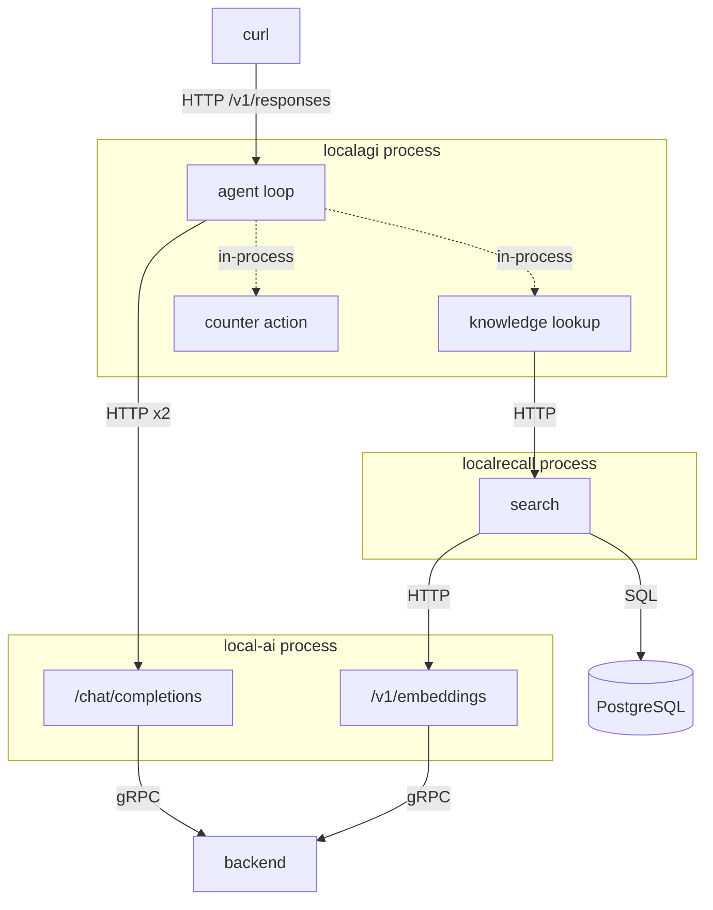

# Recipe 8 — The complete stack

## Goal

One agent that retrieves knowledge **and** uses a tool in the same request, with the
whole path traced. Nothing new is introduced; this recipe proves that Recipes 5 and 6
compose, and gives you the boundary count for a realistic request.

## Architecture

```text
                        You
                         |
                    LocalAGI ----- counter (in-process)
                    /       \
      /chat/completions    /api/collections/<agent>/search
              |                       |
           LocalAI  <-- /v1/embeddings --+
              |                       |
           backend             PostgreSQL
```



Four processes, one client request, and a request that reads knowledge before acting on
it.

## What you will learn

- retrieval happens **once, before the loop**, not once per iteration
- how to count the boundary crossings of a realistic request
- which single command tells you whether knowledge or the tool was at fault
- that combining the two does not multiply their costs

## Components

| Component | Role | Port |
|---|---|---|
| LocalAI | inference and embeddings | 8080 |
| LocalAGI | agent loop, retrieval, tool dispatch | 8081 → 3000 |
| LocalRecall | collection, chunking, search | 8082 |
| PostgreSQL | vectors and lexical index | internal |
| `counter` | the tool, in-process | — |

## Prerequisites

- Recipes 5 and 6 both completed and working. This recipe debugs badly if either half is
  unproven
- The reference Compose environment running

## Versions tested

```yaml
tested:
  date: 2026-08-17
versions:
  localai: "v4.8.2"
  localagi: "v2.8.1 (image)"
  localrecall: "v0.6.4 + v0.6.4-postgresql"
environment:
  architecture: arm64 (Apple Silicon)
  host: macOS 26.5.1
  runtime: Docker Desktop 29.7.2
  vector_engine: postgres
  gpu: none
results:
  knowledge_then_tool_in_one_request: pass
  total_request: 24.1 s
  retrieval_hop: 29.29 ms
  model_calls: 2
  tool_calls: 1
  arithmetic_on_retrieved_value: correct
```

## Start the environment

```bash
cd compose
docker compose up -d
```

## Verify each dependency

The full ladder, because this recipe depends on all of it. Each rung assumes the one
below.

**1. Inference.**

```bash
curl -s http://localhost:8080/v1/chat/completions \
  -H 'Content-Type: application/json' \
  -d '{"model":"qwen3-1.7b","messages":[{"role":"user","content":"hi"}],"max_tokens":8}' \
  | jq -r '.choices[0].message.content'
```

**2. Embeddings.**

```bash
curl -s http://localhost:8080/v1/embeddings \
  -H 'Content-Type: application/json' \
  -d '{"model":"granite-embedding-107m-multilingual","input":"probe"}' \
  | jq '.data[0].embedding | length'
```

**3. Vector store.**

```bash
docker exec localai-postgres pg_isready -U localrecall
```

**4. Knowledge service.**

```bash
curl -s http://localhost:8082/api/collections | jq '.data.collections'
```

**5. Agent runtime, and its action inventory.**

```bash
curl -s http://localhost:8081/api/agents | jq '{agents, actions}'
```

**6. Both edges from inside the agent container.**

```bash
docker exec localagi curl -s -o /dev/null -w 'localai %{http_code}\n' http://localai:8080/readyz
docker exec localagi curl -s -o /dev/null -w 'localrecall %{http_code}\n' http://localrecall:8080/api/collections
```

Or run all of it at once:

```bash
./scripts/verify-stack.sh
```

## Configure the system

**The agent, with both capabilities:**

```bash
curl -s -X POST http://localhost:8081/api/agent/create \
  -H 'Content-Type: application/json' \
  -d '{
    "name": "full-stack-probe",
    "model": "qwen3-1.7b",
    "system_prompt": "Answer from the provided context. Use tools when asked. Be terse.",
    "strip_thinking_tags": true,
    "enable_kb": true,
    "kb_auto_search": true,
    "kb_results": 3,
    "actions": [{"name": "counter", "config": "{}"}],
    "max_attempts": 1
  }' | jq
```

**The collection, named for the agent, lowercased:**

```bash
curl -s -X POST http://localhost:8082/api/collections \
  -H 'Content-Type: application/json' -d '{"name":"full-stack-probe"}' | jq
```

**A fact the model cannot know:**

```bash
cat > /tmp/kb-fact.txt <<'EOF'
The Zeppelin-7 telemetry bus uses a heartbeat interval of 4200 milliseconds.
Operators must never set the Zeppelin-7 heartbeat below 900 milliseconds because
the flight controller drops frames at that rate.
EOF
```

```bash
curl -s -X POST http://localhost:8082/api/collections/full-stack-probe/upload \
  -F file=@/tmp/kb-fact.txt | jq '.data.key'
```

## Run the request

A request that cannot succeed without **both** halves — the number must be retrieved,
then acted on:

```bash
curl -s http://localhost:8081/v1/responses \
  -H 'Content-Type: application/json' \
  -d '{
    "model": "full-stack-probe",
    "input": "Look up the Zeppelin-7 heartbeat interval, then set a counter named heartbeat to that value in milliseconds divided by 100."
  }' | jq -r '.output[0].content[0].text'
```

Then read the tool history — ground truth for what actually happened:

```bash
curl -s http://localhost:8081/api/agent/full-stack-probe/status | jq -r '.History[]'
```

## Expected result

The reply, observed:

```text
The counter 'heartbeat' was created with the value 42 (4200 ms / 100).
No further actions needed.
```

And the history:

```text
Reasoning:
			Action taken: counter
			Parameters: {"adjustment":42,"name":"heartbeat"}
			Result: Created counter 'heartbeat' with initial value 42
```

Total **24.1 s**. Retrieval **29.29 ms** of that.

This is the recipe's proof, and it is stronger than either half alone. The value `42`
appears nowhere in the collection and nowhere in the model's training data. Producing it
required:

1. retrieving `4200` from a document ingested moments earlier,
2. dividing it by 100,
3. passing the result as a tool argument.

Every layer in the stack participated. Note also that the arithmetic was **correct**
here, where [Recipe 5's](agent-with-tools.md#expected-result) narration was wrong — the
difference being that here the model computed a value *before* the tool call, and the
tool then confirmed it, rather than the model summarising a value after the fact.

### The cost, counted

| Boundary crossing | Count | Transport |
|---|---|---|
| Client → LocalAGI | 1 | network HTTP |
| LocalAGI → LocalRecall | **1** | network HTTP |
| LocalRecall → LocalAI embeddings | 1 | network HTTP |
| LocalAI → embedding backend | 1 | gRPC |
| LocalAGI → LocalAI chat | **2** | network HTTP |
| LocalAI → LLM backend | 2 | gRPC |
| LocalAGI → counter | 1 | **in-process** |
| LocalRecall → PostgreSQL | 1 | SQL |

**Retrieval happened once, not once per iteration.** Two model calls, one search. This is
worth knowing before you size anything: adding knowledge to a tool-using agent costs one
extra round trip, not one per loop.

## What happened internally

1. `POST /v1/responses` arrives; the agent resolves from the pool. *(inbound HTTP, then
   in-process)*
2. The three knowledge guards pass: `enable_kb`, `kb_auto_search`, provider present.
   *(in-process)*
3. The latest user message becomes the query, verbatim. *(in-process)*
4. `POST /api/collections/full-stack-probe/search` to LocalRecall. **(network HTTP)** —
   observed at `15:56:42.523` from `172.18.0.5`, latency **29.29 ms**.
5. LocalRecall embeds the query on LocalAI. **(network HTTP)**
6. Embedding model runs. *(gRPC)*
7. PostgreSQL vector + BM25 query. *(SQL)*
8. Chunks return; LocalAGI logs `Found similar strings in KB`. **(network HTTP)**
9. Chunks are formatted into one system message and prepended. *(in-process)*
10. Tools are assembled: `counter`, as a JSON-schema function. *(in-process)*
11. Iteration 1: `POST /chat/completions` with context **and** tools. **(network HTTP →
    gRPC)**
12. The model replies with `counter{name: "heartbeat", adjustment: 42}` — having read
    4200 from the injected context and divided it.
13. The action executes **in-process**. *(no network)*
14. The result is appended as an observation. *(in-process)*
15. Iteration 2: `POST /chat/completions`. **(network HTTP → gRPC)**
16. The model returns prose; the loop ends.
17. Long-term memory is off, so nothing is written back. *(in-process)*
18. The envelope is returned. *(outbound HTTP)*

Steps 2, 3, 8 and 17 were confirmed from LocalAGI's log; step 4 from LocalRecall's access
log at the matching timestamp; steps 12–14 from the recorded action result; the count of
two model calls from LocalAI's access log. cogito's internal call pattern within each
iteration was **not traced**. *(step ordering within iterations inferred)*

## Request flow

```mermaid
sequenceDiagram
  participant C as curl
  participant AG as LocalAGI
  participant LR as LocalRecall
  participant T as counter
  participant AI as LocalAI
  participant BE as backend
  participant PG as PostgreSQL

  C->>AG: POST /v1/responses
  Note over AG: guards pass; query = user message
  AG->>LR: POST /api/collections/full-stack-probe/search
  LR->>AI: POST /v1/embeddings
  AI->>BE: gRPC Embedding
  BE-->>AI: vector
  AI-->>LR: vector
  LR->>PG: vector + BM25
  PG-->>LR: top-3 chunks
  LR-->>AG: chunks
  Note over AG: prepend ONE system message
  AG->>AI: POST /chat/completions (iteration 1, with tools)
  AI->>BE: gRPC Predict
  BE-->>AI: counter{heartbeat, 42}
  AI-->>AG: tool call
  AG->>T: execute (in-process)
  T-->>AG: "Created counter 'heartbeat' with initial value 42"
  AG->>AI: POST /chat/completions (iteration 2)
  AI->>BE: gRPC Predict
  BE-->>AI: prose
  AI-->>AG: final text
  AG-->>C: Responses envelope
```

## Persistent state

| What | Written by | Where | Survives restart |
|---|---|---|---|
| Agent definition, flags and `actions` | LocalAGI | `/pool` JSON | yes |
| Original document | LocalRecall | `/data/assets/full-stack-probe/<uuid>/` | yes |
| Chunks and vectors | LocalRecall | PostgreSQL | yes |
| Counter value | the action | agent-scoped store | **not verified** |
| Retrieved context | nobody | request only | no |
| Conversation history | `ConversationTracker` | memory, TTL'd | no |

Three of these live in three different volumes — `localagi-pool`, `localrecall-data` and
`postgres-data`. A backup that captures one and not the others produces an agent with no
knowledge, or knowledge no agent can reach. See
[persistence](../06-deployment/persistence.md).

## Logs worth inspecting

The four commands that localise a fault to a layer:

```bash
docker logs localagi 2>&1 | grep -i 'knowledge base'
```

Present → retrieval ran. **Absent → a guard skipped it**, and those log at debug only.

```bash
docker logs localrecall 2>&1 | grep 'full-stack-probe/search' | tail -1
```

Proves the hop crossed the process boundary, with its real latency.

```bash
curl -s http://localhost:8081/api/agent/full-stack-probe/status | jq -r '.History[]'
```

Proves the tool ran, with the arguments the model chose.

```bash
docker logs --since 3m localai 2>&1 | grep -c 'chat/completions'
```

The iteration count. Rising without a corresponding tool result means the model is
looping.

## Failure modes

**The tool ran but with a wrong number.**

- *Symptom:* `Parameters` in `History` shows a value that is not in your documents.
- *Cause:* the model retrieved correctly and computed incorrectly, or retrieval returned
  the wrong chunk.
- *Check:* the `Found similar strings in KB` log line — does it contain the right fact?
- *Fix:* if retrieval was right, this is a model limit; use `qwen3-4b`. If retrieval was
  wrong, lower `kb_results` or fix chunking.

**Knowledge worked in Recipe 6 and not here.**

- *Cause:* a different agent means a **different collection**. `full-stack-probe` needs
  its own; the `kb-probe` collection is invisible to it.
- *Check:* `curl -s http://localhost:8082/api/collections | jq '.data.collections'`
- *Fix:* create and populate the collection matching this agent's name.

**The agent answers from knowledge but never calls the tool.**

- *Cause:* the two halves are independent. Confirm tools separately.
- *Check:* `curl -s http://localhost:8081/api/agent/full-stack-probe/config | jq '.actions'`
- *Fix:* `config` must be a JSON **string** (`"{}"`), not an object.

**The agent calls the tool but ignores the knowledge.**

- *Cause:* usually a guard, or the retrieved chunk did not contain the fact.
- *Check:* both log commands above.
- *Fix:* as in Recipe 6.

**Request takes minutes.**

- *Cause:* iterations times model latency. Retrieval is ~30 ms and is never the problem.
- *Check:* count `chat/completions`.
- *Fix:* raise client and proxy timeouts; reduce `kb_results` so less context is
  processed per call; consider a larger model, which often needs *fewer* iterations.

## Troubleshooting

Isolate the layer, in this order. Do not skip to the agent.

1. **Inference** — LocalAI `/v1/chat/completions`
2. **Embeddings** — LocalAI `/v1/embeddings` → 384
3. **Vector store** — `pg_isready`
4. **Retrieval, directly** — `POST /api/collections/full-stack-probe/search`
5. **Orchestration** — the agent answers a question needing neither knowledge nor tools
6. **Knowledge in the agent** — the `[Knowledge Base Lookup]` lines
7. **The tool, standalone** — `POST /api/action/counter/run`
8. **The tool in the agent** — `History`

Steps 1–4 are automated by
[`verify-stack.sh`](https://github.com/wrkode/local-ai-stack-handbook/blob/main/scripts/verify-stack.sh);
add `--agent full-stack-probe` for step 5.

## Cleanup

```bash
curl -s -X DELETE http://localhost:8081/api/agent/full-stack-probe | jq
curl -s -X POST http://localhost:8082/api/collections/full-stack-probe/reset | jq
```

Both, for the reason in the failure modes: the agent and its collection are separate
objects with separate lifecycles.

Full teardown, keeping models:

```bash
docker compose down
docker volume rm localai-stack_localagi-pool localai-stack_postgres-data localai-stack_localrecall-data
```

## Variations

**Break one layer deliberately.** This is the most valuable exercise in the handbook —
it is how [Recipe 7's](mcp-agent.md) and the troubleshooting pages' failure signatures
were established.

```bash
docker compose stop localrecall
```

Ask the same question again. Observed:

```text
STATUS: completed
ERROR:  None
TEXT:   The Zeppelin-7 telemetry bus uses a heartbeat interval of **10 seconds**
        to maintain communication reliability.
```

The agent returned `status: completed`, `error: null`, HTTP 200 — and a **confidently
invented answer**. Compare 4200 milliseconds with "10 seconds". Nothing in the response
indicates that retrieval failed, which is the single most important operational fact
about this architecture: **losing the knowledge layer degrades answers without
degrading availability.**

The log does tell you, at INFO level:

```text
INFO [Knowledge Base Lookup] Last user message agent=full-stack-probe message="What heartbeat…"
INFO Error finding similar strings inside KB: error="Post \"http://localrecall:8080/api/collections/full-stack-probe/search\": dial tcp: lookup localrecall on 127.0.0.11:53: no such host"
INFO [Knowledge Base Lookup] No similar strings found in KB agent=full-stack-probe
ERROR Observable completed without any progress id=6 name=job
```

Worth distinguishing carefully, because the two knowledge failures have different
visibility:

| Failure | Logged at | Visible by default |
|---|---|---|
| Knowledge service unreachable | **INFO**, with the dial error | **yes** |
| Knowledge disabled by config (`enable_kb`, `kb_auto_search`, no provider) | **DEBUG** | **no** |

Both return a successful response with an unreliable answer. Only the first leaves a
default-level trace. This is why [observability](../06-deployment/observability.md)
recommends alerting on `Error finding similar strings inside KB` and separately
asserting the agent's configuration — one log line cannot cover both cases.

Restore it:

```bash
docker compose start localrecall
```

Then try the same with `docker compose stop localai` — a very different, loud failure.
The contrast is the lesson: **losing inference fails hard; losing knowledge fails
quietly and plausibly.**

**Add an MCP tool** as well, from [Recipe 7](mcp-agent.md). The tool list merges; nothing
else changes.

**Turn on long-term memory** and watch conversation content flow back into the *same*
collection as your ingested document. Memory and knowledge share one store — see
[memory vs knowledge](../07-deep-dives/memory-vs-knowledge.md).

**Run it as Pattern A instead.** Set `LOCALAI_DISABLE_AGENTS=false`, stop LocalAGI, and
use LocalAI's own agent pool at `/api/agents` and `/api/agents/collections`. The same
logical architecture, one process, and knowledge in-process rather than over HTTP. Note
the loopback HTTP hops remain — see
[logical vs physical](../00-overview/logical-vs-physical.md). Not exercised in our run.

## Upstream references

- [LocalAGI `core/agent/knowledgebase.go`](https://github.com/mudler/LocalAGI/blob/v2.9.0/core/agent/knowledgebase.go) — retrieval before the loop, the three guards, and the injected system message. Validated against v2.9.0; observed on v2.8.1.
- [LocalAGI `core/agent/agent.go`](https://github.com/mudler/LocalAGI/blob/v2.9.0/core/agent/agent.go) — the job lifecycle and cogito options.
- [LocalAGI `core/state/pool.go`](https://github.com/mudler/LocalAGI/blob/v2.9.0/core/state/pool.go) — RAG provider selection and action assembly.
- [LocalAGI `core/state/config.go`](https://github.com/mudler/LocalAGI/blob/v2.9.0/core/state/config.go) — every field used in the agent definition above.
- [LocalRecall `routes.go`](https://github.com/mudler/LocalRecall/blob/v0.6.4/routes.go) — the search and upload handlers.
- [LocalAI `core/http/endpoints/openai/chat.go`](https://github.com/mudler/LocalAI/blob/v4.8.2/core/http/endpoints/openai/chat.go) — the endpoint both iterations hit.
- Latencies, model-call count, tool arguments, retrieval log lines and the silent-degradation behaviour: observed 2026-08-17, see [version matrix](../00-overview/version-matrix.md).
