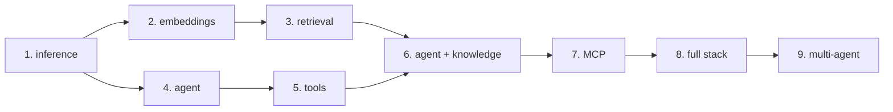

# Recipes

Nine recipes, in a fixed order, each introducing exactly one new capability. A
recipe that introduced two would hide which one broke.

Work through them in sequence. Recipe 6 is where the whole architecture becomes
visible, and it is only comprehensible if recipes 1 through 5 actually ran on your
machine.

## The path

| # | Recipe | Introduces | Components running |
|---|---|---|---|
| 1 | [LocalAI chat](localai-chat.md) | model install, Chat Completions | LocalAI |
| 2 | [Embeddings](localai-embeddings.md) | embedding model, vectors, dimensions | LocalAI |
| 3 | [LocalRecall RAG](localrecall-rag.md) | collections, ingestion, chunking, retrieval | LocalAI + LocalRecall |
| 4 | [Simple agent](simple-agent.md) | an agent, the agent loop, Responses API | LocalAI + LocalAGI |
| 5 | [Agent with tools](agent-with-tools.md) | tool/function calling | LocalAI + LocalAGI |
| 6 | [Agent with knowledge](agent-with-knowledge.md) | retrieval inside the loop | all three |
| 7 | [MCP agent](mcp-agent.md) | MCP as a capability boundary | all three + an MCP server |
| 8 | [Complete stack](complete-agent-stack.md) | the assembled system, traced | all three + tool |
| 9 | [Multi-agent](multi-agent.md) | delegation between agents | all three |



Note the two roots. Recipes 1–3 build the **data** path; recipes 1, 4, 5 build the
**control** path. They meet at recipe 6. If recipe 6 misbehaves, the question to ask
is which of the two paths is at fault — and you will know how to test each in
isolation because you built them separately.

## Reference models, used throughout

The same two models appear in every recipe, so that a failure is attributable to
your configuration rather than to a model swap.

| Role | Model | Size | Key property |
|---|---|---|---|
| LLM | `qwen3-1.7b` | 1.19 GiB Q4_K_M | gallery entry wired for native tool calling |
| Embeddings | `granite-embedding-107m-multilingual` | 211 MiB F16 | 384 dimensions, upstream's own default |

Both are Apache-2.0 and run on a CPU-only laptop. Reasoning for these choices, and
two models to actively avoid, are in the
[version matrix](../00-overview/version-matrix.md#reference-models).

If quality is insufficient, step up to `qwen3-4b` (2.33 GiB). The configuration is
identical, so nothing in these recipes changes.

## Prerequisites for all recipes

- Docker with Compose v2
- ~4 GB free disk
- `curl`. `jq` is optional throughout — it only formats output
- **No GPU.** Acceleration is covered separately in
  [GPU](../06-deployment/gpu.md); requiring it here would confuse "the stack does
  not work" with "the stack is slow"

## Recipe conventions

Every recipe has the same sections in the same order, so you can jump straight to
the one you need:

| Section | What it gives you |
|---|---|
| **Verify each dependency** | one command per dependency, in start order, with expected output |
| **What happened internally** | numbered steps, each naming the component and whether it crossed a network boundary |
| **Request flow** | a sequence diagram matching those steps exactly |
| **Persistent state** | what was written, by which process, where, and whether it survives a restart |
| **Failure modes** | symptom → cause → check → fix, with the real error text |
| **Troubleshooting** | diagnostic ordering: inference, then embeddings, then retrieval, then orchestration, then tools |

**Versions tested** carries a real `tested:` block when the recipe was executed. When
it was not, it says so explicitly instead. Nothing is marked tested that was not run
— see [evidence policy](../index.md#evidence-policy).

## Layer isolation, the one habit worth forming

Every troubleshooting section in this handbook asks the same question in the same
order. Learn it here and you will rarely need the rest:

```text
1. Is the model runtime up?              GET /readyz
2. Does inference work at all?           POST /v1/chat/completions
3. Do embeddings work?                   POST /v1/embeddings
4. Does retrieval return chunks?         POST /api/collections/<c>/search
5. Is the agent runtime up?              GET /api/agents
6. Does the agent answer without tools?  POST /v1/responses
7. Does the tool work when run directly? POST /api/action/<name>/run
```

A failure at step *n* makes every result after it meaningless. This is exactly what
[`scripts/verify-stack.sh`](https://github.com/wrkode/local-ai-stack-handbook/blob/main/scripts/verify-stack.sh)
automates:

```bash
./scripts/verify-stack.sh
```

It stops at the first failing layer and names the likely cause.

## Where the recipes deploy from

Recipes 1 and 2 use a single `docker run`, because introducing Compose before you
have seen one process would add moving parts to no purpose. Recipe 3 onward uses
[`compose/`](https://github.com/wrkode/local-ai-stack-handbook/tree/main/compose),
where each service is separated deliberately so its edges can be probed.

Kubernetes appears only after all nine recipes, in
[deployment](../06-deployment/kubernetes.md). Scheduling, service networking, GPU
device plugins and persistent volumes are genuinely difficult, and mixing them with
"what does an agent do" makes both harder to learn.
