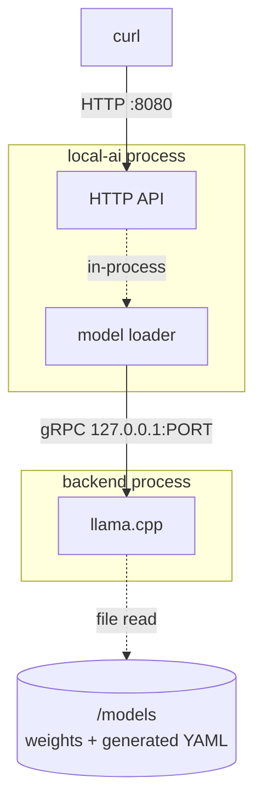
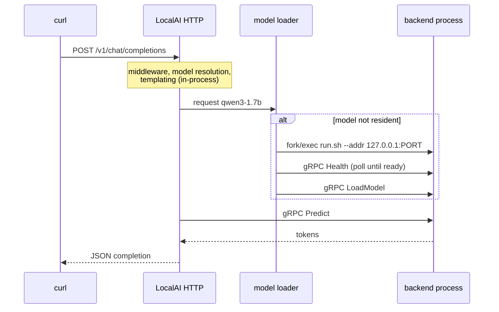

# Recipe 1 — LocalAI inference

## Goal

Run one model on your own machine and get a completion out of it over an
OpenAI-compatible API. Nothing else. By the end you will know where the model
lives, which process executes it, and what the first-request latency is made of.

## Architecture

```text
   You
    |
    | HTTP  POST /v1/chat/completions
    v
 LocalAI  (local-ai process)
    |
    | gRPC over 127.0.0.1
    v
 Backend process  (cpu-llama-cpp)
    |
    v
 Model weights  (/models)
```



Two processes, not one. That is the single most useful thing this recipe teaches.

## What you will learn

- LocalAI ships with **zero** models and **zero** backends; both are downloaded
- installing a model also installs a backend, reported as one job
- the model is executed by a **separate OS process** that LocalAI supervises over
  gRPC
- what `/readyz` does and does not promise
- where first-request latency actually goes

## Components

| Component | Role | Where it runs |
|---|---|---|
| LocalAI | HTTP API, model supervision, templating | container `localai` |
| `cpu-llama-cpp` backend | executes the model | child process inside the container |
| `qwen3-1.7b` | the model | `/models` volume |

## Prerequisites

- Docker
- ~2 GB free disk for this recipe
- `curl`; `jq` optional, for formatting only

## Versions tested

```yaml
tested:
  date: 2026-08-17
versions:
  localai: "v4.8.2"
  localagi: "not used"
  localrecall: "not used"
environment:
  architecture: arm64 (Apple Silicon)
  host: macOS 26.5.1
  runtime: Docker Desktop 29.7.2
  gpu: none
results:
  container_starts_and_readyz: pass
  gallery_model_install: FAIL — see the warning below
  manual_install_then_inference: pass (4 s including model load)
```

The container reports its build as `v4.8.2 (5ff25d9d145e0a03a5b9a3559c620f1e1204ca6d)`.

Scope of what was executed: the container start, `/readyz`, `/v1/models`, the
gallery install (which failed), a manual install, and the chat completion. The
inference was run in the
[reference Compose environment](https://github.com/wrkode/local-ai-stack-handbook/tree/main/compose)
rather than through the bare `docker run` shown below — same image, same model,
same configuration.

!!! warning "The gallery install failed when we ran it, and it can fail for you"
    On our run, `raw.githubusercontent.com` returned **HTTP 429** to this host.
    LocalAI's model gallery is YAML hosted there, so every entry failed to resolve
    and **both model installs failed** — while LocalAI still logged
    `core/startup process completed!` and `LocalAI is started and running`, and
    `/readyz` answered `200` with zero models installed.

    If `/v1/models` comes back empty, this is the first thing to check. The
    workaround we used is in [Variations](#variations). The wider lesson — that
    `/readyz` proves nothing about models — is why the verification section below
    treats them as separate checks.

## Start the environment

```bash
docker run -d --name localai -p 8080:8080 \
  -v localai-models:/models \
  -v localai-backends:/backends \
  localai/localai:v4.8.2 qwen3-1.7b
```

The positional argument is a **gallery name**, not a file. LocalAI resolves it
against its model gallery and installs it at startup.

Mount both volumes. Without `/backends` the backend is re-downloaded on every
container recreation, which is the larger of the two downloads for small models.

Follow the install:

```bash
docker logs -f localai
```

Expect the gallery index to be fetched, then a model download, then a backend
download. On a first run this takes minutes, not seconds.

## Verify each dependency

In order. Each command assumes the previous one passed.

**1. The HTTP listener is accepting connections.**

```bash
curl -s http://localhost:8080/readyz
```

This says the *listener* is up. It does **not** say a model is loaded — LocalAI
answers `/readyz` long before any model is resident. Treating this as a
model-readiness probe is a common Kubernetes mistake; see
[kubernetes](../06-deployment/kubernetes.md).

**2. The model is installed and resolvable by name.**

```bash
curl -s http://localhost:8080/v1/models | jq -r '.data[].id'
```

Expected to include `qwen3-1.7b`. If the list is empty, the install failed — read
the logs rather than retrying the request.

**3. A backend was installed alongside it.**

```bash
docker exec localai ls /backends
```

Expected: a directory such as `cpu-llama-cpp`. An empty `/backends` with a present
model means the model download succeeded and the backend download did not; the
first inference request will then fail with a backend error rather than a model
error.

## Configure the system

Nothing to configure. This is the point of the recipe: the gallery entry already
carries the model's configuration, and LocalAI generated a YAML file for it at
install time.

Look at what it generated:

```bash
docker exec localai cat /models/qwen3-1.7b.yaml
```

Worth reading once. For `qwen3-1.7b` this file sets `use_jinja: true` and
`use_tokenizer_template: true` and disables function grammar — a configuration
chosen upstream specifically so that small-model tool calling works. That is why
this model, and not a generic one, is the reference LLM in this handbook. Recipe 5
depends on it.

## Run the request

```bash
curl -s http://localhost:8080/v1/chat/completions \
  -H 'Content-Type: application/json' \
  -d '{
    "model": "qwen3-1.7b",
    "messages": [{"role": "user", "content": "In one sentence, what is a vector embedding?"}],
    "max_tokens": 600
  }' | jq -r '.choices[0].message.content'
```

!!! warning "`max_tokens` must be generous, or the answer is *empty*"
    `qwen3-1.7b` is reasoning-tuned: it thinks before answering, and the thinking counts
    against `max_tokens`. Observed on this exact request:

    | `max_tokens` | `finish_reason` | `content` | completion tokens |
    |---|---|---|---|
    | 128 | `length` | **`''` — empty** | 128 |
    | 600 | `stop` | one correct sentence | **371** |

    So 128 tokens is not a short answer, it is **no answer**: the budget was exhausted mid-
    reasoning and nothing was left for the reply. It needed **371 completion tokens to produce
    one sentence.**

    Note also that `reasoning_content` was **absent** from the response in both cases, so the
    tokens are consumed without being exposed. Budget for a reasoning model, and check
    `finish_reason` before treating empty content as an error.

Time the difference between the first and second call — the first includes model
load:

```bash
time curl -s -o /dev/null http://localhost:8080/v1/chat/completions \
  -H 'Content-Type: application/json' \
  -d '{"model":"qwen3-1.7b","messages":[{"role":"user","content":"hi"}],"max_tokens":8}'
```

## Expected result

A JSON body in OpenAI Chat Completions shape: an `id`, a `choices` array with one
`message`, and a `usage` block.

Latency, observed on CPU-only arm64:

| Call | Time |
|---|---|
| First, including model load | seconds — dominated by load, not generation |
| Subsequent, warm | proportional to tokens generated |

`qwen3-1.7b` is a reasoning-tuned model and may emit thinking tags before its
answer. That is the model's behaviour, not a LocalAI setting. LocalAGI has a
`strip_thinking_tags` option for later recipes; at this layer you see the raw
output.

## What happened internally

1. Request arrives at LocalAI's Echo HTTP server. *(inbound HTTP)*
2. The middleware chain runs: body limit, security headers, access log, metrics,
   auth, CORS. *(in-process)*
3. The `model` field is resolved against loaded configuration and
   `/models/qwen3-1.7b.yaml` is read. *(in-process)*
4. Messages are templated. For this model the tokenizer template is used rather
   than LocalAI's own prompt template. *(in-process)*
5. The model is not resident on a first request, so LocalAI allocates a free port
   on `127.0.0.1`, **fork/execs the backend's `run.sh` as a child process**, polls
   it with a gRPC `Health` call until it answers, then sends `LoadModel`.
   *(process boundary, then gRPC over loopback TCP)*
6. LocalAI issues the inference RPC — `Predict`, or `PredictStream` when streaming.
   *(gRPC)*
7. Tokens return through the callback chain and are assembled into a JSON body.
   *(in-process, then outbound HTTP)*

**Boundary count for a warm request: exactly one** — LocalAI to the backend, over
loopback gRPC.

Steps 2 through 4 are source-derived from the handler and middleware chain rather
than individually traced at runtime. *(step order inferred, not traced)*

## Request flow



## Persistent state

| What | Written by | Path | Survives restart |
|---|---|---|---|
| Model weights | LocalAI installer | `/models/*.gguf` | yes, volume `localai-models` |
| Generated model YAML | LocalAI installer | `/models/qwen3-1.7b.yaml` | yes, same volume |
| Backend binaries | LocalAI installer | `/backends/cpu-llama-cpp/` | yes, volume `localai-backends` |
| Loaded model in RAM | model loader | memory | **no** — reloaded on first request |
| The completion | nobody | — | not stored anywhere |

Nothing about this request is persisted. There is no conversation, no history and
no state. That only appears in Recipe 4.

## Logs worth inspecting

```bash
docker logs localai 2>&1 | grep -i -E 'gallery|download|backend'
```

Shows the install sequence and whether the backend came down with the model.

```bash
docker logs localai 2>&1 | grep -i -E 'loading model|grpc|127.0.0.1'
```

Shows the backend process being started and the gRPC port it was given — this is
where the two-process architecture becomes visible rather than theoretical.

```bash
docker exec localai ls -la /models /backends
```

The ground truth for what is actually installed.

## Failure modes

**Empty model list after startup.**

- *Symptom:* `/v1/models` returns `{"data":[],...}` although the container reports
  itself started and `/readyz` returns 200.
- *Cause:* the gallery install failed. Two causes we have actually observed:
  **(a)** `raw.githubusercontent.com` rate-limiting the host with HTTP 429 — the
  gallery is YAML hosted there, so *no* entry resolves; **(b)** an individual
  gallery entry whose weights are unavailable.
- *Check:*

    ```bash
    docker logs localai 2>&1 | grep -i -E 'gallery|installing model|429|503'
    ```

    ```bash
    docker exec localai curl -s -o /dev/null -w '%{http_code}\n' \
      https://raw.githubusercontent.com/mudler/LocalAI/master/gallery/qwen3.yaml
    ```

    `429` or `503` from that second command is cause (a). Note the log may contain
    `ERROR [startup] failed installing model error=<nil>` — an error line with a nil
    error, which is unhelpful but is the signature of this failure.

- *Fix:* for (a), wait for the rate limit to clear, or install manually as shown in
  [Variations](#variations). For (b), choose a different model.
  `LocalAI-functioncall-llama3.2-3b-v0.5` is a documented example of a broken
  entry — its Hugging Face repository returns **HTTP 401** to anonymous requests, so
  the install fails at download. Both are upstream gallery defects, not local
  problems.

**`model not found` on a request whose model is listed.**

- *Symptom:* a 404 or `model not found` error although `/v1/models` shows it.
- *Cause:* the name in the request does not match exactly — names are
  case-sensitive and hyphen-sensitive.
- *Check:* `curl -s localhost:8080/v1/models | jq -r '.data[].id'` and copy the
  string.
- *Fix:* use the exact string.

**First request hangs for minutes, then succeeds.**

- *Symptom:* long first call, fast afterwards.
- *Cause:* this is the model load in step 5, not a fault.
- *Check:* `docker logs localai` during the call.
- *Fix:* nothing to fix. If you need bounded first-request latency, keep the model
  resident and raise client timeouts.

**Backend error rather than model error.**

- *Symptom:* the request fails mentioning a backend or gRPC.
- *Cause:* `/backends` is empty — the backend download failed while the model
  succeeded.
- *Check:* `docker exec localai ls /backends`
- *Fix:* recreate the container with the `/backends` volume mounted and let it
  re-install.

**Works from the host, fails from another container.**

- *Symptom:* `curl` on your machine succeeds; the same call from a second container
  connects to nothing.
- *Cause:* `localhost` inside a container is that container.
- *Fix:* use `host.docker.internal`, or put both on one Compose network and use the
  service name.

## Troubleshooting

Diagnose in this order; a failure at any step makes later results meaningless.

1. **Is the process up?** `curl -s localhost:8080/readyz`
2. **Is the model installed?** `curl -s localhost:8080/v1/models`
3. **Is a backend installed?** `docker exec localai ls /backends`
4. **Does inference work at all?** the `max_tokens: 8` request above
5. **Is it slow or broken?** compare first and second call timings — slow first,
   fast second is a model load, not a failure
6. **Does the log show the backend starting?** grep for `grpc` and `127.0.0.1`

More: [LocalAI troubleshooting](../01-localai/troubleshooting.md).

## Cleanup

Stop and remove the container, keeping the downloads:

```bash
docker rm -f localai
```

Remove the downloads too — about 1.4 GB, re-downloaded next time:

```bash
docker volume rm localai-models localai-backends
```

**Keep the volumes** if you are continuing to Recipe 2. It uses the same LocalAI
and only adds a second model.

## Variations

**Install the embedding model at the same time.** Recipe 2 needs it, and installing
both now saves a restart:

```bash
docker run -d --name localai -p 8080:8080 \
  -v localai-models:/models -v localai-backends:/backends \
  localai/localai:v4.8.2 qwen3-1.7b granite-embedding-107m-multilingual
```

**Stream the response.** Add `"stream": true` and the transport becomes SSE:

```bash
curl -N -s http://localhost:8080/v1/chat/completions \
  -H 'Content-Type: application/json' \
  -d '{"model":"qwen3-1.7b","messages":[{"role":"user","content":"Count to five."}],"stream":true}'
```

Note for later: LocalAI's Chat Completions supports streaming; LocalAGI's Responses
endpoint accepts a `stream` field and **ignores it** — see
[Responses API](../02-localagi/responses-api.md).

**A larger model.** `qwen3-4b` (2.33 GiB) is configured identically. Everything in
these recipes works unchanged.

**Install manually, bypassing the gallery.** Needed when the gallery is
unreachable, and instructive because it shows exactly what a gallery install
produces. This is the sequence we used.

The backend gallery is served from a container registry rather than GitHub, so it
keeps working when the model gallery does not:

```bash
curl -s -X POST http://localhost:8080/backends/apply \
  -H 'Content-Type: application/json' -d '{"id":"llama-cpp"}'
```

Poll the returned `status_url` until `"processed":true`. Then fetch the weights
straight from Hugging Face — the URIs are the `huggingface://` entries from the
gallery index, rewritten as `resolve/main` URLs:

```bash
docker exec localai sh -c 'curl -sL -o /models/Qwen3-1.7B.Q4_K_M.gguf \
  https://huggingface.co/MaziyarPanahi/Qwen3-1.7B-GGUF/resolve/main/Qwen3-1.7B.Q4_K_M.gguf'
```

Then write the model configuration by hand. This is the gallery's own
`config_file` for the `qwen3` family, with the file name filled in:

```bash
docker exec localai sh -c 'cat > /models/qwen3-1.7b.yaml <<EOF
name: qwen3-1.7b
backend: llama-cpp
known_usecases:
  - chat
parameters:
  context_size: 8192
  f16: true
  mmap: true
  model: Qwen3-1.7B.Q4_K_M.gguf
stopwords:
  - <|im_end|>
  - <dummy32000>
  - </s>
  - <|endoftext|>
options:
  - use_jinja:true
function:
  grammar:
    disable: true
template:
  use_tokenizer_template: true
EOF'
docker restart localai
```

Two things to notice. The `context_size: 8192` is the gallery's own value, not the
model's native 32,768 — see the
[version matrix](../00-overview/version-matrix.md#reference-models). And the
`use_jinja` / disabled-grammar combination is what makes tool calling work in
Recipe 5; drop it and that recipe misbehaves.

Do **not** reach for `POST /models/apply` with an inline `config_file` and no
`url` as a gallery bypass. We tried; it fails with
`Get "": unsupported protocol scheme ""`.

**GPU.** Not here — [GPU](../06-deployment/gpu.md). Note that Docker on macOS has no
Metal access at all: a containerised LocalAI on Apple Silicon is CPU-only inside a
Linux VM, and GPU acceleration on a Mac requires the native install.

## Upstream references

- [LocalAI `core/http/endpoints/openai/chat.go`](https://github.com/mudler/LocalAI/blob/v4.8.2/core/http/endpoints/openai/chat.go) — the Chat Completions handler. Validated against v4.8.2.
- [LocalAI `pkg/model/initializers.go`](https://github.com/mudler/LocalAI/blob/v4.8.2/pkg/model/initializers.go) — port allocation, backend fork/exec, health polling, `LoadModel`.
- [LocalAI `core/backend/llm.go`](https://github.com/mudler/LocalAI/blob/v4.8.2/core/backend/llm.go) — the `Predict` / `PredictStream` path.
- [LocalAI `gallery/qwen3.yaml`](https://github.com/mudler/LocalAI/blob/v4.8.2/gallery/qwen3.yaml) — the `qwen3-1.7b` entry and its tool-calling configuration.
- [LocalAI `Dockerfile`](https://github.com/mudler/LocalAI/blob/v4.8.2/Dockerfile) — declared volumes.
- [LocalAI container documentation](https://localai.io/basics/container/) — image variants.
- Model sizes, the `LocalAI-functioncall-llama3.2-3b-v0.5` HTTP 401, and the absence of Metal in the container images: observed 2026-08-17, see [version matrix](../00-overview/version-matrix.md).
