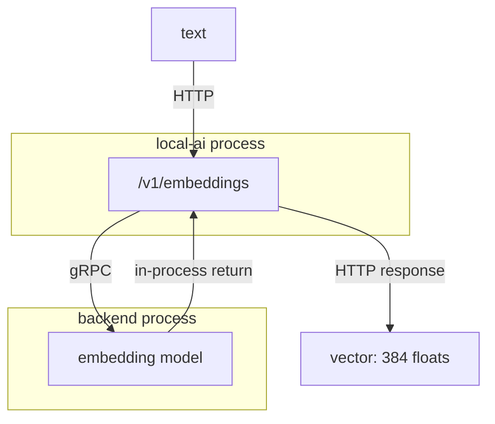
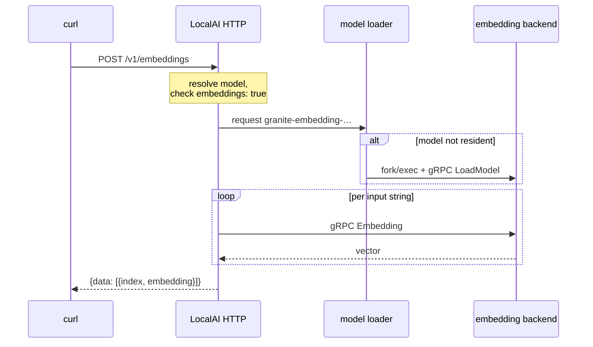

# Recipe 2 — Embeddings

## Goal

Turn text into a vector, look at the vector, and understand what its dimension
commits you to. No new components: this is the same LocalAI from Recipe 1 running a
different model on a different endpoint.

## Architecture

```text
  Text
    |
    | HTTP  POST /v1/embeddings
    v
 LocalAI
    |
    | gRPC
    v
 Embedding model  (granite-embedding-107m-multilingual)
    |
    v
 Vector  (384 float32)
```



Structurally identical to Recipe 1. That is the lesson: embeddings are not a
separate subsystem, they are a model with a different output shape.

## What you will learn

- embeddings and completions share one runtime, one backend mechanism, one API
  surface
- the vector's dimension is a property of the **model**, and it becomes a
  permanent property of any collection built from it
- these vectors come back already L2-normalized, so cosine similarity is a plain
  dot product
- batching, and how the response preserves input order
- why nothing downstream can mix two embedding models

## Components

| Component | Role | Where it runs |
|---|---|---|
| LocalAI | HTTP API, model supervision | container `localai` |
| `granite-embedding-107m-multilingual` | the embedding model | `/models` |

No LocalRecall yet. Recipe 3 adds it, and it will call exactly the endpoint you are
about to call by hand.

## Prerequisites

- Recipe 1 completed, LocalAI running
- the embedding model installed
- `curl`; `jq` optional but genuinely useful here

## Versions tested

```yaml
tested:
  date: 2026-08-17
versions:
  localai: "v4.8.2"
  localagi: "not used"
  localrecall: "not used"
environment:
  architecture: arm64 (Apple Silicon)
  host: macOS 26.5.1
  runtime: Docker Desktop 29.7.2
  gpu: none
results:
  single_input: pass — 384 dimensions
  batch_of_3: pass — 3 vectors, correct index ordering
  l2_normalized: pass — magnitude 1.0
```

## Start the environment

If LocalAI is already running from Recipe 1 with the embedding model installed,
skip ahead.

```bash
docker run -d --name localai -p 8080:8080 \
  -v localai-models:/models \
  -v localai-backends:/backends \
  localai/localai:v4.8.2 qwen3-1.7b granite-embedding-107m-multilingual
```

The two models share the `llama-cpp` backend, so the second install adds weights
but no new backend. They are separate backend **processes** at run time, though —
two models resident means two child processes.

## Verify each dependency

**1. LocalAI is up.**

```bash
curl -s http://localhost:8080/readyz
```

**2. The embedding model is installed.**

```bash
curl -s http://localhost:8080/v1/models | jq -r '.data[].id'
```

`granite-embedding-107m-multilingual` must appear. If only the LLM is listed, the
second install failed — check the logs, and see Recipe 1's failure modes.

## Configure the system

Nothing to configure. What makes this model an embedding model rather than a chat
model is one line in its generated configuration:

```bash
docker exec localai cat /models/granite-embedding-107m-multilingual.yaml
```

The line that matters is `embeddings: true`. Without it, LocalAI will not serve the
model on this endpoint. This is worth seeing once, because it explains a legacy trap
documented in the [version matrix](../00-overview/version-matrix.md#models-to-avoid):
the gallery entry named `bert-embeddings` is not a BERT model at all — it resolves to
Llama-3.2-1B-Instruct with `embeddings: true` set. A model can be pressed into
service as an embedder by configuration alone, and the results will be poor.

## Run the request

A single input:

```bash
curl -s http://localhost:8080/v1/embeddings \
  -H 'Content-Type: application/json' \
  -d '{
    "model": "granite-embedding-107m-multilingual",
    "input": "LocalRecall stores and retrieves knowledge used to augment model context."
  }' | jq '{model, dims: (.data[0].embedding | length), first_five: .data[0].embedding[0:5]}'
```

Count the dimensions on their own:

```bash
curl -s http://localhost:8080/v1/embeddings \
  -H 'Content-Type: application/json' \
  -d '{"model":"granite-embedding-107m-multilingual","input":"test"}' \
  | jq '.data[0].embedding | length'
```

A batch of three, to see ordering:

```bash
curl -s http://localhost:8080/v1/embeddings \
  -H 'Content-Type: application/json' \
  -d '{
    "model": "granite-embedding-107m-multilingual",
    "input": ["first string", "second string", "third string"]
  }' | jq '[.data[] | {index, dims: (.embedding | length)}]'
```

Confirm the vectors are unit length:

```bash
curl -s http://localhost:8080/v1/embeddings \
  -H 'Content-Type: application/json' \
  -d '{"model":"granite-embedding-107m-multilingual","input":"magnitude check"}' \
  | jq '[.data[0].embedding[] | . * .] | add | sqrt'
```

## Expected result

| Check | Observed |
|---|---|
| Dimensions | **384** |
| Batch of 3 | `[{"index":0,"dims":384},{"index":1,"dims":384},{"index":2,"dims":384}]` |
| Vector magnitude | **0.9999999536** — L2-normalized, to float32 precision |
| Cold call, including model load | ~3.3 s |
| Warm call | **0.06–0.09 s** |

The magnitude is not exactly 1; it is 1 within the rounding error of 384 float32
values. Do not write an equality assertion against 1.0 in a test.

Two consequences of that magnitude figure. Cosine similarity reduces to a dot
product, which is why the vector stores in this ecosystem can be simple. And you
must not normalize again in your own code — you would be dividing by one and
possibly introducing error.

The 384 is the number to remember. It is not a tuning parameter; it is fixed by the
model and it becomes fixed in every collection built from it.

## What happened internally

1. Request arrives at LocalAI's HTTP server. *(inbound HTTP)*
2. Middleware runs; the `model` field is resolved and its YAML read.
   *(in-process)*
3. LocalAI checks that the model is configured for embeddings. A model without
   `embeddings: true` is rejected here rather than at the backend. *(in-process)*
4. If the model is not resident, a backend process is started and `LoadModel` is
   sent — the same fork/exec and gRPC sequence as Recipe 1. *(process boundary,
   then gRPC)*
5. LocalAI issues the embedding RPC to the backend, once per input string.
   *(gRPC)*
6. Vectors are assembled into an OpenAI-shaped response with `index` preserved.
   *(in-process, then outbound HTTP)*

Steps 2, 3 and 6 are source-derived from the handler rather than individually
traced. *(step order inferred, not traced)*

**Boundary count for a warm request: one** — LocalAI to the backend over loopback
gRPC. Identical to Recipe 1.

## Request flow



## Persistent state

| What | Written by | Path | Survives restart |
|---|---|---|---|
| Embedding model weights | LocalAI installer | `/models/granite-…-f16.gguf` (211 MiB) | yes |
| Generated model YAML | LocalAI installer | `/models/granite-….yaml` | yes |
| The vectors | **nobody** | — | **not stored** |

This is the important row. **LocalAI does not store vectors.** It computes them and
returns them. Persisting them is somebody else's job, and in this ecosystem that
somebody is LocalRecall — Recipe 3.

## Logs worth inspecting

```bash
docker logs localai 2>&1 | grep -i -E 'embedding|loading model'
```

Shows the embedding backend being loaded on the first call.

```bash
docker logs localai 2>&1 | tail -5
```

The access log line for your request, with its latency. Compare the first and second
call to separate load time from compute time.

## Failure modes

**`model not found` for a model that is listed.**

- *Symptom:* an error naming the model, although `/v1/models` shows it.
- *Cause:* the name does not match exactly, or you sent the LLM's name.
- *Check:* `curl -s localhost:8080/v1/models | jq -r '.data[].id'`
- *Fix:* copy the exact string.

**An error mentioning embeddings support.**

- *Symptom:* the request is rejected although the model loads for chat.
- *Cause:* the model's YAML lacks `embeddings: true`.
- *Check:* `docker exec localai grep -i embeddings /models/<name>.yaml`
- *Fix:* use an embedding model. Adding the flag to a chat model makes it *answer*,
  not make it *good* — see the `bert-embeddings` note above.

**A different dimension than you expected.**

- *Symptom:* a vector length that is not 384.
- *Cause:* you used a different embedding model.
- *Check:* the `model` field in the response.
- *Fix:* decide deliberately, then never change it for a given collection. Changing
  it invalidates every vector already stored.

**Slow first call, fast afterwards.**

- *Symptom:* ~3.3 s then ~0.07 s.
- *Cause:* model load, not a fault.
- *Fix:* nothing. But size ingestion using the **warm** figure multiplied by chunk
  count, not the cold one.

## Troubleshooting

1. **Is LocalAI up?** `curl -s localhost:8080/readyz`
2. **Is the embedding model installed?** `curl -s localhost:8080/v1/models`
3. **Does it have `embeddings: true`?** read the generated YAML
4. **Does a single input work?** the `"input":"test"` request
5. **Does a batch work?** the array request
6. **Is the dimension what you expect?** `.data[0].embedding | length`

If all six pass, embeddings are not your problem — go on to
[LocalRecall troubleshooting](../03-localrecall/troubleshooting.md).

## Cleanup

Nothing was created. To remove the model:

```bash
docker exec localai rm -f /models/granite-embedding-107m-multilingual-f16.gguf \
  /models/granite-embedding-107m-multilingual.yaml
docker restart localai
```

**Keep it** if you are continuing to Recipe 3, which cannot work without it.

## Variations

**Compare two texts.** The point of embeddings is relative distance. Because the
vectors are unit length, the dot product *is* the cosine similarity:

```bash
curl -s http://localhost:8080/v1/embeddings \
  -H 'Content-Type: application/json' \
  -d '{"model":"granite-embedding-107m-multilingual",
       "input":["a cat sat on the mat","a feline rested on the rug","quarterly revenue increased"]}' \
  | jq '[.data[].embedding] as $e
        | {cat_vs_feline: ([range(384) | $e[0][.] * $e[1][.]] | add),
           cat_vs_revenue: ([range(384) | $e[0][.] * $e[2][.]] | add)}'
```

Observed on the reference model:

```json
{
  "cat_vs_feline": 0.8681793897317607,
  "cat_vs_revenue": 0.5404004191810163
}
```

Two sentences sharing no significant words score **0.87**; two unrelated sentences
score **0.54**. That gap is the entire basis of semantic retrieval, and running it
once makes Recipe 3 much less magical.

Note also that the floor is 0.54, not 0. Unrelated text is not orthogonal in this
embedding space, which is precisely why a top-*k* search with no relevance threshold
will always return something — a point that matters a great deal in Recipe 6.

**Try a query and a document.** Embedding models are often trained asymmetrically,
so a short question and a long passage that answers it may score lower than you
expect. This is worth knowing before you blame chunk size in Recipe 3.

**A different dimension.** `granite-embedding-125m-english` produces 768
dimensions. Larger vectors cost more storage and more compute per comparison
without automatically retrieving better. Do not change this after building a
collection.

**Multilingual.** The reference model is multilingual, so a query in one language
can retrieve a passage in another. Try it — it is a genuine capability and it is
easy to forget it is there.

## Upstream references

- [LocalAI `core/http/endpoints/openai/embeddings.go`](https://github.com/mudler/LocalAI/blob/v4.8.2/core/http/endpoints/openai/embeddings.go) — the embeddings handler. Validated against v4.8.2.
- [LocalAI `core/backend/embeddings.go`](https://github.com/mudler/LocalAI/blob/v4.8.2/core/backend/embeddings.go) — the gRPC embedding call.
- [LocalAI `core/cli/run.go`](https://github.com/mudler/LocalAI/blob/v4.8.2/core/cli/run.go) — `granite-embedding-107m-multilingual` as the default embedding model.
- [LocalAI `gallery/index.yaml`](https://github.com/mudler/LocalAI/blob/v4.8.2/gallery/index.yaml) — the model entry, `embeddings: true`, and the 384-dimension description.
- [OpenAI Embeddings API reference](https://platform.openai.com/docs/api-reference/embeddings) — the wire format LocalAI implements.
- Dimensions, unit magnitude, latency and batch ordering: observed 2026-08-17, see [version matrix](../00-overview/version-matrix.md).
