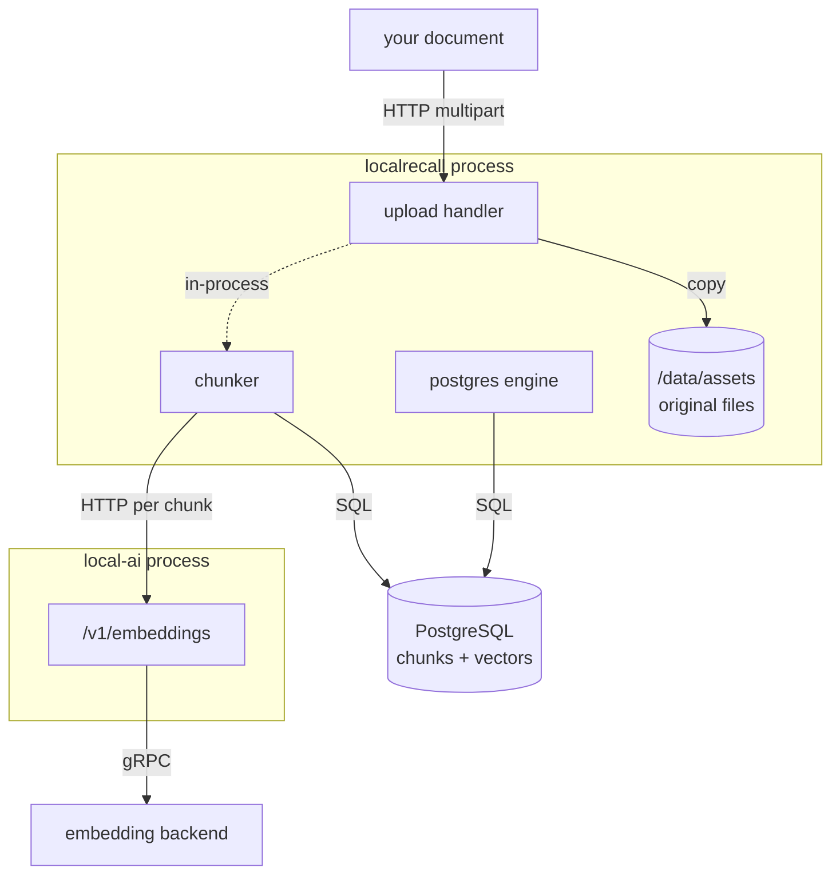
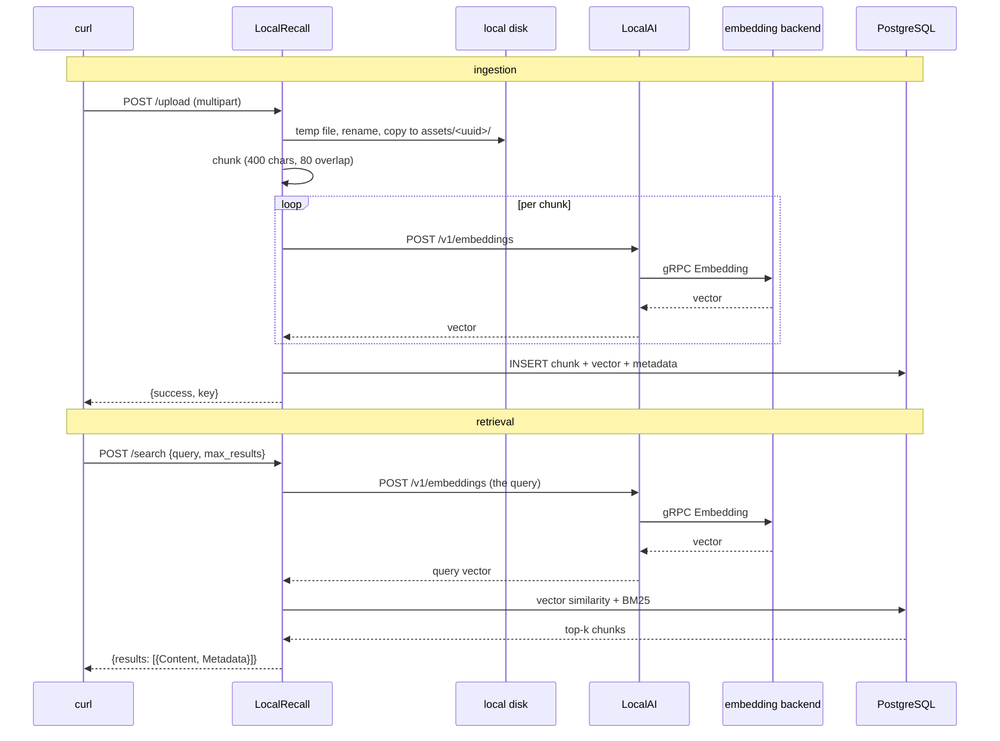

# Recipe 3 — LocalRecall: collections, ingestion and retrieval

## Goal

Store documents so they can be found by meaning rather than by keyword, and watch
each stage happen: chunking, embedding, persistence, search. This is the first
recipe with two services, and the first with data you can lose.

## Architecture

```text
 Documents
    |
    | HTTP  POST /api/collections/<name>/upload
    v
 LocalRecall  ---- HTTP /v1/embeddings ---->  LocalAI
    |                                            |
    | SQL                                        | gRPC
    v                                            v
 PostgreSQL                              embedding model
 (pgvector + pg_textsearch)
```



Note the two places your document ends up: the **original file** under
`/data/assets`, and the **chunk text plus vectors** in PostgreSQL. They are separate
stores and they must be backed up together.

## What you will learn

- a collection is created before it has content, and creating it already exercises
  the embeddings edge
- chunking is character-based, not token-based, and the defaults matter
- LocalRecall computes **no** embeddings; it is a client of LocalAI
- what a search result actually contains, including its metadata
- why LocalRecall has no health endpoint and cannot have a Docker healthcheck

## Components

| Component | Role | Port |
|---|---|---|
| LocalAI | embeddings | 8080 |
| LocalRecall | ingestion, chunking, retrieval | 8082 |
| PostgreSQL | vector and lexical storage | internal |

## Prerequisites

- Recipes 1 and 2 completed and understood
- The [reference Compose environment](https://github.com/wrkode/local-ai-stack-handbook/tree/main/compose)
- `curl`; `jq` optional

## Versions tested

```yaml
tested:
  date: 2026-08-17
versions:
  localai: "v4.8.2"
  localagi: "not used in this recipe"
  localrecall: "v0.6.4 + v0.6.4-postgresql"
environment:
  architecture: arm64 (Apple Silicon)
  host: macOS 26.5.1
  runtime: Docker Desktop 29.7.2
  vector_engine: postgres
  gpu: none
results:
  create_collection: pass
  upload_and_chunk: pass — chunk_count 1, latency 34.9 ms
  semantic_search: pass — latency 30.4 ms
```

The `chromem` engine was **not** exercised. Everything below about it is
source-verified, not tested.

## Start the environment

```bash
cd compose
cp .env.example .env
docker compose up -d
```

Four services come up: `localai`, `postgres`, `localrecall`, `localagi`. LocalAGI is
not used in this recipe; it is there because Recipe 4 needs it.

## Verify each dependency

Strictly in this order. Each check assumes the previous passed.

**1. LocalAI is up.**

```bash
curl -s http://localhost:8080/readyz
```

**2. Embeddings work.** Retrieval cannot work if this does not — verify it here
rather than discovering it three commands later.

```bash
curl -s http://localhost:8080/v1/embeddings \
  -H 'Content-Type: application/json' \
  -d '{"model":"granite-embedding-107m-multilingual","input":"probe"}' \
  | jq '.data[0].embedding | length'
```

Expected: `384`.

**3. PostgreSQL is accepting connections.**

```bash
docker exec localai-postgres pg_isready -U localrecall
```

**4. LocalRecall is up.**

```bash
curl -s http://localhost:8082/api/collections | jq
```

Expected on a fresh start:

```json
{"success":true,"message":"Collections retrieved successfully","data":{"collections":[],"count":0}}
```

!!! note "There is no health endpoint, and there cannot be a healthcheck"
    LocalRecall exposes eleven routes, all under `/api/collections`. There is no
    `/health`, no `/readyz`. `GET /api/collections` is the closest thing — but it
    answers **from disk**, without touching LocalAI, so a `200` proves the process
    is alive and proves nothing about embeddings.

    Its container image is also built `FROM scratch`: no shell, no `curl`, no
    `wget`. A Docker `CMD` healthcheck cannot run inside it at all, which is why the
    reference environment uses `service_started` for this one service and probes it
    from outside.

## Configure the system

Already configured by the Compose file, but these five values determine everything
that follows:

| Variable | Value here | Effect |
|---|---|---|
| `OPENAI_BASE_URL` | `http://localai:8080` | where embeddings come from |
| `EMBEDDING_MODEL` | `granite-embedding-107m-multilingual` | fixes the dimension at 384 |
| `VECTOR_ENGINE` | `postgres` | enables hybrid search |
| `MAX_CHUNKING_SIZE` | `400` | **characters**, not tokens |
| `CHUNK_OVERLAP` | `80` | characters carried between chunks |

Two of those deserve a warning.

**`OPENAI_BASE_URL` has no working default.** LocalRecall overwrites the OpenAI
client's default base URL unconditionally, so leaving it unset does not fall back —
it produces a bare relative `/embeddings` and every call fails. The process starts
happily and the first upload fails.

**`CHUNK_OVERLAP` defaults to `0` upstream.** We set 80 — 20% of the chunk size —
because zero overlap cuts sentences at chunk boundaries and loses whatever thought
spanned them. This is the single highest-value knob in this recipe.

## Run the request

**Create a collection.**

```bash
curl -s -X POST http://localhost:8082/api/collections \
  -H 'Content-Type: application/json' \
  -d '{"name":"handbook"}' | jq
```

This is not a bookkeeping call. It **constructs the vector engine**, which connects
to PostgreSQL and reaches the embeddings endpoint. It is the first command that
proves the whole edge works.

**Ingest a document.**

```bash
cat > /tmp/zeppelin.txt <<'EOF'
The Zeppelin-7 telemetry bus uses a heartbeat interval of 4200 milliseconds.
Operators must never set the Zeppelin-7 heartbeat below 900 milliseconds because
the flight controller drops frames at that rate.
EOF
```

```bash
curl -s -X POST http://localhost:8082/api/collections/handbook/upload \
  -F file=@/tmp/zeppelin.txt | jq
```

A deliberately invented fact. If a later answer contains it, retrieval demonstrably
happened — the model cannot have known it from training.

**List what is in the collection.**

```bash
curl -s http://localhost:8082/api/collections/handbook/entries | jq
```

**Search it.**

```bash
curl -s -X POST http://localhost:8082/api/collections/handbook/search \
  -H 'Content-Type: application/json' \
  -d '{"query":"how often does the telemetry bus send a heartbeat","max_results":3}' | jq
```

Note that the query shares almost no words with the stored text. That is the point.

## Expected result

Collection creation:

```json
{"success":true,"message":"Collection created successfully",
 "data":{"created_at":"2026-08-17T15:42:42Z","name":"handbook"}}
```

Upload — note the `key` shape, a UUID directory plus the original filename:

```json
{"success":true,"message":"File uploaded successfully",
 "data":{"collection":"handbook","created_at":"2026-08-17T15:42:42Z",
         "filename":"zeppelin.txt",
         "key":"e040fb16-4b0b-4970-9ca4-f30f909ee50d/zeppelin.txt"}}
```

Search:

```json
{"success":true,"message":"Search completed successfully",
 "data":{"count":1,"max_results":3,
   "query":"how often does the telemetry bus send a heartbeat",
   "results":[{"ID":"1",
     "Metadata":{"created_at":"2026-08-17T15:42:42Z","file_name":"zeppelin.txt",
                 "source":"e040fb16-…/zeppelin.txt","title":"e040fb16-…/zeppelin.txt",
                 "type":"file"},
     "Embedding":null,
     "Similarity":0,
     "Content":"The Zeppelin-7 telemetry bus uses a heartbeat interval of 4200 …"}]}}
```

Observed latencies: upload **34.9 ms**, search **30.4 ms**, for a 207-byte document
producing one chunk.

Three details in that response worth noticing now, because they resurface in Recipe
6:

- **`Embedding` is `null`.** Vectors are not returned. You cannot inspect them
  through this API.
- **`Metadata` carries `source` and `title` both set to the UUID path.** This whole
  map is later stringified into the model's context, Go syntax and all.
- **`Similarity` is present but returns `0`.** The field exists in the response and was
  observed as `0` on the PostgreSQL engine, so you still cannot tell how good a match this
  was — and there is no relevance threshold anywhere in the pipeline.

### What `max_results` does when you omit it

Not what you would guess. If `max_results` is absent or zero, LocalRecall sets it to
**5** when the collection holds five or more documents, and to **1** otherwise. So a
small collection silently returns a single chunk. Set it explicitly.

## What happened internally

For the upload:

1. `POST /api/collections/handbook/upload` arrives as multipart form data.
   *(inbound HTTP)*
2. The handler copies the stream to an OS temp file, then **renames it** so its base
   name matches the original filename — the index key is derived with
   `filepath.Base`. *(in-process, local disk)*
3. `Store` copies the file into a UUID subdirectory under `FILE_ASSETS`, at
   `/data/assets/handbook/<uuid>/zeppelin.txt`. The original bytes are kept.
   *(in-process, local disk)*
4. The text is chunked to 400 characters with 80 characters of word-aligned overlap.
   Observed: `content_length=207 max_chunk_size=400 chunk_overlap=80 chunk_count=1`.
   *(in-process)*
5. Each chunk is embedded by POSTing to `/v1/embeddings` on LocalAI.
   **(network HTTP)** — this happens even though everything else here is local.
6. LocalAI runs the embedding model. *(gRPC to the backend)*
7. Chunk text, vector and metadata are written to PostgreSQL. *(SQL over TCP)*

For the search:

8. `POST .../search` arrives. *(inbound HTTP)*
9. The query string is embedded — one call to `/v1/embeddings`. **(network HTTP,
   then gRPC)**
10. The engine runs the similarity query against PostgreSQL, combined with BM25
    lexical scoring when the postgres engine is in use. *(SQL)*
11. The top *k* chunks are returned with their metadata, without scores.
    *(outbound HTTP)*

Step 10's hybrid combination is source-verified; the weights were not varied, so its
*effect* was not measured. *(behaviour inferred, not traced)*

## Request flow



## Persistent state

| What | Written by | Where | Survives restart |
|---|---|---|---|
| Original document | LocalRecall | `/data/assets/handbook/<uuid>/zeppelin.txt` | yes — volume `localrecall-data` |
| Chunk text | LocalRecall | PostgreSQL table | yes — volume `postgres-data` |
| Vectors | LocalRecall | PostgreSQL, pgvector column | yes — same volume |
| Collection registry | LocalRecall | `COLLECTION_DB_PATH` = `/data/collections` | yes |
| The query and its vector | nobody | — | not stored |

**Back up `localrecall-data` and `postgres-data` together or not at all.** Restoring
only PostgreSQL leaves searchable chunks whose raw-file endpoints 404; restoring only
the assets leaves files nothing can find.

## Logs worth inspecting

LocalRecall's ingestion log is unusually good — it prints the chunking decision:

```bash
docker logs localrecall 2>&1 | grep -i chunk
```

```text
INFO Chunked file file="/data/assets/handbook/<uuid>/zeppelin.txt"
     content_length=207 max_chunk_size=400 chunk_overlap=80 chunk_count=1
```

This is the fastest way to confirm your chunk settings actually took effect.

```bash
docker logs localrecall 2>&1 | grep -i 'Storing pieces\|Stored file'
```

Shows `count_before` and `count_after`, so you can see the collection grow.

```bash
docker logs localrecall 2>&1 | tail -5
```

The Echo access log, one JSON line per request with `latency_human`. Useful for
attributing time between ingestion and embedding.

```bash
docker logs localai 2>&1 | grep -i embedding | tail -5
```

The other side of step 5 — proof the embedding calls arrived.

## Failure modes

**`502` with `Vector backend unavailable` on collection creation.**

- *Symptom:* `{"success":false,"error":{"code":"INTERNAL_ERROR","message":"Vector backend unavailable"}}`
- *Cause:* engine construction failed — embeddings unreachable, or PostgreSQL
  unreachable, or `EMBEDDING_MODEL` wrong.
- *Check:* the embeddings command from step 2, then `pg_isready`.
- *Fix:* fix the underlying edge. This status is deliberate: an earlier LocalRecall
  called `os.Exit` here and crash-looped through transient embedding outages.

**Upload returns 500 after the collection was created fine.**

- *Symptom:* creation succeeded, upload failed.
- *Cause:* creation embeds nothing; upload embeds every chunk. The embeddings edge
  is genuinely first exercised at scale here.
- *Check:* `docker logs localrecall 2>&1 | tail -20`
- *Fix:* usually `EMBEDDING_MODEL` naming or an unloadable embedding model.

**Search returns `count: 0` for text you know you ingested.**

- *Symptom:* empty results.
- *Cause, most often:* `max_results` defaulted to 1 and a different chunk won; or
  the query is genuinely distant; or `EMBEDDING_MODEL` changed since ingestion, in
  which case old vectors are no longer comparable.
- *Check:* `GET /api/collections/handbook/entries` to confirm the document is
  present, then repeat the search with `"max_results": 10`.
- *Fix:* set `max_results` explicitly. If the model changed, re-ingest — vectors
  cannot be migrated between models.

**Search returns something irrelevant rather than nothing.**

- *Symptom:* confidently wrong chunks.
- *Cause:* there is **no relevance threshold**. Top-*k* always returns *k* results
  if *k* chunks exist. Recall from Recipe 2 that unrelated text still scores ~0.54.
- *Fix:* lower `max_results`; improve chunking; use hybrid search for
  exact-identifier queries. Do not expect the pipeline to say "I found nothing".

**Collections vanish after a restart.**

- *Symptom:* `GET /api/collections` is empty after `docker compose down && up`.
- *Cause:* `COLLECTION_DB_PATH` or `FILE_ASSETS` left at their defaults, which are
  relative to the working directory — inside a `FROM scratch` image, the ephemeral
  container layer.
- *Check:* `docker exec localrecall ls /data` — but note there is no shell in that
  image, so this fails; inspect the volume from the host instead.
- *Fix:* set both explicitly, as the reference environment does.

## Troubleshooting

1. **Is LocalAI up?** `curl -s localhost:8080/readyz`
2. **Do embeddings work?** the 384-dimension check
3. **Is PostgreSQL up?** `pg_isready -U localrecall`
4. **Is LocalRecall up?** `GET /api/collections` — remember this proves nothing
   about embeddings
5. **Can a collection be created?** the `POST` — this *does* prove the edge
6. **Did ingestion chunk anything?** the `Chunked file` log line
7. **Does search return the chunk?** with an explicit `max_results`

Steps 1–3 are the ones people skip and the ones that are usually wrong.
[`verify-stack.sh`](https://github.com/wrkode/local-ai-stack-handbook/blob/main/scripts/verify-stack.sh)
runs exactly this sequence.

More: [LocalRecall troubleshooting](../03-localrecall/troubleshooting.md).

## Cleanup

Remove the collection's contents:

```bash
curl -s -X POST http://localhost:8082/api/collections/handbook/reset | jq
```

Note what `reset` does: it clears the collection **and removes it from the server's
in-memory registry**. It is closer to a delete than a truncate.

Remove a single document instead:

```bash
curl -s -X DELETE http://localhost:8082/api/collections/handbook/entry/delete \
  -H 'Content-Type: application/json' \
  -d '{"entry":"zeppelin.txt"}' | jq
```

Tear the environment down, keeping models:

```bash
docker compose down
```

Delete all knowledge too:

```bash
docker compose down
docker volume rm localai-stack_postgres-data localai-stack_localrecall-data
```

Models in `localai-models` are deliberately kept — they are the slow part.

## Variations

**Use `chromem` instead of PostgreSQL.** Set `VECTOR_ENGINE=chromem`, drop the
`postgres` service. Vectors move into a file under `localrecall-data`. You lose
hybrid search and multi-process access. Not exercised in our run.

**Watch chunking actually split something.** Ingest a document longer than 400
characters and read the log:

```bash
docker logs localrecall 2>&1 | grep 'Chunked file' | tail -1
```

`chunk_count` above 1 means you can now see overlap behaviour, and you can compare
`CHUNK_OVERLAP=0` against `80` on the same text. This is the most instructive
experiment in the recipe.

**Register an external source.** LocalRecall can poll a URL and re-ingest it:

```bash
curl -s -X POST http://localhost:8082/api/collections/handbook/sources \
  -H 'Content-Type: application/json' \
  -d '{"url":"https://example.com/handbook.md","update_interval":60}' | jq
```

`update_interval` is in **minutes** and defaults to 60 if you send anything below 1.
This makes a collection a moving target — and a
[knowledge-poisoning surface](../06-deployment/security.md) if the URL is not yours.

**Retrieve the original file**, not the chunk:

```bash
curl -s http://localhost:8082/api/collections/handbook/entries/zeppelin.txt/raw
```

This is served from `/data/assets`, which is why that volume matters.

## Upstream references

- [LocalRecall `routes.go`](https://github.com/mudler/LocalRecall/blob/v0.6.4/routes.go) — all eleven routes; upload temp-file rename at 429-451; the `max_results` 5-or-1 default at 297-303; `reset` deleting the registry entry at 257-277; the deliberate 502 at 207-212. Validated against v0.6.4.
- [LocalRecall `main.go`](https://github.com/mudler/LocalRecall/blob/v0.6.4/main.go) — unconditional base-URL overwrite at 60-63; chunk defaults 400 and 0 at 72-88; working-directory-relative paths at 33-45.
- [LocalRecall `pkg/chunk/chunking.go`](https://github.com/mudler/LocalRecall/blob/v0.6.4/pkg/chunk/chunking.go) — character-based sizing, word-aligned overlap, long-word splitting.
- [LocalRecall `rag/persistency.go`](https://github.com/mudler/LocalRecall/blob/v0.6.4/rag/persistency.go) — asset copy into a UUID directory, the `Chunked file` and `Stored file` log lines.
- [LocalRecall `rag/engine/postgres.go`](https://github.com/mudler/LocalRecall/blob/v0.6.4/rag/engine/postgres.go) — hybrid search weights at 63-94; `pg_textsearch` requirement at 215-218; BM25 index at 290-293.
- [LocalRecall `rag/source_manager.go`](https://github.com/mudler/LocalRecall/blob/v0.6.4/rag/source_manager.go) — external source polling.
- [LocalRecall `Dockerfile`](https://github.com/mudler/LocalRecall/blob/v0.6.4/Dockerfile) — `FROM scratch`, hence no in-container healthcheck.
- Latencies, chunk log output, response bodies and metadata shape: observed 2026-08-17, see [version matrix](../00-overview/version-matrix.md).
