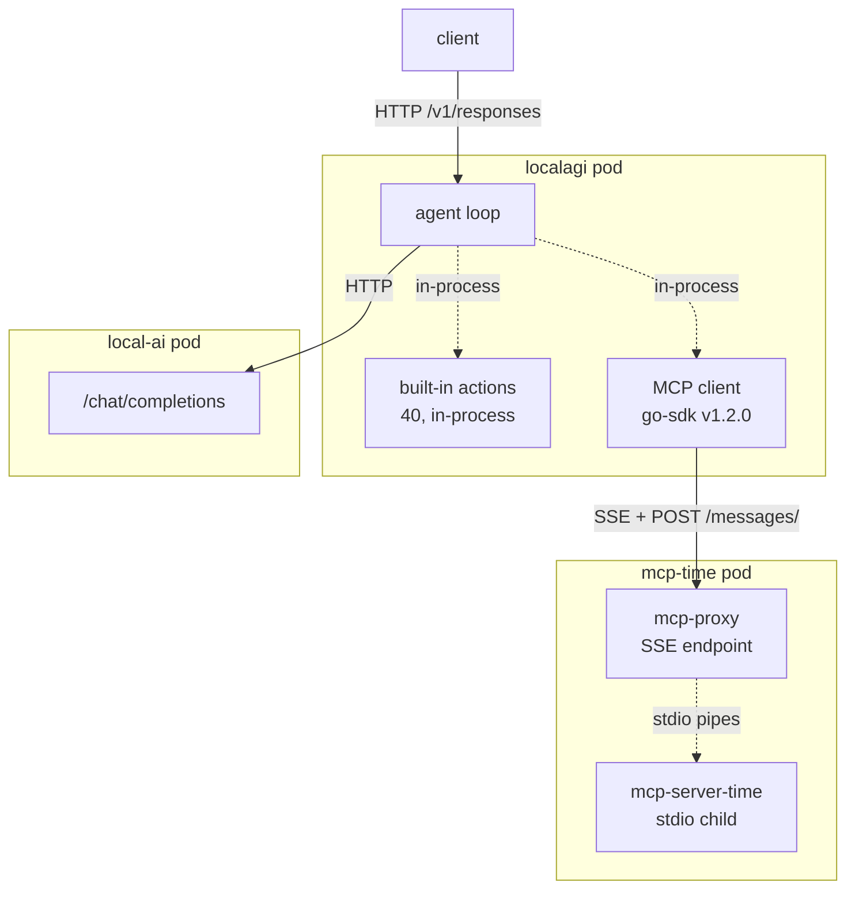
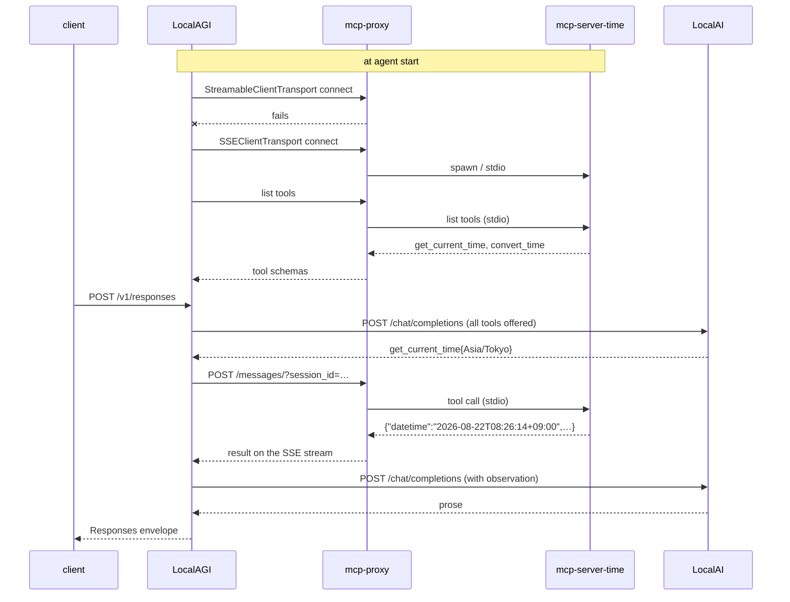

# Recipe 7 — An MCP agent

## Goal

Give the agent a capability that lives **outside its process**, reached over the Model Context
Protocol. Recipe 5's tool was a Go function call inside LocalAGI; this one crosses a boundary you
can firewall, restart and audit independently.

## Architecture

```text
                  LocalAGI
                      |
        +-------------+-------------+
        |                           |
   built-in action            MCP server
   (in-process)              (its own pod)
```



Note the two hops on the right. LocalAGI speaks HTTP to `mcp-proxy`; `mcp-proxy` speaks stdio to
the actual server. The reason for that bridge is the most practical finding in this recipe.

## What you will learn

- MCP is a **transport and discovery** mechanism, not a decision-maker
- which transport LocalAGI actually speaks, and its fallback
- why the `npx`/`uvx` reference-server ecosystem cannot run as a stdio child of LocalAGI
- that tool discovery happens at **agent start**, so a server that is not up yet leaves the agent
  silently short of tools
- that MCP tools are indistinguishable from built-in actions once the model sees them

## Components

| Component | Role | Port |
|---|---|---|
| LocalAI | inference | 8080 |
| LocalAGI | agent loop, MCP **client** | 3000 |
| `mcp-proxy` | stdio → SSE bridge | 8080 |
| `mcp-server-time` | the capability: `get_current_time`, `convert_time` | stdio child |

## Prerequisites

- [Recipe 5](agent-with-tools.md) completed. MCP changes only *where* a tool lives, so debug
  tool calling with a built-in action first
- A running stack. This recipe was validated on Kubernetes; the same agent configuration works
  under Compose with the MCP server as another service

## Versions tested

```yaml
tested:
  date: 2026-08-17
versions:
  localai: "v4.8.2-gpu-nvidia-cuda-12"
  localagi: "v2.8.1 (image)"
  mcp_proxy: "0.12.0"
  mcp_server_time: "2026.8.18"
  mcp_go_sdk: "v1.2.0 (pinned by LocalAGI)"
environment:
  platform: kubernetes, k0s v1.34.3
  node: bare metal amd64, NVIDIA Quadro RTX 6000
  transport: SSE (Streamable HTTP attempted first, then fell back)
results:
  tool_discovery: pass
  get_current_time: pass — 2.6 s
  convert_time: pass
  cross_pod_boundary_confirmed: yes
```

## Start the environment

The MCP server runs as its own workload:

```bash
kubectl apply -f examples/07-mcp/mcp-time-k8s.yaml
```

```bash
kubectl -n localai-stack rollout status deploy/mcp-time
```

!!! warning "Why a bridge, and not just `cmd: npx ...`"
    `mcp-server-time` speaks **stdio only** — its documented invocation is `docker run -i`, and it
    has no `--transport` flag. LocalAGI *can* run stdio servers, but as **child processes of its
    own container**, and the v2.8.1 image contains no runtime to run them with:

    ```text
    node MISSING    npx MISSING    python3 MISSING    uvx MISSING
    bash /usr/bin/bash   curl /usr/bin/curl   docker /usr/bin/docker   git /usr/bin/git
    ```

    So the whole `npx @modelcontextprotocol/server-*` and `uvx mcp-server-*` ecosystem — which is
    most reference servers — **cannot run as a stdio child of LocalAGI as shipped.**

    Three ways out, in preference order:

    | Approach | Trade-off |
    |---|---|
    | **Bridge to HTTP**, as here | server gets its own lifecycle and is network-policyable. Recommended |
    | `mcp_prepare_script` | runs `/bin/bash -c <script>` **before** MCP setup, so it can install a runtime or fetch a static binary into the container |
    | Custom LocalAGI image | adds a build step you now own |

    A statically linked Go or Rust MCP server needs none of this and works as a stdio child
    directly.

## Verify each dependency

**1. Tool calling already works.** Do not debug MCP against an agent that cannot call a local
tool.

```bash
curl -s http://localhost:18081/api/agent/tool-probe/status | jq -r '.History[]'
```

**2. The MCP server is serving.** Its own log states the endpoint:

```bash
kubectl -n localai-stack logs deploy/mcp-time | tail -5
```

```text
mcp-proxy                 0.12.0
mcp-server-time           2026.8.18
[I] Serving MCP Servers via SSE:
[I]   - http://0.0.0.0:8080/sse
INFO:     Uvicorn running on http://0.0.0.0:8080
```

**3. It is reachable from the agent's pod**, which is where DNS and NetworkPolicy apply:

```bash
kubectl -n localai-stack exec deploy/localagi -- curl -s --max-time 5 http://mcp-time:8080/sse
```

An SSE endpoint holds the connection open, so **`curl` exiting with code 28 (timeout) is success
here.** A `connection refused` is the failure you are looking for.

## Configure the system

**Create the agent only after the server is serving** — see the note below.

```bash
curl -s -X POST http://localhost:18081/api/agent/create \
  -H 'Content-Type: application/json' \
  -d '{
    "name": "mcp-probe",
    "model": "qwen3-1.7b",
    "system_prompt": "You use external tools when asked. Be terse and factual.",
    "strip_thinking_tags": true,
    "mcp_servers": [{"url": "http://mcp-time:8080/sse"}],
    "max_attempts": 1
  }'
```

`mcp_servers` takes `{url, token}`. `token` is omitted here because the server is unauthenticated
on an internal network; when you set it, remember it is stored **in plain text** in the agent's
JSON on disk.

The stdio form is a separate list:

```json
"mcp_stdio_servers": [{"name": "files", "cmd": "/usr/local/bin/server", "args": ["--root", "/data"], "env": ["LOG_LEVEL=info"]}]
```

| Transport | Field | Server lifetime | Fails as |
|---|---|---|---|
| HTTP | `mcp_servers` | independent | connection refused, 401, timeout |
| stdio | `mcp_stdio_servers` | **child process of LocalAGI** | exec failure, immediate exit, protocol error |

!!! danger "Discovery happens at agent start — ordering is load-bearing"
    We hit this on the first attempt. The agent was created at `23:24:51`; the MCP server only
    began serving at `23:24:55`, four seconds later. Result:

    ```text
    ERROR Failed to connect to MCP server via SSEClientTransport
          server="{URL:http://mcp-time:8080/sse Token:}"
          error="dial tcp 10.96.16.69:8080: connect: connection refused"
    INFO  Done populating actions from MCP Servers
    INFO  Agent started name=mcp-probe
    ```

    Note the last two lines: the agent **started successfully with no MCP tools**, and answered
    requests normally without them. The error is logged at ERROR level, but nothing fails.

    Tools are not re-discovered later. **Delete and recreate the agent** after the server is up:

    ```bash
    curl -s -X DELETE http://localhost:18081/api/agent/mcp-probe
    ```

## Run the request

Ask for something the model cannot know without the tool:

```bash
curl -s http://localhost:18081/v1/responses \
  -H 'Content-Type: application/json' \
  -d '{"model":"mcp-probe","input":"What is the current time in Asia/Tokyo? Use your tools."}' \
  | jq -r '.output[0].content[0].text'
```

Then read what actually ran:

```bash
curl -s http://localhost:18081/api/agent/mcp-probe/status | jq -r '.History[]'
```

## Expected result

```text
The current time in Asia/Tokyo is **08:26 AM** (Saturday, 22 August 2026).
No daylight saving time adjustments are in effect.
```

Latency **2.6 s** on a GPU-backed LocalAI. And the history:

```text
Reasoning:
			Action taken: get_current_time
			Parameters: {"timezone":"Asia/Tokyo"}
			Result: {
			  "timezone": "Asia/Tokyo",
			  "datetime": "2026-08-22T08:26:14+09:00",
			  "day_of_week": "Saturday",
			  "is_dst": false
```

The second tool works the same way:

```bash
curl -s http://localhost:18081/v1/responses \
  -H 'Content-Type: application/json' \
  -d '{"model":"mcp-probe","input":"Convert 09:00 from Europe/Rome to America/New_York using your tools."}' \
  | jq -r '.output[0].content[0].text'
```

Observed: `03:00`, a `-6.0h` difference — correct for August, when Rome is UTC+2 and New York is
UTC−4.

!!! note "`History` does not distinguish MCP tools from built-in actions"
    Compare that entry with [Recipe 5's](agent-with-tools.md#expected-result) `counter` entry: same
    shape, same fields, no marker saying one crossed a process boundary and the other did not.

    That is the design. By the time the model chooses, both are just tools with JSON schemas — and
    it is also why MCP is a **trust** boundary and not a **permission** boundary.

## What happened internally

1. At agent start, LocalAGI constructs an MCP client and tries
   **`StreamableClientTransport`** against the configured URL. *(network HTTP)*
2. That fails against this `/sse` endpoint, so it falls back to **`SSEClientTransport`**.
   *(network HTTP)* — `core/agent/mcp.go:158-166`
3. It opens an SSE stream and lists the server's tools. `mcp-proxy` forwards the request over
   stdio pipes to `mcp-server-time`. *(stdio, inside the mcp-time pod)*
4. Each discovered tool is wrapped as an ordinary agent action carrying the schema the server
   advertised. Logged: `Done populating actions from MCP Servers`. *(in-process)*
5. On a request, the wrapped MCP tools are offered to the model **in the same list** as the 40
   built-in actions. *(in-process)*
6. The loop calls `/chat/completions`. **(network HTTP → gRPC)**
7. The model emits `get_current_time{timezone: "Asia/Tokyo"}`. It cannot tell this tool is remote.
8. The wrapper issues an MCP tool call. On the SSE transport, client→server messages go as
   **`POST /messages/?session_id=<id>`** while responses arrive on the open stream.
   **(network HTTP)**
9. `mcp-proxy` relays it over stdio; the server answers with JSON. *(stdio)*
10. The result is appended as an observation and the loop continues. *(in-process)*

Steps 1–4 were confirmed from LocalAGI's log and the source; step 8 from the server's access log
(below). The internal stdio framing between proxy and server was **not** traced.

## Request flow



## Persistent state

| What | Written by | Where | Survives restart |
|---|---|---|---|
| MCP server configuration | LocalAGI pool | `/pool` JSON, **including any token in plain text** | yes |
| Discovered tool schemas | LocalAGI, in memory | memory | **no** — re-discovered at agent start |
| Whatever the MCP tool changed | **the MCP server** | wherever it stores things | **outside this stack** |

The `time` server is stateless, which is part of why it is the right first MCP server. A server
that writes things puts its side effects outside your backups and outside
`kubectl delete namespace` — see [security](../06-deployment/security.md).

## Logs worth inspecting

```bash
kubectl -n localai-stack logs deploy/localagi | grep -iE 'mcp|Failed to connect'
```

The discovery result. `Failed to connect to MCP server via …` means this agent has fewer tools than
you think.

```bash
kubectl -n localai-stack logs deploy/mcp-time | grep -E 'POST|session'
```

The other side of the boundary — and the proof it was crossed:

```text
INFO: 10.244.172.216:53246 - "POST /messages/?session_id=9337da7bba…" 202 Accepted
```

`10.244.172.216` is the LocalAGI pod's IP:

```bash
kubectl -n localai-stack get pod -l app=localagi -o jsonpath='{.items[0].status.podIP}'
```

Matching those two is how you prove the hop happened rather than assuming it.

```bash
curl -s http://localhost:18081/api/agent/mcp-probe/status | jq -r '.History[]'
```

Ground truth for arguments and results — last ten only, in memory.

## Failure modes

**The agent has no MCP tools and answers vaguely.**

- *Symptom:* plausible answers, empty `History`, no MCP lines in the log.
- *Cause:* discovery failed at agent start — most often the server was not up yet.
- *Check:* `kubectl -n localai-stack logs deploy/localagi | grep -i mcp`
- *Fix:* bring the server up, then **delete and recreate the agent**. Restarting the agent's pod
  also re-runs discovery.

**`connection refused` in the discovery error.**

- *Cause:* wrong Service name or port, or the server not listening on `0.0.0.0`.
- *Check:* `kubectl -n localai-stack exec deploy/localagi -- curl -s --max-time 5 <url>`
- *Fix:* `mcp-proxy` defaults to `127.0.0.1`; it needs `--host=0.0.0.0` to be reachable from
  another pod.

**`FileNotFoundError: 'uvx'` in the MCP server's log.**

- *Cause:* we hit this. The `ghcr.io/sparfenyuk/mcp-proxy` image does **not** bundle `uv`/`uvx`,
  so `mcp-proxy … uvx mcp-server-time` cannot spawn its child.
- *Fix:* use a base image that has the runtime and install both packages, as the shipped manifest
  does.

**stdio server exits immediately.**

- *Cause:* `cmd` not present in the LocalAGI container — the usual case, given no node or python.
- *Fix:* bridge to HTTP, use `mcp_prepare_script`, or use a static binary. Note that **stdout is
  the protocol channel**: a server that logs to stdout corrupts the stream, so its diagnostics must
  go to stderr.

**401 from an HTTP server.**

- *Cause:* `token` wrong or absent. It is per-server, not global.
- *Fix:* set `token` in that entry of `mcp_servers`.

**The model never chooses the MCP tool.**

- *Cause:* the same small-model limitation as Recipe 5, not an MCP problem. Note the tool
  *description* comes from the **server**, so you may not control it.
- *Fix:* verify with a built-in tool first; say "use your tools" in the prompt; try a larger model.

## Troubleshooting

1. **Does inference work?** LocalAI directly
2. **Does a built-in tool work?** Recipe 5's `counter`
3. **Is the MCP server serving?** its own log, and the endpoint it prints
4. **Is it reachable from the agent's pod?** `exec … curl` — timeout means success on SSE
5. **Did LocalAGI discover the tools?** the MCP log lines
6. **Did the model select one?** `History`
7. **Did the server see the call?** its access log, matched against the agent's pod IP

Step 2 is the one that saves the most time: if a local tool does not work, MCP cannot.

## Cleanup

```bash
curl -s -X DELETE http://localhost:18081/api/agent/mcp-probe
```

```bash
kubectl delete -f examples/07-mcp/mcp-time-k8s.yaml
```

Deleting the agent stops any stdio child process and stops HTTP calls. It does **not** undo
anything an MCP tool did elsewhere — with `time` there is nothing to undo, which is the point of
starting here.

## Variations

**Both transports on one agent.** `mcp_servers` and `mcp_stdio_servers` are independent lists;
tools from both merge into the same offered set.

**Constrain a server that can actually do damage.** Swap `time` for a filesystem server mounted
**read-only**, then ask the agent to write a file. It fails at the boundary, not in the prompt —
which is the whole argument of
[the security model](../07-deep-dives/security-model.md). MCP has no permission model of its own:
if the model can name the tool, it can call it with arguments it chose.

**Demonstrate indirect prompt injection.** Point a `fetch`-style server at a page **you control**
that contains instructions, and watch them reach the model as tool output. Worth doing once, on a
throwaway deployment, because it makes the threat concrete. Do not leave it enabled.

**LocalAI as an MCP *server*.** LocalAI v4.8.2 logs
`LocalAI Assistant in-memory MCP server initialised tools=36 read_only=false` — 36 administrative
tools over the model runtime, not read-only. We probed `/mcp`, `/api/mcp` and `/mcp/sse` and all
returned 404, so we found no default external path; treat it as a privilege surface for LocalAI's
own Assistant rather than something you connect an agent to.

## Upstream references

- [LocalAGI `core/agent/mcp.go`](https://github.com/mudler/LocalAGI/blob/v2.9.0/core/agent/mcp.go) — `MCPServer{url, token}` at 22-25 and `MCPSTDIOServer{name, cmd, args, env}` at 27-32; `StreamableClientTransport` then `SSEClientTransport` fallback at 158-166; `mcp_prepare_script` via `/bin/bash -c` at 184; `exec.Command` + `CommandTransport` for stdio at 193-198. Validated against v2.9.0.
- [LocalAGI `core/state/config.go`](https://github.com/mudler/LocalAGI/blob/v2.9.0/core/state/config.go) — `mcp_servers`, `mcp_stdio_servers`, `mcp_prepare_script`.
- [LocalAGI `go.mod`](https://github.com/mudler/LocalAGI/blob/v2.9.0/go.mod) — `github.com/modelcontextprotocol/go-sdk v1.2.0`.
- [Model Context Protocol specification](https://modelcontextprotocol.io) — transports, tool discovery, and why stdout is the protocol channel.
- [`mcp-server-time`](https://github.com/modelcontextprotocol/servers/tree/main/src/time) — `get_current_time`, `convert_time`, `--local-timezone`; stdio only.
- [`sparfenyuk/mcp-proxy`](https://github.com/sparfenyuk/mcp-proxy) — the stdio→SSE bridge, `--host`, `--port`, `/sse`.
- Absence of node/npx/python3/uvx in the LocalAGI v2.8.1 image; the discovery-ordering failure and its log lines; the `uvx` FileNotFoundError; both tool calls and their results; the `POST /messages/?session_id=` access-log lines matched to the LocalAGI pod IP: observed 2026-08-17, see [version matrix](../00-overview/version-matrix.md).
