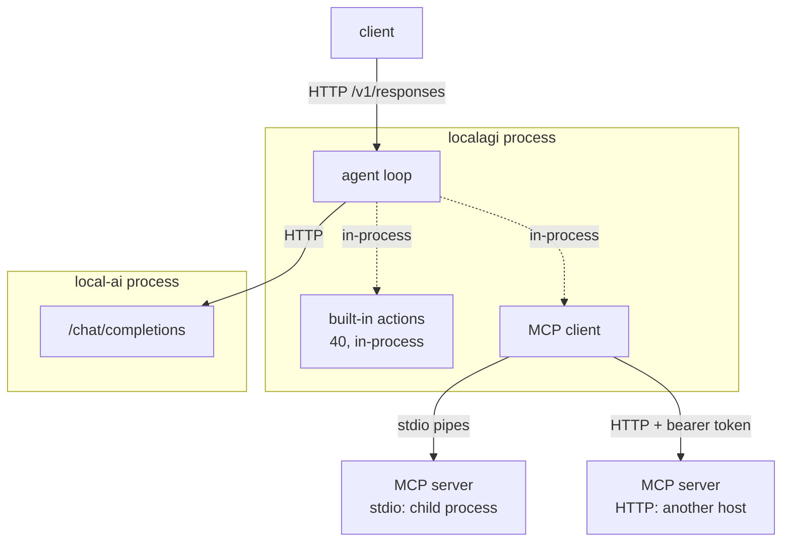
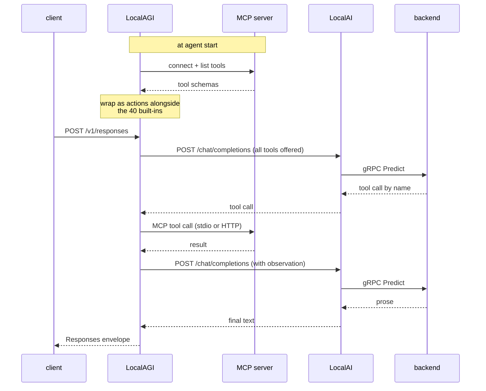

# Recipe 7 — An MCP agent

## Goal

Give the agent a capability that lives **outside** its process, reached over the Model
Context Protocol. Recipe 5's tool was a Go function call; this one crosses a boundary
you can firewall, audit and get wrong.

## Architecture

```text
                  LocalAGI
                      |
        +-------------+-------------+
        |                           |
   built-in action            MCP server
   (in-process)          (subprocess or HTTP)
```



## What you will learn

- MCP is a **transport and discovery** mechanism, not a decision-maker
- the two transports LocalAGI supports, and how differently they fail
- tools are discovered at agent start, so a missing server is a startup problem
- why every MCP server is a trust boundary

## Components

| Component | Role |
|---|---|
| LocalAI | inference |
| LocalAGI | agent loop, MCP **client** |
| An MCP server | the external capability |

## Prerequisites

- Recipe 5 completed. Tool calling must already work, because this recipe changes only
  *where the tool lives*
- An MCP server you trust

## Versions tested

> **Not yet validated.** No MCP server was run. The configuration below is derived from
> LocalAGI v2.9.0 source and its configuration schema; the commands have not been
> executed end to end. Every other recipe in this path was executed — this one is the
> exception, and it is marked rather than implied. See the
> [version matrix](../00-overview/version-matrix.md#not-yet-validated).

## Start the environment

```bash
cd compose
docker compose up -d
```

## Verify each dependency

**1. Tool calling already works.** Do not debug MCP against an agent that cannot call a
local tool. Complete [Recipe 5](agent-with-tools.md) first and confirm:

```bash
curl -s http://localhost:8081/api/agent/tool-probe/status | jq -r '.History[]'
```

**2. The MCP server runs on its own.** For a stdio server, run the exact command
LocalAGI will run, by hand, in the same environment:

```bash
docker exec localagi <your-mcp-command> --help
```

The binary must exist **inside the LocalAGI container**. This is the single most common
MCP failure: a command that works on your host and is absent in the image.

**3. For an HTTP server, that it answers from inside the container:**

```bash
docker exec localagi curl -s -o /dev/null -w '%{http_code}\n' http://<mcp-host>:<port>/
```

## Configure the system

Two transports, two config keys. They are separate lists and an agent may use both.

**HTTP transport** — `mcp_servers`, taking `url` and `token`:

```bash
curl -s -X POST http://localhost:8081/api/agent/create \
  -H 'Content-Type: application/json' \
  -d '{
    "name": "mcp-probe",
    "model": "qwen3-1.7b",
    "system_prompt": "You use external tools when asked. Be terse.",
    "strip_thinking_tags": true,
    "mcp_servers": [
      {"url": "http://mcp-example:9090", "token": "<bearer-token>"}
    ],
    "max_attempts": 1
  }' | jq
```

**stdio transport** — `mcp_stdio_servers`, taking `cmd`, `args`, `env` and an optional
`name`:

```bash
curl -s -X POST http://localhost:8081/api/agent/create \
  -H 'Content-Type: application/json' \
  -d '{
    "name": "mcp-stdio-probe",
    "model": "qwen3-1.7b",
    "strip_thinking_tags": true,
    "mcp_stdio_servers": [
      {"name": "files", "cmd": "/usr/local/bin/mcp-filesystem",
       "args": ["--root", "/data/readonly"], "env": ["LOG_LEVEL=info"]}
    ],
    "max_attempts": 1
  }' | jq
```

`<bearer-token>`, the command path and the args are environment-specific. `cmd` must be
resolvable inside the LocalAGI container.

| Transport | Field | Server lifetime | Fails as |
|---|---|---|---|
| HTTP | `mcp_servers` | independent of the agent | connection refused, 401, timeout |
| stdio | `mcp_stdio_servers` | **child process of LocalAGI** | exec failure, immediate exit, protocol error |

The lifetime difference is the practical one. A stdio server is a subprocess LocalAGI
spawns and pipes to; if it exits, its tools vanish and there is nothing to restart
independently. An HTTP server is a service with its own lifecycle.

## Run the request

```bash
curl -s http://localhost:8081/v1/responses \
  -H 'Content-Type: application/json' \
  -d '{"model": "mcp-probe", "input": "<a request that requires the MCP tool>"}' \
  | jq -r '.output[0].content[0].text'
```

Then check what ran — the same endpoint as Recipe 5, because MCP tools appear alongside
built-in ones:

```bash
curl -s http://localhost:8081/api/agent/mcp-probe/status | jq -r '.History[]'
```

## Expected result

An answer that could only come from the external capability, and a `History` entry
naming the MCP tool with its arguments and result.

The important structural point: **`History` does not distinguish MCP tools from built-in
actions.** By the time the agent chooses, both are just tools with JSON schemas. That is
the design — and it is why the next section matters.

## What happened internally

1. At agent start, LocalAGI connects to each configured MCP server and calls the
   protocol's tool-listing method. *(subprocess spawn, or network HTTP)*
2. Each discovered tool is wrapped as an ordinary agent action with the schema the
   server advertised. *(in-process)*
3. On a request, the wrapped MCP tools are offered to the model **in the same list** as
   the 40 built-in actions. *(in-process)*
4. The loop calls `/chat/completions` with the combined tool list. **(network HTTP →
   gRPC)**
5. The model selects a tool by name. It cannot tell MCP tools from local ones.
6. If the selection is an MCP tool, the wrapper issues an MCP tool-call over that
   server's transport. **(stdio pipes, or network HTTP)**
7. The result is appended as an observation. *(in-process)*
8. The loop continues, exactly as in Recipe 5.

*(Not traced. Steps 1–8 are derived from `core/agent/mcp.go` and the action-assembly
path; no MCP server was run.)*

## Request flow



## Persistent state

| What | Written by | Where | Survives restart |
|---|---|---|---|
| MCP server configuration | LocalAGI pool | `/pool` JSON, **including tokens** | yes |
| Discovered tool schemas | LocalAGI, in memory | memory | no — re-discovered at start |
| Whatever the MCP server changed | **the MCP server** | wherever it stores things | **outside this stack entirely** |

The last row is the security-relevant one. Side effects of MCP tools are not this
stack's state and not in its backups. An agent that opened a GitHub issue has changed
something no `docker compose down -v` will undo.

The first row matters too: **bearer tokens are stored in the agent's JSON on disk**, in
plain text. Treat `localagi-pool` as a secret-bearing volume.

## Logs worth inspecting

```bash
docker logs localagi 2>&1 | grep -i mcp
```

Connection and discovery at startup. Absence of these lines means no MCP server was
reached and the agent silently has fewer tools.

```bash
docker logs localagi 2>&1 | grep -i -E 'action|tool' | tail -20
```

Dispatch.

```bash
curl -s http://localhost:8081/api/agent/mcp-probe/status | jq -r '.History[]'
```

Ground truth for what ran.

## Failure modes

**The agent has no MCP tools and says so vaguely.**

- *Symptom:* generic answers, no MCP lines in the log, `History` empty.
- *Cause:* discovery failed at agent start.
- *Check:* `docker logs localagi 2>&1 | grep -i mcp`
- *Fix:* for stdio, confirm `cmd` exists **in the container**; for HTTP, confirm the URL
  resolves from inside the container.

**stdio server exits immediately.**

- *Symptom:* tools present briefly, then gone; or never present.
- *Cause:* the command failed — wrong path, missing runtime, bad args, or it wrote to
  stdout in a way that broke the protocol framing.
- *Check:* run the exact command with `docker exec`.
- *Fix:* note that **stdout is the protocol channel**. An MCP server that logs to stdout
  corrupts the stream. Its diagnostics must go to stderr.

**HTTP server returns 401.**

- *Cause:* `token` wrong or absent.
- *Check:* `docker exec localagi curl -H 'Authorization: Bearer <token>' <url>`
- *Fix:* correct the token in the agent config, not in the environment — it is
  per-server.

**The model never chooses the MCP tool.**

- *Cause:* the same small-model limitation as Recipe 5, not an MCP problem. The tool
  description the *server* advertises is what the model sees, and you may not control
  it.
- *Fix:* verify with a built-in tool first; try a larger model; if the server's tool
  descriptions are poor there is little you can do from this side.

**Tool call times out and the agent hangs.**

- *Cause:* MCP calls happen inside the agent loop; a slow server extends the whole
  request.
- *Fix:* raise client and proxy timeouts, and prefer MCP servers with their own internal
  timeouts.

## Troubleshooting

1. **Does inference work?** LocalAI directly
2. **Does a built-in tool work?** Recipe 5's `counter`
3. **Does the MCP server run standalone?** by hand, inside the container
4. **Did LocalAGI discover its tools?** the MCP log lines
5. **Did the model select the tool?** `History`
6. **Did the tool return or hang?** compare request duration against the server's own
   log

Step 2 is the one that saves time: if a local tool does not work, MCP cannot.

More: [MCP](../02-localagi/mcp.md) · [security](../06-deployment/security.md).

## Cleanup

```bash
curl -s -X DELETE http://localhost:8081/api/agent/mcp-probe | jq
```

Deleting the agent stops any stdio child process and stops HTTP calls. It does **not**
undo anything the MCP tools did — that is outside this stack.

## Variations

**Both transports on one agent.** `mcp_servers` and `mcp_stdio_servers` are independent
lists; tools from both merge into the same offered set.

**LocalAI as an MCP *server*.** LocalAI v4.8.2 hosts an MCP server in-process and, on a
stock container, logs **36 tools registered, writable by default** — exposing its own
administration surface to any MCP client. This is the opposite direction to everything
above and is unrelated except in name. An agent given LocalAI's MCP endpoint can
administer the model runtime it is running on. Read
[security](../06-deployment/security.md) before doing this deliberately, and check
whether you are doing it accidentally.

**Restrict what a server can reach.** MCP has no permission model of its own: if the
model can name the tool, it can call it with arguments it chose. Constrain at the
boundary instead — a read-only root for a filesystem server, a scoped token for an API
server, network policy for an HTTP server. See
[security model](../07-deep-dives/security-model.md).

## Upstream references

- [LocalAGI `core/agent/mcp.go`](https://github.com/mudler/LocalAGI/blob/v2.9.0/core/agent/mcp.go) — `MCPServer{url, token}` at 22-25, `MCPSTDIOServer{name, cmd, args, env}` at 27-32, and the wrapper that turns an MCP tool into an agent action at 34+. Validated against v2.9.0.
- [LocalAGI `core/state/config.go`](https://github.com/mudler/LocalAGI/blob/v2.9.0/core/state/config.go) — `mcp_servers`, `mcp_stdio_servers`, `mcp_prepare_script`.
- [Model Context Protocol specification](https://modelcontextprotocol.io) — transports, tool discovery, and why stdout is the protocol channel.
- [`modelcontextprotocol/go-sdk`](https://github.com/modelcontextprotocol/go-sdk) — the client LocalAGI uses.
- LocalAI's in-process MCP server, 36 tools registered and writable by default: observed 2026-08-17, see [version matrix](../00-overview/version-matrix.md).
