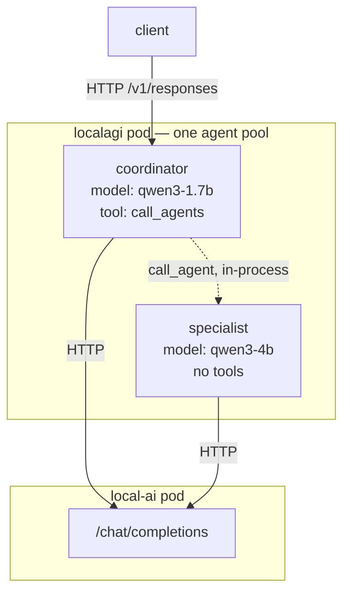
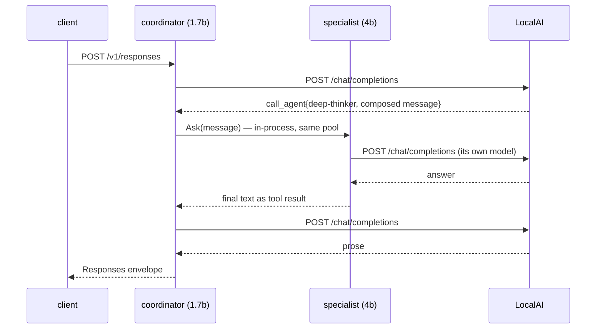

# Recipe 9 — Multi-agent delegation

## Goal

Let one agent call another. Delegation here is not a separate subsystem — it is a built-in tool,
`call_agents`, and understanding that explains both what it can do and where its only safety
control lives.

## Architecture

```text
        You
         |
   coordinator agent   (only tool: call_agents, whitelisted)
         |
         | in-process, same pool
         v
   specialist agent    (no tools, its own model)
         |
      LocalAI
```



Both agents live in the **same pool, in the same process**. Delegation is a Go call — but each
agent runs its own loop and makes its own model calls, and they may use **different models**.

## What you will learn

- delegation is a tool, subject to the same model-selection uncertainty as any tool
- `agent_name` is a constrained **enum**, so an agent name cannot be hallucinated
- `whitelist` is the only access control, and **omitting it offers the entire pool**
- the coordinator **composes** the delegated message; it does not forward yours verbatim
- a tool-less specialist has an **empty** `History`, so the log is your proof it ran
- per-agent `model` makes "route hard questions to a bigger model" a config change

## Components

| Component | Role | Model |
|---|---|---|
| LocalAI | inference for every agent | — |
| LocalAGI | one pool holding all agents | — |
| `coordinator` | delegates; only tool is `call_agents` | qwen3-1.7b |
| `unit-converter` | the specialist; no tools | qwen3-1.7b |
| `deep-thinker` | cross-model specialist | **qwen3-4b** |

## Prerequisites

- [Recipe 5](agent-with-tools.md) completed. Delegation is a tool; if tool calling is unreliable,
  delegation will be worse
- A running stack. Validated on Kubernetes with a GPU-backed LocalAI

## Versions tested

```yaml
tested:
  date: 2026-08-17
versions:
  localai: "v4.8.2-gpu-nvidia-cuda-12"
  localagi: "v2.8.1 (image)"
environment:
  platform: kubernetes, k0s v1.34.3
  node: bare metal amd64, NVIDIA Quadro RTX 6000
  models: qwen3-1.7b and qwen3-4b, both resident
results:
  same_model_delegation: pass — 10.6 s cold, 7.5 s warm
  cross_model_delegation: pass — 37.5 s cold (model load), 7.8 s warm
  whitelist_narrows_enum: pass — 4 agents to 1
  blacklist_removes_agents: pass
  three_models_resident_no_eviction: pass — 7294 MiB VRAM
```

## Start the environment

Any working stack from Recipe 5 onward. For the cross-model variation, install a second chat
model:

```bash
curl -s -X POST http://localhost:18080/models/apply \
  -H 'Content-Type: application/json' -d '{"id":"qwen3-4b"}'
```

Poll the returned `status` URL until `"processed":true`. On a GPU this took a couple of minutes.

## Verify each dependency

**1. Tool calling works.** Non-negotiable — delegation is a tool.

```bash
curl -s http://localhost:18081/api/agent/tool-probe/status | jq -r '.History[]'
```

**2. `call_agents` is in the inventory.**

```bash
curl -s http://localhost:18081/api/actions | jq -r '.[]' | grep call_agents
```

**3. Read the schema the model will be shown.** This is the step that teaches the most:

```bash
curl -s -X POST http://localhost:18081/api/action/call_agents/definition \
  -H 'Content-Type: application/json' -d '{}' | jq
```

```json
{
  "Name": "call_agent",
  "Description": "Use this tool to call another agent. Available agents and their roles are:\n\t- k8s-probe: \n\t- mcp-probe: ",
  "Required": ["agent_name", "message"],
  "Properties": {
    "agent_name": {"type": "string", "description": "The name of the agent to call.",
                   "enum": ["k8s-probe", "mcp-probe"]},
    "message": {"type": "string", "description": "The message to send to the agent."}
  }
}
```

Three things worth noticing before you configure anything:

**The action is `call_agents`; the tool is `call_agent`.** Plural key, singular tool name. You
configure the former and see the latter in `History`.

**`agent_name` is an `enum`.** Agent names are constrained exactly the way cogito constrains tool
names, so **a hallucinated agent name is impossible**. What is *not* constrained is the `message`,
which is generated text.

**The `Description` embeds each agent's `description` field** — empty above, because those agents
had none. Setting `description` on your specialists is how the coordinator knows what to pick.

## Configure the system

**The specialist first**, with a description and no tools:

```bash
curl -s -X POST http://localhost:18081/api/agent/create \
  -H 'Content-Type: application/json' \
  -d '{
    "name": "unit-converter",
    "description": "Converts between units of measurement. Replies with only the converted value and its unit.",
    "model": "qwen3-1.7b",
    "system_prompt": "You convert units. Reply with ONLY the converted value and its unit. No explanation.",
    "strip_thinking_tags": true,
    "max_attempts": 1
  }'
```

**Then the coordinator**, whose only tool is delegation:

```bash
curl -s -X POST http://localhost:18081/api/agent/create \
  -H 'Content-Type: application/json' \
  -d '{
    "name": "coordinator",
    "description": "Delegates specialised work to other agents.",
    "model": "qwen3-1.7b",
    "system_prompt": "You never answer specialised questions yourself. You MUST delegate them to the appropriate agent using your tool, then report that agent reply verbatim.",
    "strip_thinking_tags": true,
    "actions": [{"name": "call_agents", "config": "{\"whitelist\": \"unit-converter\"}"}],
    "max_attempts": 1
  }'
```

Note the double-escaped JSON: `config` is a **string** containing JSON, so the inner quotes are
escaped. Same shape as every other action's config, and the most common thing to get wrong.

### The whitelist is the only access control

Demonstrated by passing config straight to the definition endpoint. With four agents in the pool:

```bash
curl -s -X POST http://localhost:18081/api/action/call_agents/definition \
  -H 'Content-Type: application/json' -d '{}' | jq -c '.Properties.agent_name.enum'
```

```text
["k8s-probe","mcp-probe","unit-converter","coordinator"]
```

```bash
curl -s -X POST http://localhost:18081/api/action/call_agents/definition \
  -H 'Content-Type: application/json' -d '{"config":{"whitelist":"unit-converter"}}' \
  | jq -c '.Properties.agent_name.enum'
```

```text
["unit-converter"]
```

```bash
curl -s -X POST http://localhost:18081/api/action/call_agents/definition \
  -H 'Content-Type: application/json' -d '{"config":{"blacklist":"k8s-probe,mcp-probe"}}' \
  | jq -c '.Properties.agent_name.enum'
```

```text
["unit-converter","coordinator"]
```

!!! danger "With no whitelist, the whole pool is callable"
    Four agents in, four agents offered — **including the coordinator itself**. Both lists are
    parsed as comma-separated strings.

    So an unconfigured `call_agents` lets the model reach an agent that has `shell-command` or
    `send-mail`, even though the coordinator was never granted either. Privilege is not contained
    by the agent boundary; it is contained by the whitelist you remember to set.

    The structural fix is topology, not vigilance: give **one** agent `call_agents` and give
    specialists none. Then chains cannot form.

    *(Whether an actual self-call is refused at execution time was **not tested** — the source
    records the calling agent's own name, but this endpoint has no agent context, so it cannot
    show that filtering.)*

## Run the request

```bash
curl -s http://localhost:18081/v1/responses \
  -H 'Content-Type: application/json' \
  -d '{"model":"coordinator","input":"Convert 12 kilometres to miles."}' \
  | jq -r '.output[0].content[0].text'
```

Then inspect **both** agents — this is what distinguishes real delegation from the coordinator
answering by itself:

```bash
curl -s http://localhost:18081/api/agent/coordinator/status | jq -r '.History[]'
```

```bash
curl -s http://localhost:18081/api/agent/unit-converter/status | jq -r '.History[]'
```

## Expected result

```text
The converted value is 7.456 miles.
```

Correct — 12 km is 7.4565 miles. **10.6 s** cold, **7.5 s** warm.

The coordinator's history proves the delegation:

```text
Reasoning:
			Action taken: call_agent
			Parameters: {"agent_name":"unit-converter","message":"Convert 12 kilometres to miles."}
			Result: 7.456 miles
```

!!! warning "The specialist's `History` is EMPTY — and that is not a failure"
    Our first instinct was to check the specialist's `History` for proof it ran. It is empty,
    because **`History` records action results, and this specialist has no actions.**

    `History` is not "what the agent did". It is "what tools the agent called".

    The proof that the specialist ran is the log:

    ```text
    23:39:40 DEBUG Agent Ask()        agent=unit-converter model=qwen3-1.7b
    23:39:49 DEBUG Agent has finished agent=unit-converter
    23:39:50 DEBUG Agent has finished agent=coordinator
    23:39:50 INFO  we got a response  agent=coordinator response="The converted value is 7.456 miles."
    ```

    Note the timing: the specialist's own loop took ~9 s of the 10.6 s total. Most of a delegated
    request is the specialist's work, not the routing.

### The coordinator rewrites your question

Worth knowing before you rely on wording reaching the specialist. In the cross-model run below,
the input was a prose question about requests per second, and the coordinator delegated:

```text
Parameters: {"agent_name":"deep-thinker","message":"Calculate 47 requests/second * (3*3600 + 25*60) seconds."}
```

**Delegation passes a message the coordinator composed, not your text verbatim.** That is
sometimes helpful and sometimes lossy — and it means a specialist's prompt engineering has to
tolerate paraphrase.

## What happened internally

1. `POST /v1/responses` for `coordinator` arrives; the agent resolves from the pool. *(inbound
   HTTP, then in-process)*
2. Tools are assembled. `call_agents` becomes a `call_agent` function whose `agent_name` enum is
   computed from the whitelist. *(in-process)*
3. The loop calls `/chat/completions`. **(network HTTP → gRPC)**
4. The model emits `call_agent{agent_name, message}`, choosing a name from the enum and composing
   the message itself.
5. The action resolves the target in the pool, applies whitelist/blacklist, and invokes that
   agent's `Ask`. *(in-process — same process, same pool)*
6. The specialist runs its **own full loop**: its own guards, its own tools, its own model calls.
   Logged as `Agent Ask() agent=<specialist> model=<its model>`. **(network HTTP → gRPC)**
7. Its final text becomes the tool result. *(in-process)*
8. The result is appended to the coordinator's conversation as an observation. *(in-process)*
9. The coordinator's loop calls `/chat/completions` again. **(network HTTP → gRPC)**
10. It returns prose; the loop ends. *(outbound HTTP)*

Steps 3–9 are reconstructed from the recorded action result plus the two agents' interleaved log
lines. cogito's internal call pattern within each iteration was **not traced**.

## Request flow



## Persistent state

| What | Written by | Where | Survives restart |
|---|---|---|---|
| Both agent definitions | LocalAGI pool | `/pool` JSON | yes |
| The whitelist | part of the coordinator's `actions` config | `/pool` JSON | yes |
| Coordinator's action history | in memory | last 10 | no |
| Specialist's action history | in memory, **separate and often empty** | last 10 | no |
| Each agent's collection | LocalRecall | one per agent name | yes |

Two separate histories and two separate collections. A specialist's knowledge lives under **its
own** name, so populating the coordinator's collection does nothing for it.

## Logs worth inspecting

```bash
kubectl -n localai-stack logs deploy/localagi | grep -E 'agent=(coordinator|unit-converter)'
```

Every line carries `agent=`, so one request produces interleaved lines for two agents. This is the
fastest way to see delegation actually happen — and the only way when the specialist has no tools.

```bash
kubectl -n localai-stack logs deploy/localagi | grep -E 'Ask\(\)' | tail -4
```

Each line also carries `model=`, which is how you confirm cross-model routing:

```text
DEBUG Agent Ask() agent=router       model=qwen3-1.7b
DEBUG Agent Ask() agent=deep-thinker model=qwen3-4b
```

```bash
curl -s http://localhost:18080/system | jq -c '.loaded_models'
```

Which models are resident — relevant once agents use different ones.

## Failure modes

**The coordinator answers directly and never delegates.**

- *Symptom:* plausible answer, **empty coordinator `History`**.
- *Cause:* the model did not select the tool. A small model will often just answer.
- *Check:* `curl -s .../api/agent/coordinator/status | jq '.History'`
- *Fix:* an insistent system prompt ("You never answer … you MUST delegate") worked reliably here;
  a larger model helps. This is ordinary tool-selection uncertainty, not a delegation bug.

**`agent_name` names an agent that does not exist.**

- *Cause:* unlikely — the enum prevents invention. More often the whitelist names a deleted agent.
- *Check:* `curl -s .../api/agent/<name>/config | jq '.actions'` against `.../api/agents`
- *Fix:* keep the whitelist current; it doubles as the model's menu.

**The specialist ignores its knowledge.**

- *Cause:* not a delegation problem. Its collection is **its own** lowercased name.
- *Fix:* see [Recipe 6](agent-with-knowledge.md).

**A delegated request is unexpectedly slow.**

- *Cause:* most likely a **cold model load** in the specialist, not routing. Observed 37.5 s cold
  versus 7.8 s warm for the identical cross-model request.
- *Check:* `curl -s http://localhost:18080/system | jq -c '.loaded_models'` before and after.
- *Fix:* keep both models resident, or accept the first-call cost.

**Latency compounds past a client timeout.**

- *Cause:* coordinator iterations × specialist iterations × model latency.
- *Fix:* raise client and proxy timeouts; keep chains one level deep. `LOCALAGI_TIMEOUT` is per
  **model call** and does not bound this.

**A delegation loop.**

- *Symptom:* the request never returns; repeated `call_agent` entries.
- *Cause:* mutual delegation. **Not verified** whether an A→B→A cycle is refused.
- *Fix:* make cycles structurally impossible — only the coordinator gets `call_agents`.

## Troubleshooting

1. **Does inference work?** LocalAI directly
2. **Does a simple tool work?** Recipe 5's `counter`
3. **Do both agents answer individually?** call each with `/v1/responses` directly
4. **What is in the enum?** the definition endpoint with your config
5. **Did the coordinator delegate?** its `History`
6. **Did the specialist run?** the **log** — its `History` may legitimately be empty
7. **Which models were used?** the `model=` field on each `Ask()` line

Step 3 matters most: **test each agent alone before testing them together.** A specialist that
cannot answer directly will not answer when delegated to, and the delegation will look like the
fault.

## Cleanup

```bash
curl -s -X DELETE http://localhost:18081/api/agent/coordinator
curl -s -X DELETE http://localhost:18081/api/agent/unit-converter
```

Deleting the coordinator does not delete the specialist; they are independent pool entries. Their
collections, if any were created, persist — reset those separately.

## Variations

**Route hard questions to a bigger model.** The genuinely useful pattern, and a config change:

```bash
curl -s -X POST http://localhost:18081/api/agent/create \
  -H 'Content-Type: application/json' \
  -d '{
    "name": "deep-thinker",
    "description": "Handles hard multi-step arithmetic and reasoning.",
    "model": "qwen3-4b",
    "system_prompt": "You are careful and precise. Show only the final numeric answer.",
    "strip_thinking_tags": true,
    "max_attempts": 1
  }'
```

…with a coordinator on `qwen3-1.7b` whitelisted to it. Verified working: the log showed
`agent=router model=qwen3-1.7b` then `agent=deep-thinker model=qwen3-4b`, and the answer was
correct.

An honest note on this test: we chose an arithmetic question
(47 req/s over 3 h 25 min = **578,100**) expecting the 1.7B model to fail it and the 4B model to
succeed. **The 1.7B model got it right.** So this validated the *routing mechanism* but did not
demonstrate a quality gap — whether you need the pattern depends on your workload, and you should
measure your own before assuming you do.

**Multiple models stay resident.** With both chat models plus the embedding model in use:

```text
qwen3-1.7b   2202 MiB
granite      234 MiB
qwen3-4b     4850 MiB
total        7294 MiB of 24576
```

Three backend processes, no eviction. Eviction is a memory-pressure behaviour, not an
every-second-model rule — see [scaling](../07-deep-dives/scaling.md).

**Generate a group of agents.** LocalAGI can ask the model to invent roles and create them:

```bash
curl -s -X POST http://localhost:18081/api/agent/group/generateProfiles \
  -H 'Content-Type: application/json' \
  -d '{"description":"a team that researches and summarises technical documents"}' | jq
```

Convenient, and worth treating carefully: **the model chooses what agents exist**, and the
`agent_config` you pass to `group/create` applies to **all** of them — so never put
`shell-command` in a shared group config. *(Not exercised.)*

**Deliberately omit the whitelist** on a throwaway deployment and read the enum. It is the
clearest possible demonstration of why the whitelist matters.

## Upstream references

- [LocalAGI `services/actions/callagents.go`](https://github.com/mudler/LocalAGI/blob/v2.9.0/services/actions/callagents.go) — `NewCallAgent`, comma-separated `whitelist`/`blacklist` parsing with trimming, and the action's record of its own name. Validated against v2.9.0.
- [LocalAGI `core/state/config.go`](https://github.com/mudler/LocalAGI/blob/v2.9.0/core/state/config.go) — `actions`, `description`, and the per-agent `model`, `api_url`, `api_key` overrides that make cross-model routing a config change.
- [LocalAGI `core/state/pool.go`](https://github.com/mudler/LocalAGI/blob/v2.9.0/core/state/pool.go) — the shared pool and `AgentPoolInternalAPI`; `Status.addResult` trimming to ten at 83-90.
- [LocalAGI `core/agent/agent.go`](https://github.com/mudler/LocalAGI/blob/v2.9.0/core/agent/agent.go) — `Ask` at 211 and the per-agent log lines carrying `agent=` and `model=`.
- [LocalAGI `webui/routes.go`](https://github.com/mudler/LocalAGI/blob/v2.9.0/webui/routes.go) — `/api/agent/group/generateProfiles` and `group/create` at 99-100.
- [LocalAGI `webui/app.go`](https://github.com/mudler/LocalAGI/blob/v2.9.0/webui/app.go) — `GenerateGroupProfiles`'s schema-constrained role generation at 700-748.
- The `call_agent` tool schema and its `enum`; whitelist narrowing 4 agents to 1 and blacklist removing two; the empty specialist `History`; the coordinator composing its own delegated message; cross-model `model=` log lines; 10.6 s / 7.5 s / 37.5 s / 7.8 s latencies; and three models resident at 7294 MiB: observed 2026-08-17, see [version matrix](../00-overview/version-matrix.md).
