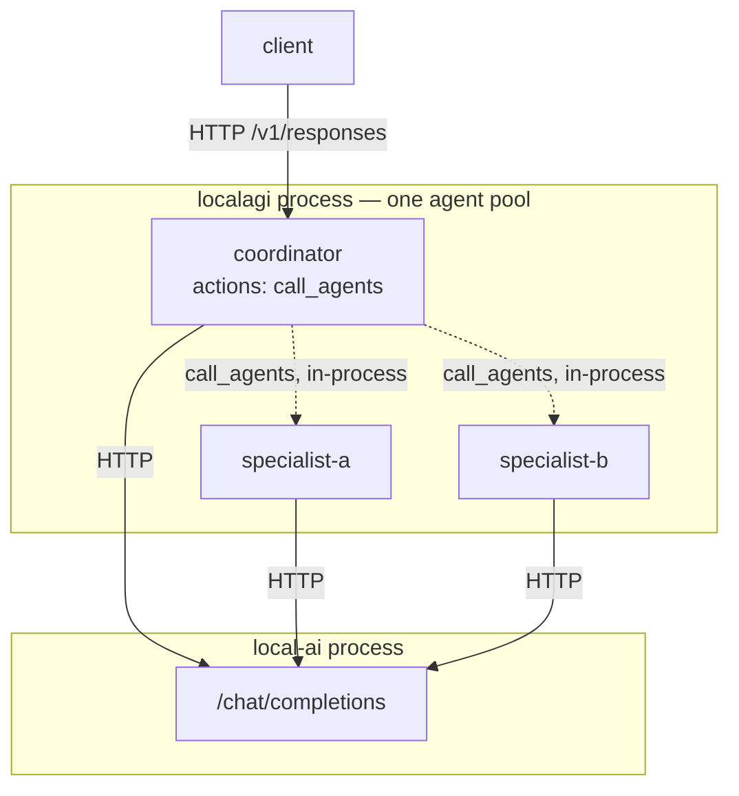
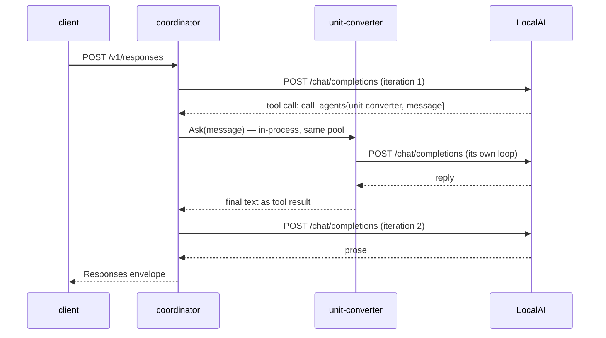

# Recipe 9 — Multi-agent delegation

## Goal

Let one agent call another. Delegation is not a separate subsystem here — it is a
built-in tool, `call_agents`, and understanding that explains both its capabilities and
its sharp edges.

## Architecture

```text
        You
         |
   coordinator agent
         |
         | call_agents  (in-process, same pool)
         v
   specialist agent
         |
      LocalAI
```



Both agents live in the **same pool, in the same process**. Delegation is a Go call, not
a network hop — but each delegated agent runs its own loop and makes its own model calls.

## What you will learn

- delegation is the `call_agents` action, subject to the same model-selection uncertainty
  as any tool
- `whitelist` and `blacklist` are the only access control, and they are comma-separated
  strings
- model calls multiply: the coordinator's loop plus each specialist's loop
- each agent has its **own** collection, so knowledge is not shared by delegation

## Components

| Component | Role |
|---|---|
| LocalAI | inference for every agent |
| LocalAGI | one pool holding all agents |
| `call_agents` | the delegation tool |

## Prerequisites

- Recipe 5 completed. Delegation is a tool; if tool calling is unreliable, delegation
  will be worse
- Recipe 8 recommended, so you can reason about compounded latency

## Versions tested

> **Not yet validated.** Multi-agent delegation was **not executed**. The configuration
> below is derived from LocalAGI v2.9.0 source — `services/actions/callagents.go` and the
> agent configuration schema. Latency and behaviour claims are marked as inference
> throughout. Recipes 1–6 and 8 were executed; this one and
> [Recipe 7](mcp-agent.md) were not. See the
> [version matrix](../00-overview/version-matrix.md#not-yet-validated).

## Start the environment

```bash
cd compose
docker compose up -d
```

## Verify each dependency

**1. Tool calling works.** Non-negotiable — delegation is a tool.

```bash
curl -s http://localhost:8081/api/agent/tool-probe/status | jq -r '.History[]'
```

**2. `call_agents` is in the action inventory.**

```bash
curl -s http://localhost:8081/api/actions | jq -r '.[]' | grep call_agents
```

**3. Its schema, so you know what the model will be shown.**

```bash
curl -s -X POST http://localhost:8081/api/action/call_agents/definition \
  -H 'Content-Type: application/json' -d '{}' | jq
```

## Configure the system

**The specialist first** — a plain agent, unaware it will be delegated to:

```bash
curl -s -X POST http://localhost:8081/api/agent/create \
  -H 'Content-Type: application/json' \
  -d '{
    "name": "unit-converter",
    "model": "qwen3-1.7b",
    "system_prompt": "You convert units. Reply with only the converted value and its unit.",
    "strip_thinking_tags": true,
    "max_attempts": 1
  }' | jq
```

**Then the coordinator**, with `call_agents` and an explicit whitelist:

```bash
curl -s -X POST http://localhost:8081/api/agent/create \
  -H 'Content-Type: application/json' \
  -d '{
    "name": "coordinator",
    "model": "qwen3-1.7b",
    "system_prompt": "You delegate specialised work to other agents. Be terse.",
    "strip_thinking_tags": true,
    "actions": [
      {"name": "call_agents", "config": "{\"whitelist\": \"unit-converter\"}"}
    ],
    "max_attempts": 1
  }' | jq
```

Note the double-escaped JSON: `config` is a **string** containing JSON, so the inner
quotes are escaped. This is the same shape as every other action's config and the most
common thing to get wrong here.

### Whitelist and blacklist

The only access control on delegation. Both are read from the action's config and parsed
as **comma-separated strings**, trimmed:

```json
{"name": "call_agents", "config": "{\"whitelist\": \"unit-converter, translator\"}"}
```

```json
{"name": "call_agents", "config": "{\"blacklist\": \"admin-agent\"}"}
```

| Config | Effect |
|---|---|
| `whitelist` set | only those agents may be called |
| `blacklist` set | those agents may not be called |
| neither set | **every agent in the pool is callable** |

That last row is the one to notice. An unconfigured `call_agents` gives the model the
whole pool as a target list, including agents that have `shell-command` or `send-mail`
attached. **Always set a whitelist.** See
[security model](../07-deep-dives/security-model.md).

The action also excludes the calling agent itself, so an agent cannot directly call
itself. *(Source-verified: the action records its own name. Whether an A→B→A cycle is
prevented was not established.)*

## Run the request

```bash
curl -s http://localhost:8081/v1/responses \
  -H 'Content-Type: application/json' \
  -d '{
    "model": "coordinator",
    "input": "Ask the unit-converter agent to convert 4200 milliseconds to seconds, then report the answer."
  }' | jq -r '.output[0].content[0].text'
```

Then inspect both agents — delegation shows up in the coordinator's history as a tool
call, and the specialist has its own separate history:

```bash
curl -s http://localhost:8081/api/agent/coordinator/status | jq -r '.History[]'
```

```bash
curl -s http://localhost:8081/api/agent/unit-converter/status | jq -r '.History[]'
```

## Expected result

The coordinator's history should show a `call_agents` action naming `unit-converter`,
with the specialist's reply as its result; the coordinator's prose should then relay it.

*(Expected, not observed — this recipe was not executed.)*

The structural expectations are worth stating even so, because they follow from the
architecture rather than from behaviour:

- The coordinator's loop makes its own model calls; the specialist's loop makes more.
  Total model calls are **additive across agents**, so a delegating request costs at
  least the sum of both. On CPU, where [Recipe 5](agent-with-tools.md) took 38.7 s for
  one tool-using agent, plan accordingly.
- The specialist receives a **prompt**, not the coordinator's conversation. Delegation
  passes a message; it does not share context.
- The specialist's own knowledge, tools and system prompt apply. Its collection is
  `unit-converter`, not `coordinator` — **knowledge does not travel with a delegation.**

## What happened internally

1. `POST /v1/responses` for `coordinator` arrives; the agent resolves. *(inbound HTTP,
   then in-process)*
2. Tools are assembled, including `call_agents`, whose schema advertises the permitted
   agent names. *(in-process)*
3. The loop calls `/chat/completions`. **(network HTTP → gRPC)**
4. The model emits a `call_agents` tool call naming `unit-converter` and a message.
5. The action resolves the target against the pool, applies whitelist and blacklist, and
   invokes that agent's `Ask`. *(in-process — same process, same pool)*
6. The specialist runs its **own full loop**: its own knowledge guards, its own tools,
   its own model calls. **(network HTTP → gRPC, one or more times)**
7. The specialist's final text is returned as the tool result. *(in-process)*
8. The result is appended to the coordinator's conversation as an observation.
   *(in-process)*
9. The coordinator's loop calls `/chat/completions` again. **(network HTTP → gRPC)**
10. It returns prose; the loop ends. *(outbound HTTP)*

*(Not traced. Steps 1–10 are derived from `services/actions/callagents.go` and the loop
structure established in Recipes 5 and 8.)*

## Request flow



## Persistent state

| What | Written by | Where | Survives restart |
|---|---|---|---|
| Both agent definitions | LocalAGI pool | `/pool` JSON | yes |
| Whitelist / blacklist | part of the coordinator's `actions` config | `/pool` JSON | yes |
| Coordinator's action history | in memory | memory, last 10 | no |
| **Specialist's** action history | in memory | memory, last 10, **separate** | no |
| Each agent's collection | LocalRecall | one per agent name | yes |

Two separate histories and two separate collections. When a delegated request produces a
wrong answer, the specialist's history is where the cause usually is — and it is not
visible from the coordinator's.

## Logs worth inspecting

```bash
docker logs localagi 2>&1 | grep -E 'agent=(coordinator|unit-converter)' | tail -20
```

Both agents log with an `agent=` field, so one request produces interleaved lines for
two agents. This is the fastest way to see delegation actually happening.

```bash
docker logs --since 3m localai 2>&1 | grep -c 'chat/completions'
```

The compounded model-call count. Compare against a non-delegating request to see the
multiplication directly.

```bash
docker logs localagi 2>&1 | grep 'we got a response from the agent'
```

Logged for the outer request. Note that the specialist's completion appears in the
`agent=unit-converter` lines rather than here.

## Failure modes

**The coordinator answers directly and never delegates.**

- *Symptom:* plausible answer, empty coordinator `History`.
- *Cause:* the model did not select `call_agents`. A small model will often just answer.
- *Check:* `curl -s http://localhost:8081/api/agent/coordinator/status | jq '.History'`
- *Fix:* make the system prompt insistent about delegating; use a larger model. This is
  the same model-selection uncertainty as any tool, not a delegation bug.

**`call_agents` names an agent that does not exist.**

- *Symptom:* a tool result reporting an unknown agent.
- *Cause:* the model invented a name, or the whitelist names an agent that was deleted.
- *Check:* `curl -s http://localhost:8081/api/agents | jq '.agents'`
- *Fix:* keep the whitelist tight and current — it doubles as the model's menu.

**The specialist ignores its knowledge.**

- *Cause:* not a delegation problem. Its collection is its **own name**; populate
  `unit-converter`, not `coordinator`.
- *Fix:* see [Recipe 6](agent-with-knowledge.md).

**Latency compounds beyond any client timeout.**

- *Symptom:* minutes.
- *Cause:* coordinator iterations times specialist iterations times model latency.
- *Fix:* raise client and proxy timeouts; keep delegation chains to one level; reduce
  `kb_results` on both agents. Note `LOCALAGI_TIMEOUT` is per **model call** and does not
  bound this.

**A delegation loop.**

- *Symptom:* the request never returns; repeated `call_agents` entries.
- *Cause:* mutual delegation. The action excludes self-calls, but an A→B→A cycle was
  **not verified** as prevented.
- *Fix:* use whitelists to make cycles structurally impossible — give only the
  coordinator `call_agents`, and give specialists none.

## Troubleshooting

1. **Does inference work?** LocalAI directly
2. **Does a simple tool work?** Recipe 5's `counter`
3. **Do both agents answer individually?** call each with `/v1/responses` directly
4. **Did the coordinator delegate?** its `History`
5. **What did the specialist do?** its **own** `History`
6. **How many model calls in total?** count in LocalAI's log

Step 3 is the one that matters most: **test each agent alone before testing them
together.** A specialist that cannot answer a question directly will not answer it when
delegated to, and the delegation will look like the fault.

## Cleanup

```bash
curl -s -X DELETE http://localhost:8081/api/agent/coordinator | jq
curl -s -X DELETE http://localhost:8081/api/agent/unit-converter | jq
```

Deleting the coordinator does not delete the specialist; they are independent pool
entries. Their collections, if created, also persist — reset them separately.

## Variations

**Generate a group of agents from a description.** LocalAGI can ask the model to invent a
set of roles and then create them:

```bash
curl -s -X POST http://localhost:8081/api/agent/group/generateProfiles \
  -H 'Content-Type: application/json' \
  -d '{"description":"a team that researches and summarises technical documents"}' | jq
```

```bash
curl -s -X POST http://localhost:8081/api/agent/group/create \
  -H 'Content-Type: application/json' \
  -d '{"agents": [ /* output of generateProfiles */ ], "agent_config": { /* shared config */ }}' | jq
```

`generateProfiles` returns `{name, description, system_prompt}` per agent, produced by a
schema-constrained model call. Convenient, and worth treating carefully: **the model is
choosing what agents exist**, and `agent_config` is applied to all of them — including
any `actions`. Do not put `shell-command` in a shared group config.

**One agent per model.** Each agent may override `model`, `api_url` and `api_key`, so a
coordinator on a small local model can delegate to a specialist backed by a larger model
or a hosted endpoint. This is the most practical use of delegation on modest hardware:
route only the hard questions to the expensive model.

**Deliberately omit the whitelist**, list the pool, and see what the model is offered.
Do this once on a throwaway deployment; it is the clearest demonstration of why the
whitelist matters.

## Upstream references

- [LocalAGI `services/actions/callagents.go`](https://github.com/mudler/LocalAGI/blob/v2.9.0/services/actions/callagents.go) — `NewCallAgent`, comma-separated `whitelist` and `blacklist` parsing with trimming, and the action's record of its own name. Validated against v2.9.0.
- [LocalAGI `webui/routes.go`](https://github.com/mudler/LocalAGI/blob/v2.9.0/webui/routes.go) — `/api/agent/group/generateProfiles` and `/api/agent/group/create`, at 99-100.
- [LocalAGI `webui/app.go`](https://github.com/mudler/LocalAGI/blob/v2.9.0/webui/app.go) — `GenerateGroupProfiles`, the schema-constrained role generation, at 700-748.
- [LocalAGI `core/state/pool.go`](https://github.com/mudler/LocalAGI/blob/v2.9.0/core/state/pool.go) — the pool that both agents share, and `AgentPoolInternalAPI`.
- [LocalAGI `core/state/config.go`](https://github.com/mudler/LocalAGI/blob/v2.9.0/core/state/config.go) — per-agent `model`, `api_url`, `api_key` overrides.
- `call_agents` present in the 40-action inventory: observed 2026-08-17. Delegation behaviour itself: **not executed**, see [version matrix](../00-overview/version-matrix.md#not-yet-validated).
