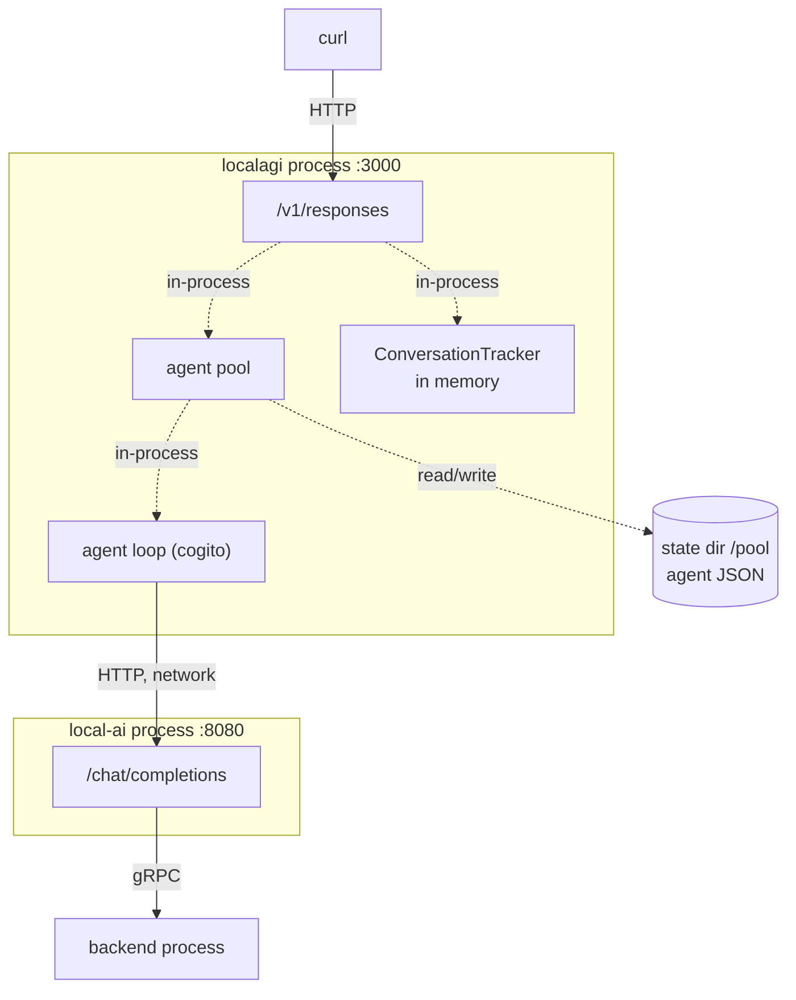
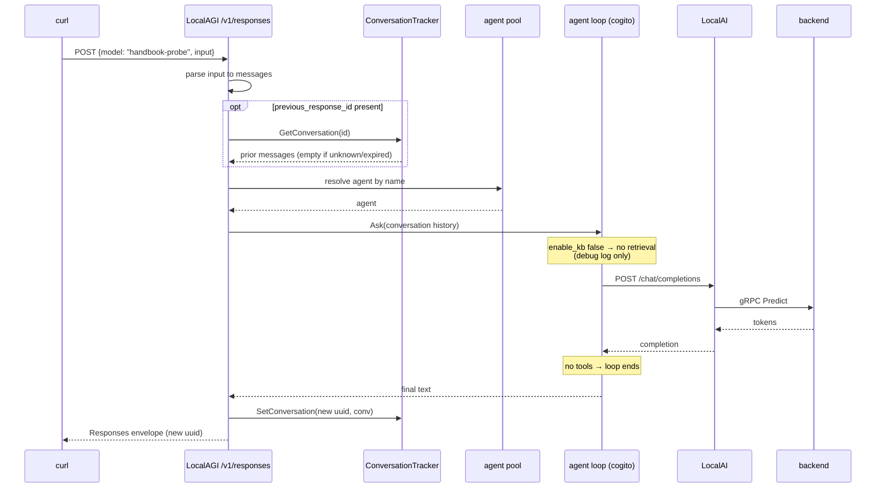

# Recipe 4 — A simple agent

## Goal

Define an agent, ask it something, and see what an agent request is that an
inference request is not. No tools and no knowledge yet — those are Recipes 5 and 6.
This recipe isolates the loop.

## Architecture

```text
  You
   |
   | HTTP  POST /v1/responses   {model: "<agent name>"}
   v
 LocalAGI  (agent pool + cogito loop)
   |
   | HTTP  POST /chat/completions
   v
 LocalAI
   |
   | gRPC
   v
 Backend
```



No LocalRecall in this diagram, and none is started for this recipe's purposes. The
reference environment runs it because Recipe 6 needs it.

## What you will learn

- the `model` field on `/v1/responses` carries an **agent name**, not a model name
- agent definitions are JSON on disk; conversation history is not
- conversation continuation via `previous_response_id`, and how it silently fails
- why `usage` is always zero
- why an agent request cannot be treated like an inference request by a timeout

## Components

| Component | Role | Port |
|---|---|---|
| LocalAI | inference | 8080 |
| LocalAGI | agent pool, agent loop, agent state | 8081 → 3000 |

## Prerequisites

- Recipe 1 completed; inference verified working
- The [reference Compose environment](https://github.com/wrkode/local-ai-stack-handbook/tree/main/compose)

## Versions tested

```yaml
tested:
  date: 2026-08-17
versions:
  localai: "v4.8.2"
  localagi: "v2.8.1 (image)"
  localrecall: "running but unused in this recipe"
environment:
  architecture: arm64 (Apple Silicon)
  host: macOS 26.5.1
  runtime: Docker Desktop 29.7.2
  gpu: none
results:
  create_agent: pass
  single_request: pass — 2-3 s
  conversation_chaining: pass
  unknown_previous_response_id: pass, and silently returns an empty conversation
```

!!! warning "v2.8.1 is the newest LocalAGI image; v2.9.0 has none"
    `quay.io/mudler/localagi:v2.9.0` does not exist. Everything in this recipe was
    run against **v2.8.1**, which also **does not contain LocalRecall at all** — see
    the [version matrix](../00-overview/version-matrix.md). That does not affect this
    recipe, which uses no knowledge, but it matters from Recipe 6 onward.

## Start the environment

```bash
cd compose
docker compose up -d
```

## Verify each dependency

**1. Inference works.** Verify the layer below before touching the layer above.

```bash
curl -s http://localhost:8080/v1/chat/completions \
  -H 'Content-Type: application/json' \
  -d '{"model":"qwen3-1.7b","messages":[{"role":"user","content":"hi"}],"max_tokens":8}' \
  | jq -r '.choices[0].message.content'
```

**2. LocalAGI is up.**

```bash
curl -s http://localhost:8081/api/agents | jq
```

Expected on a fresh start:

```json
{"actions":40,"agentCount":0,"agents":[],"connectors":9,"statuses":{}}
```

The `40` and `9` are the built-in actions and connectors compiled into the binary.
They are available to every agent and they are not MCP — see Recipe 5.

**3. LocalAGI can reach LocalAI.** This is the edge that actually breaks. Test it
from inside the container, because that is where DNS applies:

```bash
docker exec localagi curl -s http://localai:8080/v1/models | head -c 200
```

If this fails while step 1 succeeded, the problem is container networking, not the
stack.

## Configure the system

Create an agent. This is the whole configuration:

```bash
curl -s -X POST http://localhost:8081/api/agent/create \
  -H 'Content-Type: application/json' \
  -d '{
    "name": "handbook-probe",
    "model": "qwen3-1.7b",
    "system_prompt": "You are a terse assistant. Answer in one short sentence.",
    "strip_thinking_tags": true,
    "enable_kb": false,
    "max_attempts": 1
  }' | jq
```

Expected: `{"status":"ok"}`.

| Field | Why it is here |
|---|---|
| `name` | the identifier you will send as `model` later. Also becomes the collection name in Recipe 6, lowercased |
| `model` | the **real** model name, resolved against LocalAI |
| `system_prompt` | the agent's standing instruction |
| `strip_thinking_tags` | `qwen3` is reasoning-tuned and emits `<think>` blocks; this removes them from the reply |
| `enable_kb: false` | explicit, so this recipe cannot accidentally retrieve |
| `max_attempts: 1` | no retries, so a failure surfaces instead of being masked |

Confirm it registered:

```bash
curl -s http://localhost:8081/api/agents | jq
```

```json
{"actions":40,"agentCount":1,"agents":["handbook-probe"],
 "connectors":9,"statuses":{"handbook-probe":true}}
```

`statuses` maps the agent to whether it is running. An agent that is registered but
paused shows `false` here.

## Run the request

```bash
curl -s http://localhost:8081/v1/responses \
  -H 'Content-Type: application/json' \
  -d '{
    "model": "handbook-probe",
    "input": "What is 2+2? Answer with just the number."
  }' | jq
```

The critical detail: **`model` is `handbook-probe`, the agent name.** Send
`qwen3-1.7b` here and you get `Agent not found`, because this endpoint resolves the
field against the agent pool, not against LocalAI's models.

Continue the conversation. Capture the response `id` and send it back:

```bash
ID=$(curl -s http://localhost:8081/v1/responses \
  -H 'Content-Type: application/json' \
  -d '{"model":"handbook-probe","input":"My favourite colour is teal. Please remember it."}' \
  | jq -r '.id')
echo "$ID"
```

```bash
curl -s http://localhost:8081/v1/responses \
  -H 'Content-Type: application/json' \
  -d "{\"model\":\"handbook-probe\",\"input\":\"What is my favourite colour?\",\"previous_response_id\":\"$ID\"}" \
  | jq -r '.output[0].content[0].text'
```

Use `jq -r '.id'`, not a hand-rolled pattern. The envelope contains a second `id`
inside `output[0]` of the form `msg_<nanoseconds>`, and a greedy regex will grab that
one instead — which then behaves like an unknown conversation, as shown below.

## Expected result

```json
{
  "id": "b9ec1e4d-41c5-42b7-a18a-d12d21040be4",
  "object": "response",
  "created_at": 1786981102,
  "status": "completed",
  "model": "handbook-probe",
  "output": [
    {"type": "message", "id": "msg_1786981102342119587", "status": "completed",
     "role": "assistant",
     "content": [{"type": "output_text", "text": "4", "annotations": null}]}
  ],
  "usage": {"input_tokens": 0, "output_tokens": 0, "total_tokens": 0},
  "store": false,
  "previous_response_id": null
}
```

Latency: **2–3 s** for a no-tool, no-knowledge request on CPU.

Four things in that envelope are worth knowing before you build against it:

**`usage` is always zero.** Not "zero for short replies" — the fields are hardcoded,
with a `// TODO: calculate actual usage` beside them in the source. You cannot do
token accounting at this layer. Get it from LocalAI instead.

**The response `id` is a bare UUID**, not `resp_…`. If you have written client code
expecting OpenAI's prefix, it will not match.

**`previous_response_id` comes back `null`** even when you sent one. The echo is not
implemented; do not rely on it to confirm continuation worked.

**`store` is `false`.** Accurate, and more informative than it looks: nothing about
this exchange is written to disk. See [Persistent state](#persistent-state).

Conversation chaining works — the second reply knows the colour is teal. Note that
the reply `id` is a **new** UUID each time; conversation identity is a chain of
per-turn IDs, not one session ID.

### An unknown `previous_response_id` does not error

Worth doing deliberately once:

```bash
curl -s http://localhost:8081/v1/responses \
  -H 'Content-Type: application/json' \
  -d '{"model":"handbook-probe","input":"What is my favourite colour?","previous_response_id":"does-not-exist-at-all"}' \
  | jq -r '.output[0].content[0].text'
```

Observed: `I don't have access to personal information such as favorite colors.`

**No error, no warning.** An unrecognised ID is treated as an empty conversation.
The same is true of an ID that has **expired** — history is held in memory with a
TTL (`LOCALAGI_CONVERSATION_DURATION`, falling back to 1 hour), and expiry returns an
empty conversation rather than an error.

So there are three indistinguishable states: valid-but-new, expired, and never
existed. If you need to know which, you must track it yourself. This is the
mechanism behind "the agent forgot everything over lunch".

## What happened internally

1. `POST /v1/responses` arrives at LocalAGI's Fiber server, port 3000 inside the
   container. *(inbound HTTP)*
2. The body is parsed; `input` is normalised into chat messages. A bare string and a
   message array are both accepted. *(in-process)*
3. If `previous_response_id` is set, prior messages are fetched from the in-memory
   `ConversationTracker` and prepended. An unknown or expired key yields an empty
   list. *(in-process, memory only)*
4. The `model` field is looked up in the agent pool. Not found → HTTP 500
   `Agent not found`. *(in-process)*
5. The agent's `Ask` is invoked with the assembled conversation history.
   *(in-process, into cogito)*
6. Knowledge lookup is skipped — `enable_kb` is false, logged at **debug** level
   only. *(in-process)*
7. The loop calls `POST http://localai:8080/chat/completions`. **(network HTTP)**
   Note the absence of a `/v1` segment: cogito concatenates the path onto the base
   URL without inserting a version.
8. LocalAI resolves the model and calls the backend. *(gRPC)*
9. The reply returns. With no tools configured there is nothing to dispatch, so the
   loop ends after one iteration.
10. The assistant message is appended to the conversation and stored under a **newly
    generated UUID**. *(in-process, memory)*
11. The text is wrapped in a Responses envelope and returned. *(outbound HTTP)*

Steps 5, 6 and 9 were confirmed from LocalAGI's debug log
(`Agent Ask()`, `Agent Execute()`, `Agent is consuming a job`, `Agent has finished`).
The internals of cogito's own iteration are source-derived. *(step order inferred,
not traced)*

## Request flow



## Persistent state

| What | Written by | Where | Survives restart |
|---|---|---|---|
| Agent definition | LocalAGI pool | `/pool` JSON — volume `localagi-pool` | **yes** |
| Agent running status | LocalAGI, in memory | memory | no |
| Recent action results | LocalAGI, in memory | memory, **last 10 only** | no |
| Conversation history | `ConversationTracker` | **memory, TTL'd** | **no** |
| The reply text | nobody | — | not stored |

Two rows carry the lesson of this recipe. **Agent definitions are durable; agent
conversations are not.** Losing `/pool` loses every agent you ever created — not just
their state, their definitions. Restarting LocalAGI loses every in-flight
conversation while keeping every agent.

If you want conversations on disk, `LOCALAGI_ENABLE_CONVERSATIONS_LOGGING=true`
writes each turn to `/pool/conversations/<agent>-<timestamp>.json`. That is an audit
log — nothing reads it back, and it does not restore history.

## Logs worth inspecting

```bash
docker logs localagi 2>&1 | grep -i -E 'Agent Ask|Agent Execute|has finished'
```

Brackets one request. The delta between `Agent Ask()` and `Agent has finished` is the
agent's real wall-clock cost.

```bash
docker logs localagi 2>&1 | grep 'we got a response from the agent'
```

The final text, logged at INFO — useful when your client is timing out and you want
to know whether the agent actually finished.

```bash
docker logs localai 2>&1 | grep -i 'chat/completions' | tail -5
```

The other side of step 7. **Count these per agent request.** With no tools it should
be one. Recipe 5 will show it climb.

```bash
docker logs localagi 2>&1 | grep -i 'knowledge base'
```

Silent here, because knowledge is off. Remember this command for Recipe 6 — it is how
you find out that retrieval was skipped.

## Failure modes

**`{"error":"Agent not found"}` with HTTP 500.**

- *Symptom:* every request fails immediately.
- *Cause:* `model` holds a model name rather than an agent name, or the case is wrong.
- *Check:* `curl -s localhost:8081/api/agents | jq '.agents'`
- *Fix:* send the agent name exactly as listed.

**Agent request fails instantly with a 404 in LocalAI's log on `/chat/completions`.**

- *Symptom:* immediate failure, not a slow one.
- *Cause:* the base URL. cogito appends `/chat/completions` without inserting `/v1`.
  LocalAI tolerates this because it registers un-prefixed aliases; other
  OpenAI-compatible servers do not.
- *Check:* `docker logs localai 2>&1 | grep 404`
- *Fix:* against LocalAI either form works. Against anything else, put `/v1` in
  `LOCALAGI_LLM_API_URL`.

**401 from LocalAI on every agent call, while LocalAGI's own API works.**

- *Symptom:* the platform looks healthy; agents fail.
- *Cause:* `LOCALAI_API_KEY` is set and `LOCALAGI_LLM_API_KEY` is not. When unset,
  the client sends the literal string `sk-xxx` — so the log shows a *rejected token*,
  never "no credentials supplied".
- *Fix:* set both to the same value.

**Client times out at exactly 30 or 60 seconds.**

- *Symptom:* a round number, reproducible.
- *Cause:* your client's or a proxy's read timeout, not the agent. An agent request
  is a loop; `LOCALAGI_TIMEOUT` (default `5m`) governs **one model call**, not the
  request.
- *Check:* `docker logs localagi 2>&1 | grep 'we got a response'` — if the agent
  finished, the timeout was yours.
- *Fix:* raise the client and proxy timeouts. Note that a mistyped
  `LOCALAGI_TIMEOUT` falls back to **150 s**, shorter than the documented default.

**The reply contains `<think>` blocks.**

- *Symptom:* visible reasoning in the output.
- *Cause:* `qwen3` is reasoning-tuned and `strip_thinking_tags` was not set.
- *Fix:* set it in the agent config.

**Agents disappeared after `docker compose down -v`.**

- *Cause:* `-v` removed `localagi-pool`.
- *Fix:* nothing to recover. Export agents you care about:
  `curl -s http://localhost:8081/settings/export/handbook-probe`.

## Troubleshooting

1. **Does inference work directly?** LocalAI `/v1/chat/completions`
2. **Is the model loaded and named correctly?** `/v1/models`
3. **Is LocalAGI up?** `/api/agents`
4. **Can LocalAGI reach LocalAI?** `docker exec localagi curl http://localai:8080/v1/models`
5. **Does the agent exist, spelled that way?** `/api/agents`
6. **Does the agent answer at all?** the simple request
7. **Did the agent finish, or did your client give up?** the
   `we got a response from the agent` log line

Steps 1 and 4 catch most real failures. Do not debug the agent before proving them.

More: [LocalAGI troubleshooting](../02-localagi/troubleshooting.md).

## Cleanup

```bash
curl -s -X DELETE http://localhost:8081/api/agent/handbook-probe | jq
```

Keep the agent if you are continuing — Recipe 5 adds a tool to a similar one.

Remove agent state entirely:

```bash
docker compose down
docker volume rm localai-stack_localagi-pool
```

Models are deliberately kept.

## Variations

**Pause and resume**, which is what `statuses` reflects:

```bash
curl -s -X PUT http://localhost:8081/api/agent/handbook-probe/pause | jq
curl -s -X PUT http://localhost:8081/api/agent/handbook-probe/start | jq
```

**Inspect what the agent has been doing:**

```bash
curl -s http://localhost:8081/api/agent/handbook-probe/status | jq
```

Returns `History`, the **last ten** action results, newest first. Empty for an agent
with no tools — it becomes the most useful endpoint in Recipe 5.

**Export and re-import an agent**, the only real backup for a definition:

```bash
curl -s http://localhost:8081/settings/export/handbook-probe > handbook-probe.json
```

**Use the asynchronous endpoint instead.** `POST /api/chat/:name` reaches the same
engine but does not return the answer; it is consumed over
`GET /sse/:name`. If you poll it expecting a body, you will wait forever. Use
`/v1/responses` for request/response.

**Try `stream: true`.** It is accepted and **silently ignored** — the field exists on
the request type and is never read. You get a complete JSON body. See
[Responses API](../02-localagi/responses-api.md).

## Upstream references

- [LocalAGI `webui/app.go`](https://github.com/mudler/LocalAGI/blob/v2.9.0/webui/app.go) — the Responses handler at 575-692: agent lookup by `model`, conversation assembly, hardcoded zero `usage`, bare-UUID response id. Validated against v2.9.0; behaviour observed on v2.8.1.
- [LocalAGI `core/conversations`](https://github.com/mudler/LocalAGI/blob/v2.9.0/core/conversations) — in-memory tracker, TTL expiry returning an empty conversation.
- [LocalAGI `webui/options.go`](https://github.com/mudler/LocalAGI/blob/v2.9.0/webui/options.go) — 1 hour fallback for the conversation duration, at 42-50.
- [LocalAGI `webui/routes.go`](https://github.com/mudler/LocalAGI/blob/v2.9.0/webui/routes.go) — `/v1/responses`, `/api/agent/create`, `/api/chat/:name`, `/sse/:name`.
- [LocalAGI `webui/types/openai.go`](https://github.com/mudler/LocalAGI/blob/v2.9.0/webui/types/openai.go) — the `Stream` field, at 161, which no handler reads.
- [LocalAGI `core/state/pool.go`](https://github.com/mudler/LocalAGI/blob/v2.9.0/core/state/pool.go) — pool persistence; `Status` keeping only the last ten results at 83-90.
- [LocalAGI `core/state/config.go`](https://github.com/mudler/LocalAGI/blob/v2.9.0/core/state/config.go) — every agent configuration field.
- [LocalAGI `pkg/llm/client.go`](https://github.com/mudler/LocalAGI/blob/v2.9.0/pkg/llm/client.go) — the `sk-xxx` placeholder and 150 s timeout fallback.
- [LocalAGI `cmd/serve.go`](https://github.com/mudler/LocalAGI/blob/v2.9.0/cmd/serve.go) — the hardcoded `:3000` listener, at 126.
- Response envelope, latencies, action and connector counts, and the unknown-`previous_response_id` behaviour: observed 2026-08-17, see [version matrix](../00-overview/version-matrix.md).
