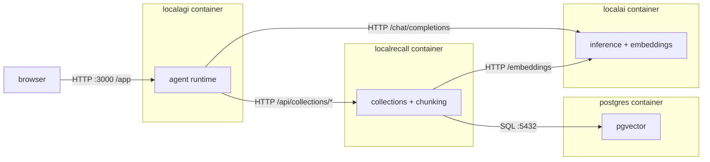

# The reference Compose stack

The files live in `compose/` in this repository. This page explains their shape,
why each service is configured the way it is, and how to tell whether the stack
actually works — the YAML itself is the authority on syntax.

Compose is the first layer where the three projects become three processes.
Everything below follows from that: LocalRecall stops being a linked library and
becomes a network service with its own authentication boundary, and the 8080
collision between LocalAI and LocalRecall has to be resolved.

## Topology



Two edges are the whole point of running Compose rather than a single LocalAI
container:

**`agent → knowledge` is HTTP, not a library call.** LocalAGI only takes that
path when `LOCALAGI_LOCALRAG_URL` is set. Leave it unset — as every upstream
compose file does — and LocalAGI links LocalRecall's `rag` package in-process,
the `localrecall` service never receives a request, and the stack is two services
plus a database wearing a three-service costume. The reference stack sets it.

**`knowledge → embeddings` is HTTP back into LocalAI.** LocalRecall has no
embedding model of its own; `OPENAI_BASE_URL` points at LocalAI and the first
search or upload triggers a cold model load there.

## Services and their roles

| Service | Image | Published | Role |
|---|---|---|---|
| `localai` | `localai/localai:v4.8.2` (+ accelerator suffix via overlay) | 8080 | Inference, embeddings, model and backend galleries. The only service with an accelerator variant |
| `localrecall` | `quay.io/mudler/localrecall:v0.6.4` | 8082 | Collections, chunking, retrieval. Moved off 8080 because LocalAI owns it |
| `localagi` | `quay.io/mudler/localagi:v2.8.1` | 3000 | Agent runtime and web UI. **v2.9.0 has no published image** — see [docker](docker.md#images-that-exist) |
| `postgres` | `quay.io/mudler/localrecall:v0.6.4-postgresql` | not published | PostgreSQL 18 with pgvector, pg_textsearch and pgvectorscale. Optional: omit it and set `VECTOR_ENGINE=chromem` |

The `postgres` image name is confusing by construction and costs people an
afternoon. It is published from LocalRecall's `Dockerfile.pgsql` — Ubuntu 24.04
plus PostgreSQL 18, with `postgresql-18-pgvector`, `pg_textsearch` built from
source and pgvectorscale built through pgrx. Its entrypoint is PostgreSQL.
**It is not a LocalRecall server** (source-verified, v0.6.4).

## Healthcheck strategy

Healthchecks are what makes `depends_on: condition: service_healthy` mean
anything. Only one of the four services ships a usable one.

| Service | Probe | Why |
|---|---|---|
| `localai` | Image default: `/healthcheck.sh`, `--start-period=60m`, interval 1m, timeout 10s, retries 3 | Mode-aware; resolves to `GET /readyz` on `:8080` for `run`. The long start period exists because preload can materialize tens of GB before the socket binds |
| `localrecall` | `curl -fsS -H "Authorization: Bearer $API_KEYS" http://localhost:8080/api/collections` | The project's own convention — its `Makefile` uses exactly this and prints "RAG server is ready". A cheap in-memory map read that returns 200 with zero collections |
| `localagi` | `curl -fsS -H "Authorization: Bearer $LOCALAGI_API_KEYS" http://localhost:3000/app` | `/app` serves the embedded SPA. `/api/agents` is the better *readiness* signal, `/app` the cheaper *liveness* one |
| `postgres` | `pg_isready -U localrecall` | Upstream's own probe in all three of its compose files |

Neither LocalAGI nor LocalRecall has a health, readiness or metrics endpoint. A
full route enumeration finds 45 routes in LocalAGI and 12 in LocalRecall, and
none of them is `/health`, `/healthz`, `/readyz`, `/ready`, `/ping` or `/metrics`
(source-verified, v2.9.0 and v0.6.4). Both probes above must carry the API key,
because both projects' auth middleware exempts nothing at all.

Dependency order in the reference stack:

```text
postgres  (service_healthy)  ──▶ localrecall
localai   (service_healthy)  ──▶ localrecall, localagi
localrecall (service_healthy) ──▶ localagi
```

`service_healthy` on `localai` is doing more work than it looks. LocalRecall's
own compose file omits it — `ragserver` does not depend on `localai` at all, and
`localai` has no healthcheck there — so the RAG server can start before
embeddings are reachable. The code tolerates that (startup collection-load
failures are logged and collections are rehydrated lazily on first request), but
the first user-visible request pays for it.

### Warm the embedding model

Health does not imply useful. `/readyz` goes green with zero models loaded; the
first embedding call then pays a cold backend spawn plus model load — measured at
3.34 s cold against 0.06–0.09 s warm for a 107M F16 model on CPU (observed
2026-08-17). LocalRecall's own `Makefile` compensates by polling LocalAI and then
issuing a real `/v1/embeddings` POST before tests run. Reproduce that:

```bash
curl -fsS http://localhost:8080/v1/embeddings \
  -H 'Content-Type: application/json' \
  -d '{"model":"granite-embedding-107m-multilingual","input":"warmup"}' >/dev/null
```

## Environment layering

Four layers, innermost wins:

| Layer | Where | Use it for |
|---|---|---|
| 1. Image defaults | `ENV` in each Dockerfile | Nothing you control |
| 2. `compose/.env` | Interpolated into the YAML by Compose itself | Versions, ports, host paths — anything that appears as `${VAR}` in the file |
| 3. `env_file:` | Read by the container at start | Shared blocks such as API keys and model names |
| 4. `environment:` | Per-service, in the YAML | Service-specific values and anything that must not be silently overridable |

LocalAI adds a fifth layer inside the container. Before kong parses any flag it
loads dotenv files in order — `./.env`, `./localai.env`, `$HOME/localai.env`,
`$HOME/.config/localai.env`, `/etc/localai.env` — and `godotenv.Load` does *not*
override variables already present in the process environment (source-verified,
v4.8.2). So a value set through `environment:` beats anything in a mounted
`localai.env`, which is the opposite of what "later file wins" would suggest.

Copy `compose/.env.example` to `compose/.env` before the first `up`. The values
that must not stay at their defaults:

| Variable | Why |
|---|---|
| `LOCALAI_API_KEY` | Without it LocalAI has no authentication, and `adminMiddleware` degrades to a no-op |
| `LOCALAGI_API_KEYS` | Without it an unauthenticated caller can create an agent that runs arbitrary Go and shell — see [security](security.md#agent-security) |
| `API_KEYS` (LocalRecall) | Without it the entire REST surface and web UI are open |
| `POSTGRES_PASSWORD` | Upstream ships `localrecall`/`localrecall` and `localai`/`localai` |

Note the naming is not consistent across the three projects: LocalAI reads
`LOCALAI_API_KEY` (singular), LocalAGI `LOCALAGI_API_KEYS`, LocalRecall a bare
`API_KEYS`. That is upstream's spelling, not a transcription error.

## Accelerator overlays

The base file pins the CPU image. Accelerator selection is an overlay that
changes **only the `localai` service** — image suffix, plus `devices:` or
`deploy.resources.reservations.devices`. Neither LocalAGI nor LocalRecall ever
touches a GPU: both are `CGO_ENABLED=0` static Go binaries and neither publishes
an accelerator-suffixed tag (source-verified, v2.9.0 and v0.6.4).

```bash
docker compose -f compose/docker-compose.yml up -d
docker compose -f compose/docker-compose.yml -f compose/docker-compose.nvidia.yml up -d
```

Device details per family are in [gpu](gpu.md).

## What upstream's own compose files do

Three exist, and all three are development conveniences rather than deployment
templates. Reading them is still worthwhile — the comments carry facts that
appear nowhere else.

| File | Services | Notable |
|---|---|---|
| LocalAI `docker-compose.yaml` | 1 (`api`) | Five named volumes matching the image's `VOLUME` set. Commented blocks document the agent env vars, the pgvector sidecar, and both CDI and legacy NVIDIA device syntax |
| LocalAI `docker-compose.distributed.yaml` | 5 (`postgres`, `nats`, `localai`, `worker-1`, `agent-worker-1`) | The only upstream file showing distributed mode: NATS with JetStream, a registration token, PostgreSQL for both the auth DB and the agent vector store |
| LocalAGI `docker-compose.yaml` + 3 GPU overlays | 5 (`localai`, `postgres`, `sshbox`, `dind`, `localagi`) | Publishes LocalAI on 8081 and LocalAGI on `8080:3000` |
| LocalRecall `docker-compose.yml` | 3 (`localai`, `postgres`, `ragserver`) | The only upstream file that runs LocalRecall's server as a service |

### Where they mislead

| Claim implied by the file | Reality |
|---|---|
| LocalAGI's `postgres` service is a LocalRecall server | It is a pgvector PostgreSQL image published *by* the LocalRecall project. `LOCALAGI_LOCALRAG_URL` is set in no upstream compose file, so LocalRecall runs as a linked library inside the `localagi` binary |
| `localai/localai:latest-cpu` is a current image | Stale since 2025-06-19. Named in comments in both LocalAI compose files |
| `localai/localai:master-cublas-cuda12-ffmpeg` is an alternative NVIDIA image | Dead naming scheme. Commented in LocalAGI's NVIDIA overlay |
| `quay.io/mudler/localagi:master` is a usable image | Last modified 2025-04-07, roughly 16 months stale (observed 2026-08-17) |
| `IMAGE_TYPE=core` selects a slim build | No-op. The Dockerfile no longer declares that `ARG` |
| The `/tmp/generated/images/` mount captures generated content | The code default moved to `$TMPDIR/localai-<uid>/generated/content`. Set `LOCALAI_GENERATED_CONTENT_PATH` |
| LocalAGI's healthcheck proves LocalAGI is up | That healthcheck belongs to the `localai` service in the same file. LocalAGI has no health endpoint |
| The default stack is safe to expose | LocalAGI's ships `SSH_USER=root` / `SSH_PASSWORD=root` with `PasswordAuthentication yes`, next to a `privileged: true` dind exposing an unauthenticated TCP Docker socket. It grants agents a root shell on a container holding a full Docker daemon |

The distributed file's comments are the useful ones. Two are load-bearing: the
image healthcheck detects worker mode and derives the port from
`LOCALAI_SERVE_ADDR` (gRPC base − 1), and the worker's `/readyz` returns 503
while its NATS connection is down, so `unhealthy` there means the worker
genuinely cannot receive work. It also sets `GODEBUG: netdns=go` on every LocalAI
service — the cgo resolver follows the container's `nsswitch.conf` and forwards
to the host's `systemd-resolved` at 127.0.0.53, which is unreachable from inside
the container.

## Verifying the stack

```bash
docker compose -f compose/docker-compose.yml ps
docker compose -f compose/docker-compose.yml logs -f localai
```

`ps` should show all four services `healthy`. Then check each boundary in the
order the diagram draws them:

```bash
# 1. LocalAI is ready and serving
curl -fsS http://localhost:8080/readyz && echo ok
curl -fsS -H "Authorization: Bearer $LOCALAI_API_KEY" \
  http://localhost:8080/v1/models | jq '.data[].id'

# 2. Embeddings work (and the model is now warm)
curl -fsS -H "Authorization: Bearer $LOCALAI_API_KEY" \
  http://localhost:8080/v1/embeddings \
  -H 'Content-Type: application/json' \
  -d '{"model":"granite-embedding-107m-multilingual","input":"hello"}' \
  | jq '.data[0].embedding | length'

# 3. LocalRecall answers, and can reach LocalAI
curl -fsS -H "Authorization: Bearer $API_KEYS" \
  http://localhost:8082/api/collections | jq .
curl -fsS -H "Authorization: Bearer $API_KEYS" \
  -X POST http://localhost:8082/api/collections \
  -H 'Content-Type: application/json' -d '{"name":"smoke"}'

# 4. LocalAGI answers, and sees its agents
curl -fsS -H "Authorization: Bearer $LOCALAGI_API_KEYS" \
  http://localhost:3000/api/agents | jq .
```

Expected results: step 2 returns `384` for the reference embedding model
(observed 2026-08-17); step 3 returns `[]` on a fresh stack and then accepts the
collection; step 4 returns a JSON object with an `agents` field. A `502` from
step 3's collection creation with `"Vector backend"` in the message means
LocalRecall cannot reach LocalAI's embeddings endpoint — check `OPENAI_BASE_URL`
and the `/v1` question before anything else.

Reaching LocalRecall over the network is the difference from a single-container
deployment, and it is a security boundary, not a convenience: in a single LocalAI
process the knowledge base is a Go struct that nothing can address. Here it
answers on a port. `API_KEYS` is not optional.

## Upstream references

- [LocalAI `docker-compose.yaml`](https://github.com/mudler/LocalAI/blob/v4.8.2/docker-compose.yaml) — single-service quickstart, volume set, commented agent and GPU blocks. Source-verified against v4.8.2, validated 2026-08-17.
- [LocalAI `docker-compose.distributed.yaml`](https://github.com/mudler/LocalAI/blob/v4.8.2/docker-compose.distributed.yaml) — NATS, PostgreSQL, worker and agent-worker wiring; healthcheck and `GODEBUG` comments. Source-verified against v4.8.2, validated 2026-08-17.
- [LocalAI `cmd/local-ai/main.go`](https://github.com/mudler/LocalAI/blob/v4.8.2/cmd/local-ai/main.go) — dotenv load order and non-override semantics. Source-verified against v4.8.2, validated 2026-08-17.
- [LocalAGI `docker-compose.yaml`](https://github.com/mudler/LocalAGI/blob/v2.9.0/docker-compose.yaml) — five services, the pgvector `postgres` service, `sshbox` and privileged `dind`. Source-verified against v2.9.0, validated 2026-08-17.
- [LocalAGI `Dockerfile.sshbox`](https://github.com/mudler/LocalAGI/blob/v2.9.0/Dockerfile.sshbox) — `PasswordAuthentication yes`, root login. Source-verified against v2.9.0, validated 2026-08-17.
- [LocalAGI `cmd/serve.go`](https://github.com/mudler/LocalAGI/blob/v2.9.0/cmd/serve.go) — `LOCALAGI_LOCALRAG_URL` selects the HTTP RAG provider. Source-verified against v2.9.0, validated 2026-08-17.
- [LocalRecall `docker-compose.yml`](https://github.com/mudler/LocalRecall/blob/v0.6.4/docker-compose.yml) — the only upstream file running the RAG server as a service; no `depends_on` for `localai`. Source-verified against v0.6.4, validated 2026-08-17.
- [LocalRecall `Makefile`](https://github.com/mudler/LocalRecall/blob/v0.6.4/Makefile) — `/api/collections` as the readiness convention; the embedding warm-up. Source-verified against v0.6.4, validated 2026-08-17.
- [LocalRecall `Dockerfile.pgsql`](https://github.com/mudler/LocalRecall/blob/v0.6.4/Dockerfile.pgsql) — what the `-postgresql` image contains. Source-verified against v0.6.4, validated 2026-08-17.
- Embedding dimensions, cold/warm timings and clean-instance responses: observed 2026-08-17 on `localai/localai:latest` reporting `v4.8.2 (5ff25d9d)`.
- Registry tag timestamps for `quay.io/mudler/localagi`: observed 2026-08-17 against the Quay tag API.
