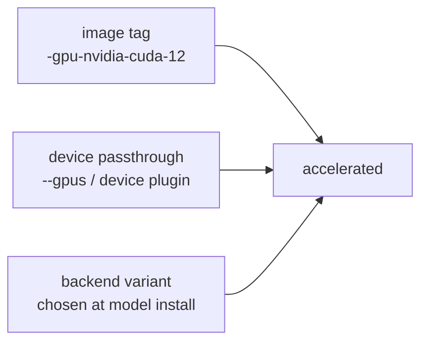

# GPU deployment

How to get a device through to LocalAI in Docker, Compose and Kubernetes, and how to prove
it is actually being used. The mechanics of image variants, backends and layer offloading
are in [LocalAI GPU](../01-localai/gpu.md); this page is about the deployment plumbing
around them.

**Only LocalAI needs a GPU.** LocalAGI and LocalRecall are orchestration and I/O; they
never touch a device. That single fact is the strongest argument for splitting LocalAI out
of an integrated deployment — it is the only component with special hardware requirements.

## Three things must agree



LocalAI does not warn when they disagree. It installs a CPU backend and runs.

## Docker

```bash
docker run -d --name localai -p 8080:8080 --gpus all \
  -v localai-models:/models -v localai-backends:/backends \
  localai/localai:v4.8.2-gpu-nvidia-cuda-12 qwen3-1.7b
```

Prove the runtime can reach the device **before** blaming LocalAI:

```bash
docker run --rm --gpus all nvidia/cuda:12.4.0-base-ubuntu22.04 nvidia-smi
```

If that fails, the NVIDIA Container Toolkit is the problem.

| Vendor | Tag suffix | Passthrough |
|---|---|---|
| NVIDIA | `-gpu-nvidia-cuda-12`, `-gpu-nvidia-cuda-13` | `--gpus all` |
| AMD | `-gpu-hipblas` | `--device /dev/kfd --device /dev/dri` |
| Intel | `-gpu-intel` | `--device /dev/dri` |
| Any | `-gpu-vulkan` | `--device /dev/dri` |
| Jetson | `-nvidia-l4t-arm64`, `-nvidia-l4t-arm64-cuda-13` | `--runtime nvidia` |

## Compose

```yaml
services:
  localai:
    image: localai/localai:v4.8.2-gpu-nvidia-cuda-12
    ports:
      - "8080:8080"
    volumes:
      - localai-models:/models
      - localai-backends:/backends
      - localai-configuration:/configuration
    deploy:
      resources:
        reservations:
          devices:
            - driver: nvidia
              count: all
              capabilities: [gpu]
    healthcheck:
      test: ["CMD", "curl", "-f", "http://localhost:8080/readyz"]
      interval: 15s
      retries: 120
      start_period: 30s
```

For AMD or Intel, replace the `deploy.resources` block with device mappings:

```yaml
    devices:
      - /dev/dri:/dev/dri
      - /dev/kfd:/dev/kfd     # AMD only
```

Everything else in the [reference environment](https://github.com/wrkode/local-ai-stack-handbook/tree/main/compose)
is unchanged — LocalAGI, LocalRecall and PostgreSQL are unaffected by the switch.

## Kubernetes

```yaml
    spec:
      containers:
        - name: localai
          image: localai/localai:v4.8.2-gpu-nvidia-cuda-12
          resources:
            limits:
              nvidia.com/gpu: 1
```

A GPU is a **non-overcommittable** resource: `limits` must equal `requests`, and one
container gets whole devices. Consequences that shape the whole deployment:

| Consequence | Detail |
|---|---|
| Replica count is bounded by devices | four GPUs means at most four LocalAI pods, one device each |
| Pods are unschedulable without a device | they stay `Pending`, not `CrashLoopBackOff` |
| Node selection matters | use a node selector or taint/toleration so only GPU nodes are considered |
| Rolling updates need spare capacity | with one GPU and one replica, `maxSurge: 1` deadlocks — the new pod waits for a device the old one holds |

That last row is the one that surprises people. Set `maxSurge: 0` and accept downtime, or
keep a spare device.

```yaml
      nodeSelector:
        nvidia.com/gpu.present: "true"
      strategy:
        rollingUpdate:
          maxSurge: 0
          maxUnavailable: 1
```

Full manifests and the rest of the scaling story: [Kubernetes](kubernetes.md) and
[scaling](../07-deep-dives/scaling.md).

## Apple Silicon

The most common wasted afternoon in this ecosystem.

**There is no Metal or Darwin target anywhere in LocalAI's Dockerfile or image
workflows.** A containerised LocalAI on Apple Silicon is **CPU-only**, inside a Linux VM.
No flag, image tag or Docker Desktop setting changes this.

GPU acceleration on a Mac requires the **native install** (DMG or install script), which
pulls `metal-darwin-arm64-*` backends. The practical arrangement:

```text
LocalAI       native install (Metal)   -> host:8080
LocalAGI      container                -> host.docker.internal:8080
LocalRecall   container                -> host.docker.internal:8080
```

```yaml
services:
  localagi:
    environment:
      - LOCALAGI_LLM_API_URL=http://host.docker.internal:8080
    extra_hosts:
      - "host.docker.internal:host-gateway"
```

Note that our own validation was CPU-only under Docker on Apple Silicon, which is why every
GPU claim here is documented or source-verified rather than tested.

## Proving the GPU is used

The image tag proves nothing. Neither does `nvidia-smi` showing a process.

```bash
docker exec localai ls /backends
```

**A `cpu-llama-cpp` directory on a GPU image means you are running on the CPU.** This is
the single most useful check on this page.

Backends are downloaded as OCI artifacts at **model-install time**, and the variant is
chosen by hardware detection *inside the container*. If the device was invisible then, the
CPU backend was installed — and it persists in the `/backends` volume afterwards.

**Restarting with the device attached does not fix it.** Remove the backends volume and let
it re-install:

```bash
docker compose down
docker volume rm localai-stack_localai-backends
docker compose up -d
```

Then:

```bash
docker logs localai 2>&1 | grep -i -E 'cuda|rocm|sycl|vulkan|offload|gpu layer'
```

```bash
time curl -s -o /dev/null http://localhost:8080/v1/chat/completions \
  -H 'Content-Type: application/json' \
  -d '{"model":"qwen3-1.7b","messages":[{"role":"user","content":"Write two sentences about vectors."}]}'
```

Compare **warm** calls only — the first includes model load either way. Reference: CPU-only
on Apple Silicon returned a completion in **4 s** including load.

## Memory planning

VRAM must hold the model **and** the KV cache, and the cache scales with context.

| Lever | Where | Effect |
|---|---|---|
| `gpu_layers` | model YAML | how many layers on the device; partial offload puts the rest in system RAM |
| `context_size` | model YAML | KV cache reservation scales with it |
| Quantisation | the model file | Q4_K_M is the reference; smaller quantisations trade quality for memory |

Note that `qwen3-1.7b`'s gallery config sets `context_size: 8192`, not the model's native
32,768. Raising it to 32,768 **quadruples** the KV-cache reservation — the most common cause
of an out-of-memory on load after an apparently harmless configuration change.

Loading a model may **evict another**, terminating that backend's process. Two models
alternating on one device pay a load per request. One model per deployment is the reliable
arrangement.

## What a GPU does not fix

| Slow thing | Helped? |
|---|---|
| Token generation | **yes** — the point |
| Embedding a large ingestion | yes per call, but the call count is unchanged |
| Model load | marginally; largely I/O |
| Retrieval | **no** — already 29–37 ms |
| **Agent wall-clock** | **only partly** |

Agent latency is `iterations × model latency`. Measured on CPU:
[Recipe 5](../05-recipes/agent-with-tools.md) took 38.7 s across three model calls;
[Recipe 8](../05-recipes/complete-agent-stack.md) took 24.1 s across two. A GPU shortens each
call and changes neither the iteration count nor tool execution time.

**Count the model calls before buying hardware:**

```bash
docker logs --since 5m localai 2>&1 | grep -c 'chat/completions'
```

A request making six calls where it should make two is a prompt or model-capability problem,
and no device fixes it.

## Upstream references

- [LocalAI container documentation](https://localai.io/basics/container/) — image variants and targets.
- [LocalAI `Dockerfile`](https://github.com/mudler/LocalAI/blob/v4.8.2/Dockerfile) — build targets; absence of any Metal or Darwin target. Validated against v4.8.2.
- [LocalAI `pkg/model/initializers.go`](https://github.com/mudler/LocalAI/blob/v4.8.2/pkg/model/initializers.go) — backend selection, load and eviction.
- [LocalAI `core/config/backend_config.go`](https://github.com/mudler/LocalAI/blob/v4.8.2/core/config/backend_config.go) — `gpu_layers`, `f16`, `context_size`.
- [LocalAI `gallery/qwen3.yaml`](https://github.com/mudler/LocalAI/blob/v4.8.2/gallery/qwen3.yaml) — the `context_size: 8192` the reference model actually uses.
- [NVIDIA Container Toolkit](https://docs.nvidia.com/datacenter/cloud-native/container-toolkit/latest/) — Docker device passthrough.
- [Kubernetes device plugins](https://kubernetes.io/docs/concepts/extend-kubernetes/compute-storage-net/device-plugins/) — how `nvidia.com/gpu` is advertised.
- Tag inventory, CPU-only latency on Apple Silicon, retrieval timings and agent model-call counts: observed 2026-08-17. **No GPU configuration was tested** — see [version matrix](../00-overview/version-matrix.md).
