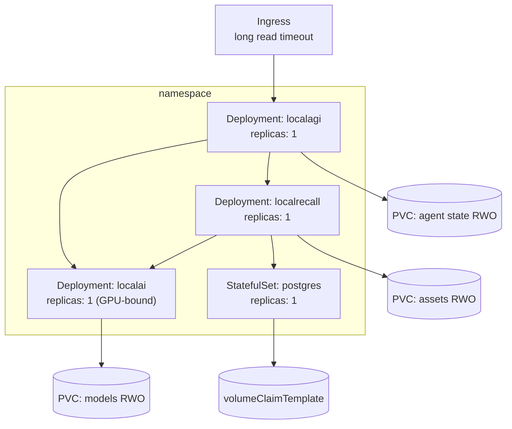

# Kubernetes

Do not start here. Kubernetes adds scheduling, service networking, storage classes, secrets
and device plugins — five sources of failure that all look like "the stack is broken". Work
through [the recipes](../05-recipes/index.md) and the
[Compose environment](https://github.com/wrkode/local-ai-stack-handbook/tree/main/compose)
first, so that when something fails here you already know what correct behaviour looks like.

Manifests live in
[`kubernetes/`](https://github.com/wrkode/local-ai-stack-handbook/tree/main/kubernetes).
They are plain YAML, deliberately — Helm would hide exactly the details this page exists to
show.

> **Not yet validated.** No Kubernetes deployment was executed. The manifests are derived
> from the validated Compose environment and from source; the workload requirements below
> are source-verified. Treat this page as a well-founded starting point, not a tested
> configuration. See the
> [version matrix](../00-overview/version-matrix.md#not-yet-validated).

## The shape, and why



| Workload | Kind | Why |
|---|---|---|
| `localai` | Deployment | stateless request handling; its volumes are caches |
| `localagi` | Deployment | **but see the replica warning** — its state is a file |
| `localrecall` | Deployment | stateless when backed by PostgreSQL |
| `postgres` | **StatefulSet** | stable identity and a per-replica volume |

## The replica warning, first

This is the fact that determines your whole topology, so it comes before the manifests.

| Component | Safe to scale? | Why not |
|---|---|---|
| LocalAI | **yes**, with caveats | stateless per request; bounded by GPUs and by model memory |
| LocalRecall | **yes**, with PostgreSQL | a database tolerates concurrent readers; a `chromem` file does not |
| **LocalAGI** | **no** | agent definitions are **JSON on disk**, read at boot and rewritten on change |
| PostgreSQL | not by adding replicas | use the database's own replication |

**Two LocalAGI replicas sharing one `ReadWriteMany` volume are two processes rewriting one
JSON inventory.** There is no locking protocol. Last writer wins; agents disappear. Keep
`replicas: 1` and treat it as a singleton until upstream provides shared state.

Note also that scheduled and self-initiated agents (`periodic_runs`,
`initiate_conversations`, connectors) would each fire **once per replica** — so scaling
would duplicate side effects, not distribute them.

Full treatment: [scaling](../07-deep-dives/scaling.md).

## Probes: the trap that matters most

```yaml
          livenessProbe:
            httpGet:
              path: /readyz
              port: 8080
            initialDelaySeconds: 30
            periodSeconds: 15
          readinessProbe:
            exec:
              command:
                - sh
                - -c
                - 'curl -sf http://localhost:8080/v1/models | grep -q ''"id"'''
            initialDelaySeconds: 30
            periodSeconds: 15
            failureThreshold: 120
```

**`/readyz` is not a readiness signal.** Reproduced: with
`raw.githubusercontent.com` rate-limiting the host, both model installs failed while
LocalAI logged `core/startup process completed!` and answered `/readyz` with `200`, holding
**zero models**.

A readiness probe on `/readyz` therefore marks a pod Ready when it can serve nothing. Use
`/readyz` for **liveness** and a models-check for **readiness**, as above.

`failureThreshold: 120` with a 15-second period allows 30 minutes for the initial model
download. Get this wrong and Kubernetes kills the pod mid-download, forever.

### The other two have no health endpoint

| Service | Health endpoint | Probe with |
|---|---|---|
| LocalAI | `/readyz` | as above |
| LocalAGI | **none** | `GET /api/agents` on port 3000 |
| LocalRecall | **none** | `GET /api/collections` — and **no `exec` probe is possible** |

LocalRecall's image is built `FROM scratch`: no shell, no `curl`, no `wget`. `exec` probes
cannot run. Use an `httpGet` probe, and remember it answers from disk — a `200` proves the
process is alive and **nothing** about whether embeddings work.

```yaml
          readinessProbe:
            httpGet:
              path: /api/collections
              port: 8080
```

For LocalAGI, note that if `LOCALAGI_API_KEYS` is set the auth middleware is **global** and
`/api/agents` returns 401 — the probe fails until you add the header:

```yaml
          readinessProbe:
            httpGet:
              path: /api/agents
              port: 3000
              httpHeaders:
                - name: Authorization
                  value: Bearer $(LOCALAGI_API_KEY)
```

## Storage

| Volume | Access mode | Size | Note |
|---|---|---|---|
| models | RWO | 20 Gi+ | observed 1.5 GB for two small models; real models are far larger |
| backends | RWO | 5 Gi | observed 160 MB |
| agent state | **RWO** | 1 Gi | observed 6 kB — tiny and irreplaceable |
| assets | RWO | 10 Gi+ | original documents; grows with ingestion |
| postgres | RWO via `volumeClaimTemplate` | 20 Gi+ | observed 66 MB baseline for one document |

Two sizing notes from measurement. **The irreplaceable data is kilobytes** — agent state was
6 kB — so back that up and let models re-download. And **PostgreSQL has a large floor**: 66 MB
for a single 207-byte document is the database's baseline, so do not extrapolate from a small
collection.

Deliberately **RWO, not RWX**, for agent state — a `ReadWriteMany` claim invites the
two-replica data loss described above. Making it RWO makes the unsafe configuration hard.

## Configuration and secrets

Non-secret values in a ConfigMap:

```yaml
apiVersion: v1
kind: ConfigMap
metadata:
  name: localai-stack-config
data:
  LOCALAI_DISABLE_AGENTS: "true"
  LLM_MODEL: "qwen3-1.7b"
  EMBEDDING_MODEL: "granite-embedding-107m-multilingual"
  VECTOR_ENGINE: "postgres"
  MAX_CHUNKING_SIZE: "400"
  CHUNK_OVERLAP: "80"
  COLLECTION_DB_PATH: "/data/collections"
  FILE_ASSETS: "/data/assets"
  LISTENING_ADDRESS: ":8080"
  LOCALAGI_TIMEOUT: "5m"
```

`LOCALAI_DISABLE_AGENTS: "true"` is load-bearing when you run a standalone LocalAGI:
otherwise you have **two agent pools**, and if they ever share state, agents vanish.

`COLLECTION_DB_PATH` and `FILE_ASSETS` must be set explicitly. Their defaults are relative to
the working directory, which in a `FROM scratch` image is the ephemeral container layer.

Secrets — remembering that **five keys must agree**:

```yaml
apiVersion: v1
kind: Secret
metadata:
  name: localai-stack-secrets
type: Opaque
stringData:
  LOCALAI_API_KEY: "<key>"
  LOCALAGI_LLM_API_KEY: "<same as LOCALAI_API_KEY>"
  LOCALRECALL_OPENAI_API_KEY: "<same as LOCALAI_API_KEY>"
  LOCALAGI_API_KEYS: "<client key>"
  LOCALRECALL_API_KEYS: "<internal key>"
  POSTGRES_PASSWORD: "<password>"
  DATABASE_URL: "postgresql://localrecall:<password>@postgres:5432/localrecall?sslmode=disable"
```

Note `sslmode=disable` is only acceptable while PostgreSQL is in-cluster and on a trusted
network. See [security](security.md).

## Services

```yaml
apiVersion: v1
kind: Service
metadata:
  name: localai
spec:
  selector:
    app: localai
  ports:
    - port: 8080
      targetPort: 8080
---
apiVersion: v1
kind: Service
metadata:
  name: localagi
spec:
  selector:
    app: localagi
  ports:
    - port: 3000
      targetPort: 3000
```

**LocalAGI listens on 3000**, hardcoded in `cmd/serve.go`; no variable changes it. Every
in-cluster URL follows from the Service names:

| Variable | Value |
|---|---|
| `LOCALAGI_LLM_API_URL` | `http://localai:8080` |
| `LOCALAGI_LOCALRAG_URL` | `http://localrecall:8080` |
| `OPENAI_BASE_URL` (on LocalRecall) | `http://localai:8080` |

No `/v1` on any of these against LocalAI. If you ever point LocalAGI at a **different**
inference service, `/v1` becomes mandatory — cogito does not insert a version segment. See
[the `/v1` trap](../04-integration/api-flow.md#the-v1-trap).

Only `localagi` should have an Ingress. `localai`, `localrecall` and `postgres` are internal;
publishing LocalRecall exposes unauthenticated read **and write** access to your knowledge.

## Ingress: the timeout that produces phantom failures

```yaml
apiVersion: networking.k8s.io/v1
kind: Ingress
metadata:
  name: localagi
  annotations:
    nginx.ingress.kubernetes.io/proxy-read-timeout: "600"
    nginx.ingress.kubernetes.io/proxy-send-timeout: "600"
spec:
  rules:
    - host: agents.example.com
      http:
        paths:
          - path: /
            pathType: Prefix
            backend:
              service:
                name: localagi
                port:
                  number: 3000
```

The default read timeout — 60 seconds on ingress-nginx — is **shorter than a real agent
request**. Measured on CPU: 38.7 s for one tool call across three model calls, 24.1 s with
knowledge and a tool. Under load, or with a larger model, both exceed 60 s comfortably.

The failure is nasty: the client gets a **504 while the agent runs to completion and commits
its tool side effects**. The email is sent, the issue is opened, and the caller believes it
failed.

Order the three timeouts: **client > ingress > `LOCALAGI_TIMEOUT`** (which is per model
call, default `5m`).

## Resources

```yaml
          resources:
            requests:
              cpu: "2"
              memory: "4Gi"
            limits:
              memory: "8Gi"
```

| Workload | Notes |
|---|---|
| LocalAI | memory dominated by resident models plus KV cache. **Do not set a CPU limit** on CPU inference — it throttles token generation directly |
| LocalAGI | modest; it is I/O and orchestration. No GPU, ever |
| LocalRecall | modest; chunking and HTTP. No GPU, ever |
| PostgreSQL | standard database sizing |

An OOMKill during model load looks like a crash loop. Check `lastState.terminated.reason`:

```bash
kubectl get pod -l app=localai -o jsonpath='{.items[0].status.containerStatuses[0].lastState.terminated.reason}'
```

## GPU

```yaml
          image: localai/localai:v4.8.2-gpu-nvidia-cuda-12
          resources:
            limits:
              nvidia.com/gpu: 1
```

```yaml
      nodeSelector:
        nvidia.com/gpu.present: "true"
      strategy:
        rollingUpdate:
          maxSurge: 0
          maxUnavailable: 1
```

`maxSurge: 0` is not a typo. A GPU is non-overcommittable, so with one device and one
replica a surging update **deadlocks**: the new pod waits for a device the old pod still
holds. Accept the brief downtime, or keep a spare device.

Pods without an available device stay `Pending`, not `CrashLoopBackOff` — check
`kubectl describe pod` for the scheduling message rather than the logs.

More: [GPU deployment](gpu.md).

## Startup ordering

### The listener binds last

Worth knowing before you tune `initialDelaySeconds`: in an integrated deployment LocalAI
starts its agent pool **after** the HTTP listener is accepting connections, deliberately —
knowledge-base backends call the embeddings API on the same process, so starting the pool
first would deadlock.

Practical effect: `/readyz` can answer `200` while the agent pool is still initialising.
LocalAI's own agent routes return `503 agent pool is starting, please retry shortly` during
that window, which is the correct signal to probe if you use Pattern A. In the separated
deployment described here it does not arise, because the pool is disabled.


Kubernetes has no `depends_on`. Two things follow:

**LocalRecall tolerates LocalAI being absent at boot.** It iterates over existing collections
at startup, constructing an engine for each — which calls the embeddings endpoint. Failures
register a `nil` placeholder and are **rehydrated lazily on first use**, logging
`Failed to load collection at startup; will retry lazily on first request`. That line alone,
with everything else working, is a startup-ordering artefact rather than a fault.

**LocalAGI does not tolerate missing configuration.** `serve` prints help and exits if
`LOCALAGI_MODEL` or `LOCALAGI_LLM_API_URL` is empty. A pod that exits immediately with usage
text is a missing variable, not a crash.

Readiness probes handle the rest — LocalAGI will fail requests until LocalAI has a model, and
its own probe will keep it out of the Service until then.

## Verifying a deployment

```bash
kubectl get pods -o wide
```

```bash
kubectl exec deploy/localagi -- curl -s http://localai:8080/v1/models
```

That is the check that matters: **from inside the client pod**, which is where DNS and
NetworkPolicy actually apply. A failure here with a healthy `localai` pod is networking, not
the stack.

Then port-forward and run the real thing:

```bash
kubectl port-forward svc/localagi 8081:3000 &
kubectl port-forward svc/localai 8080:8080 &
./scripts/verify-stack.sh --skip-knowledge
```

Add `LOCALRECALL_URL` and drop the flag if you also forward LocalRecall.

## Failure signatures

| Symptom | Cause |
|---|---|
| Pod `Pending`, no events about images | no GPU available, or no node matches the selector |
| Pod Ready but every request fails with a model error | readiness probe is on `/readyz`; no models installed |
| Pod killed ~30 min into first start | `failureThreshold` too low for the model download |
| `CrashLoopBackOff` with usage text in the log | missing `LOCALAGI_MODEL` or `LOCALAGI_LLM_API_URL` |
| Agents vanish after a rollout | agent state not on a PVC, or two replicas sharing one |
| 504 from the ingress, work completed anyway | ingress read timeout shorter than the agent request |
| 401 on internal hops, external surface fine | the five keys do not agree |
| Retrieval silently stops working | LocalRecall unreachable — logs `Error finding similar strings inside KB` at INFO |
| Collections empty after a restart | `COLLECTION_DB_PATH` defaulted into the container layer |

## What this does not give you

| Missing | See |
|---|---|
| Horizontal scaling of agents | [scaling](../07-deep-dives/scaling.md) |
| PostgreSQL HA | your database operator |
| TLS between services | [security](security.md) |
| Metrics for LocalAGI and LocalRecall | **they expose none** — [observability](observability.md) |
| Request tracing across pods | does not exist; correlate by timestamp |
| Multi-tenant isolation | **no tenancy model exists** — [security](security.md) |
| Backup and restore | [persistence](persistence.md) |

An honest assessment of readiness: [production](production.md).

## Upstream references

- [LocalAGI `cmd/serve.go`](https://github.com/mudler/LocalAGI/blob/v2.9.0/cmd/serve.go) — hardcoded `:3000` at 126; required-variable validation at 31-36; state-dir-relative defaults at 38-53. Validated against v2.9.0.
- [LocalAGI `webui/routes.go`](https://github.com/mudler/LocalAGI/blob/v2.9.0/webui/routes.go) — global auth middleware at 30-36, which affects probes.
- [LocalAGI `core/state/pool.go`](https://github.com/mudler/LocalAGI/blob/v2.9.0/core/state/pool.go) — pool JSON load and save; why replicas are unsafe.
- [LocalRecall `Dockerfile`](https://github.com/mudler/LocalRecall/blob/v0.6.4/Dockerfile) — `FROM scratch`, hence no `exec` probes. Validated against v0.6.4.
- [LocalRecall `routes.go`](https://github.com/mudler/LocalRecall/blob/v0.6.4/routes.go) — startup collection load with lazy rehydration at 121-156.
- [LocalRecall `main.go`](https://github.com/mudler/LocalRecall/blob/v0.6.4/main.go) — `LISTENING_ADDRESS` default and working-directory-relative paths.
- [LocalAI `core/cli/run.go`](https://github.com/mudler/LocalAI/blob/v4.8.2/core/cli/run.go) — `LOCALAI_DISABLE_AGENTS` at 124. Validated against v4.8.2.
- [Kubernetes device plugins](https://kubernetes.io/docs/concepts/extend-kubernetes/compute-storage-net/device-plugins/) — GPU scheduling semantics.
- The `/readyz`-with-no-models reproduction, volume sizes, agent latencies and the retrieval-failure log level: observed 2026-08-17 under Docker, see [version matrix](../00-overview/version-matrix.md). **The Kubernetes manifests themselves were not executed.**
