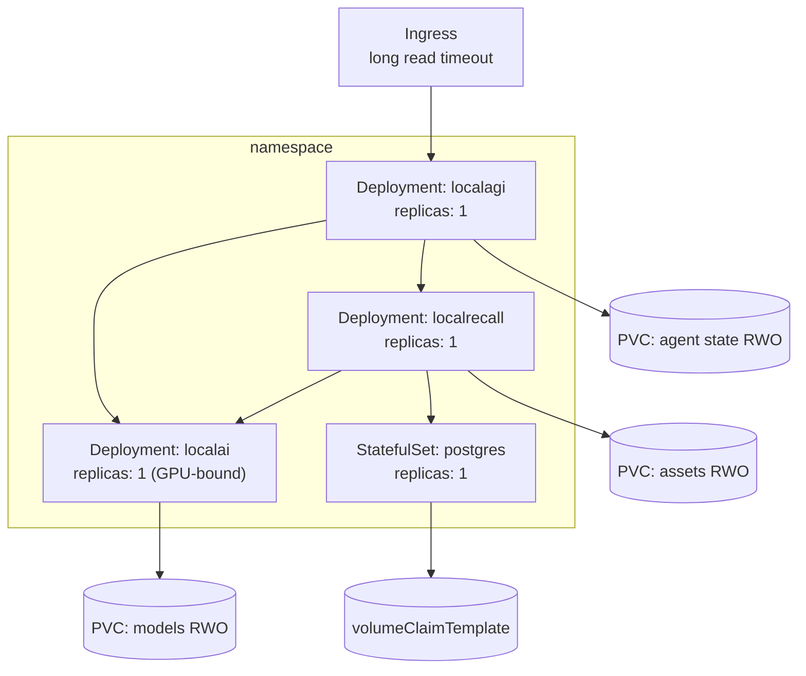

# Kubernetes

Do not start here. Kubernetes adds scheduling, service networking, storage classes, secrets
and device plugins — five sources of failure that all look like "the stack is broken". Work
through [the recipes](../05-recipes/index.md) and the
[Compose environment](https://github.com/wrkode/local-ai-stack-handbook/tree/main/compose)
first, so that when something fails here you already know what correct behaviour looks like.

Manifests live in
[`kubernetes/`](https://github.com/wrkode/local-ai-stack-handbook/tree/main/kubernetes).
They are plain YAML, deliberately — Helm would hide exactly the details this page exists to
show.

```yaml
tested:
  date: 2026-08-17
cluster:
  distribution: k0s v1.34.3
  nodes: 4 (1 bare-metal amd64 + 3 VMs), Ubuntu 24.04.3
  storage: Longhorn (default), RWO
  ingress: Traefik
  gpu_device_plugin: none installed
versions:
  localai: "v4.8.2"
  localagi: "v2.8.1"
  localrecall: "v0.6.4 + v0.6.4-postgresql"
results:
  all_four_workloads_ready: pass
  verify_stack_all_7_layers: pass
  agent_with_knowledge_and_tool: pass — 23.7 s CPU, 2.12 s GPU
  retrieval_across_pods: pass — 55.7 ms
  gpu: pass — device plugin v0.19.3, cuda12-llama-cpp, 2194 MiB VRAM
  defects_found_and_fixed: 4
```

**Four real defects surfaced on deployment**, none of which the Compose environment could have
revealed. They are called out in place below and summarised in
[what Compose cannot teach you](#what-compose-cannot-teach-you).

## The shape, and why



| Workload | Kind | Why |
|---|---|---|
| `localai` | Deployment | stateless request handling; its volumes are caches |
| `localagi` | Deployment | **but see the replica warning** — its state is a file |
| `localrecall` | Deployment | stateless when backed by PostgreSQL |
| `postgres` | **StatefulSet** | stable identity and a per-replica volume |

## The replica warning, first

This is the fact that determines your whole topology, so it comes before the manifests.

| Component | Safe to scale? | Why not |
|---|---|---|
| LocalAI | **yes**, with caveats | stateless per request; bounded by GPUs and by model memory |
| LocalRecall | **yes**, with PostgreSQL | a database tolerates concurrent readers; a `chromem` file does not |
| **LocalAGI** | **no** | agent definitions are **JSON on disk**, read at boot and rewritten on change |
| PostgreSQL | not by adding replicas | use the database's own replication |

**Two LocalAGI replicas sharing one `ReadWriteMany` volume are two processes rewriting one
JSON inventory.** There is no locking protocol. Last writer wins; agents disappear. Keep
`replicas: 1` and treat it as a singleton until upstream provides shared state.

Note also that scheduled and self-initiated agents (`periodic_runs`,
`initiate_conversations`, connectors) would each fire **once per replica** — so scaling
would duplicate side effects, not distribute them.

Full treatment: [scaling](../07-deep-dives/scaling.md).

## Probes: the trap that matters most

```yaml
          livenessProbe:
            httpGet:
              path: /readyz
              port: 8080
            initialDelaySeconds: 30
            periodSeconds: 15
          readinessProbe:
            exec:
              command:
                - sh
                - -c
                - 'curl -sf http://localhost:8080/v1/models | grep -q ''"id"'''
            initialDelaySeconds: 30
            periodSeconds: 15
            failureThreshold: 120
```

**`/readyz` is not a readiness signal.** Reproduced: with
`raw.githubusercontent.com` rate-limiting the host, both model installs failed while
LocalAI logged `core/startup process completed!` and answered `/readyz` with `200`, holding
**zero models**.

A readiness probe on `/readyz` therefore marks a pod Ready when it can serve nothing. Use
`/readyz` for **liveness** and a models-check for **readiness**, as above.

`failureThreshold: 120` with a 15-second period allows 30 minutes for the initial model
download. Get this wrong and Kubernetes kills the pod mid-download, forever.

### The other two have no health endpoint

| Service | Health endpoint | Probe with |
|---|---|---|
| LocalAI | `/readyz` | as above |
| LocalAGI | **none** | `GET /api/agents` on port 3000 |
| LocalRecall | **none** | `GET /api/collections` — and **no `exec` probe is possible** |

LocalRecall's image is built `FROM scratch`: no shell, no `curl`, no `wget`. `exec` probes
cannot run. Use an `httpGet` probe, and remember it answers from disk — a `200` proves the
process is alive and **nothing** about whether embeddings work.

```yaml
          readinessProbe:
            httpGet:
              path: /api/collections
              port: 8080
```

For LocalAGI, note that if `LOCALAGI_API_KEYS` is set the auth middleware is **global** and
`/api/agents` returns 401 — the probe fails until you add the header:

```yaml
          readinessProbe:
            httpGet:
              path: /api/agents
              port: 3000
              httpHeaders:
                - name: Authorization
                  value: Bearer $(LOCALAGI_API_KEY)
```

## Defect 1: PostgreSQL will not start without `fsGroup`

The first thing that broke, and a clean example of Compose hiding a problem.

```text
initdb: error: could not create directory "/var/lib/postgresql/data/pgdata": Permission denied
```

`CrashLoopBackOff`, three restarts in three minutes. A dynamically provisioned Longhorn volume
arrives **root-owned**, and the image runs unprivileged.

```bash
kubectl -n localai-stack exec <pod> -- id
```

```text
uid=999(postgres) gid=104(postgres) groups=104(postgres),102(ssl-cert)
```

**The GID is 104, not 999.** Do not assume uid == gid; verify it. The fix:

```yaml
      securityContext:
        runAsUser: 999
        runAsGroup: 104
        fsGroup: 104
```

`fsGroup` makes the kubelet chown the volume to that GID at mount time. Under Docker Compose
this never arises, because the entrypoint starts as root and chowns the volume itself.

## Defect 2: enabling authentication breaks every probe

The second failure, and the more instructive one — because the handbook already warned about it
for LocalAGI and we then made the same mistake for the other two services.

With API keys set and probes unchanged, observed:

| Service | Symptom |
|---|---|
| LocalAI | `0/1 Running` **forever** — readiness never passed |
| LocalRecall | **killed by its liveness probe**, 5 restarts |
| LocalAGI | fine — its probe already carried a header |

Both logged the cause plainly:

```json
{"uri":"/api/collections","user_agent":"kube-probe/1.34","status":401}
```

The root problem is structural: **a Kubernetes `httpGet` probe cannot read a Secret.**
`httpHeaders` values are static strings. So per service:

| Service | Can a probe carry a token? |
|---|---|
| LocalAI | **yes** — `exec` probe with `curl -H "Authorization: Bearer $LOCALAI_API_KEY"`; the env var is already in the container |
| LocalAGI | **yes**, but only as a **hardcoded literal** in `httpHeaders`, or via an `exec` probe (that image has `curl`) |
| LocalRecall | **no.** `FROM scratch` means no shell for `exec`, and `httpGet` cannot read the Secret. Hardcode the token, drop the probes, or leave `API_KEYS` empty |

Two rules follow:

**Never put a liveness probe on an endpoint that can return 401.** A failing readiness probe
degrades safely; a failing liveness probe is a permanent restart loop. The shipped
`05-localrecall.yaml` therefore has **readiness only**.

**Default to auth off, and turn it on deliberately.** The shipped `02-secrets.yaml` ships empty
keys for exactly this reason, with the enabling procedure in its comments. A template whose
placeholder values break every probe is worse than no template.

## Defect 3: node inotify limits kill LocalAI mid-request

The subtlest failure, and the one whose error message is least helpful.

Symptom: every workload Ready, `/v1/models` correct, and then the **first inference request**
returns an empty body while the pod restarts with exit code 1.

```text
INFO  BackendLoader starting modelID="qwen3-1.7b" backend="llama-cpp"
INFO  effective runtime tuning … n_gpu_layers=99999999 parallel="8"
2026/08/17 18:15:32 FATAL -- failed to create Watcher
goroutine 5093 [running]:
github.com/hpcloud/tail/util.Fatal(…)
github.com/hpcloud/tail/watch.(*InotifyTracker).run(…)
```

LocalAI tails its backend's log via `hpcloud/tail`, which creates an **inotify instance**. When
the node has none left, `util.Fatal` kills the whole process. A related non-fatal line appears
at startup:

```text
ERROR failed creating watcher error=couldn't initialize inotify: too many open files
```

"too many open files" is misleading — the file-descriptor limit is fine. The exhausted resource
is inotify **instances**, which are counted **per UID**, and most containers run as root:

```bash
ssh <node> sysctl fs.inotify.max_user_instances
```

```text
fs.inotify.max_user_instances = 128
```

128 is the Linux default. The node in question was running **50 pods** — kubelet, containerd,
CNI, monitoring, storage and KubeVirt agents all consume instances.

Two fixes, verified in this order:

**Reduce pod count on the node.** Removing an unrelated workload took the node from 50 to 45
pods, and inference then worked with zero restarts. Effective, but fragile — it leaves you one
pod away from the failure.

**Raise the limit.** The durable fix, and it needs root on the node:

```bash
sudo sysctl -w fs.inotify.max_user_instances=8192
```

```bash
echo 'fs.inotify.max_user_instances=8192' | sudo tee /etc/sysctl.d/99-inotify.conf
```

This is standard Kubernetes node tuning, not a LocalAI quirk — but LocalAI's reaction to
exhaustion (`FATAL`, mid-request, with a `hpcloud/tail` stack trace) makes it look like an
application bug. If you see `failed to create Watcher`, check the sysctl before anything else.

## Storage

| Volume | Access mode | Size | Note |
|---|---|---|---|
| models | RWO | 20 Gi+ | observed 1.5 GB for two small models; real models are far larger |
| backends | RWO | 5 Gi | observed 160 MB |
| agent state | **RWO** | 1 Gi | observed 6 kB — tiny and irreplaceable |
| assets | RWO | 10 Gi+ | original documents; grows with ingestion |
| postgres | RWO via `volumeClaimTemplate` | 20 Gi+ | observed 66 MB baseline for one document |

Two sizing notes from measurement. **The irreplaceable data is kilobytes** — agent state was
6 kB — so back that up and let models re-download. And **PostgreSQL has a large floor**: 66 MB
for a single 207-byte document is the database's baseline, so do not extrapolate from a small
collection.

Deliberately **RWO, not RWX**, for agent state — a `ReadWriteMany` claim invites the
two-replica data loss described above. Making it RWO makes the unsafe configuration hard.

## Configuration and secrets

Non-secret values in a ConfigMap:

```yaml
apiVersion: v1
kind: ConfigMap
metadata:
  name: localai-stack-config
data:
  LOCALAI_DISABLE_AGENTS: "true"
  LLM_MODEL: "qwen3-1.7b"
  EMBEDDING_MODEL: "granite-embedding-107m-multilingual"
  VECTOR_ENGINE: "postgres"
  MAX_CHUNKING_SIZE: "400"
  CHUNK_OVERLAP: "80"
  COLLECTION_DB_PATH: "/data/collections"
  FILE_ASSETS: "/data/assets"
  LISTENING_ADDRESS: ":8080"
  LOCALAGI_TIMEOUT: "5m"
```

`LOCALAI_DISABLE_AGENTS: "true"` is load-bearing when you run a standalone LocalAGI:
otherwise you have **two agent pools**, and if they ever share state, agents vanish.

`COLLECTION_DB_PATH` and `FILE_ASSETS` must be set explicitly. Their defaults are relative to
the working directory, which in a `FROM scratch` image is the ephemeral container layer.

Secrets — remembering that **five keys must agree**:

```yaml
apiVersion: v1
kind: Secret
metadata:
  name: localai-stack-secrets
type: Opaque
stringData:
  LOCALAI_API_KEY: "<key>"
  LOCALAGI_LLM_API_KEY: "<same as LOCALAI_API_KEY>"
  LOCALRECALL_OPENAI_API_KEY: "<same as LOCALAI_API_KEY>"
  LOCALAGI_API_KEYS: "<client key>"
  LOCALRECALL_API_KEYS: "<internal key>"
  POSTGRES_PASSWORD: "<password>"
  DATABASE_URL: "postgresql://localrecall:<password>@postgres:5432/localrecall?sslmode=disable"
```

Note `sslmode=disable` is only acceptable while PostgreSQL is in-cluster and on a trusted
network. See [security](security.md).

## Services

```yaml
apiVersion: v1
kind: Service
metadata:
  name: localai
spec:
  selector:
    app: localai
  ports:
    - port: 8080
      targetPort: 8080
---
apiVersion: v1
kind: Service
metadata:
  name: localagi
spec:
  selector:
    app: localagi
  ports:
    - port: 3000
      targetPort: 3000
```

**LocalAGI listens on 3000**, hardcoded in `cmd/serve.go`; no variable changes it. Every
in-cluster URL follows from the Service names:

| Variable | Value |
|---|---|
| `LOCALAGI_LLM_API_URL` | `http://localai:8080` |
| `LOCALAGI_LOCALRAG_URL` | `http://localrecall:8080` |
| `OPENAI_BASE_URL` (on LocalRecall) | `http://localai:8080` |

No `/v1` on any of these against LocalAI. If you ever point LocalAGI at a **different**
inference service, `/v1` becomes mandatory — cogito does not insert a version segment. See
[the `/v1` trap](../04-integration/api-flow.md#the-v1-trap).

Only `localagi` should have an Ingress. `localai`, `localrecall` and `postgres` are internal;
publishing LocalRecall exposes unauthenticated read **and write** access to your knowledge.

## Ingress: the timeout that produces phantom failures

```yaml
apiVersion: networking.k8s.io/v1
kind: Ingress
metadata:
  name: localagi
  annotations:
    nginx.ingress.kubernetes.io/proxy-read-timeout: "600"
    nginx.ingress.kubernetes.io/proxy-send-timeout: "600"
spec:
  rules:
    - host: agents.example.com
      http:
        paths:
          - path: /
            pathType: Prefix
            backend:
              service:
                name: localagi
                port:
                  number: 3000
```

!!! warning "These annotations are ingress-nginx-specific"
    Verified on a **Traefik** cluster: `nginx.ingress.kubernetes.io/*` annotations are simply
    ignored, and Traefik has **no equivalent per-Ingress read-timeout annotation**. Its
    forwarding timeouts are static configuration
    (`--serversTransport.forwardingTimeouts.responseHeaderTimeout`) or a `ServersTransport`
    CRD referenced by the Service — not something you set on the Ingress.

    So on Traefik the timeout fix is **not in this file**. Check your controller before assuming
    the annotation did anything; an ignored annotation looks exactly like a working one until an
    agent request runs long.

The default read timeout — 60 seconds on ingress-nginx — is **shorter than a real agent
request**. Measured on CPU: 38.7 s for one tool call across three model calls, 24.1 s with
knowledge and a tool. Under load, or with a larger model, both exceed 60 s comfortably.

The failure is nasty: the client gets a **504 while the agent runs to completion and commits
its tool side effects**. The email is sent, the issue is opened, and the caller believes it
failed.

Order the three timeouts: **client > ingress > `LOCALAGI_TIMEOUT`** (which is per model
call, default `5m`).

## Resources

```yaml
          resources:
            requests:
              cpu: "2"
              memory: "4Gi"
            limits:
              memory: "8Gi"
```

| Workload | Notes |
|---|---|
| LocalAI | memory dominated by resident models plus KV cache. **Do not set a CPU limit** on CPU inference — it throttles token generation directly |
| LocalAGI | modest; it is I/O and orchestration. No GPU, ever |
| LocalRecall | modest; chunking and HTTP. No GPU, ever |
| PostgreSQL | standard database sizing |

An OOMKill during model load looks like a crash loop. Check `lastState.terminated.reason`:

```bash
kubectl get pod -l app=localai -o jsonpath='{.items[0].status.containerStatuses[0].lastState.terminated.reason}'
```

## Defect 4: the CUDA backend download outlives the liveness probe

Only visible on a **first GPU deployment**, which makes it the nastiest of the four.

Symptom: pod Running, never Ready, restarting every ~2 minutes.

```text
Downloading … latest-gpu-nvidia-cuda-12-llama-cpp current="1.5 GiB" total="1.8 GiB" percentage=85.25
Liveness probe failed: Get "http://10.244.172.235:8080/readyz": connect: connection refused
```

**5 restarts**, each discarding an 85%-complete 1.8 GiB download.

Model and backend installation happens **before** the HTTP listener starts, so `/readyz` refuses
connections throughout. A liveness probe with a 30 s delay and 6 × 15 s threshold kills the
container at ~120 s. The CPU backend is small enough to finish inside that window — which is why
passes on CPU never revealed this.

The fix is a **`startupProbe`**, which suspends liveness *and* readiness until the app has started
once:

```yaml
          startupProbe:
            httpGet: { path: /readyz, port: 8080 }
            periodSeconds: 15
            failureThreshold: 120      # 30 minutes
```

Ready in ~3 minutes afterwards, zero restarts. `04-localai.yaml` now ships this.

The general rule: **any container that does slow work before opening its port needs a
`startupProbe`, not a generous `initialDelaySeconds`.**

## GPU

Validated end to end on k0s v1.34.3 with an NVIDIA Quadro RTX 6000. The full procedure — containerd
drop-in, RuntimeClass, device plugin, and the LocalAI patch — is in
[`kubernetes/gpu/`](https://github.com/wrkode/local-ai-stack-handbook/tree/main/kubernetes/gpu).

```yaml
          image: localai/localai:v4.8.2-gpu-nvidia-cuda-12
          resources:
            limits:
              nvidia.com/gpu: 1
```

Plus `runtimeClassName: nvidia`, because the nvidia runtime is registered as an *additional*
runtime rather than the node default.

**Four prerequisites, each failing differently:**

| # | Requirement | Failure signature |
|---|---|---|
| 1 | NVIDIA driver | no devices at all |
| 2 | `nvidia-container-toolkit` | runtime binary not found |
| 3 | containerd knows the `nvidia` runtime | `no runtime for "nvidia" is configured` |
| 4 | Device plugin advertising `nvidia.com/gpu` | pod `Pending`: `Insufficient nvidia.com/gpu` |

1 and 2 are usually already satisfied if Docker on that host can run `--gpus all`. **3 and 4 are
not** — Docker's toolkit configuration does not touch k0s's containerd, whose drop-in directory
`/etc/k0s/containerd.d/` is **empty by default**.

Two ways the containerd drop-in silently does nothing: **missing `version = 2`** (k0s discards it
without error), and **not restarting** `k0sworker` (drop-ins are read only at startup). And
`SystemdCgroup` must match the kubelet cgroup driver — **k0s uses cgroupfs, so `false`**; getting it
wrong fails one layer deeper, in runc, with a message that names the cgroupfs path it received.

**Measured**, same node, same model, same prompt, 200-token cap, warm:

| Workload | CPU | GPU | Speed-up |
|---|---|---|---|
| 200-token completion | 6.67 s | **1.41 s** | ~4.5x |
| Agent: knowledge + tool | 23.7 s | **2.12 s** | **~11x** |
| VRAM attributed to the pod | — | **2194 MiB** | — |

Note VRAM reads 0 MiB until the first inference request — the backend process starts lazily, so an
idle GPU is not a sign of misconfiguration.

```yaml
      nodeSelector:
        nvidia.com/gpu.present: "true"
      strategy:
        rollingUpdate:
          maxSurge: 0
          maxUnavailable: 1
```

`maxSurge: 0` is not a typo. A GPU is non-overcommittable, so with one device and one
replica a surging update **deadlocks**: the new pod waits for a device the old pod still
holds. Accept the brief downtime, or keep a spare device.

Pods without an available device stay `Pending`, not `CrashLoopBackOff` — check
`kubectl describe pod` for the scheduling message rather than the logs.

More: [GPU deployment](gpu.md).

## Startup ordering

### The listener binds last

Worth knowing before you tune `initialDelaySeconds`: in an integrated deployment LocalAI
starts its agent pool **after** the HTTP listener is accepting connections, deliberately —
knowledge-base backends call the embeddings API on the same process, so starting the pool
first would deadlock.

Practical effect: `/readyz` can answer `200` while the agent pool is still initialising.
LocalAI's own agent routes return `503 agent pool is starting, please retry shortly` during
that window, which is the correct signal to probe if you use Pattern A. In the separated
deployment described here it does not arise, because the pool is disabled.


Kubernetes has no `depends_on`. Two things follow:

**LocalRecall tolerates LocalAI being absent at boot.** It iterates over existing collections
at startup, constructing an engine for each — which calls the embeddings endpoint. Failures
register a `nil` placeholder and are **rehydrated lazily on first use**, logging
`Failed to load collection at startup; will retry lazily on first request`. That line alone,
with everything else working, is a startup-ordering artefact rather than a fault.

**LocalAGI does not tolerate missing configuration.** `serve` prints help and exits if
`LOCALAGI_MODEL` or `LOCALAGI_LLM_API_URL` is empty. A pod that exits immediately with usage
text is a missing variable, not a crash.

Readiness probes handle the rest — LocalAGI will fail requests until LocalAI has a model, and
its own probe will keep it out of the Service until then.

## Verifying a deployment

```bash
kubectl get pods -o wide
```

```bash
kubectl exec deploy/localagi -- curl -s http://localai:8080/v1/models
```

That is the check that matters: **from inside the client pod**, which is where DNS and
NetworkPolicy actually apply. A failure here with a healthy `localai` pod is networking, not
the stack.

Then port-forward and run the real thing:

```bash
kubectl port-forward svc/localagi 8081:3000 &
kubectl port-forward svc/localai 8080:8080 &
./scripts/verify-stack.sh --skip-knowledge
```

Add `LOCALRECALL_URL` and drop the flag if you also forward LocalRecall.

## Failure signatures

| Symptom | Cause |
|---|---|
| Pod `Pending`, no events about images | no GPU available, or no node matches the selector |
| Pod Ready but every request fails with a model error | readiness probe is on `/readyz`; no models installed |
| Pod killed ~30 min into first start | `failureThreshold` too low for the model download |
| `CrashLoopBackOff` with usage text in the log | missing `LOCALAGI_MODEL` or `LOCALAGI_LLM_API_URL` |
| Agents vanish after a rollout | agent state not on a PVC, or two replicas sharing one |
| 504 from the ingress, work completed anyway | ingress read timeout shorter than the agent request |
| 401 on internal hops, external surface fine | the five keys do not agree |
| Retrieval silently stops working | LocalRecall unreachable — logs `Error finding similar strings inside KB` at INFO |
| Collections empty after a restart | `COLLECTION_DB_PATH` defaulted into the container layer |

## What Compose cannot teach you

The point of this page, stated plainly. All three defects above were invisible in a Compose
environment that had passed every check:

| Defect | Why Compose hid it |
|---|---|
| PostgreSQL `fsGroup` | Docker's entrypoint starts as root and chowns the volume itself |
| Probes 401 under auth | Compose healthchecks run *inside* the container, where `curl` can read env vars; `httpGet` probes cannot read a Secret |
| inotify exhaustion | a laptop running 4 containers never approaches 128 instances; a node running 45 pods does |
| CUDA backend outliving the liveness probe | a Compose healthcheck has `start_period`; a Kubernetes liveness probe needs a separate `startupProbe`, and the 1.8 GiB backend only downloads on GPU |

The general lesson: **Compose validates the application; Kubernetes validates the deployment.**
Passing the former tells you the stack works. It tells you nothing about volume ownership, probe
credentials, or node-level resource ceilings.

What *did* transfer unchanged: every service URL, every environment variable, the port mappings,
the retrieval behaviour, and the measured latencies. The application layer was portable; the
platform layer was not.

### Measured on Kubernetes

| Operation | Compose (arm64, CPU) | Kubernetes (amd64, CPU) |
|---|---|---|
| Chat completion, warm | ~1 s | **1 s** |
| Retrieval hop | 29–37 ms | **55.7 ms**, across pods |
| Agent + knowledge + tool | 24.1 s | **23.7 s** |
| LocalAI restart with models in the PVC | — | **~20 s to Ready** |

The retrieval hop is slower — a real pod-to-pod network call rather than a container-to-container
one on a single host — and still irrelevant next to a 23-second agent request.

The cross-pod boundary was confirmed the same way as under Compose, by matching identities rather
than assuming them: LocalRecall's access log recorded `remote_ip 10.244.172.216`, which is exactly
the LocalAGI pod's IP.

## What this does not give you

| Missing | See |
|---|---|
| Horizontal scaling of agents | [scaling](../07-deep-dives/scaling.md) |
| PostgreSQL HA | your database operator |
| TLS between services | [security](security.md) |
| Metrics for LocalAGI and LocalRecall | **they expose none** — [observability](observability.md) |
| Request tracing across pods | does not exist; correlate by timestamp |
| Multi-tenant isolation | **no tenancy model exists** — [security](security.md) |
| Backup and restore | [persistence](persistence.md) |

An honest assessment of readiness: [production](production.md).

## Upstream references

- [LocalAGI `cmd/serve.go`](https://github.com/mudler/LocalAGI/blob/v2.9.0/cmd/serve.go) — hardcoded `:3000` at 126; required-variable validation at 31-36; state-dir-relative defaults at 38-53. Validated against v2.9.0.
- [LocalAGI `webui/routes.go`](https://github.com/mudler/LocalAGI/blob/v2.9.0/webui/routes.go) — global auth middleware at 30-36, which affects probes.
- [LocalAGI `core/state/pool.go`](https://github.com/mudler/LocalAGI/blob/v2.9.0/core/state/pool.go) — pool JSON load and save; why replicas are unsafe.
- [LocalRecall `Dockerfile`](https://github.com/mudler/LocalRecall/blob/v0.6.4/Dockerfile) — `FROM scratch`, hence no `exec` probes. Validated against v0.6.4.
- [LocalRecall `routes.go`](https://github.com/mudler/LocalRecall/blob/v0.6.4/routes.go) — startup collection load with lazy rehydration at 121-156.
- [LocalRecall `main.go`](https://github.com/mudler/LocalRecall/blob/v0.6.4/main.go) — `LISTENING_ADDRESS` default and working-directory-relative paths.
- [LocalAI `core/cli/run.go`](https://github.com/mudler/LocalAI/blob/v4.8.2/core/cli/run.go) — `LOCALAI_DISABLE_AGENTS` at 124. Validated against v4.8.2.
- [Kubernetes device plugins](https://kubernetes.io/docs/concepts/extend-kubernetes/compute-storage-net/device-plugins/) — GPU scheduling semantics.
- The `/readyz`-with-no-models reproduction, volume sizes, agent latencies and the retrieval-failure log level: observed 2026-08-17 under Docker, see [version matrix](../00-overview/version-matrix.md). **The Kubernetes manifests themselves were not executed.**
