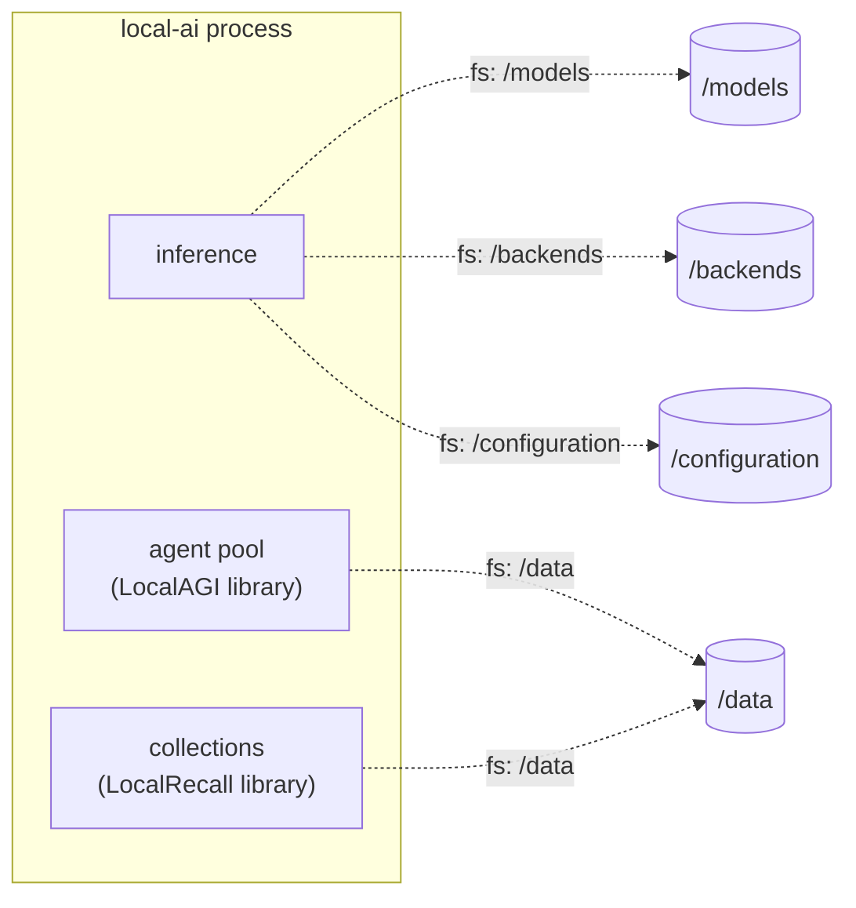

# Deployment layers

Four ways to run this stack, each one a superset of the last:

| Layer | What runs | What it adds | What it hides |
|---|---|---|---|
| Local process | `local-ai run` from a shell | Nothing between you and the binary. Paths, ports and logs are visible immediately | Nothing — this is the reference for what everything else does |
| Single container | `docker run localai/localai:v4.8.2` | A pinned userland, the accelerator driver stack, a `HEALTHCHECK`, a fixed `WORKDIR /` so paths stop moving | Which directory the process considers "here", and therefore where state lands |
| Compose | LocalAI + LocalRecall + LocalAGI + PostgreSQL | Service DNS, dependency ordering, healthcheck gating, one env file per stack | Startup ordering failures — `depends_on` masks the fact that a model load is still in flight |
| Kubernetes | The same containers, scheduled | Restart policy, rolling replacement, GPU scheduling, secret injection, PVC lifecycle | Everything above, plus: probes now decide whether your pod lives, and this stack has startup and shutdown behaviour that defeats the defaults |

Read the layers in that order even if you intend to deploy only the last one.
Each layer inherits a defect from the one below, and the defects are easier to
recognise where they originate. Two examples that recur on every page here:

- **`${basepath}` is the process working directory.** LocalAI's path defaults are
  computed from `kong.ExpandPath(".")` (source-verified, v4.8.2). Run
  `local-ai run` from `/home/you` and models land in `/home/you/models`. The
  container image only appears to fix this: it sets `WORKDIR /`, so the defaults
  resolve to `/models`, `/backends`, `/data`, `/configuration` — which happen to
  match the declared `VOLUME`s. Change the working directory and the coincidence
  ends. See [docker](docker.md#basepath-is-the-working-directory).
- **The HTTP listener binds last.** `application.New()` runs every download and
  preload before `appHTTP.Start()` is called (source-verified, v4.8.2). At the
  process layer this looks like a slow start. At the Kubernetes layer it looks
  like `CrashLoopBackOff`, because probes get connection-refused rather than a
  503. See [kubernetes](kubernetes.md#the-listener-binds-last).

## Where state lives in the smallest deployment

A single `local-ai` process contains three logical components and writes to four
directories. Nothing here is a separate service.

The agent pool and the collections store are Go libraries linked into the same
binary, not sidecars. That is why a deployment which persists `/models` and
nothing else loses every agent it ever created while appearing to work.

## The four volumes

Declared by the image as `VOLUME /models /backends /configuration /data`
(source-verified, v4.8.2, `Dockerfile`).

| Volume | Contents | Cost of losing it |
|---|---|---|
| `/models` | Model weights (GGUF, safetensors), per-model YAML, `._gallery_*.yaml` metadata | Re-download of every model. Gigabytes, and rate-limited by the upstream host |
| `/backends` | Backend OCI artifacts, each unpacked to `<name>/run.sh` plus metadata | Re-download of every backend on the next cold model load. Since v3.2.0 backends live outside the binary, so this is not an optional cache |
| `/configuration` | `api_keys.json`, `external_backends.json`, `runtime_settings.json`, watched by fsnotify and hot-reloaded | Statically issued API keys, external backend registrations, and every setting saved through the web UI |
| `/data` | Agent pool state, agent jobs and tasks, the agent collection DB and its assets, the SQLite auth database (`database.db`), the auto-generated HMAC secret (`.hmac_secret`), persisted traces, the MITM CA | Accounts, agents, agent knowledge, job history — **and every API key ever issued** |

That last row is worth spelling out. `LOCALAI_AUTH_HMAC_SECRET` has no default:
when unset, startup generates one and writes it to `<DataPath>/.hmac_secret` with
mode `0600` (source-verified, v4.8.2, `core/application/startup.go`). API keys
issued through the auth database are stored as HMACs under that secret. Lose
`/data` and a fresh secret is generated on the next boot, so every key a user
holds stops validating — with no error that names the cause. Either persist
`/data` or set `LOCALAI_AUTH_HMAC_SECRET` explicitly from a secret store, and
prefer doing both.

Three more paths are written but **not** covered by `VOLUME`:

| Path | Env | Default |
|---|---|---|
| Generated images, audio, video | `LOCALAI_GENERATED_CONTENT_PATH` | `$TMPDIR/localai-<uid>/generated/content` |
| Files API uploads | `LOCALAI_UPLOAD_PATH` | `$TMPDIR/localai-<uid>/upload` |
| System backends (read-only) | `LOCALAI_BACKENDS_SYSTEM_PATH` | `/var/lib/local-ai/backends` |

Upstream's own `docker-compose.yaml` still mounts `/tmp/generated/images/`, a
path the code no longer uses after the move to a per-UID temp directory
(source-verified, v4.8.2). Set `LOCALAI_GENERATED_CONTENT_PATH` explicitly rather
than inheriting that mount.

The other two processes have their own state. LocalAGI keeps everything under
`LOCALAGI_STATE_DIR` (`/pool` in its compose file); LocalRecall splits between
`COLLECTION_DB_PATH` and `FILE_ASSETS`. Neither declares a `VOLUME` in its
Dockerfile, and both have a runtime working directory of `/` — which is a
problem in LocalRecall's case, because its image is `FROM scratch` and has no
shell to inspect with. The complete map is in
[persistence](persistence.md).

## What each layer is for

**Local process.** Development, and any Apple Silicon host that wants GPU
acceleration — Metal exists only in the native build. See
[gpu](gpu.md#apple-silicon).

**Single container.** One machine, one accelerator family, state on named
volumes. Correct for a workstation or a single GPU box. Recipes per hardware
family in [docker](docker.md).

**Compose.** The point at which LocalRecall and LocalAGI become separate
processes and the port collision between LocalAI and LocalRecall (both default to
8080) has to be resolved. The reference stack is described in
[docker-compose](docker-compose.md).

**Kubernetes.** Only worth the cost if you need scheduled GPUs, rolling
replacement or multi-node scale-out. Read
[kubernetes](kubernetes.md) before deciding — the horizontal scaling story is
narrower than it looks, because agent pool state is local JSON and chromem vector
files are node-local.

Before exposing any of the four to a network you do not control, read
[security](security.md): none of the three projects terminates TLS, LocalAI's
default CORS policy is a wildcard, and LocalAGI and LocalRecall are
unauthenticated out of the box.

## Upstream references

- [`Dockerfile`](https://github.com/mudler/LocalAI/blob/v4.8.2/Dockerfile) — `WORKDIR /`, `VOLUME /models /backends /configuration /data`, `HEALTHCHECK`. Source-verified against v4.8.2, validated 2026-08-17.
- [`cmd/local-ai/main.go`](https://github.com/mudler/LocalAI/blob/v4.8.2/cmd/local-ai/main.go) — `${basepath}` = `kong.ExpandPath(".")`, dotenv load order. Source-verified against v4.8.2, validated 2026-08-17.
- [`core/cli/run.go`](https://github.com/mudler/LocalAI/blob/v4.8.2/core/cli/run.go) — path flags and their defaults; listener started last. Source-verified against v4.8.2, validated 2026-08-17.
- [`core/application/startup.go`](https://github.com/mudler/LocalAI/blob/v4.8.2/core/application/startup.go) — HMAC secret generation into `<DataPath>/.hmac_secret`. Source-verified against v4.8.2, validated 2026-08-17.
- [`docker-compose.yaml`](https://github.com/mudler/LocalAI/blob/v4.8.2/docker-compose.yaml) — the stale `/tmp/generated/images/` mount. Source-verified against v4.8.2, validated 2026-08-17.
- [LocalAGI `cmd/serve.go`](https://github.com/mudler/LocalAGI/blob/v2.9.0/cmd/serve.go) — state directory resolution. Source-verified against v2.9.0, validated 2026-08-17.
- [LocalRecall `main.go`](https://github.com/mudler/LocalRecall/blob/v0.6.4/main.go) — `COLLECTION_DB_PATH` and `FILE_ASSETS` defaults. Source-verified against v0.6.4, validated 2026-08-17.
