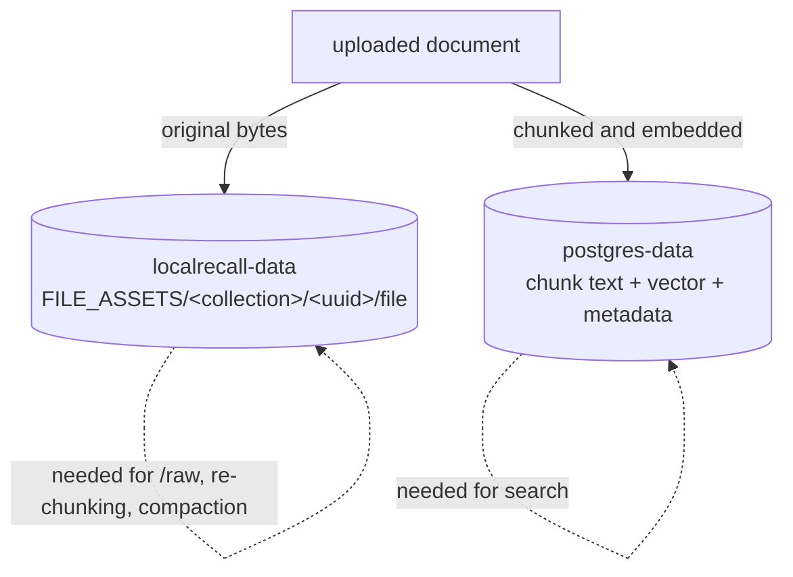

# Persistence

Six volumes, and they are not equally important. Two hold data you cannot regenerate; the
rest hold downloads. Getting the distinction wrong produces the two characteristic
disasters of this stack: **every agent gone**, or **a collection whose documents have
vanished but whose chunks remain**.

## What exists, and what it costs

Measured on the reference environment after the validation run — four agents, one small
collection, two models.

| Volume | Holds | Owner | Observed size | Regenerable? |
|---|---|---|---|---|
| `localai-models` | model weights, generated YAML | LocalAI | **1.503 GB** | yes — re-download |
| `localai-backends` | backend binaries | LocalAI | **160 MB** | yes — re-download |
| `localai-configuration` | runtime settings | LocalAI | **0 B** | yes — settings reset |
| `localagi-pool` | **agent definitions**, tokens, connector config | LocalAGI | **6.1 kB** | **no** |
| `localrecall-data` | **original uploaded documents** | LocalRecall | **460 B** | **no** |
| `postgres-data` | **chunks and vectors** | PostgreSQL | **66.23 MB** | only by re-ingesting |

Two things that table teaches immediately.

**The irreplaceable data is tiny.** 6.1 kB of agent definitions against 1.5 GB of models.
Your backup problem is small; your restore-time problem is the models, and those you can
re-download. Back up the kilobytes and let the gigabytes rebuild.

**PostgreSQL has a large floor.** 66 MB for a single 207-byte document — that is the
database's baseline, not your data. Do not size a vector store by extrapolating from a
small collection.

## The dependency that catches people

A document is persisted **twice**, in two different volumes:



| Restore only | Result |
|---|---|
| `postgres-data` | search works; `/entries/<x>/raw` **404s**; re-chunking and compaction impossible |
| `localrecall-data` | files present; **nothing can find them** |
| both | correct |

**Back them up together or not at all.** They are one logical dataset in two stores, and
nothing in the system detects or repairs the inconsistency — you will discover it when a
raw-file fetch fails months later.

With `VECTOR_ENGINE=chromem` this problem disappears, because both live under
`localrecall-data`. That is a genuine operational advantage of the file engine.

## Agent state: the definition, not just the runtime

The most common data loss in this stack, and it happens because the volume looks optional.

```bash
docker exec localagi ls -la /pool
```

`LOCALAGI_STATE_DIR` holds **agent definitions as JSON**. Losing it does not lose "runtime
state that will rebuild" — it loses the agents themselves, their tools, their prompts and
their credentials.

| Also in that volume | Note |
|---|---|
| MCP bearer tokens | **plain text** |
| Per-agent `api_key`, `local_rag_api_key` | plain text |
| Connector configuration (Slack, GitHub, email, Telegram) | plain text |
| `conversations/` | only if conversation logging is enabled |
| `skills/` | if skills are used |

So this volume is both **irreplaceable** and **secret-bearing**. Restrict access to it and
be careful where its backups go — see [security](security.md).

!!! danger "Pattern A puts agent state in `/data`, and most quickstarts do not mount it"
    When LocalAI runs its own agent pool, agent state lives in **`/data`** inside the
    LocalAI container. The image declares four volumes:

    ```text
    VOLUME /models /backends /configuration /data
    ```

    Mounting only `/models` — which is what most quickstarts show — **silently discards
    every agent you create**. Nothing warns you; the agents simply are not there after a
    restart.

## What a restart actually costs

| Restart | Lost | Recovery |
|---|---|---|
| LocalAI, volumes mounted | resident models only | reloaded on first request — observed **4 s** |
| LocalAI, no volumes | models, backends, and agents in Pattern A | ~1.4 GiB re-download |
| LocalAGI, state dir mounted | conversation history, action history | conversations start fresh |
| LocalAGI, no state dir | **all agent definitions** | manual re-creation |
| LocalRecall, data mounted | nothing | — |
| PostgreSQL, volume mounted | nothing | — |

### Conversation history is never persisted

By design, and worth stating in a persistence page so nobody looks for it.

Conversation history for `previous_response_id` lives in an **in-memory map with a TTL**
(`LOCALAGI_CONVERSATION_DURATION`, falling back to **1 hour**). It is never written to
disk. A restart loses every in-flight conversation while keeping every agent.

Expiry returns an **empty conversation**, not an error — so an expired ID and a valid one
are indistinguishable to a client. See
[the Responses API](../02-localagi/responses-api.md).

If you need durable recall, that is what the knowledge base is for: `long_term_memory`
writes conversation content into the agent's collection, which *is* persisted.

## Backing up

### The minimum that matters

```bash
docker run --rm \
  -v localai-stack_localagi-pool:/data:ro \
  -v "$PWD":/backup \
  alpine tar czf /backup/localagi-pool.tar.gz -C /data .
```

6 kB, and it is the difference between a five-minute restore and re-creating every agent
by hand.

An alternative for individual agents, which has the advantage of being readable:

```bash
curl -s http://localhost:8081/settings/export/<agent-name> > agent.json
```

Verified: returns 200 with a ~1.1 kB JSON document. Re-import with
`POST /settings/import`.

### Knowledge — both halves

PostgreSQL properly, with `pg_dump`:

```bash
docker exec -e PGPASSWORD=localrecall localai-postgres \
  pg_dump -U localrecall -d localrecall > localrecall.sql
```

`PGPASSWORD` is required; without it `psql`/`pg_dump` prompt and fail non-interactively.

And the assets, in the same operation so the two stay consistent:

```bash
docker run --rm \
  -v localai-stack_localrecall-data:/data:ro \
  -v "$PWD":/backup \
  alpine tar czf /backup/localrecall-data.tar.gz -C /data .
```

**Take both at the same time.** There is no transactional boundary between the file store
and the database, so a document ingested between the two operations will be half-captured.
For a consistent snapshot, pause ingestion — stop the LocalRecall container — for the
duration.

With `chromem`, the second command is the whole backup:

```bash
docker run --rm -v localai-stack_localrecall-data:/data:ro -v "$PWD":/backup \
  alpine tar czf /backup/localrecall-chromem.tar.gz -C /data .
```

### What not to bother backing up

| Volume | Why not |
|---|---|
| `localai-models` | 1.5 GB, re-downloadable, and version-pinned by your configuration anyway |
| `localai-backends` | 160 MB, re-downloaded on the next model load |
| `localai-configuration` | 0 B in practice; settings are better held in your Compose file |

Backing up models is not wrong, and it does make restores faster and gallery-outage-proof —
which, given that we reproduced a gallery outage
([HTTP 429 from `raw.githubusercontent.com`](../00-overview/version-matrix.md#a-reproduced-failure-worth-knowing)),
is a real consideration. But it is a *convenience* backup, not a *data* backup, and it
should not compete with the two that matter.

## Restoring

```bash
docker compose down
```

```bash
docker run --rm \
  -v localai-stack_localagi-pool:/data \
  -v "$PWD":/backup \
  alpine sh -c 'rm -rf /data/* && tar xzf /backup/localagi-pool.tar.gz -C /data'
```

```bash
docker compose up -d
docker exec -i -e PGPASSWORD=localrecall localai-postgres \
  psql -U localrecall -d localrecall < localrecall.sql
```

Then verify — a restore that looks fine and has no data is the failure mode to guard
against:

```bash
curl -s http://localhost:8081/api/agents | jq '.agents'
```

```bash
curl -s http://localhost:8082/api/collections | jq '.data.collections'
```

```bash
./scripts/verify-stack.sh --agent <restored-agent>
```

Nothing validates that the volume you mounted is the one holding your data. An empty state
directory produces an empty agent pool and **no error** — so assert the contents, do not
assume them.

## Migration hazards

### Moving collections between embedded and standalone

The one migration with a real data hazard, because the default paths differ:

| Running as | `COLLECTION_DB_PATH` default | `FILE_ASSETS` default |
|---|---|---|
| Embedded in LocalAGI | `<stateDir>/collections` | `<stateDir>/assets` |
| Standalone LocalRecall | `./collections` — **relative to the working directory** | `./assets` |

In a `FROM scratch` image, "the working directory" is the ephemeral container layer. That
is how collections silently vanish on restart.

**Always set both explicitly**, in both modes, as the reference environment does. Then a
migration is a variable change rather than a data hunt.

### Changing the embedding model invalidates collections

Not a persistence operation, but it destroys data value, so it belongs here.

| Change | Result |
|---|---|
| New model, different dimension | writes fail on dimension mismatch |
| New model, same dimension | writes succeed and **retrieval silently degrades** |

Vectors from different models are not comparable. There is no migration path: you
**re-ingest**, which is why keeping `localrecall-data` matters — the originals are what you
re-ingest from. A deployment that kept only PostgreSQL cannot re-embed anything.

Treat `EMBEDDING_MODEL` as part of a collection's identity and record it alongside your
backups.

## Volume hygiene

```bash
docker system df -v | grep localai-stack
```

Sizes and link counts. A volume with `LINKS 0` is orphaned.

```bash
docker compose down
```

Keeps everything.

```bash
docker compose down -v
```

**Removes all six volumes.** Models, agents, collections, vectors. There is no
confirmation and no recovery.

Selective, keeping the slow downloads:

```bash
docker compose down
docker volume rm localai-stack_localagi-pool \
  localai-stack_postgres-data localai-stack_localrecall-data
```

## Checklist

- [ ] `localagi-pool` is on a persistent volume, and backed up
- [ ] `localrecall-data` **and** `postgres-data` are backed up together
- [ ] In Pattern A, `/data` is mounted — not just `/models`
- [ ] `COLLECTION_DB_PATH` and `FILE_ASSETS` are set explicitly, never defaulted
- [ ] `EMBEDDING_MODEL` is recorded with each collection backup
- [ ] A restore has actually been tested, and the contents asserted afterwards
- [ ] The agent state volume is treated as secret-bearing
- [ ] Someone knows that `docker compose down -v` deletes everything

## Upstream references

- [LocalAI `Dockerfile`](https://github.com/mudler/LocalAI/blob/v4.8.2/Dockerfile) — `VOLUME /models /backends /configuration /data`. Validated against v4.8.2.
- [LocalAI `core/cli/run.go`](https://github.com/mudler/LocalAI/blob/v4.8.2/core/cli/run.go) — `LOCALAI_DATA_PATH` and the agent-pool state directory.
- [LocalAGI `cmd/serve.go`](https://github.com/mudler/LocalAGI/blob/v2.9.0/cmd/serve.go) — state directory creation and the state-dir-relative collection defaults at 38-53. Validated against v2.9.0.
- [LocalAGI `core/state/pool.go`](https://github.com/mudler/LocalAGI/blob/v2.9.0/core/state/pool.go) — pool JSON load and save.
- [LocalAGI `core/conversations`](https://github.com/mudler/LocalAGI/tree/v2.9.0/core/conversations) — the in-memory, never-persisted conversation store.
- [LocalAGI `webui/routes.go`](https://github.com/mudler/LocalAGI/blob/v2.9.0/webui/routes.go) — `/settings/export/:name` and `/settings/import` at 192-193.
- [LocalRecall `main.go`](https://github.com/mudler/LocalRecall/blob/v0.6.4/main.go) — working-directory-relative path defaults at 33-45. Validated against v0.6.4.
- [LocalRecall `rag/persistency.go`](https://github.com/mudler/LocalRecall/blob/v0.6.4/rag/persistency.go) — the asset copy into `FILE_ASSETS/<collection>/<uuid>/`.
- Volume sizes, the export endpoint's response, the PostgreSQL baseline footprint and model-reload latency: observed 2026-08-17, see [version matrix](../00-overview/version-matrix.md).
