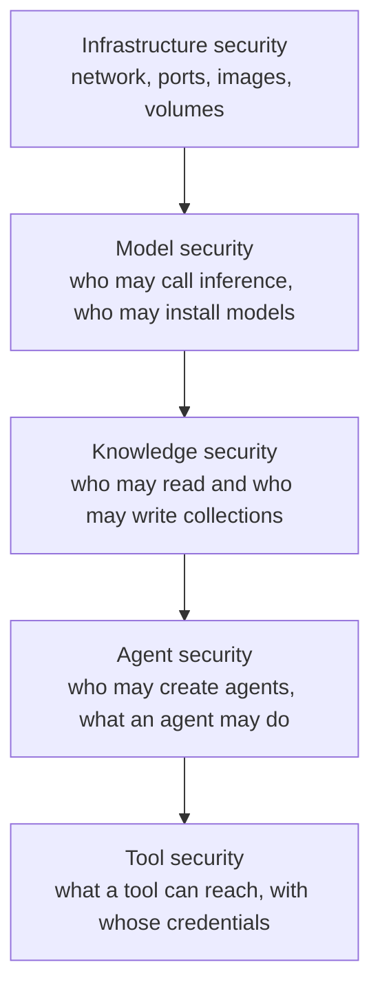
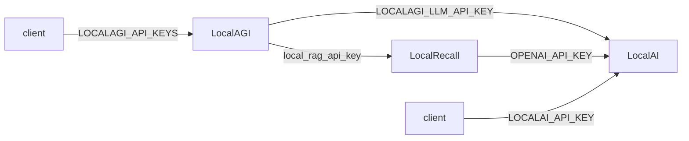

# Security

An agent platform is not an inference server with extra features. It is a system that
lets a language model choose actions with arguments it invented, against credentials you
supplied. The threat model is different in kind, not degree.

This page is the operational treatment: what is off by default, what to turn on, and
where the real boundaries are. The conceptual treatment — trust boundaries, adversarial
inputs, isolation — is in [the security model](../07-deep-dives/security-model.md).

## Start here: nothing is on by default

Verified on the reference environment, which is upstream's shape with explicit
configuration:

| Control | Default | Consequence |
|---|---|---|
| Authentication on LocalAI | **none** | anyone who can reach the port can use, install and delete models |
| Authentication on LocalAGI | **none** | anyone who can reach the port can create agents and run tools |
| Authentication on LocalRecall | **none** | anyone who can reach the port can read and poison collections |
| TLS anywhere | **none** | all of the above in plaintext, including bearer tokens |
| Tool sandboxing | **none** | built-in actions run in the agent's process and container |
| Collection isolation | **none** | there is no tenancy model |
| Audit log | **off** | no record of what an agent did |

None of this is a defect in the projects — they are self-hosted components, not a managed
platform. It *is* a defect in a deployment that reaches beyond one workstation.

## Five layers, five different problems

Conflating these is why "we put it behind an auth proxy" is a common and insufficient
answer.



An auth proxy addresses the second. It does nothing about the fifth.

## Infrastructure

### Ports

Three services, three surfaces. Publish only what you actually consume.

| Service | Port | Should it be reachable? |
|---|---|---|
| LocalAI | 8080 | only by the agent runtime and your applications |
| LocalAGI | 3000 (in container) | by your applications |
| LocalRecall | 8080 (in container) | **only by the agent runtime** |
| PostgreSQL | 5432 | **only by LocalRecall** |

The reference environment publishes LocalRecall on 8082 for teaching — so you can probe
retrieval independently. In a real deployment that port should not leave the network.
PostgreSQL is deliberately unpublished there; keep it that way.

Full table: [ports](../08-reference/ports.md).

### Images

Pin explicit versions. `latest-aio-*`, `latest-cpu`, `-extras` and `-cuda-11` tags still
resolve but are **frozen builds from 2026-02-21 or earlier** — `latest-cpu` since
2025-06-19. Running a stale image means running unpatched code that looks current.

Note also that LocalAGI's newest published image is **v2.8.1**; `v2.9.0` does not exist.
Whatever you pin, know which one you are actually running — the two differ
architecturally. See the [version matrix](../00-overview/version-matrix.md).

### Volumes hold secrets

```bash
docker exec localagi ls /pool
```

Agent definitions are JSON on disk and they contain **credentials in plain text**: MCP
bearer tokens, per-agent `api_key` and `local_rag_api_key`, and connector
configuration for Slack, GitHub, email and Telegram.

Treat `localagi-pool` as a secret-bearing volume: restrict access, encrypt at rest if
your platform supports it, and be careful where its backups go.

## Authentication, and the five keys

The most common misconfiguration in a separated deployment: **every hop authenticates
independently.**



| Variable | Direction | Must equal |
|---|---|---|
| `LOCALAI_API_KEY` | inbound to LocalAI | — |
| `LOCALAGI_LLM_API_KEY` | LocalAGI → LocalAI | `LOCALAI_API_KEY` |
| `OPENAI_API_KEY` on LocalRecall | LocalRecall → LocalAI | `LOCALAI_API_KEY` |
| `LOCALAGI_API_KEYS` | inbound to LocalAGI | your clients |
| `API_KEYS` on LocalRecall | inbound to LocalRecall | LocalAGI's RAG key |

Three traps, all source-verified:

**`sk-xxx`.** When `LOCALAGI_LLM_API_KEY` is unset, the client sends the literal string
`sk-xxx` rather than no credential. You will never see "no credentials supplied" in a log
— you will see a rejected token, which looks like a wrong key instead of a missing one.

**The RAG provider borrows the model key.** `NewHTTPRAGProvider` is constructed with the
*model server's* API key as its default token for LocalRecall. If the two services use
different keys, retrieval authenticates with the wrong one unless you set the per-agent
`local_rag_api_key`.

**LocalAGI's auth is global.** With `LOCALAGI_API_KEYS` set, every route requires a key —
including `/api/agents`, which the reference environment uses as its healthcheck. The
healthcheck starts failing the moment you enable auth.

LocalAGI accepts the key from four places, which is worth knowing when you write a proxy
rule:

```text
header:Authorization    header:x-api-key    header:xi-api-key    cookie:token
```

LocalRecall compares keys with `subtle.ConstantTimeCompare`. LocalAGI uses a keyauth
middleware. Neither has users, roles, scopes or expiry: **a key is all-or-nothing
access.** There is no read-only key, no per-collection key, and no per-agent key.

## TLS

None of the three terminates TLS. Every internal hop — agent to model, knowledge to
embeddings, agent to knowledge — is plaintext HTTP carrying bearer tokens.

| Where | What to do |
|---|---|
| Client → LocalAGI | terminate TLS at a reverse proxy or ingress |
| Between services | keep them on a private network; use a service mesh if you need mTLS |
| LocalRecall → PostgreSQL | `sslmode=require` in `DATABASE_URL` if the database is remote |

The reference environment uses `sslmode=disable` because the database is on the same
Docker network. Change that the moment it is not.

Remember the timeout interaction: a reverse proxy in front of an agent needs a **long
read timeout**. An agent request is a loop and legitimately takes tens of seconds — 38.7 s
was measured for a single tool call on CPU. A 60-second default returns 504 to the client
**while the agent runs to completion and commits its side effects**.

## Agent security

### Who may create an agent

Anyone who can reach `POST /api/agent/create`. There is no notion of an agent owner, and
creating an agent means choosing its tools.

So **the ability to create an agent is the ability to run its tools.** If
`shell-command` is available, that is remote code execution in the LocalAGI container.
Authentication on LocalAGI is not optional in any shared environment.

### What an agent may do

A stock LocalAGI reports **40 built-in actions and 9 connectors**. Verified list of the
ones that need care:

| Action | Capability |
|---|---|
| `shell-command` | executes commands |
| `browse`, `scraper` | fetches arbitrary URLs — an SSRF surface, and an injection surface |
| `send-mail` | sends email as you |
| `send-telegram-message`, `twitter-post` | posts publicly |
| `webhook` | POSTs to arbitrary URLs — an exfiltration path |
| `github-pr-creator`, `github-issue-opener`, `github-repository-create-or-update-content` | writes to repositories |
| `generate_pdf`, `generate_image`, `generate_song` | writes files |
| `call_agents` | invokes other agents |
| `add_to_memory`, `remove_from_memory` | writes and deletes knowledge |

These are **available to configure**, not enabled by default — an agent gets only the
actions you list. The rule that follows: treat an agent's `actions` list as a permission
grant, and review it as you would a service account's IAM policy.

### `call_agents` without a whitelist grants the whole pool

`whitelist` and `blacklist` are the only access control on delegation, and **when neither
is set every agent in the pool is callable.** A coordinator with an unconfigured
`call_agents` can reach an agent that has `shell-command`, even though the coordinator was
never given it.

```json
{"name": "call_agents", "config": "{\"whitelist\": \"unit-converter\"}"}
```

Always set a whitelist. Better: give only one agent `call_agents` and give specialists
none, so privilege cannot be chained.

### Agents can act on their own

Several configuration fields make an agent run without a request:

| Field | Effect |
|---|---|
| `periodic_runs` | runs on a schedule |
| `initiate_conversations` | starts conversations itself |
| `permanent_goal` | pursues a standing objective |
| `standalone_job` | runs as a job |
| connectors (Slack, Discord, Telegram, IRC, GitHub, email) | **external parties can trigger it** |

The last row is the important one. A connector turns an agent into something an outsider
can invoke. Everything in [the security model](../07-deep-dives/security-model.md) about
indirect prompt injection applies immediately once a connector is attached.

## Tool security

The layer an auth proxy cannot help with.

**The model chooses the arguments.** A tool that takes a path can be given any path; one
that takes a URL can be given any URL; one that takes a command can be given any command.
Verified in [Recipe 5](../05-recipes/agent-with-tools.md): the recorded `Parameters` are
whatever the model emitted.

cogito constrains tool **names** — with forced reasoning it offers a JSON-schema `enum` of
real tool names, so a hallucinated name is impossible. It does **not** constrain
arguments. Those are generated text.

Therefore constrain at the boundary, not in the prompt:

| Risk | Mitigation |
|---|---|
| Filesystem reach | run the container with a read-only root and mount only what is needed |
| Network reach | egress network policy; do not give `browse`/`webhook` unrestricted egress |
| Credential blast radius | scoped, short-lived tokens per tool — never a broad PAT |
| Command execution | do not enable `shell-command` on any agent reachable by untrusted input |
| Side effects | prefer read-only tool variants; there is no dry-run mode |

**There is no confirmation step and no approval workflow.** A tool call executes as soon
as the model emits it.

### MCP is a trust boundary, not a control

MCP has no permission model of its own. If the model can name the tool, it can call it.

| Transport | Extra exposure |
|---|---|
| stdio | the server runs as a **child process of LocalAGI**, in its container, with its filesystem |
| HTTP | a network destination; its bearer token is stored in the agent's JSON on disk |

An MCP server's tool descriptions are written by whoever wrote the server, and they are
injected into the model's context. **An MCP server you do not control is content you do
not control.** See [Recipe 7](../05-recipes/mcp-agent.md).

### LocalAI's own MCP server

A stock container logs:

```text
INFO LocalAI Assistant in-memory MCP server initialised tools=36 read_only=false
```

36 administrative tools over the model runtime, **not read-only**, backing LocalAI's
built-in Assistant. We probed `/mcp`, `/api/mcp` and `/mcp/sse` and all returned 404, so
we found no evidence of default external reachability — but `read_only=false` means the
Assistant is a model-driven agent with write access to model and backend management.

If you expose LocalAI's UI, you are exposing that.

## Knowledge security

### There is no tenancy model

The most consequential fact on this page for anyone thinking about multi-user
deployments.

An agent's collection is its **lowercased name**. That is the whole isolation model.

| Consequence | Detail |
|---|---|
| Two agents differing only in case **share** a collection | `Support-Bot` and `support-bot` both use `support-bot` |
| Any authenticated caller can read any collection | one API key, all collections |
| Any authenticated caller can write any collection | including an agent's memories |
| No per-collection permissions exist | not in LocalRecall, not in LocalAGI, not in LocalAI |

**Do not put two tenants' documents in one deployment and assume they are separated.**
Separation means separate deployments, separate databases, or a proxy that enforces
collection scoping before the request arrives — which you would have to write.

### Memory and knowledge are the same store

Agent memory is written into the same collection as ingested documents, as a file named
`<timestamp>-<md5>.txt`. Two consequences:

- **Resetting a collection deletes the agent's memories too.** There is no separate scope.
- **Anything that can write the collection can write the agent's memory** — which is to
  say, can put words into the agent's head for future retrieval.

See [memory vs knowledge](../07-deep-dives/memory-vs-knowledge.md).

### Knowledge-base poisoning

Retrieved chunks are prepended to the conversation as a system message reading `Given the
user input you have the following in memory:`. **Whatever is in the collection is
instruction-adjacent context.** There is no relevance threshold and no provenance check.

Two write paths to guard:

**Uploads.** `POST /api/collections/:name/upload` accepts a file from anyone who can reach
the port.

**External sources.** A registered source is polled and re-ingested on a schedule:

```bash
curl -s http://localhost:8082/api/collections/<name>/sources | jq
```

`update_interval` is in minutes and defaults to 60 if you send anything below 1 — so
`0` means hourly, not never. **A source URL you do not control is a scheduled injection
channel.** Audit them.

## Auditability

Thin, and worth knowing precisely.

| Question | Can you answer it? |
|---|---|
| What requests arrived? | yes — access logs on all three services |
| Which agent ran, and when? | yes — `agent=` on every LocalAGI log line |
| Which tools ran, with what arguments? | **partly** — `/api/agent/:name/status`, **last 10 only**, in memory, lost on restart |
| What was the full conversation? | only with `LOCALAGI_ENABLE_CONVERSATIONS_LOGGING=true` |
| How many tokens did it cost? | **no** — `usage` is hardcoded to zero |
| Who authenticated? | **no** — keys have no identity |

That last row is the ceiling on auditability: a key is not a user, so you cannot attribute
an action to a person. If you need attribution, put an identity-aware proxy in front and
log there.

Enable the conversation log where policy requires a record:

```bash
LOCALAGI_ENABLE_CONVERSATIONS_LOGGING=true
```

It writes `<stateDir>/conversations/<agent>-<timestamp>.json`. It is an **audit log, not
state** — nothing reads it back. It also contains everything a user said, which is itself
a data-protection consideration.

See [observability](observability.md).

## A hardening checklist

Ordered by how much risk each removes.

- [ ] Do not expose LocalAGI to untrusted networks without authentication
- [ ] Set all five API keys, and verify the internal hops still work
- [ ] Terminate TLS in front of LocalAGI; keep service-to-service traffic private
- [ ] Do not publish LocalRecall or PostgreSQL beyond the internal network
- [ ] Review every agent's `actions` list as a permission grant
- [ ] Never enable `shell-command` on an agent reachable by untrusted input
- [ ] Set a `whitelist` on every `call_agents`
- [ ] Scope and time-limit every credential a tool receives
- [ ] Apply egress network policy; assume `browse`, `scraper` and `webhook` are exfiltration paths
- [ ] Audit external knowledge sources; treat their content as untrusted
- [ ] Do not co-tenant collections
- [ ] Pin image versions; avoid `latest-*` and AIO tags
- [ ] Treat the agent state volume as secret-bearing
- [ ] Raise proxy read timeouts to exceed a real agent request
- [ ] Enable conversation logging where a record is required
- [ ] Put an identity-aware proxy in front if you need attribution

## Upstream references

- [LocalAGI `webui/routes.go`](https://github.com/mudler/LocalAGI/blob/v2.9.0/webui/routes.go) — global keyauth middleware at 30-36; the four key locations in `GetKeyAuthConfig` at 252-254. Validated against v2.9.0.
- [LocalAGI `pkg/llm/client.go`](https://github.com/mudler/LocalAGI/blob/v2.9.0/pkg/llm/client.go) — the `sk-xxx` placeholder when no key is set.
- [LocalAGI `core/state/pool.go`](https://github.com/mudler/LocalAGI/blob/v2.9.0/core/state/pool.go) — `NewHTTPRAGProvider` defaulting to the LLM API key at 36-49; `Status` keeping only ten results at 83-90.
- [LocalAGI `core/state/config.go`](https://github.com/mudler/LocalAGI/blob/v2.9.0/core/state/config.go) — `actions`, `mcp_servers` with tokens, `periodic_runs`, `permanent_goal`, `initiate_conversations`, per-agent `api_key` and `local_rag_api_key`.
- [LocalAGI `services/actions/callagents.go`](https://github.com/mudler/LocalAGI/blob/v2.9.0/services/actions/callagents.go) — whitelist/blacklist parsing, and the absence of a default restriction.
- [LocalAGI `services/actions`](https://github.com/mudler/LocalAGI/tree/v2.9.0/services/actions) — `shell-command`, `browse`, `webhook`, `send-mail` and the rest of the 40.
- [LocalAGI `core/agent/mcp.go`](https://github.com/mudler/LocalAGI/blob/v2.9.0/core/agent/mcp.go) — MCP server config, including stdio child processes at 27-32.
- [LocalAGI `core/agent/knowledgebase.go`](https://github.com/mudler/LocalAGI/blob/v2.9.0/core/agent/knowledgebase.go) — retrieved chunks injected as a system message at 94-101.
- [LocalRecall `routes.go`](https://github.com/mudler/LocalRecall/blob/v0.6.4/routes.go) — `API_KEYS` middleware with `subtle.ConstantTimeCompare` at 158-175; upload and source registration. Validated against v0.6.4.
- [LocalRecall `rag/source_manager.go`](https://github.com/mudler/LocalRecall/blob/v0.6.4/rag/source_manager.go) — scheduled external-source re-ingestion.
- [LocalAI `core/cli/run.go`](https://github.com/mudler/LocalAI/blob/v4.8.2/core/cli/run.go) — `LOCALAI_API_KEY`, `LOCALAI_DISABLE_AGENTS`. Validated against v4.8.2.
- The 40 actions and 9 connectors, the MCP server log line with `read_only=false`, the 404s on `/mcp*`, plain-text credentials in the pool volume, and all latencies: observed 2026-08-17, see [version matrix](../00-overview/version-matrix.md).
