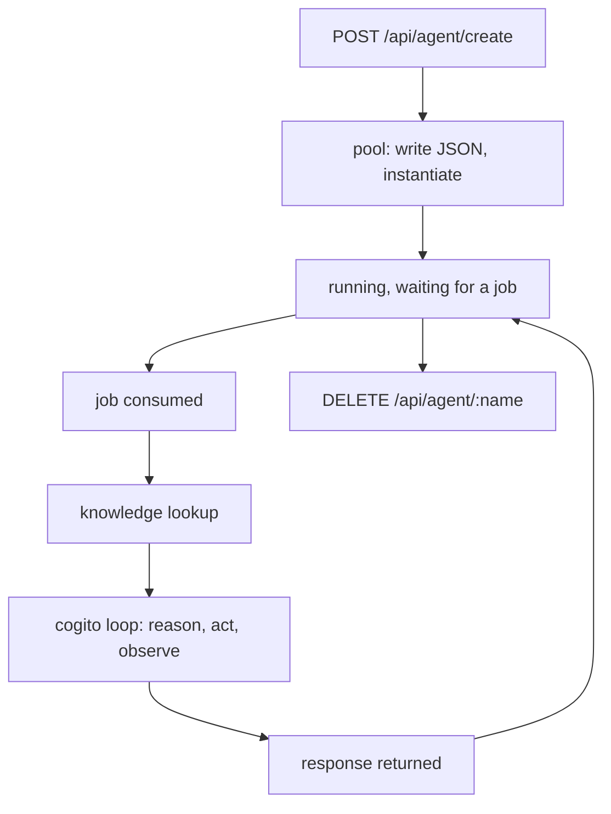

# The agent lifecycle

An agent's life has four stages, and each is owned by a different piece of code: the **pool**
persists it, the **job** carries one request, **cogito** runs the loop, and the **status** records
what it did. Confusing them is why "the agent is stuck" is so often a question about the wrong
layer.

## The four stages



| Stage | Owner | Durable? |
|---|---|---|
| Definition | agent pool | **yes** — JSON on disk |
| Running status | pool, in memory | no |
| One request | a job | no |
| The loop | cogito | no |
| Action history | `Status`, in memory | no — **last 10 only** |

Only the first row survives a restart. That is the single most useful thing to know about the
lifecycle.

## Creation

```bash
curl -s -X POST http://localhost:8081/api/agent/create \
  -H 'Content-Type: application/json' \
  -d '{"name":"researcher","model":"qwen3-1.7b","system_prompt":"Be terse.",
       "enable_kb":true,"actions":[{"name":"counter","config":"{}"}]}'
```

Returns `{"status":"ok"}`. Three things happen, and the ordering matters when one fails:

1. The configuration is written into the pool's JSON in `LOCALAGI_STATE_DIR`.
2. The agent object is instantiated: connectors, dynamic prompts, actions and filters are all
   resolved **now**, not per request.
3. It starts and begins waiting for jobs.

Verified immediately afterwards:

```bash
curl -s http://localhost:8081/api/agents
```

```json
{"actions":40,"agentCount":1,"agents":["researcher"],
 "connectors":9,"statuses":{"researcher":true}}
```

`actions: 40` and `connectors: 9` are what is **compiled into the binary**, not what this agent
has. `statuses` maps the agent to whether it is running — a paused agent shows `false`.

### The name is load-bearing

More than an identifier. The name determines:

| Consequence | Detail |
|---|---|
| The `model` field on `/v1/responses` | you send the **agent** name, not a model name |
| **The collection name** | trimmed and **lowercased** — `Support-Bot` → `support-bot` |
| Log correlation | every line carries `agent=<name>` |

Two agents differing only in case therefore **share one collection**, and renaming an agent
orphans its knowledge. There is no rename operation; you delete and recreate, and the old
collection stays behind, full.

### Resolution happens at creation, not per request

Because connectors, actions and MCP servers are resolved when the agent is instantiated, a
missing MCP server is a **startup** problem rather than a request problem:

```bash
docker logs localagi 2>&1 | grep -i mcp
```

No MCP lines means discovery failed and the agent silently has fewer tools. It will still answer
requests.

## The running state, and autonomy

Most agents wait for a request. Several configuration fields make an agent act on its own, and
they change the lifecycle fundamentally:

| Field | Trigger |
|---|---|
| `periodic_runs` | a schedule |
| `scheduler_poll_interval`, `scheduler_task_template` | scheduling detail |
| `initiate_conversations` | the agent itself |
| `permanent_goal` | a standing objective |
| `standalone_job` | runs as a job |
| connectors | **an external party** |

For an autonomous agent there is no caller to attribute, no request to block, and no HTTP status
to observe. This is also why LocalAGI cannot be replicated: each replica loads the same pool and
runs the same schedules, so side effects are **duplicated rather than distributed** — see
[scaling](scaling.md).

Pause and resume, which is what `statuses` reflects:

```bash
curl -s -X PUT http://localhost:8081/api/agent/researcher/pause
curl -s -X PUT http://localhost:8081/api/agent/researcher/start
```

Verified: after `pause`, `statuses` reports `{"researcher": false}`. The definition is untouched.

## One request: the job

```text
POST /v1/responses  →  Ask(jobOptions...)  →  job  →  cogito  →  response
```

A job carries the conversation history, the tools available for this request, and callbacks for
reasoning and results. Observed in LocalAGI's debug log for a single request:

```text
DEBUG Agent Ask()               agent=kb-probe model=qwen3-1.7b
DEBUG Agent Execute()           agent=kb-probe model=qwen3-1.7b
DEBUG Agent is consuming a job  agent=kb-probe job="&{… ConversationHistory:[{Role:user …}]
                                 UUID:75339ab8-8ebc-41b6-a661-de17a24a91ac …}"
INFO  [Knowledge Base Lookup] Last user message      agent=kb-probe
INFO  [Knowledge Base Lookup] Found similar strings in KB  agent=kb-probe
DEBUG Long term memory is disabled                   agent=kb-probe
DEBUG Agent has finished                             agent=kb-probe
DEBUG Agent is now waiting for a new job             agent=kb-probe
INFO  we got a response from the agent               agent=kb-probe response="…"
```

That sequence is the lifecycle of one request, and it is worth memorising because it is the
fastest way to answer "where did it get to". Note the job's own **UUID**, which is distinct from
the response ID returned to the client — and is not exposed over the API.

The delta between `Agent Ask()` and `Agent has finished` is the agent's real cost. Comparing it
against your client's timeout tells you whose fault a 504 was:

```bash
docker logs localagi 2>&1 | grep 'we got a response from the agent'
```

**If that line is present and your client timed out, the timeout was yours.**

### Knowledge lookup happens once, before the loop

Three guards are checked in order — `enable_kb`, `kb_auto_search`, and whether a RAG provider
exists — and **all three log at DEBUG only**. Then the latest user message is used, verbatim, as
the query.

Verified: two model calls, **one** retrieval call. Retrieval is not per iteration, so an agent
that discovers mid-loop that it needs different knowledge cannot go back for it — unless
`kb_as_tools` makes retrieval a tool the model may call.

### Then cogito takes over

The loop is **not LocalAGI's code**. LocalAGI translates its agent options into cogito options and
hands over:

| Agent field | cogito option |
|---|---|
| `loop_detection` | `WithLoopDetection` |
| `max_attempts` | `WithMaxAttempts` |
| `enable_reasoning` | forced reasoning |

Under forced reasoning cogito does not hand the model a free-form tool list. It asks for
schema-validated reasoning, then a tool name from a JSON-schema `enum` of real names, then
arguments in a third scoped call — **three or more model calls per iteration**. A hallucinated
tool *name* is impossible by construction; arguments remain generated text.

That trade — reliability on small models, paid for in model calls — is the main reason agent
latency is what it is.

## Observables: the introspection surface

Beyond logs, an agent emits **observables**: a tree of named steps with a parent ID.

```bash
curl -s http://localhost:8081/api/agent/researcher/observables | jq
curl -s -X DELETE http://localhost:8081/api/agent/researcher/observables
```

Observed during a knowledge lookup, the retrieval step creates an observable named `Recall` with
icon `database`, parented to the job's observable, updated with progress and then a completion
carrying either the result count or an error.

Also observed, when a job produced nothing:

```text
ERROR Observable completed without any progress id=6 name=job
```

This is the closest thing the stack has to per-step tracing — but it is **in memory**, per agent,
and there is no request-ID propagation to correlate it with anything else. See
[observability](../06-deployment/observability.md).

## What the agent recorded

```bash
curl -s http://localhost:8081/api/agent/researcher/status | jq -r '.History[]'
```

```text
Reasoning:
			Action taken: counter
			Parameters: {"adjustment":0,"name":"apples"}
			Result: Current value of counter 'apples' is 7
```

Newest first, and **capped at the last ten results**, in memory. Two consequences:

- An agent that made fifteen tool calls shows ten.
- A restart shows none.

`Reasoning:` is empty unless reasoning is enabled.

**This is ground truth for what an agent did**, and it is worth trusting over the agent's own
prose. Observed once: two correct tool calls both returning 7, and a reply claiming *"increased by
7 to 14"*. The tools were right; the model's summary was not. On a later identical run the summary
was correct — so **the narration error is non-deterministic**, which makes it worse to rely on,
not better.

## Conversation state across requests

Not part of the agent at all — it lives beside it:

```text
request(previous_response_id=A) → conv[A] → job → conv[B] = conv[A] + turn → return B
```

| Property | Detail |
|---|---|
| Storage | in-memory map keyed by response ID |
| TTL | `LOCALAGI_CONVERSATION_DURATION`, **1 hour** fallback |
| Persistence | **none** |
| Expiry behaviour | returns an **empty conversation**, not an error |

So an agent survives a restart with its definition intact and **every conversation gone**.
Verified: an unknown `previous_response_id` returns HTTP 200 with no history and no warning, making
valid-but-new, expired and never-existed indistinguishable.

Optionally `LOCALAGI_ENABLE_CONVERSATIONS_LOGGING=true` writes each turn to
`<stateDir>/conversations/<agent>-<timestamp>.json`. An **audit log, not state** — nothing reads it
back.

## Deletion, and what survives

```bash
curl -s -X DELETE http://localhost:8081/api/agent/researcher
```

| Removed | Survives |
|---|---|
| The definition, from the pool JSON | **its collection**, fully populated |
| The running agent and its status | counter values and other action state |
| In-memory history | anything its tools did in the world |

**Deleting an agent does not delete its knowledge.** Recreate an agent with the same name and it
inherits the old collection — surprising the first time, and a real consideration when names are
reused. Clean up both:

```bash
curl -s -X POST http://localhost:8082/api/collections/researcher/reset
```

Export before deleting, since the definition is the irreplaceable part:

```bash
curl -s http://localhost:8081/settings/export/researcher > researcher.json
```

Verified: returns 200, ~1.1 kB of JSON. Re-import with `POST /settings/import`.

## Failure modes, by stage

| Stage | Symptom | Cause |
|---|---|---|
| Creation | `Agent not found` on every later request | `model` field carries a model name, not the agent name |
| Creation | agent has no tools | `config` sent as an object instead of a JSON **string** |
| Instantiation | MCP tools absent | discovery failed at start; only visible in the log |
| Job | request never returns | usually a client or proxy timeout, not a hang — check for `we got a response` |
| Knowledge | answers without its knowledge | one of the three guards; **DEBUG only** |
| Loop | repeated identical tool calls | model not registering observations; use `loop_detection` |
| Loop | correct tools, wrong prose | model capability limit — trust `History` |
| After restart | all agents gone | state directory not persisted |
| After restart | conversations gone | **by design** |

## The one-line summary per stage

| Stage | Remember |
|---|---|
| Creation | the **name** determines the collection, lowercased |
| Instantiation | tools and connectors resolve **now**, not per request |
| Running | autonomy fields mean it acts with no caller |
| Job | one request, one retrieval, N model calls |
| Loop | cogito's, not LocalAGI's |
| Status | ground truth, last 10, in memory |
| Deletion | the collection outlives the agent |

## Upstream references

- [LocalAGI `core/agent/agent.go`](https://github.com/mudler/LocalAGI/blob/v2.9.0/core/agent/agent.go) — `Ask` at 211, `Execute` at 236, job consumption at 1315, the running/waiting states at 1264-1309, cogito option translation at 1340-1365. Validated against v2.9.0.
- [LocalAGI `core/agent/knowledgebase.go`](https://github.com/mudler/LocalAGI/blob/v2.9.0/core/agent/knowledgebase.go) — the three guards at 19-31, the `Recall` observable at 33-40, verbatim query at 44, conversation logging at 113-124.
- [LocalAGI `core/state/pool.go`](https://github.com/mudler/LocalAGI/blob/v2.9.0/core/state/pool.go) — pool persistence, `StartAll`, per-agent overrides at 290-300, `Status.addResult` trimming to ten at 83-90.
- [LocalAGI `core/state/config.go`](https://github.com/mudler/LocalAGI/blob/v2.9.0/core/state/config.go) — every field named on this page, including the autonomy group.
- [LocalAGI `webui/collections/rag_provider.go`](https://github.com/mudler/LocalAGI/blob/v2.9.0/webui/collections/rag_provider.go) — collection name as the lowercased agent name at 160.
- [LocalAGI `webui/routes.go`](https://github.com/mudler/LocalAGI/blob/v2.9.0/webui/routes.go) — create, delete, pause, start, status, observables, export/import at 70-73, 86-87, 141-193.
- [LocalAGI `core/types/observable.go`](https://github.com/mudler/LocalAGI/blob/v2.9.0/core/types) — the observable tree and the "completed without any progress" message.
- [LocalAGI `core/conversations`](https://github.com/mudler/LocalAGI/tree/v2.9.0/core/conversations) — the in-memory, TTL'd conversation store.
- [`mudler/cogito`](https://github.com/mudler/cogito) — the loop, forced reasoning and the constrained tool-name `enum`.
- Log sequence, `/api/agents` body, pause behaviour, history format, the export size, the non-deterministic narration error and the observable error line: observed 2026-08-17 against LocalAGI v2.8.1. See [version matrix](../00-overview/version-matrix.md).
