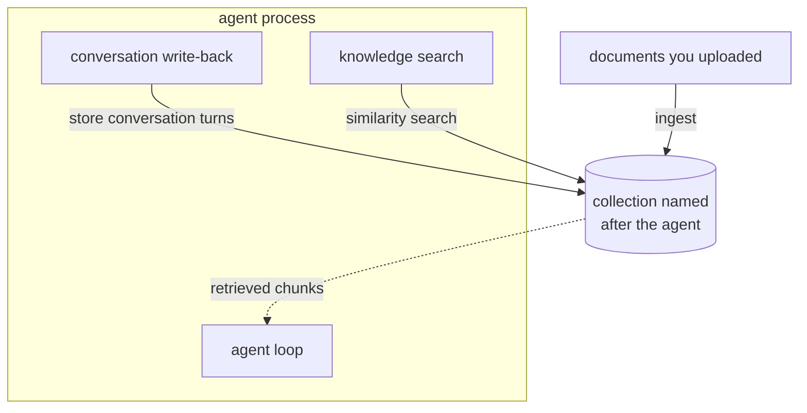

# Memory versus knowledge

"Memory" is the worst-overloaded word in this ecosystem. It is used, in upstream
documentation and UI, for at least five different things that live in different
places, have different lifetimes, and fail in different ways.

This page separates them and tells you where each one is stored.

## The chain of non-equivalences

None of these is the same as its neighbour:

```text
LLM context
   !=
conversation history
   !=
agent state
   !=
agent memory
   !=
knowledge base
   !=
vector store
```

Reading that as six synonyms is the single most common source of confusion when
debugging why an agent "forgot" something.

## Ownership table

| Concept | Owner | Process it lives in | Persisted where | Survives restart |
|---|---|---|---|---|
| **LLM context / KV cache** | the model backend | the spawned backend process | process memory only | No |
| **Conversation history — chat completions** | *nobody* | — | not stored; the API is stateless | N/A |
| **Conversation history — `/v1/responses`** | LocalAI | LocalAI | **in-memory map with a TTL** | **No** |
| **Conversation history — agents** | LocalRecall, indirectly | agent process | opt-in, written **into the agent's collection** | Yes, if enabled |
| **Agent config** | LocalAGI schema | agent process | `pool.json` (+`.bak`), or PostgreSQL in distributed mode | Yes |
| **Agent runtime state** | LocalAGI | agent process | `<name>.state.json`, `<name>.character.json`, `scheduler-<name>.json` | Yes |
| **Agent transient state** | LocalAGI | agent process | in-memory, ~5-minute TTL | **No** |
| **Agent long-term "memory"** | **LocalRecall** | in-process | the agent's own collection — same store as knowledge | Yes |
| **LocalAGI `memory` action store** | LocalAGI | LocalAGI only | a **Bleve** full-text index on disk | Yes |
| **Knowledge / collections** | LocalRecall | in-process | chromem files, or PostgreSQL | Yes |
| **Embedding vectors** | LocalRecall engine | in-process or PostgreSQL | `<COLLECTION_DB_PATH>/…` or `documents_<name>` tables | Yes |
| **Uploaded original files** | LocalRecall | in-process | `<assets>/<collection>/<uuid>/<filename>` | Yes |

Two rows in that table are the ones people get wrong.

## The finding that matters: agent memory *is* knowledge

There is no separate memory subsystem.

When an agent is configured to remember, its conversation turns are written into
**the same LocalRecall collection that holds its documents**, embedded by the same
model, retrieved by the same similarity search. The collection is named after the
agent. The `add_memory` and `search_memory` tools are thin wrappers over the same
collection's store and search operations.



The consequence is operational, not philosophical: **an agent that remembers is
polluting the index it searches.** Every conversational turn written back becomes
a candidate chunk competing with your curated documents for the top-K slots. Over
weeks, a chatty agent's retrieval quality degrades because its own small talk
outranks the manual.

Mitigations that exist:

- **Conversation storage modes** control what gets written back: the whole
  transcript, user and assistant messages separately, or user messages only. The
  default is user-only.
- **Summary mode** stores an LLM-generated summary instead of raw turns.
- **KB compaction** runs on a schedule (daily/weekly/monthly), groups entries by a
  date prefix in the filename, optionally summarises each group, writes
  `summary-<key>.txt` and deletes the originals.

None of them separates memory from knowledge. They only reduce the volume.

If you need that separation, the practical approach is two collections and an
agent whose knowledge base points at the curated one, with write-back disabled.

## The second memory: LocalAGI's Bleve store

Standalone LocalAGI ships a `memory` **action** — a tool the agent can call —
backed by a [Bleve](https://blevesearch.com/) full-text index on local disk.

This is a completely separate system. It:

- never touches LocalRecall
- is keyword/full-text, not vector similarity
- is not what "long-term memory" in the agent configuration refers to
- exists only in standalone LocalAGI

Two things named "memory", in the same product, with different storage engines
and different retrieval semantics. When someone reports that memory works or does
not work, establish which one they mean.

## The third memory: LLM-authored `Memories`

Agent runtime state includes a `Memories` field that the model itself writes,
gated behind the agent "HUD". It is stored in `<name>.state.json` alongside the
rest of the agent's persisted state.

This is neither vector knowledge nor a Bleve index — it is a small structured
field the model maintains about itself, reloaded into its prompt.

## Conversation history is more fragile than it looks

The row that surprises operators most:

**`/v1/responses` history is in memory only.** LocalAI stores responses in a map
with a TTL sweeper. There is no disk, no database. In multi-replica distributed
mode it can be replicated over NATS, but a single instance restarting loses every
stored response.

If you built an application on the Responses API assuming server-side persistence
across restarts, that assumption is wrong.

**Chat completions store nothing at all.** The API is stateless by design; the
client re-sends the full history on every call. This is not a limitation to work
around — it is the contract, and it is why chat completions scale horizontally
without any shared state.

## Where "context" fits

The context window is not storage. It is the token sequence assembled *for one
call* and discarded afterwards. Everything else in this page exists to decide
what goes into it.

For an agent request, the context is assembled fresh each iteration from:

1. the system prompt and agent character
2. retrieved knowledge chunks, prepended as a system message
3. the conversation so far
4. tool definitions
5. tool results from previous iterations

The KV cache inside the backend process is an optimisation over that assembly,
not a second copy of it, and LocalAI never persists it.

## Diagnosing "the agent forgot"

Work down the list; each step distinguishes a different failure.

**1. Was it ever written?**
Check whether write-back is enabled for the agent. It is opt-in. If long-term
memory and summary memory are both off, nothing is stored, and the agent is
behaving correctly.

**2. Was it written to the right place?**
The collection is named after the agent. Renaming an agent does not migrate its
collection.

```bash
curl -s http://localhost:8080/api/agents/collections
```

**3. Is it retrievable?**
Storage and retrieval are separate failures. Search the collection directly:

```bash
curl -s -X POST http://localhost:8080/api/agents/collections/<agent>/search \
  -H 'Content-Type: application/json' \
  -d '{"query":"<what it should remember>","limit":5}'
```

If the chunk comes back here but the agent does not use it, the problem is
prompt assembly or top-K, not storage.

**4. Is auto-search on?**
Knowledge retrieval is only automatic when auto-search is enabled. With
`kb_as_tools` instead, the model must *choose* to call `search_memory` — and a
small model often will not. Note the backwards-compatibility default: if neither
auto-search nor tools-mode is set explicitly, auto-search is forced on.

**5. Did compaction eat it?**
Compaction deletes original entries after summarising them. Detail present last
week can be gone this week, by design.

**6. Is it the wrong memory?**
If the agent used the `memory` action, the content is in Bleve, not in the
collection, and none of the above searches will find it.

## Design guidance

- **Separate curated knowledge from conversational write-back** if retrieval
  quality matters. Two collections, write-back disabled on the curated one.
- **Do not treat `/v1/responses` as durable storage.** If you need conversations
  to survive a restart, persist them yourself.
- **Decide who owns history.** Either your application owns it and uses chat
  completions, or the agent owns it and you accept its storage semantics.
  Splitting ownership produces duplicated and contradictory context.
- **Budget for pollution.** An agent with write-back enabled needs its collection
  reviewed, not just monitored.

## Upstream references

- [LocalAI `core/services/agents/knowledge.go`](https://github.com/mudler/LocalAI/blob/v4.8.2/core/services/agents/knowledge.go) — conversation write-back into the agent's collection; storage modes; summariser. Validated against v4.8.2.
- [LocalAI `core/http/endpoints/openresponses/store.go`](https://github.com/mudler/LocalAI/blob/v4.8.2/core/http/endpoints/openresponses/store.go) — in-memory response store with TTL sweeper.
- [LocalAGI `core/agent/knowledgebase.go`](https://github.com/mudler/LocalAGI/blob/v2.9.0/core/agent/knowledgebase.go) — auto-search, `search_memory` / `add_memory`, write-back modes. Validated against v2.9.0.
- [LocalAGI `core/state/compaction.go`](https://github.com/mudler/LocalAGI/blob/v2.9.0/core/state/compaction.go) — periodic KB compaction and summarisation.
- [LocalAGI `services/actions/memory.go`](https://github.com/mudler/LocalAGI/blob/v2.9.0/services/actions/memory.go) — the separate Bleve-backed memory action.
- [LocalAGI `core/state/pool.go`](https://github.com/mudler/LocalAGI/blob/v2.9.0/core/state/pool.go) — state files, RAG provider selection, transient state TTL.
- [LocalRecall `rag/persistency.go`](https://github.com/mudler/LocalRecall/blob/v0.6.4/rag/persistency.go) — collection storage and asset layout. Validated against v0.6.4.
