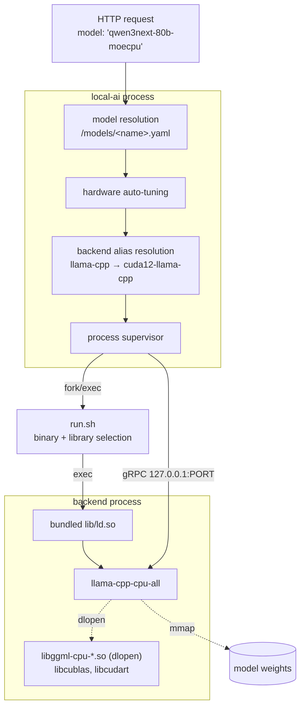

# The model runtime abstraction

LocalAI does not execute models. It is a supervisor and an API translator; execution happens in
a **separate OS process** that LocalAI downloads, starts, and speaks gRPC to.

That one sentence explains most of LocalAI's observable behaviour: why the first request is slow,
why `/backends` is empty on a fresh container, why a "GPU image" can still run on the CPU, and
why loading one model can terminate another.

## The layers



Four distinct resolution steps happen before any tensor is touched, and each is a place things go
wrong differently.

## Backends are OCI artifacts, not libraries

A stock container ships **zero** backends. The first model install downloads one from a container
registry.

Verified on a live host — `/backends/cuda12-llama-cpp/metadata.json`:

```json
{
  "alias": "llama-cpp",
  "name": "cuda12-llama-cpp",
  "gallery_url": "https://index.localai.io/backends",
  "installed_at": "2026-08-15T18:32:35Z",
  "uri": "quay.io/go-skynet/local-ai-backends:latest-gpu-nvidia-cuda-12-llama-cpp",
  "digest": "sha256:a7524ea57df8d085b603db428c5f5cc62d0c5dfceff38a4195de0fa18ffcbe50"
}
```

Three things that file settles:

**`uri` is a container image.** Backends are distributed as OCI artifacts, pinned by digest. This
is why the backend gallery kept working during a
[GitHub outage that broke the model gallery](../00-overview/version-matrix.md#a-reproduced-failure-worth-knowing)
— different infrastructure entirely.

**`alias` is the abstraction.** The model YAML says `backend: llama-cpp`; the installed directory
is `cuda12-llama-cpp`. The alias is what makes a model configuration portable across hardware:
the same YAML runs on a CUDA host, a ROCm host or a CPU-only host, resolving to whichever variant
is installed.

**`installed_at` is a moment in time.** The variant was chosen by hardware detection *when it was
installed*, and it persists in the volume afterwards. See
[the trap](#the-trap-a-gpu-image-that-runs-on-the-cpu).

The runtime registry is visible over HTTP:

```bash
curl -s http://localhost:8080/backends | jq
```

```json
[{"Name":"cuda12-llama-cpp","RunFile":"/backends/cuda12-llama-cpp/run.sh",
  "IsMeta":false,"IsSystem":false,"Metadata":{"alias":"llama-cpp","name":"cuda12-llama-cpp"}}]
```

`RunFile` is the entry point. Which brings us to the most informative file in the whole stack.

## `run.sh` is where hardware selection actually happens

Not in Go. Each backend bundle carries a shell script that picks a binary and sets up its library
environment. Read on a live CUDA host:

```bash
BINARY=llama-cpp-fallback

# CPU images and most x86 GPU images ship a single llama-cpp-cpu-all built with ggml
# CPU_ALL_VARIANTS: ggml's backend registry dlopens the best libggml-cpu-*.so for this
# host, so no shell-side AVX probing.
if [ -e "$CURDIR"/llama-cpp-cpu-all ]; then
	BINARY=llama-cpp-cpu-all
fi

if [ -n "$LLAMACPP_GRPC_SERVERS" ]; then
	if [ -e "$CURDIR"/llama-cpp-grpc ]; then
		BINARY=llama-cpp-grpc
	fi
fi
```

!!! warning "`llama-cpp-cpu-all` does **not** mean CPU-only"
    This is the single most misleading name in the ecosystem, and it will make you think you have
    a GPU problem when you do not.

    `cpu-all` means "**all CPU microarchitecture variants in one binary**", not "CPU-only
    execution". ggml's backend registry `dlopen`s the best match at runtime, so there is no
    shell-side AVX probing.

    Observed in a **CUDA** bundle's `lib/`, 67 libraries in total:

    | Libraries | Purpose |
    |---|---|
    | `libggml-cpu-{sandybridge,ivybridge,haswell,skylakex,icelake,alderlake,cascadelake,cooperlake,cannonlake,sapphirerapids,piledriver,sse42,x64}.so` | 13 CPU variants, dlopened by best match |
    | `libcublas.so.12`, `libcublasLt.so.12`, `libcudart.so.12.8.90` | CUDA 12.8 — **GPU execution** |

    So the resident process on the GPU host was:

    ```text
    /backends/cuda12-llama-cpp/lib/ld.so \
      /backends/cuda12-llama-cpp/llama-cpp-cpu-all --addr 127.0.0.1:45479
    ```

    …while `nvidia-smi` attributed **3136 MiB of VRAM** to that same PID. A binary named
    `cpu-all`, executing on the GPU.

    **Judge by the directory, not the binary:** `cuda12-llama-cpp` versus `cpu-llama-cpp` is the
    meaningful distinction.

### The bundled dynamic loader

```bash
if [ -f "$CURDIR"/lib/ld.so ]; then
	exec "$CURDIR"/lib/ld.so "$CURDIR"/$BINARY "$@"
fi
```

The bundle ships its **own `ld.so`** and execs through it, with `LD_LIBRARY_PATH` pointed at its
own `lib/`. The backend is hermetic: it does not link against the host's glibc or the host's CUDA
runtime.

That is why backends can be distributed as portable OCI artifacts at all, and why a backend built
elsewhere runs on your machine without matching your distribution.

### Vendor-specific environment repair

`run.sh` also encodes hard-won per-vendor fixes. Paraphrasing the script's own comments:

| Vendor | What the script does | Why |
|---|---|---|
| AMD | sets `ROCBLAS_TENSILE_LIBPATH`, `HIPBLASLT_TENSILE_LIBPATH` | the bundled hipBLASLt resolves kernel data relative to itself; without this it falls back to slow generic kernels (upstream issue #10660) |
| Intel | sets `ZE_ENABLE_ALT_DRIVERS` to the **bundled** Level Zero driver | the host's driver may be built against a different C library and can crash on start |
| Intel | sets `ZES_ENABLE_SYSMAN=1` | without it llama.cpp reads zero free memory on integrated graphics, which shares system RAM |
| Intel | deliberately says **nothing** about OpenCL | no OpenCL driver is bundled, so overriding would be worse than the host's own setup |

Anything the operator already set is left alone. This is the layer that makes "just works across
vendors" approximately true, and it is a shell script — worth knowing when it does not work.

## Hardware auto-tuning happens before load

A step that surprises people because it silently rewrites your configuration. Observed on the
GPU host:

```text
INFO effective runtime tuning (override in the model YAML;
     LOCALAI_DISABLE_HARDWARE_DEFAULTS=true disables hardware auto-tuning)
     modelID="qwen3-coder-30b-a3b-instruct" context=8192 n_batch=512
     n_gpu_layers=99999999 parallel="4" flash_attention="auto" f16=false
```

LocalAI inspects the device that will run the model and fills in values you left unset.
`ApplyHardwareDefaults` sits alongside the other config overriders — model-family defaults and
GGUF inspection — on the principle "adjust the config from the device that will run it".

| Tuned | Observed value |
|---|---|
| `n_gpu_layers` | `99999999` — i.e. **all layers** |
| `n_batch` | 512 (`DefaultPhysicalBatch`) |
| `parallel` | 4 |
| `flash_attention` | `auto` |

The heuristics are parameterised on a **GPU descriptor** rather than on direct detection, so the
same code serves both a single host and the distributed router — which passes the *selected
node's* reported GPU, because the frontend that loaded the config may have no GPU at all.

One heuristic worth quoting as an example of how specific this gets: NVIDIA **Blackwell consumer**
GPUs (sm_12x) get `n_batch=2048` instead of 512, because a larger physical batch materially lifts
MoE prefill there — measured upstream on a GB10 with Qwen3-30B-A3B. Datacenter Blackwell
(sm_100) reports a different compute capability and is deliberately **not** matched.

`LOCALAI_DISABLE_HARDWARE_DEFAULTS=true` turns the whole thing off and gives you llama.cpp's stock
behaviour. Reach for it when you want predictable, un-tuned loads.

### Auto-tuning is also how you run out of VRAM

`n_gpu_layers=99999999` means "offload everything", which is right until the model does not fit.
Observed repeatedly on a 24 GB card:

```text
ERROR Failed to load model modelID="qwen3-coder-30b-a3b-instruct"
  error=… Failed to load model: /models/Qwen3-Coder-30B-A3B-Instruct-Q4_K_M.gguf.
  Error: ggml_backend_cuda_buffer_type_alloc_buffer: allocating 17524.43 MiB on device 0:
  cudaMalloc failed: out of memory; alloc_tensor_range: failed to allocate CUDA0 buffer
  of size 18375698432; llama_model_load: error loading model: unable to allocate CUDA0 buffer
```

And for an 80B model on the same card, an attempt to allocate **46,297 MiB**. The failure is
loud, specific, and names the exact byte count — which makes it one of the more pleasant errors
in this stack.

The fix is not to disable tuning but to constrain placement, which is the next section.

## The escape hatch: opaque options passthrough

The abstraction's most important property is that it does not try to model every backend feature.
`options:` in the model YAML is a list of strings handed to the backend.

Two configurations from the GPU host, both fitting large MoE models onto 24 GB by putting expert
tensors in system RAM:

```yaml
# 80B MoE: ALL experts on CPU, attention and dense layers on GPU
name: qwen3next-80b-moecpu
backend: llama-cpp
gpu_layers: 999
threads: 6
options:
    - use_jinja:true
    - tensor_buft_overrides:exps=CPU
parameters:
    context_size: 8192
    mmap: true
    model: llama-cpp/models/Qwen_Qwen3-Next-80B-A3B-Thinking-Q4_K_M.gguf
```

```yaml
# 30B MoE: experts from block 16 upward on CPU, blocks 0-15 on GPU,
# plus a quantised KV cache to halve cache memory
name: qwen3-coder-moehybrid
backend: llama-cpp
gpu_layers: 999
threads: 6
flash_attention: true
cache_type_k: q8_0
cache_type_v: q8_0
options:
    - use_jinja:true
    - tensor_buft_overrides:blk\.(1[6-9]|[2-9][0-9])\.ffn_.*_exps\.=CPU
```

`tensor_buft_overrides` appears **nowhere in LocalAI's Go source** — it is a llama.cpp feature
that LocalAI passes through without understanding. *(Source-verified by absence: zero matches in
the v4.8.2 tree, while the configuration demonstrably works.)*

That is the abstraction working as intended. LocalAI models what is common — a model, a backend,
a context size, layer offload — and gets out of the way for what is not. The cost is that
`options:` is unvalidated and undocumented by LocalAI: a typo is silently ineffective.

The result on the live host: the 80B configuration **loads and stays resident**, using **3136 MiB
of VRAM and roughly 46 GB of RSS**, where the auto-tuned configuration could not allocate
46,297 MiB and failed.

## The process boundary

```bash
docker exec <container> ps aux | grep llama
```

```text
root 169 ... /backends/cuda12-llama-cpp/lib/ld.so \
             /backends/cuda12-llama-cpp/llama-cpp-cpu-all --addr 127.0.0.1:45479
```

| Property | Detail |
|---|---|
| Transport | gRPC over loopback TCP |
| Port | **ephemeral, allocated per load** — `45479` here |
| Binding | `127.0.0.1` — not reachable from outside the container |
| Lifetime | one process per resident model |
| Configuration | none; you never set this port |

The RPC sequence on a cold request: allocate a free port, `fork/exec` `run.sh` with `--addr`,
poll a gRPC `Health` RPC until it answers, send `LoadModel`, then `Predict` or `PredictStream`.

**For a warm, tool-free request there is exactly one boundary crossing** — LocalAI to the backend.
Everything else is in-process.

Which models are currently resident is answerable:

```bash
curl -s http://localhost:8080/system | jq
```

```json
{"backends":["llama-cpp","cuda12-llama-cpp"],
 "loaded_models":[{"id":"qwen3next-80b-moecpu","backend":"llama-cpp"}]}
```

Note that this endpoint is **admin-gated**, and it also shows the alias and the resolved variant
side by side — the clearest single view of the abstraction at runtime.

## Load, eviction, and why two models fight

Each resident model is a separate process holding its own memory. Loading a model may **evict**
another, which terminates that backend's OS process.

| Situation | Consequence |
|---|---|
| One model, many requests | ideal; load cost paid once |
| Two models, enough memory | two backend processes coexist |
| Two models, not enough | eviction per alternating request |

Two clients alternating between two models on a constrained host pay a **model load per
request**. Observed load costs: 4 s for a 1.7B Q4 model on CPU; on a GPU with a large MoE model,
minutes.

Levers, all environment variables on LocalAI:

| Variable | Effect |
|---|---|
| `LOCALAI_LOAD_TO_MEMORY` | preload models at startup |
| `LOCALAI_FORCE_EVICTION_WHEN_BUSY` | evict even while a model is in use |
| `LOCALAI_GPU_RECLAIMER`, `_THRESHOLD` | release GPU memory |
| `LOCALAI_SINGLE_ACTIVE_BACKEND` | keep at most one resident |

The structural answer, if you serve several models seriously, is **one model per deployment,
routed by model name** — see [scaling](scaling.md).

## The trap: a GPU image that runs on the CPU

Everything above converges on one failure mode worth stating on its own.

The backend variant is chosen by hardware detection **at model-install time**, and it persists in
the `/backends` volume. If the device was invisible then — no `--gpus`, no device plugin, a
missing toolkit — the **CPU variant was installed**, and it keeps being used afterwards.

**Restarting with the device attached does not fix it.** The installed backend does not change.

```bash
docker exec localai ls /backends
```

| Observed | Meaning |
|---|---|
| `cuda12-llama-cpp` | a CUDA backend is installed — as on the validated GPU host |
| `cpu-llama-cpp` **only**, on a GPU image | **you are running on the CPU** |

The fix is to remove the backends volume and let it re-install with the device visible:

```bash
docker compose down
docker volume rm <project>_localai-backends
docker compose up -d
```

And remember not to be misled by the *binary* name in `ps` output — see the warning above.

## Distributed inference

`LLAMACPP_GRPC_SERVERS` switches `run.sh` to `llama-cpp-grpc`, and the bundle also ships
`llama-cpp-rpc-server`. That is llama.cpp's own RPC mechanism for splitting one model across
machines — a different axis from LocalAI's distributed mode, which distributes *requests* rather
than tensors.

*(Present in the bundle and selected by the script; **not exercised** in our validation.)*

## Replacing the runtime

The abstraction cuts both ways: because a backend is a gRPC service behind an alias, you can
supply your own.

| Variable | Purpose |
|---|---|
| `LOCALAI_EXTERNAL_BACKENDS` | register additional backends |
| `LOCALAI_EXTERNAL_GRPC_BACKENDS` | point at a gRPC backend you run yourself |

So "which engine executes my model" is a deployment decision, not a code change — which is the
whole point of the layer. *(Documented and source-verified; not exercised.)*

## What this means operationally

| Question | Answer |
|---|---|
| Why is the first request slow? | process spawn + `LoadModel`, not generation |
| Why is `/backends` empty? | backends install with the first model |
| Why did a GPU image run on the CPU? | the variant was chosen at install time, and persists |
| Why does one model's load break another? | eviction terminates the other backend process |
| Why did my `options:` line do nothing? | it is opaque passthrough; LocalAI does not validate it |
| Why did it OOM at exactly 17,524 MiB? | auto-tuning set `n_gpu_layers` to all layers |
| Which models are resident? | `GET /system` |
| Which variant is actually installed? | `ls /backends`, or `GET /backends` |

## Upstream references

- [LocalAI `pkg/model/initializers.go`](https://github.com/mudler/LocalAI/blob/v4.8.2/pkg/model/initializers.go) — free-port allocation, `fork/exec` of `run.sh`, gRPC health polling, `LoadModel`, eviction. Validated against v4.8.2.
- [LocalAI `core/config/hardware_defaults.go`](https://github.com/mudler/LocalAI/blob/v4.8.2/core/config/hardware_defaults.go) — `HardwareDefaultsDisabled` at 17-24, the `GPU` descriptor at 41-50, `DefaultPhysicalBatch`/`BlackwellPhysicalBatch` at 52-62, `IsNVIDIABlackwell` at 66-70.
- [LocalAI `core/backend/options.go`](https://github.com/mudler/LocalAI/blob/v4.8.2/core/backend/options.go) — `ModelOptions` at 184, and how `options:` reaches the backend.
- [LocalAI `core/config/backend_config.go`](https://github.com/mudler/LocalAI/blob/v4.8.2/core/config/backend_config.go) — `gpu_layers`, `threads`, `flash_attention`, `cache_type_k`/`_v`, `options`.
- [LocalAI `core/http/routes/localai.go`](https://github.com/mudler/LocalAI/blob/v4.8.2/core/http/routes/localai.go) — `GET /system` registered with `adminMiddleware` at 417.
- [LocalAI `core/cli/run.go`](https://github.com/mudler/LocalAI/blob/v4.8.2/core/cli/run.go) — `LOCALAI_LOAD_TO_MEMORY`, `LOCALAI_FORCE_EVICTION_WHEN_BUSY`, `LOCALAI_GPU_RECLAIMER`, `LOCALAI_EXTERNAL_GRPC_BACKENDS`.
- `run.sh`, `metadata.json` and the 67-library `lib/` inventory: read from a live `cuda12-llama-cpp` backend, observed 2026-08-17 on linux/amd64.
- Resident backend process, ephemeral gRPC port 45479, 3136 MiB VRAM attribution, the CUDA OOM at 17,524 MiB and 46,297 MiB, the `effective runtime tuning` banner, and the two MoE offload configurations: observed 2026-08-17 on Ubuntu 24.04 amd64 with a Quadro RTX 6000, LocalAI v4.8.2 CUDA 12. See [version matrix](../00-overview/version-matrix.md).
- `tensor_buft_overrides` absent from the LocalAI v4.8.2 Go tree: verified by search.
