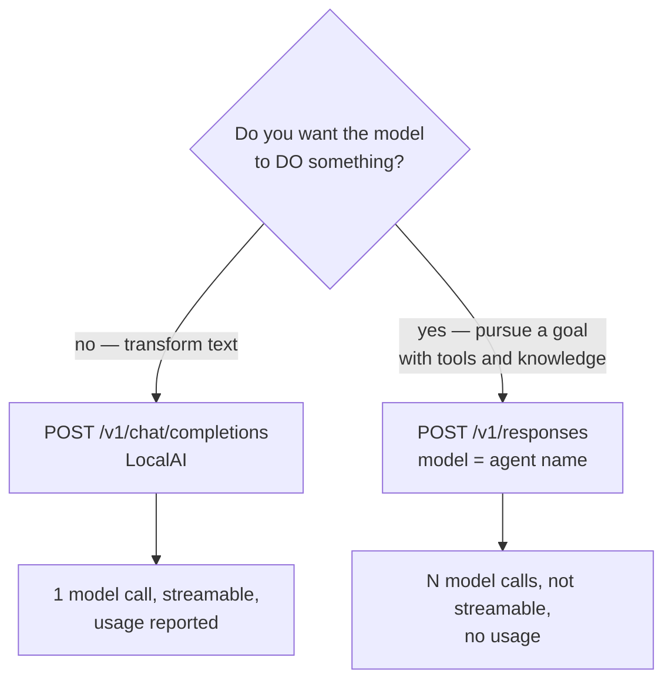
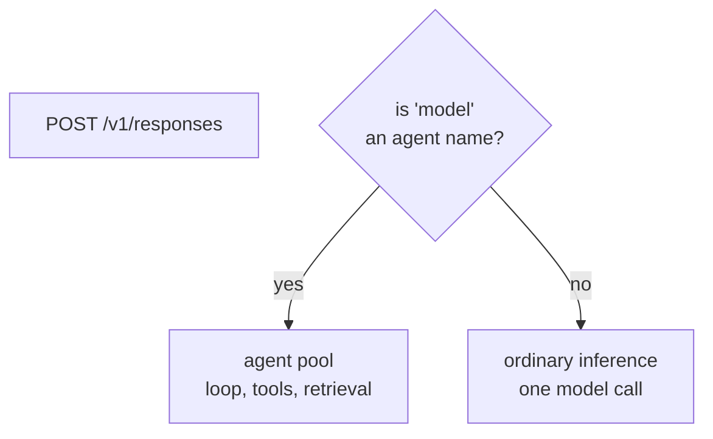

# Responses versus Chat Completions

Two endpoints, similar shapes, completely different things. The confusion is understandable:
both are OpenAI-derived, both take messages and return text, and in LocalAI's integrated
deployment **they are the same URL**.

The distinction that matters is not the wire format. It is:

```text
Chat Completions  ->  one model call
Responses (agent) ->  a loop that decides what to do next
```

## The essential difference

| | Chat Completions | Responses, with an agent |
|---|---|---|
| Served by | LocalAI | LocalAGI (or LocalAI's agent pool) |
| `model` field means | **a model** | **an agent name** |
| Model calls per request | exactly 1 | 1 per iteration — measured 1 to 3+ |
| Tool execution | none, unless MCP is configured on the model | yes, zero to many |
| Retrieval | none | optional, once per request |
| Conversation state | **you send all of it** | server-side, via `previous_response_id` |
| Latency | proportional to tokens | **unbounded in principle** |
| Idempotent | effectively | **no** — tools have side effects |
| Streaming | **yes** | **no** — field ignored |
| Token usage reported | **yes** | **no** — hardcoded zeros |

Two rows are the ones that break client code: streaming and usage. Both are covered below.

## Which one should you call?



The honest rule of thumb:

| Use Chat Completions when | Use an agent when |
|---|---|
| You want a completion, classification, summary, translation | The work needs tools, retrieval, or several steps |
| You want streaming | You want the platform to manage the loop |
| You want token accounting | You want conversation state held for you |
| You manage conversation history yourself | You want scheduling or connectors |
| You need predictable latency | You accept unbounded latency |

**Most applications need Chat Completions.** Reach for an agent when you actually want
autonomy, not because the endpoint sounds more modern. An agent doing single-turn text
transformation is strictly worse: slower, unstreamable, unmetered.

## The `model` field is the trap

```bash
curl -s http://localhost:8081/v1/responses \
  -H 'Content-Type: application/json' \
  -d '{"model": "handbook-probe", "input": "hi"}'
```

`handbook-probe` is an **agent**. Send a model name and you get HTTP 500:

```json
{"error":"Agent not found"}
```

Verified. Every other endpoint in this stack means "a model" by `model`; this one means "an
agent". That collision is the single most common first-time error.

### In LocalAI, both arrive at one URL

LocalAI serves `/v1/responses` too, and a middleware inspects the `model` field: if it names an
agent, the request is diverted into the agent runtime; otherwise it falls through to ordinary
inference.



**Same endpoint, two execution paths, two latency profiles, one of them with side effects.** A
typo in the `model` field does not error — it silently changes which engine ran. Worth knowing
before you write a load balancer rule or a timeout policy.

## Conversation state

### Chat Completions: you own it

Stateless. You send the full message array every time; the server remembers nothing. Simple,
predictable, and your problem.

### Responses: the server owns it, briefly

```bash
ID=$(curl -s … -d '{"model":"agent","input":"My name is Ada."}' | jq -r '.id')
curl -s … -d "{\"model\":\"agent\",\"input\":\"What is my name?\",\"previous_response_id\":\"$ID\"}"
```

Verified working. But the mechanics have three sharp edges:

**Each reply returns a new UUID.** Conversation identity is a chain of per-turn IDs, not one
session ID. Continuing from an older ID branches rather than errors.

**It is in memory with a TTL.** `LOCALAGI_CONVERSATION_DURATION`, falling back to **1 hour**.
Never written to disk; lost on restart.

**Expiry and non-existence are indistinguishable.** Verified: an unknown
`previous_response_id` returns HTTP 200 with an **empty conversation** and no warning. So three
states look identical:

| State | Response |
|---|---|
| Valid, history carried | 200, model has context |
| Expired | 200, model has none |
| Never existed | 200, model has none |

If your application needs to distinguish them, it must track conversation identity itself. This
is the mechanism behind "the agent forgot everything over lunch".

There is one guard: continuing with **no new input** is rejected, because the job would end on
an assistant message and some backends reject that.

## Streaming: only one of them has it

| Endpoint | `stream: true` |
|---|---|
| Chat Completions (LocalAI) | **works** — SSE |
| Responses (LocalAGI) | **accepted and silently ignored** |

The `stream` field exists on LocalAGI's request type and **no handler reads it** — verified by
grep across the whole `webui` and `core` trees. A client asking for a stream gets a single
complete JSON body with a 200 and no indication its request was not honoured. A client written
to consume SSE will hang waiting for events that never arrive.

| Want | Use |
|---|---|
| Streamed tokens | LocalAI `/v1/chat/completions` |
| Incremental agent output | `GET /sse/:name` on LocalAGI |
| Request/response from an agent | `/v1/responses` |

Note also that `POST /api/chat/:name` is **asynchronous** — it does not return the answer.
Polling it for a body waits forever.

## Token accounting: only one of them has it

```json
"usage": {"input_tokens": 0, "output_tokens": 0, "total_tokens": 0}
```

Always zero on the agent path. Hardcoded, with `// TODO: calculate actual usage` beside it.
Verified on every agent response we made.

Chat Completions reports real numbers. So if you need cost attribution or quota, meter at
LocalAI — and remember **one agent request produces several calls**, which you must sum, and
which you cannot attribute to an agent without correlating by timestamp (there is no request-ID
propagation).

## Latency, measured

CPU-only, `qwen3-1.7b`.

| Request | Model calls | Wall clock |
|---|---|---|
| Chat completion, warm | 1 | proportional to tokens — **streaming verified**, SSE `chat.completion.chunk` |
| Chat completion, incl. model load | 1 | 4 s |
| Agent, no tools, no knowledge | 1 | 2–3 s |
| Agent, knowledge only | 1 | **2.27 s** |
| Agent, knowledge + one tool | 2 | **24.1 s** |
| Agent, one tool | 3 | **38.7 s** |

An order of magnitude, from the same model on the same hardware, because the loop iterated.

Consequences for anything in the request path:

```text
client timeout  >  proxy timeout  >  LOCALAGI_TIMEOUT (per model call, default 5m)
```

A proxy read timeout of 60 s — the ingress-nginx default — is shorter than a measured agent
request. When it fires the client gets a **504 while the agent runs to completion and commits
its side effects**. That asymmetry is why the idempotency row in the first table matters:
retrying a Chat Completion is free; retrying an agent request may send a second email.

## Feature-by-feature

| Feature | Chat Completions | Responses (agent) |
|---|---|---|
| `messages` array | yes | as `input` |
| `input` as a bare string | no | yes |
| `stream` | **yes** | ignored |
| `temperature`, `top_p` | yes | reported as 0; set on the agent or model |
| `tools` | function definitions the caller executes | plus the agent's own server-side tools |
| `tool_choice` | yes | yes, for `{"type":"function","name":…}` |
| `previous_response_id` | — | **request side works**; echoed back as `null` |
| `usage` | real | **zeros** |
| Response `id` | a **bare UUID**, not `chatcmpl-…` | a **bare UUID**, not `resp_…` |
| `store` | — | reported `false`; accurate |

Two client-breaking details there. **Neither endpoint prefixes its response `id`**: LocalAI's
Chat Completions returns a bare UUID where OpenAI returns `chatcmpl-…`, and LocalAGI returns a
bare UUID where OpenAI returns `resp_…`. Both verified:

```text
POST /v1/chat/completions  ->  id: 20f92f49-a575-4220-81e8-d1b7a8769c76, object: chat.completion
POST /v1/responses         ->  id: b9ec1e4d-41c5-42b7-a18a-d12d21040be4, object: response
```

So client code that pattern-matches on the prefix fails against both. And
`previous_response_id` always comes back `null` even when you sent one — do not use the echo to
confirm continuation worked.

### Three kinds of tool, which is easy to miss

| Kind | Executed by | Configured |
|---|---|---|
| Chat Completions `tools` | **your client** | per request |
| Responses user-defined `tools` | **your client** | per request |
| Agent `actions` / MCP | **LocalAGI** | on the agent |

The Responses endpoint supports both loops at once: user-defined tools come back as a
`function_call` output item for your client to execute and return as
`function_call_output`, while the agent's own actions execute server-side without your
involvement. Mixing them without noticing produces a request where some tools run on your side
and some do not.

## An inference request is not an agent request

The framing worth keeping:

| | Inference | Agent |
|---|---|---|
| Produces | one output | a goal outcome |
| Failure modes | backend errors | plus loops, tool failures, iteration exhaustion, silent knowledge loss |
| Retry safety | safe | **unsafe** |
| Observable cost | token count | must be summed across calls |
| Timeout meaning | how long generation may take | how long **one of N calls** may take |

Treating an agent request like an inference request in a client timeout, a load balancer, or a
retry policy is a reliable way to produce mysterious truncations and duplicated side effects.

## Upstream references

- [LocalAGI `webui/app.go`](https://github.com/mudler/LocalAGI/blob/v2.9.0/webui/app.go) — the Responses handler at 575-692: agent lookup by `model` at 591-608, conversation assembly at 584-602, the tool-call response path at 646-658, new-UUID storage at 644 and 666, hardcoded zero `usage` at 567-571. Validated against v2.9.0; behaviour observed on v2.8.1.
- [LocalAGI `webui/types/openai.go`](https://github.com/mudler/LocalAGI/blob/v2.9.0/webui/types/openai.go) — `Stream` at 161, which no handler reads.
- [LocalAGI `core/conversations`](https://github.com/mudler/LocalAGI/tree/v2.9.0/core/conversations) — in-memory tracker; expiry returning an empty conversation.
- [LocalAGI `webui/options.go`](https://github.com/mudler/LocalAGI/blob/v2.9.0/webui/options.go) — the 1 hour fallback at 42-50.
- [LocalAGI `webui/routes.go`](https://github.com/mudler/LocalAGI/blob/v2.9.0/webui/routes.go) — `/v1/responses` at 83, `/api/chat/:name` at 75, `/sse/:name` at 58.
- [LocalAI `core/http/endpoints/localai/agent_responses.go`](https://github.com/mudler/LocalAI/blob/v4.8.2/core/http/endpoints/localai/agent_responses.go) — the interceptor that inspects `model` and falls through to inference. Validated against v4.8.2.
- [LocalAI `core/http/endpoints/openai/chat.go`](https://github.com/mudler/LocalAI/blob/v4.8.2/core/http/endpoints/openai/chat.go) — Chat Completions, including streaming.
- [OpenAI Chat Completions](https://platform.openai.com/docs/api-reference/chat) and [Responses](https://platform.openai.com/docs/api-reference/responses) — the shapes being approximated.
- Response envelopes, the `Agent not found` 500, the unknown-`previous_response_id` behaviour, zero `usage`, and every latency figure: observed 2026-08-17, see [version matrix](../00-overview/version-matrix.md).
