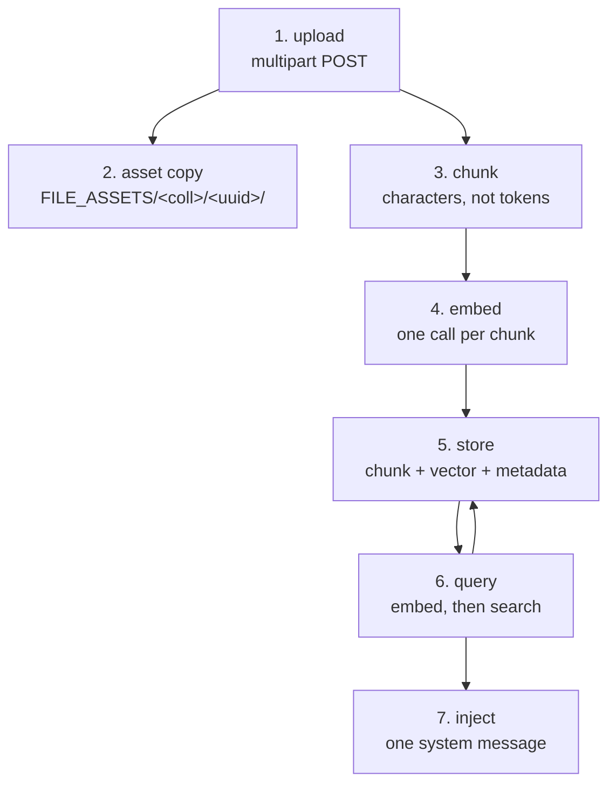

# The retrieval pipeline

Seven stages from a file on disk to text in a model's context window. Each one can silently
degrade the result, and only two of them produce an error when they go wrong.

The most useful fact about this pipeline is not in any of the stages: **there is no relevance
threshold anywhere in it.** Top-*k* returns *k* results whatever their scores, so the pipeline
cannot say "I found nothing."

## The seven stages



| Stage | Owner | Fails loudly? |
|---|---|---|
| 1. Upload | LocalRecall | yes — HTTP status |
| 2. Asset copy | LocalRecall | yes |
| 3. Chunking | LocalRecall | no — bad chunking just retrieves worse |
| 4. Embedding | **LocalAI** | yes — 502 or 500 |
| 5. Storage | vector engine | yes |
| 6. Query | LocalRecall | **no** — always returns something |
| 7. Injection | LocalAGI | **no** — no threshold, no provenance |

Stages 3, 6 and 7 are where quality is lost without any error.

## Stage 1–2: upload and the second copy

```bash
curl -s -X POST http://localhost:8082/api/collections/handbook/upload -F file=@note.txt
```

```json
{"success":true,"data":{"collection":"handbook","filename":"note.txt",
 "key":"e040fb16-4b0b-4970-9ca4-f30f909ee50d/note.txt"}}
```

The handler copies the stream to a temp file, then **renames it** so its base name matches the
original — because the index key is derived with `filepath.Base`. Then `Store` copies it into a
UUID subdirectory under `FILE_ASSETS`.

Observed layout:

```text
/data/assets/handbook/e040fb16-4b0b-4970-9ca4-f30f909ee50d/note.txt
```

**A document is persisted twice**, and with `VECTOR_ENGINE=postgres` in two different volumes:

| Copy | Where | Needed for |
|---|---|---|
| Original bytes | `FILE_ASSETS/<collection>/<uuid>/` | `/raw` retrieval, re-chunking, compaction, **re-embedding after a model change** |
| Chunk text + vector | the vector engine | search |

Back them up together. Restoring only the database gives searchable chunks whose `/raw` endpoints
404 — and, worse, no originals to re-ingest from if you ever change the embedding model.

Note the naming asymmetry: `entries` are base filenames, `keys` are `<uuid>/<filename>`, and
**deletion takes the entry**, not the key.

## Stage 3: chunking is character-based

The stage with the most leverage and the least feedback.

| Setting | Default | Unit |
|---|---|---|
| `MAX_CHUNKING_SIZE` | **400** | **characters**, not tokens |
| `CHUNK_OVERLAP` | **0** | characters, word-aligned |

Paragraph-oriented splitting; words longer than the chunk size are split rather than allowed to
overflow.

The only way to confirm your settings took effect:

```bash
docker logs localrecall 2>&1 | grep -i 'Chunked file'
```

```text
INFO Chunked file file="/data/assets/handbook/<uuid>/note.txt"
     content_length=207 max_chunk_size=400 chunk_overlap=80 chunk_count=1
```

Two things worth deciding deliberately:

**400 characters is small** — roughly 60–100 tokens, often less than a paragraph. It produces many
chunks, which means many embedding calls and more chances to inject noise. 1000–1500 is often
better for prose, at some cost to precision.

**Zero overlap cuts sentences at boundaries** and loses whatever thought spanned them. The
handbook's reference environment sets 80 — 20% of chunk size — for exactly this reason. Overlap
adds chunks sub-linearly, so it is cheap.

Changing either affects **only documents ingested afterwards**. Existing chunks are not re-split.

## Stage 4: embedding is always a network call

**LocalRecall computes no embeddings.** It is a client of an OpenAI-compatible
`/v1/embeddings` — and that remains true when the knowledge layer is embedded as a library:

```text
in-process retrieval  →  removes the retrieval HTTP hop
                      →  does NOT remove the embedding HTTP hop
```

The cost asymmetry is the thing to plan around:

| Operation | Embedding calls |
|---|---|
| Search | **one**, for the query |
| Ingest a document | **one per chunk** |

Measured: warm embedding call **0.06–0.09 s**, cold 3.34 s including model load. So a document
producing 2,000 chunks is a couple of minutes of pure embedding, and ingestion — not
retrieval — is what you should benchmark.

Two configuration hazards, neither validated at startup:

**`OPENAI_BASE_URL` has no working default.** LocalRecall assigns
`config.BaseURL = openAIBaseURL` unconditionally, *after* the OpenAI client library has already set
a real URL. An empty value does not fall back — it overwrites the default with nothing, producing a
bare relative `/embeddings`. The process starts happily and the first ingestion fails.

**`EMBEDDING_MODEL` has no default at all** in standalone LocalRecall — an empty model name goes on
the wire. LocalAGI, running the same library, does supply one.

### The dimension is a permanent commitment

| Property | Observed |
|---|---|
| Dimensions | **384** on the reference model |
| Normalisation | L2, magnitude **0.9999999536** |
| Similarity of paraphrases | **0.868** |
| Similarity of unrelated text | **0.540** |

Because vectors are unit length, cosine similarity is a plain dot product — do not normalise
again.

The 0.540 is the number that matters most on this page. **The floor is not zero.** Unrelated text
is not orthogonal in this embedding space, so nothing ever looks "unrelated enough" to be excluded
— which, combined with the absence of a threshold, is why stage 6 always returns something.

Changing the model:

| Change | Result |
|---|---|
| Different dimension | writes fail on mismatch |
| Same dimension | writes succeed and **retrieval silently degrades** |

There is no migration. You re-ingest — from the originals kept in stage 2.

## Stage 5: storage, and what hybrid search needs

| Engine | Storage | Hybrid search | Concurrent readers |
|---|---|---|---|
| `chromem` (default) | one file | no | one process |
| `postgres` | database | **yes** | many |
| `localai` | LocalAI's `/stores` API | no | — |

The `localai` engine returns `not implemented` for `Reset`, `Count` and
`GetEmbeddingDimensions`. Do not choose it for new work.

**Hybrid search — vector similarity combined with BM25 lexical scoring — exists only in the
PostgreSQL engine**, and requires the `pg_textsearch` extension for BM25 indexing. That single
fact is the architectural justification for putting a database in this stack.

| Variable | Default |
|---|---|
| `HYBRID_SEARCH_VECTOR_WEIGHT` | 0.5 |
| `HYBRID_SEARCH_BM25_WEIGHT` | 0.5 |
| `BM25_TEXT_CONFIG` | `english` |

Raise the BM25 weight when queries contain **exact identifiers** — error codes, function names,
SKUs — which embeddings match poorly and lexical search matches exactly. This is the pipeline's
main quality lever after chunk size.

Observed extensions in LocalRecall's own PostgreSQL image: `plpgsql`, `pg_textsearch`, `vector`,
`vectorscale`. Three of the four are absent from a stock `postgres:` image.

*(The engine was exercised; the weights were **not** varied, so their effect is source-verified
rather than measured.)*

## Stage 6: query, and everything it does not do

```bash
curl -s -X POST http://localhost:8082/api/collections/handbook/search \
  -H 'Content-Type: application/json' \
  -d '{"query":"how often does the bus send a heartbeat","max_results":3}'
```

One embedding call for the query, then a store query. Measured end to end: **30.4 ms** standalone,
**29–37 ms** inside an agent request.

**Retrieval is never your bottleneck.** 30 ms against a 24-second agent request.

What the response contains:

```json
{"ID":"1",
 "Metadata":{"created_at":"…","file_name":"note.txt","source":"<uuid>/note.txt",
             "title":"<uuid>/note.txt","type":"file"},
 "Embedding":null,
 "Similarity":0,
 "Content":"The Zeppelin-7 telemetry bus uses a heartbeat interval of 4200 milliseconds. …"}
```

Four absences worth naming:

| Absent | Consequence |
|---|---|
| A usable score | `Similarity` exists and was observed as **`0`** — you cannot rank or filter on it |
| The vector | `Embedding` is `null`; not inspectable through the API |
| A relevance threshold | top-*k* returns *k*, however irrelevant |
| Query rewriting | the query is used **verbatim** |

### `max_results` has a surprising default

Omit it, or send zero, and LocalRecall sets it to **5** if the collection holds five or more
documents and **1** otherwise. Verified: a one-document collection returned `max_results: 1`.

A small collection therefore silently returns a single chunk. **Always set it explicitly.**

### No query rewriting means multi-turn retrieval degrades

The query is the **latest user message, verbatim**. No condensation, no history-aware
reformulation. A follow-up like "and the minimum?" is embedded literally and retrieves
accordingly.

If you need better multi-turn behaviour, rewrite the query in your client before sending it — the
pipeline will not do it for you.

## Stage 7: injection, where retrieval becomes instruction

The stage most likely to surprise you, because it is not in LocalRecall at all.

Retrieved chunks are formatted into **one system message** and **prepended to the front of the
conversation**:

```text
Given the user input you have the following in memory:
- The Zeppelin-7 telemetry bus uses a heartbeat interval of 4200 milliseconds. …
  (map[created_at:2026-08-17T15:42:42Z file_name:kb-fact.txt source:e040fb16-…/kb-fact.txt
   title:e040fb16-…/kb-fact.txt type:file])
```

Each line is `fmt.Sprintf("%s (%+v)", content, metadata)`. Three consequences, all verified from a
live agent's log:

**It says "in memory", not "in the knowledge base".** The conflation this handbook spends
[a whole page](memory-vs-knowledge.md) untangling is baked into the prompt. The model cannot
distinguish retrieved documents from recalled conversation because nothing tells it they differ.

**Go map syntax reaches the model.** `map[created_at:… type:file]` is literally in the context
window — noise that consumes tokens, and why retrieved chunks sometimes get echoed back oddly.

**It is a system message with no provenance.** Whatever is in the collection arrives with
instruction-adjacent authority, and nothing records who put it there or whether it is trusted.
That is the mechanism behind knowledge-base poisoning — see
[the security model](security-model.md).

## The whole pipeline, traced once

Verified end to end, with matching timestamps proving the process boundary. An agent asked about a
fact that existed only in its collection:

```text
15:42:53.667 INFO [Knowledge Base Lookup] Last user message agent=kb-probe
15:42:53.705 INFO [Knowledge Base Lookup] Found similar strings in KB agent=kb-probe
```

```json
{"time":"2026-08-17T15:42:53.705Z","remote_ip":"172.18.0.5","method":"POST",
 "uri":"/api/collections/kb-probe/search","user_agent":"Go-http-client/1.1",
 "status":200,"latency_human":"37.190542ms"}
```

`172.18.0.5` is the agent container. The invented fact came back correctly, which no model could
have known — so retrieval demonstrably happened, and cost **37 ms of a 2.27 s request**.

Boundary count for one retrieval: **agent → LocalRecall → LocalAI → backend**, plus one SQL query.
Three process boundaries for one lookup.

## Tuning, in order of effect

| Symptom | Change |
|---|---|
| Retrieved chunks are fragments | raise `MAX_CHUNKING_SIZE` |
| Sentences cut mid-thought | set `CHUNK_OVERLAP` to 10–20% of chunk size |
| Exact identifiers not found | PostgreSQL engine; raise `HYBRID_SEARCH_BM25_WEIGHT` |
| Irrelevant context crowding the answer | **lower** `kb_results` / `max_results` |
| Answers ignore knowledge entirely | check the three agent guards — DEBUG only |
| Ingestion is slow | raise chunk size; move to PostgreSQL |
| Retrieval worked yesterday, not today | `EMBEDDING_MODEL` changed — re-ingest |

Note the fourth row. With a small model, a **larger** *k* often makes answers worse, because
irrelevant chunks crowd the context and the model cannot tell which is relevant. Given a 0.54
similarity floor and no threshold, `kb_results: 3` is a better default than `10`.

## What this pipeline is not

| Not present | Implication |
|---|---|
| Reranking of retrieved chunks | ranking is raw similarity — though LocalAI does expose `/v1/rerank` you could call yourself |
| Relevance threshold | it cannot return "nothing found" |
| Query rewriting or expansion | multi-turn retrieval degrades |
| Provenance or trust weighting | all chunks speak equally |
| Deduplication across chunks | near-duplicates can fill *k* |
| Per-collection access control | **no tenancy model at all** |

Several of these are things a mature RAG system would have. Knowing they are absent is what lets
you compensate — usually by chunking well, keeping *k* small, and using hybrid search for
identifier-like queries.

## Upstream references

- [LocalRecall `routes.go`](https://github.com/mudler/LocalRecall/blob/v0.6.4/routes.go) — upload temp-file rename at 429-451; the `max_results` 5-or-1 default at 297-303; `reset` deleting the registry entry at 257-277; the deliberate 502 at 207-212. Validated against v0.6.4.
- [LocalRecall `pkg/chunk/chunking.go`](https://github.com/mudler/LocalRecall/blob/v0.6.4/pkg/chunk/chunking.go) — character sizing, word-aligned overlap, long-word splitting.
- [LocalRecall `rag/persistency.go`](https://github.com/mudler/LocalRecall/blob/v0.6.4/rag/persistency.go) — asset copy into `FILE_ASSETS/<collection>/<uuid>/`; the `Chunked file` and `Stored file` log lines.
- [LocalRecall `rag/engine.go`](https://github.com/mudler/LocalRecall/blob/v0.6.4/rag/engine.go) — the vector-engine contract.
- [LocalRecall `rag/engine/postgres.go`](https://github.com/mudler/LocalRecall/blob/v0.6.4/rag/engine/postgres.go) — hybrid weights at 63-94; `pg_textsearch` requirement at 215-218; BM25 index at 290-293.
- [LocalRecall `rag/engine/localai.go`](https://github.com/mudler/LocalRecall/blob/v0.6.4/rag/engine/localai.go) — the `not implemented` methods.
- [LocalRecall `main.go`](https://github.com/mudler/LocalRecall/blob/v0.6.4/main.go) — the unconditional base-URL overwrite at 60-63; chunk defaults at 72-88.
- [LocalAGI `core/agent/knowledgebase.go`](https://github.com/mudler/LocalAGI/blob/v2.9.0/core/agent/knowledgebase.go) — the three guards at 19-31; verbatim query at 44; the "in memory" system message at 94-101. Validated against v2.9.0.
- [LocalAGI `webui/collections/rag_provider.go`](https://github.com/mudler/LocalAGI/blob/v2.9.0/webui/collections/rag_provider.go) — `fmt.Sprintf("%s (%+v)")` result formatting at 64-80.
- [LocalAI `core/http/endpoints/openai/embeddings.go`](https://github.com/mudler/LocalAI/blob/v4.8.2/core/http/endpoints/openai/embeddings.go) — the endpoint every stage-4 call reaches. Validated against v4.8.2.
- Dimensions, magnitude, similarity scores, the `max_results` default, latencies, the chunk log, the search response shape and the end-to-end trace: observed 2026-08-17, PostgreSQL engine. See [version matrix](../00-overview/version-matrix.md).
