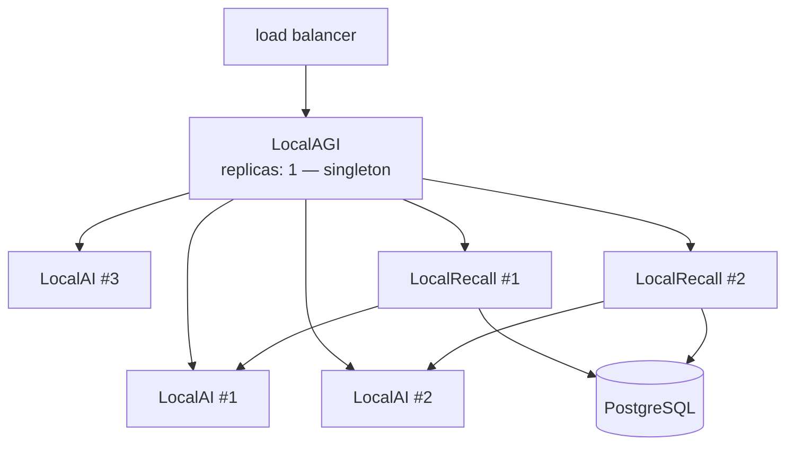
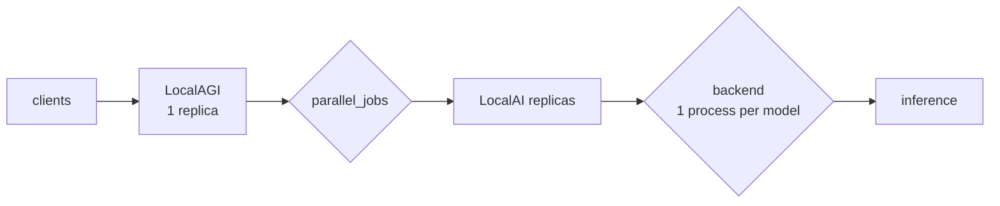

# Scaling

Three components, three completely different scaling stories. One of them does not scale
horizontally at all, and knowing which — and why — determines the whole topology.

## The summary

| Component | Horizontally scalable? | Bound by | Why |
|---|---|---|---|
| LocalAI | **yes** | GPUs, model memory | stateless per request |
| LocalRecall | **yes**, with PostgreSQL | the database | stateless when the store is a database |
| **LocalAGI** | **no** | — | agent state is a **file** |
| PostgreSQL | via its own replication | — | it is a database |



Note the shape: everything fans out **behind** the agent runtime, which stays at one replica.
That is the constraint to design around.

## Why LocalAGI cannot scale horizontally

Agent definitions are **JSON on disk**, read at boot by `StartAll` and rewritten whenever an
agent is created, updated or deleted. There is no locking protocol, no leader election, no
shared-state backend.

Two replicas sharing a volume are two processes rewriting one inventory. **Last writer wins,
and agents disappear.**

That is the data-consistency problem, and it is the smaller one. The larger one:

**Agents act autonomously.** `periodic_runs`, `initiate_conversations`, `permanent_goal`,
`standalone_job`, and every connector (Slack, Discord, Telegram, IRC, GitHub, email) cause an
agent to run without a request. Each replica loads the same pool and runs the same agents.

| With N replicas | Result |
|---|---|
| A scheduled agent | fires **N times** |
| A Slack connector | **N** replicas consume the same channel |
| An agent with a permanent goal | **N** independent pursuits of it |

Replication does not distribute the work. It **duplicates the side effects**. Two replicas
with an agent that emails a daily summary send two emails.

### What to do instead

**Vertical first.** LocalAGI is orchestration and I/O — it does no inference and no
embedding. One replica handles a great deal, because its work per request is small; the
latency is almost entirely spent waiting on LocalAI.

`parallel_jobs` on the agent config controls concurrency within one process, which is the
supported way to handle more simultaneous requests.

**Then shard by agent.** If you genuinely outgrow one process:

```text
router (by agent name)
   ├── localagi-a   state: /pool-a   agents: support, triage
   └── localagi-b   state: /pool-b   agents: research, summarise
```

Separate deployments, **separate state volumes**, a router in front keyed on the agent name in
the `model` field. Each pool owns its agents exclusively, so no two processes write one file
and no scheduled agent fires twice.

This is work you do, not a feature you enable. There is no built-in sharding.

**Accept single-replica restarts.** Startup is fast — the pool is a small JSON file, and
observed agent state was **6 kB**. A restart loses in-flight conversations (in-memory, TTL'd)
and nothing else. For many deployments that is an acceptable availability story; be explicit
about it rather than discovering it.

## Scaling LocalAI

Genuinely stateless per request: no session, no affinity, no coordination. Put replicas
behind a load balancer and it works.

The bounds are physical rather than architectural.

### GPUs are indivisible

A GPU is a non-overcommittable resource. One container gets whole devices, so **replica count
is bounded by device count**. Four GPUs means at most four LocalAI pods.

This also breaks naive rolling updates: with one device and one replica, a surging update
deadlocks — the new pod waits for a device the old pod holds. `maxSurge: 0`, or keep a spare
device. See [Kubernetes](../06-deployment/kubernetes.md).

### Model memory, and eviction

Each resident model is a **separate backend process** with its own memory. Loading a model may
**evict** another, terminating that process.

The pathological case is worth naming because it is easy to create: two models alternating on
one replica pay a model load per request. Observed load cost was **4 s** for a 1.7B Q4 model
on CPU; on a GPU with a large model it is far worse.

| Situation | Arrangement |
|---|---|
| One model, many requests | replicate freely |
| Several models | **one model per deployment**, routed by model name |
| Several models, one replica | expect eviction thrashing |

Routing by model rather than replicating everything is the single most effective scaling
decision available in this stack.

### Cold start is not covered by readiness

`/readyz` answers before any model is loaded. A newly scheduled replica is marked Ready and
then pays the load cost on its first real request.

Worse, reproduced: with the gallery unreachable (**HTTP 429**), model installation failed
entirely while `/readyz` still returned 200 with **zero models**. Use `/readyz` for liveness
and a `GET /v1/models` check for readiness, and pre-populate the models volume or bake it into
the image so a scaling event does not depend on a download.

## Scaling LocalRecall

Stateless **only when the store is a database**.

| Engine | Replicas |
|---|---|
`chromem` | **one.** A single file opened by one process |
| `postgres` | many — concurrent readers are what a database is for |
| `localai` | not a scaling option; several methods are `not implemented` |

Note that scaling LocalRecall scales *chunking and request handling*, not embedding — the
embedding calls still land on LocalAI. If ingestion is your bottleneck, the constraint is
almost certainly inference capacity, not retrieval replicas.

## Where the time actually goes

The measurements that should drive any capacity work. CPU-only, `qwen3-1.7b`.

| Operation | Latency |
|---|---|
| Retrieval, end to end | **29–37 ms** |
| Embedding, warm | 0.06–0.09 s |
| Chat completion, incl. model load | 4 s |
| Agent, no tools | 2–3 s |
| Agent, knowledge + one tool, 2 model calls | **24.1 s** |
| Agent, one tool, 3 model calls | **38.7 s** |

**Retrieval is 30 ms of a 24-second request.** Optimising it is wasted effort. Two conclusions
follow:

### Agent latency is iterations × model latency

```text
agent wall clock  ≈  Σ (model call latency)  +  Σ (tool execution)
```

Retrieval contributes once, not per iteration — verified: two model calls, one search.

So the lever that matters is **the iteration count**, and it is a function of the prompt and
the model, not of hardware. A larger model that answers in two iterations can be faster
end-to-end than a small one that takes five.

Measure it:

```bash
docker logs --since 5m localai 2>&1 | grep -c 'chat/completions'
```

| Request | Expected |
|---|---|
| No tools | 1 |
| One tool | 2–3 |
| Forced reasoning | more — cogito issues additional scoped calls |

Forced reasoning is worth understanding here: it does not hand the model a free-form tool
list, but asks for schema-validated reasoning, then a tool name from an `enum`, then arguments
— **three or more model calls per iteration**. It buys reliability on small models and it costs
capacity.

### Capacity is measured in model calls, not requests

The arithmetic that actually sizes a deployment:

```text
model calls/sec needed  =  agent requests/sec  ×  average calls per request
LocalAI replicas needed =  model calls/sec  ÷  calls/sec per replica
```

An agent workload at 1 request/second with 3 calls each needs 3 model calls/second. Sizing
against the request rate under-provisions by a factor of three.

## Where the queues form



| Point | Control |
|---|---|
| Clients → LocalAGI | your load balancer |
| Inside LocalAGI | `parallel_jobs` per agent |
| LocalAGI → LocalAI | no queue — direct HTTP; a slow model call just blocks the iteration |
| Inside LocalAI | one backend process per model; concurrency is the backend's |

The absence of a queue between LocalAGI and LocalAI matters. **Backpressure does not exist**:
if inference is saturated, agent requests slow down and eventually hit
`LOCALAGI_TIMEOUT` per call. There is no admission control that fails fast. If you need one,
put it in front.

## Timeout ordering under load

The most common scaling failure is not capacity, it is a timeout mismatch that only appears
when latency rises.

```text
client  >  proxy / ingress  >  LOCALAGI_TIMEOUT (per model call)
```

An ingress default of 60 s is already shorter than a measured 38.7 s request plus queueing.
When it fires, the client gets a **504 while the agent runs to completion and commits its tool
side effects** — duplicate emails, duplicate issues, from requests the caller believes failed.

Prefer idempotent tools for exactly this reason.

## A worked example

Target: 10 agent requests/minute, each using knowledge and one tool.

| Step | Figure |
|---|---|
| Model calls per request | 2 (measured) |
| Model calls needed | 20/minute ≈ 0.33/second |
| Per-request latency | 24.1 s (measured, CPU) |
| Concurrent requests in flight | 10 × 24.1 / 60 ≈ **4** |
| LocalAGI replicas | **1** — it is only waiting |
| `parallel_jobs` | ≥ 4 |
| LocalAI capacity | must sustain 4 concurrent model calls |
| LocalAI replicas | 4 ÷ (concurrency per replica) |
| LocalRecall replicas | 1 — 20 searches/minute at 30 ms is nothing |
| Ingress read timeout | **≥ 120 s**, not 60 |

The instructive part is the last four rows. Retrieval needs nothing. LocalAGI needs nothing.
**Everything you buy, you buy for inference** — which is the argument for splitting LocalAI
out as the first thing you do.

## What would change this

- Agent state in a shared database → LocalAGI replicas and real HA
- A leader-election or ownership model for scheduled agents → replicas without duplicated side effects
- Admission control between the agent loop and inference → backpressure instead of timeouts
- Metrics on LocalAGI → capacity decisions from data rather than from log counting

## Upstream references

- [LocalAGI `core/state/pool.go`](https://github.com/mudler/LocalAGI/blob/v2.9.0/core/state/pool.go) — file-based pool load and save; no locking; `StartAll`. Validated against v2.9.0.
- [LocalAGI `core/state/config.go`](https://github.com/mudler/LocalAGI/blob/v2.9.0/core/state/config.go) — `parallel_jobs`, `periodic_runs`, `initiate_conversations`, `permanent_goal`, `standalone_job`, `loop_detection`, `max_attempts`.
- [LocalAGI `core/agent/agent.go`](https://github.com/mudler/LocalAGI/blob/v2.9.0/core/agent/agent.go) — cogito options, loop detection at 1345, max attempts at 1360.
- [LocalAGI `core/conversations`](https://github.com/mudler/LocalAGI/tree/v2.9.0/core/conversations) — in-memory conversation state, lost on restart.
- [LocalAI `pkg/model/initializers.go`](https://github.com/mudler/LocalAI/blob/v4.8.2/pkg/model/initializers.go) — one backend process per model; load, eviction and process termination. Validated against v4.8.2.
- [LocalAI `core/cli/run.go`](https://github.com/mudler/LocalAI/blob/v4.8.2/core/cli/run.go) — `LOCALAI_FORCE_EVICTION_WHEN_BUSY`, `LOCALAI_GPU_RECLAIMER`, `LOCALAI_LOAD_TO_MEMORY`.
- [LocalRecall `rag/engine/chromem.go`](https://github.com/mudler/LocalRecall/blob/v0.6.4/rag/engine/chromem.go) — the single-file store. Validated against v0.6.4.
- [LocalRecall `rag/engine/postgres.go`](https://github.com/mudler/LocalRecall/blob/v0.6.4/rag/engine/postgres.go) — the database-backed engine.
- [`mudler/cogito`](https://github.com/mudler/cogito) — the loop, and forced reasoning's multi-call structure.
- All latency figures, the model-call counts per request type, and the `/readyz`-with-no-models reproduction: observed 2026-08-17, see [version matrix](../00-overview/version-matrix.md). **No multi-replica configuration was tested.**
