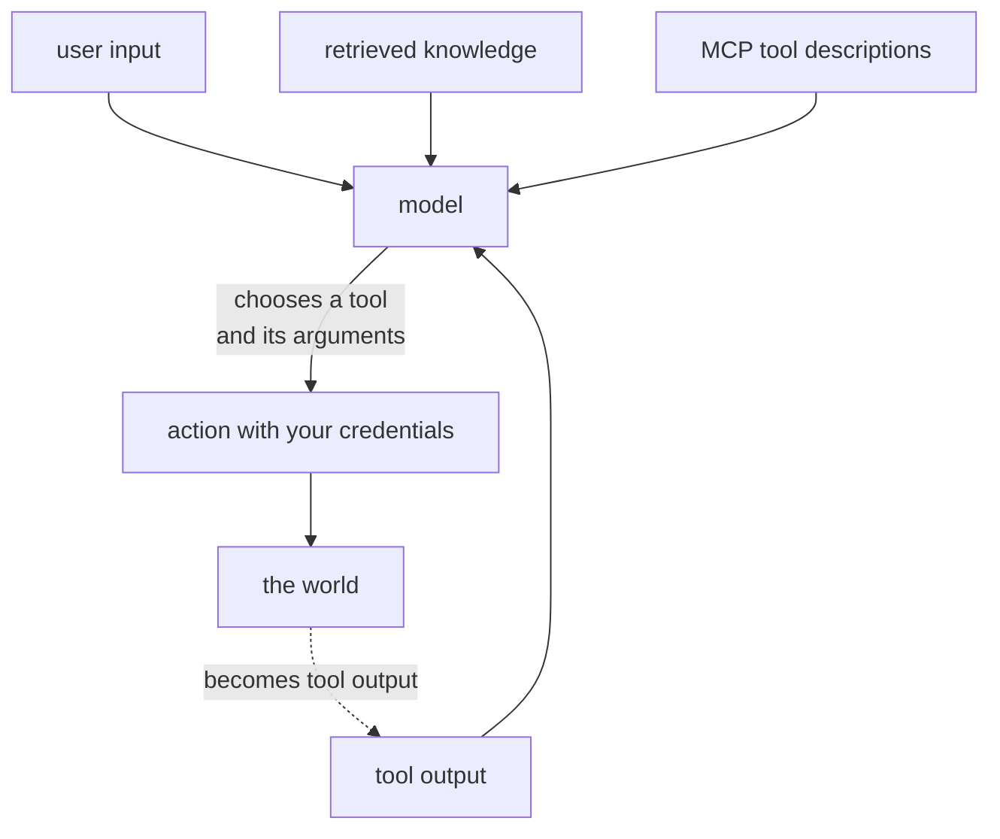
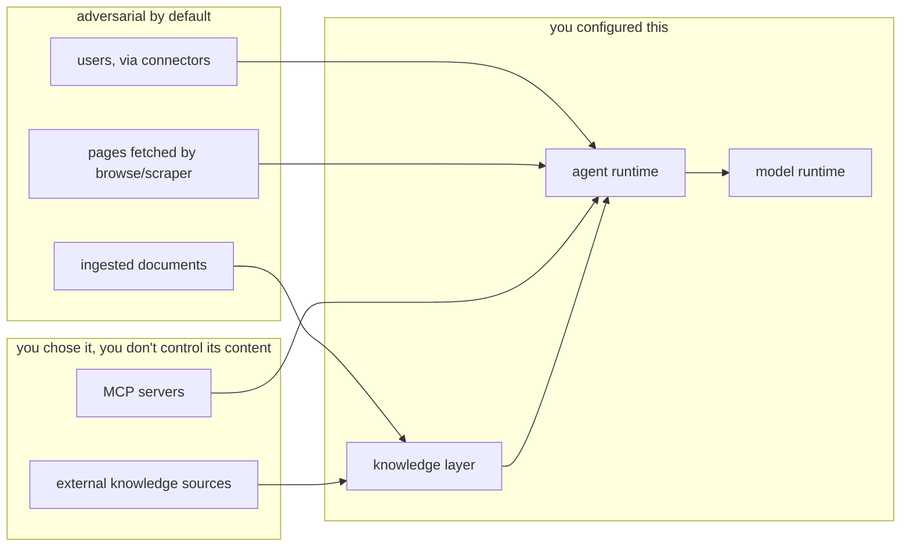

# The security model

[Security](../06-deployment/security.md) is the operational page: what to set, what to turn
off. This one is about the shape of the problem — where the trust boundaries actually are,
and why an agent platform is not an inference server with extra endpoints.

## The premise

A model chooses actions. You supply the credentials. Text the model reads can influence what
it chooses.

Those three sentences generate every threat below. An inference server has none of them: it
transforms input to output and touches nothing.



Four inputs reach the model, and **only one of them is the user**. The other three are content
from elsewhere that arrives in the same context window with the same authority. And the loop
at the bottom closes: what the world returns becomes model input on the next iteration.

## Five layers

Conflating them is why "we put it behind an auth proxy" is a common and insufficient answer.

| Layer | Question | Controlled by |
|---|---|---|
| Infrastructure | who can reach a port? | network, images, volumes |
| Model | who may call inference and install models? | API keys on LocalAI |
| Knowledge | who may read and **write** collections? | API keys on LocalRecall — nothing finer |
| Agent | who may create an agent, and what may it do? | API keys on LocalAGI; the `actions` list |
| **Tool** | what can the action reach, with whose credentials? | **the boundary you build** |

An auth proxy addresses the second. The fifth is where the damage happens, and no
configuration in this stack constrains it.

## Trust boundaries, as they actually are



The middle box is the one people misplace. An MCP server you did not write, and a knowledge
source URL you do not own, are **content you do not control** running inside your trust
boundary.

## Prompt injection, direct and indirect

Direct injection — a user telling the agent to ignore its instructions — is the version
everyone knows and the less serious one, because the user is already authenticated and acting
in their own name.

**Indirect injection is the real problem.** Text the model reads, which the user did not write,
carrying instructions.

Four channels, all real in this stack:

| Channel | How text arrives | Who can write it |
|---|---|---|
| Ingested documents | retrieved and prepended as a system message | anyone who can upload |
| External sources | polled and re-ingested on a schedule | whoever controls the URL |
| Fetched pages | `browse`, `scraper` return page content as tool output | whoever controls the page |
| MCP tool descriptions | injected into the tool list | whoever wrote the server |

### The knowledge channel is the sharpest

Retrieved chunks are formatted into a **system message** and prepended to the conversation:

```text
Given the user input you have the following in memory:
- <chunk content> (map[created_at:… file_name:… type:file])
```

Three properties make this dangerous, all verified:

**It is a system message.** Not a user message, not a labelled document block. Whatever is in
the collection arrives with the authority of an instruction.

**There is no relevance threshold.** Top-*k* returns *k* results whatever their scores. Measured
on the reference model, unrelated text still scores **0.54** against 0.87 for a paraphrase — so
the floor is not zero and an off-topic chunk is not excluded. A document crafted to be
retrievable for many queries will be retrieved.

**There is no provenance.** The metadata carries a filename and a timestamp. Nothing records
who uploaded it or whether it is trusted, and the model has no way to weigh it.

### Memory is a write into the agent's head

Agent memory is not a separate subsystem. `long_term_memory` writes conversation content into
**the same collection** as ingested documents, as a file named `<timestamp>-<md5>.txt`, through
the same chunk-and-embed path.

So anything that can write the collection can put words into the agent's memory, to be
retrieved as authoritative context on a future turn — including the agent itself, persuaded
once.

And `add_to_memory` / `remove_from_memory` are **tools the model can call**. An agent with
those actions can rewrite its own knowledge.

See [memory vs knowledge](memory-vs-knowledge.md).

## The tool boundary

### Names are constrained, arguments are not

cogito does constrain tool selection. With forced reasoning it does not hand the model a
free-form list: it asks for schema-validated reasoning, then a tool name from a JSON-schema
`enum` of real names, then arguments in a third scoped call. **A hallucinated tool name is
impossible by construction.**

Arguments are generated text. Verified in [Recipe 5](../05-recipes/agent-with-tools.md): the
recorded `Parameters` are whatever the model emitted.

| Constrained | Not constrained |
|---|---|
| Which tool | the path it is given |
| That the tool exists | the URL it is given |
| Schema types | the command it is given |
| — | the recipient of the email |

**Therefore: constrain at the boundary, never in the prompt.** A read-only root filesystem is
a control. "Please only read files under /data" is not.

### There is no approval step

A tool executes as soon as the model emits the call. No confirmation, no dry-run, no
human-in-the-loop, no policy hook. Verified across every recipe.

Consequence for design: **prefer idempotent tools**, because retries and client timeouts both
produce duplicate execution. A timed-out request whose agent completed anyway has already sent
the email.

### The high-consequence actions

Of the 40 built-in actions, verified present:

| Action | Why it needs care |
|---|---|
| `shell-command` | executes commands — **the ability to create an agent with this is remote code execution** |
| `browse`, `scraper` | fetch arbitrary URLs: SSRF *and* an injection channel |
| `webhook` | POSTs to arbitrary URLs — an exfiltration primitive |
| `send-mail`, `send-telegram-message`, `twitter-post` | speak in your name |
| `github-pr-creator`, `github-issue-opener`, `github-repository-create-or-update-content` | write to repositories |
| `add_to_memory`, `remove_from_memory` | rewrite the agent's own knowledge |
| `call_agents` | reach other agents' privileges |

They are not enabled by default — an agent gets only the actions you list. Read the `actions`
list as an IAM policy, because that is what it is.

### `browse` plus `webhook` is an exfiltration pair

Worth naming explicitly. An agent that can fetch a page and POST to a URL can be instructed by
the fetched page to send it your context. Neither action is malicious; the combination is a
channel. Egress network policy is the control, not tool selection.

## Privilege chaining through delegation

`call_agents` has `whitelist` and `blacklist`, parsed as comma-separated strings. **When
neither is set, every agent in the pool is callable.**

So a coordinator with an unconfigured `call_agents` can reach an agent that has
`shell-command`, even though the coordinator was never granted it. Privilege is not contained
by the agent boundary; it is contained by the whitelist you remember to set.

The structural fix is not a whitelist but a topology: give **one** agent `call_agents` and give
specialists none. Then chains cannot form.

## Identity, and its absence

The ceiling on everything above.

| Question | Answerable? |
|---|---|
| Is this caller authenticated? | yes — a bearer key |
| Which caller is this? | **no** — a key is not an identity |
| May this caller use only some agents? | **no** — keys have no scope |
| May this caller read only some collections? | **no** |
| Who ran this tool? | **no** |

A key is all-or-nothing: no users, roles, scopes or expiry. And **anyone who can create an
agent can choose its tools**, so the create-agent permission is effectively the
execute-anything permission.

If you need attribution or authorization, both belong in an identity-aware proxy in front, and
the audit record belongs there too. Nothing inside the stack can supply them.

## Multi-tenancy is not achievable by configuration

An agent's collection is its **lowercased name**. That is the entire isolation mechanism, and
it is a naming convention rather than a boundary.

| Consequence |
|---|
| Any valid key reads any collection |
| Any valid key writes any collection, including agents' memories |
| Agents whose names differ only in case **share** a collection |
| Resetting a collection deletes the agent's memories too |

**Separation means separate deployments**, separate databases, or a scoping proxy you write. It
does not mean careful naming.

## Connectors change the threat model

The moment a connector is attached — Slack, Discord, Telegram, IRC, GitHub, email — an outsider
can trigger the agent. Everything about indirect injection stops being theoretical, because the
adversary now has an input channel and does not need an account on your systems.

The same is true of `periodic_runs`, `initiate_conversations` and `permanent_goal`: the agent
acts with no request at all, so there is no caller to attribute and no request to block.

## What is auditable

| Question | Answer |
|---|---|
| What requests arrived? | access logs on all three services |
| Which agent ran? | `agent=` on every LocalAGI log line |
| Which tools ran, with what arguments? | `/api/agent/:name/status` — **last 10 only, in memory, lost on restart** |
| Full conversation? | only with `LOCALAGI_ENABLE_CONVERSATIONS_LOGGING=true` |
| Token cost? | **no** — `usage` is hardcoded to zero |
| Which person? | **no** |

The tool-history limit is the practical gap: an agent that made fifteen calls shows ten, and a
restart shows none. If tool execution needs to be auditable, log it at the tool.

## Design rules that follow

1. **Assume every retrieved chunk is adversarial.** It arrives as a system message with no
   provenance and no threshold.
2. **Constrain tools at the boundary**, not in the prompt: read-only roots, minimal mounts,
   scoped short-lived credentials, egress policy.
3. **Never give `shell-command` to an agent reachable by untrusted input**, including through a
   connector or through `call_agents`.
4. **Whitelist delegation always**; better, give only one agent `call_agents`.
5. **Treat "can create an agent" as "can execute code."** Authenticate LocalAGI.
6. **Audit knowledge write paths** — uploads and external sources both.
7. **Prefer idempotent tools**, because timeouts and retries duplicate execution.
8. **Do not co-tenant.** One deployment per tenant.
9. **Put identity in front**, since the stack has none.
10. **Treat the agent state volume as secret-bearing** — it holds tokens in plain text.

## Upstream references

- [LocalAGI `core/agent/knowledgebase.go`](https://github.com/mudler/LocalAGI/blob/v2.9.0/core/agent/knowledgebase.go) — retrieved chunks injected as a **system message** at 94-101; no threshold; the query taken verbatim at 44. Validated against v2.9.0.
- [LocalAGI `webui/collections/rag_provider.go`](https://github.com/mudler/LocalAGI/blob/v2.9.0/webui/collections/rag_provider.go) — collection name as the lowercased agent name at 160; memory written as a hashed file at 29-52.
- [LocalAGI `services/actions/callagents.go`](https://github.com/mudler/LocalAGI/blob/v2.9.0/services/actions/callagents.go) — whitelist/blacklist parsing, and the absence of any default restriction.
- [LocalAGI `services/actions`](https://github.com/mudler/LocalAGI/tree/v2.9.0/services/actions) — `shell-command`, `browse`, `scraper`, `webhook`, `send-mail`, `add_to_memory` and the rest of the 40.
- [LocalAGI `core/agent/mcp.go`](https://github.com/mudler/LocalAGI/blob/v2.9.0/core/agent/mcp.go) — MCP tools wrapped as ordinary actions; stdio servers as child processes at 27-32.
- [LocalAGI `core/state/config.go`](https://github.com/mudler/LocalAGI/blob/v2.9.0/core/state/config.go) — `actions`, `mcp_servers` with tokens, `long_term_memory`, `periodic_runs`, `permanent_goal`, `initiate_conversations`.
- [LocalAGI `core/state/pool.go`](https://github.com/mudler/LocalAGI/blob/v2.9.0/core/state/pool.go) — `Status` keeping only ten action results at 83-90.
- [LocalAGI `webui/routes.go`](https://github.com/mudler/LocalAGI/blob/v2.9.0/webui/routes.go) — global keyauth; the four accepted key locations at 252-254.
- [LocalRecall `routes.go`](https://github.com/mudler/LocalRecall/blob/v0.6.4/routes.go) — `API_KEYS` with no per-collection scoping at 158-175; upload and source registration. Validated against v0.6.4.
- [LocalRecall `rag/source_manager.go`](https://github.com/mudler/LocalRecall/blob/v0.6.4/rag/source_manager.go) — scheduled re-ingestion of external URLs.
- [`mudler/cogito`](https://github.com/mudler/cogito) — forced reasoning and the constrained tool-name `enum`.
- Similarity floor of 0.54, the 40-action inventory, the injected system message, and plain-text credentials in the state volume: observed 2026-08-17, see [version matrix](../00-overview/version-matrix.md).
